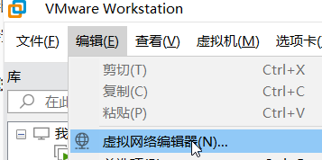
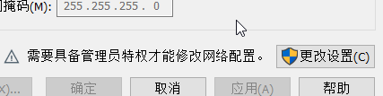
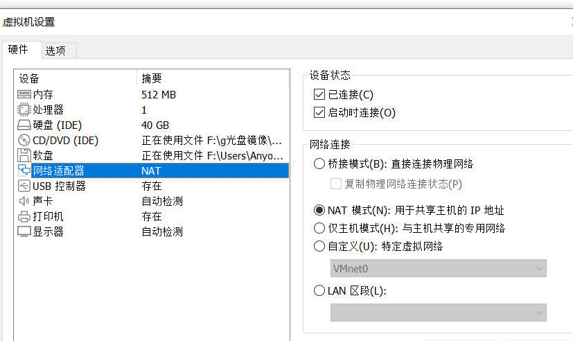

[toc]

### 今日任务

1. 了解虚拟机管理器的功能
2. 掌握虚拟机管理器的安装 
3. 掌握虚拟机管理器的网络模式和配置
4. 掌握虚拟机管理器的关键功能:新建,拍摄快照等功能
5. 从虚拟机文件部署--LiteXP虚拟机

### 虚拟机管理器的功能

常见软件:VMWare WorkStation ,virtual Box

功能: 创建不同操作系统的虚拟机,以及开关机。拍摄、恢复快照。虚拟网络管理功能

### 虚拟机管理器安装的流程

```
sudo sed -i "s@http://.*archive.ubuntu.com@https://mirrors.tuna.tsinghua.edu.cn@g" /etc/apt/sources.list
sudo sed -i "s@http://.*security.ubuntu.com@https://mirrors.tuna.tsinghua.edu.cn@g" /etc/apt/sources.list
```


### 虚拟机网络模式

| 网络模式   | 能否连外网 | 是否新建网络 | ip特征                            | 虚拟网络编辑器是否可以自定义网络配置 | 默认网络名称 |
| ---------- | ---------- | ------------ | --------------------------------- | ------------------------------------ | ------------ |
| 桥接模式   | 能         | 否           | 和物理机网卡在同一网络的ip        | 否                                   | 无           |
| NAT模式    | 能         | 是           | 新网络的ip,和物理网卡不在一个网段 | 是                                   | VMNet8       |
| 仅主机模式 | 不能       | 是           | 新网络的ip,和物理网卡不在一个网段 | 是                                   | VMNet0       |

可以通过虚拟网络编辑器进行各模式参数的配置:





需要点击更改设置才能修改


可以在虚拟机的设置里选择网络模式



