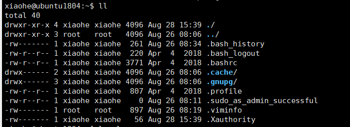
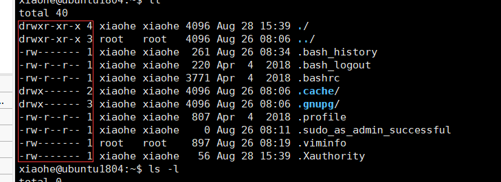

#### Linux运行级别:

(通过`init  运行级别`来进入相应的级别)

0. 停机状态,系统默认运行级别不能设为0,不然无法开机
1. 单用户模式,用于系统维护,禁止远程登录
2. 多用户模式
3. 完全的多用户状态
4. 系统未使用,保留
5. GUI模式,进入图形化界面
6. 系统重启

#### VMware内切换窗口

`alt+空格+F1~F6`

#### Linux关机

不管用任何方式关机,都应该先执行sync命令,将数据由内存同步到硬盘中,再进行关机。

关机命令有：

- shutdown -h now  立即关机
  - shutdown -h 10 ‘This server will shutdown after 10 mins’ 这个命令告诉大家，计算机将在10分钟后关机，并且会显示在登陆用户的当前屏幕中。
  - shutdown -h 20:05  系统将会在今天20:05关机
  - shutdown -h +10 系统将在十分钟后关机
  - 
- halt   立即关机，等同于shutdown -h now
- poweroff  立即关机，等同于shutdown -h now
- init 0 立即关机，等同于shutdown -h now

重启命令有：

- shutdown -r now 
- reboot
- init6

#### Linux忘记密码

进入单用户模式，执行passwd命令，输入新密码按回车，然后再次输入新密码，回车，然后重启之后即可用新密码登录

#### Linux远程登陆

常用的Windows平台远程登陆软件：Secure CRT，Putty，SSH Secure Sheel，XShell等等

登陆步骤：

1. 打开远程软件Xshell  新建会话
2. 填入服务器IP地址、端口号,选择SSH协议
3. 在用户验证中填写用户名和密码
4. 填入用户名和密码即可远程登陆服务器


#### Linux文件基本属性

在Linux中，用以下命令来修改文件或目录的所属用户与权限

- chown （change owner）：修改文件或目录所属的用户与组
- chmod（change mode）：修改用户的权限

在Linux中可以使用`ll`或者`ls -l `命令来显示一个文件的属性以及文件所属的用户和组



`rwx`是一组参数，r代表可读（read）,w代表可写（write）,x代表可执行（execute）


每个文件的属性由左边第一部分的10个字符来确定（用0-9表示）



第0位：文件类型

第1-3位：确定属主（该文件的所有者）拥有该文件的权限（`rwx`r代表可读（read）w代表可写（write）x代表可执行（execute），`rwx`是一组参数，顺序不变，如果没有对应的权限，则用-号代替）

第4-6位：确定属组（文件所有者的同组用户）拥有该文件的权限

第7-9位：确定替他用户拥有该文件的权限

##### 更改文件属性

1. chgrp（change group）：更改文件属组：

   ```shell
   chgrp [-r] 属组名 文件名
   ```

   -r:递归更改文件属性,如果在更改某个目录的属性时,加上了-r,name该目录下的所有文件的属组都会更改

2. chown:更改文件属主,也可以同时更改文件属组

   ```
   chown [-r] 属组名 文件名
   chown [-r] 属主名:属组名 文件名
   ```

   进入/root目录将install.log 拥有者改为用户:xiaohe

   ```
   cd ~
   chown xiaohe install.log
   ```

   将install.log的拥有者与群组改回为root:

   ```
   chown root:root install.log
   ```

3. chmod:更改文件九个属性

   Linux设置文件属性有两种方法:数字和符号

   - 数字:
     - 数字的算法:r=4  w=2  x=1  三个权限需要累加  
     - chmod 777  代表给所有用户设置读写和执行权限,第一位数字代表用户,第二位数字代表用户所属的组,第三位数字代表其他用户
     - chmod 750 代表给属主设置所有权限,给属组其他用户设置4+0+1也就是读和执行权限 给其他用户不设置权限(0+0+0=0没有权限)
   - 字母:
     - 可以用u代表user也就是用户,用g代表属组,用o代表other其他,a代表all  全部用户,读写权限就是r,w,x
     - `chmod u=rwx,u=rx,o=r 文件名  `代表给user设置该文件的所有权限,给属组设置该用户的读和执行权限,给其他用户设置读权限
     - `chomd a-x 文件名`表示去除所有用户对该文件的执行权限,a+x表示给所有用户设置执行权限  给其他用户去除权限同理 
     - ` chmod u+r`表示给属主添加读权限,给其他用户添加权限同理
     - 注意:`chmod ugo+r q.txt`和`chmod a+r q.txt`是一样的

#### Linux文件目录与管理

##### 常用的处理目录的命令:

| 命令  | 作用                                  |
| ----- | ------------------------------------- |
| ls    | 列出目录及文件名                      |
| cd    | 切换目录                              |
| pwd   | 显示当前的目录                        |
| mkdir | 创建一个新的目录                      |
| rmdir | 删除一个空的目录                      |
| cp    | 复制文件或目录                        |
| rm    | 删除文件或目录                        |
| mv    | 移动文件与目录,或修改文件与目录的名称 |

##### ls(列出目录)

可选参数:

- -a:全部的文件,连同隐藏文件(以.开头的文件)一起列出来
- -d:仅列出目录本身,而不是列出目录内的文件数据
- -l:长数据串列出,包含文件的属性与权限等数据

##### cd(切换目录)

##### pwd(显示当前所在目录)

可选参数:

- -p:显示出确实的路径而非使用连接路径

##### mkdir(创建新目录)

可选参数:

- -m:直接配置要创建的文件夹的权限
- -p:将创建当前目录所需要的上级目录一起创建出来

##### rmdir(删除空的目录)

可选参数:

- -p:从该目录开始,一次删除多级空目录(只能删除空的目录,要删除非空目录,需要使用rm命令)

##### cp(复制文件或目录)

可选参数:

- -a:相当于-pdr
- -d:如果来源档为链接档的属性,则复制链接档属性而非文件本身
- -f:强制,若目标文件已经存在且无法开启,则移除后再尝试一次
- -i:进行硬式链接的链接创建,而非复制文件本身
- -p:连同文件的属性一起复制过去,而非使用默认属性
- -r:递归持续复制,用于目录的复制行为
- -s:复制成为符号链接档,
- -u:destination比source旧才升级destination

##### rm(移除文件或目录)

可选参数:

- -f:就是force的意思,忽略不存在的文件,不会出现警告信息
- -i:互动模式,在删除前会询问使用者是否执行
- -f:递归删除,常用在目录的删除,这是非常危险的操作.==rm -rf /*==

##### mv(移动文件与目录,或修改名称)

