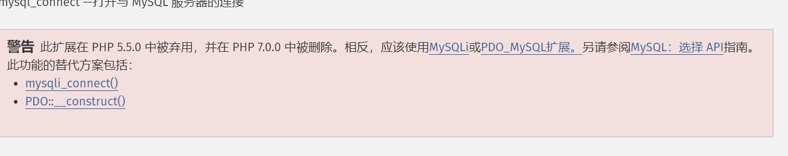
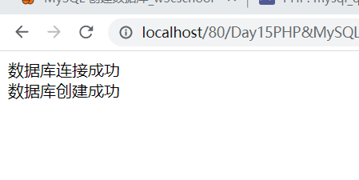
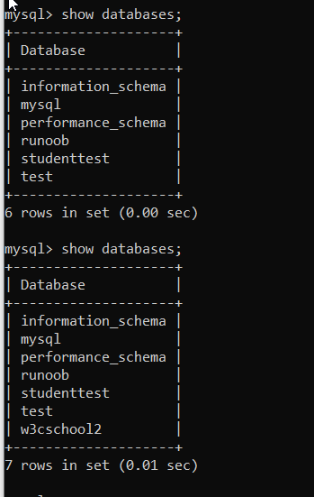

[toc]

### 学习目标

1. 连接DBMS
2. 创建数据库
3. 查询记录等
   1. SELECT ...FROM...
   2. INSERT ... INTO...VALUES...
   3. DELETE FROM ...
   4. CREATE TABLE ...
   5. ....

### 掌握:思路步骤

1. 创建连接

   $conn = mysqli_connect();

2. 定义查询语句

   $sql = "select* from ...";

3. 执行查询

   $res = mysqli_query($conn,$sql);

4. 获取查询结果(如果有)

   1. 判断有没有查询结果:

      if(mysqli_num_rows($res)>0

   2. 遍历查询结果

      ```mysql
      while($row = mysqli_fetch_assoc($res) ){
      	echo $row['字段1'].$row['字段2']
      }
      ```

      

5. 关闭连接

   mysqli_close($conn);

### 了解:PHP连接MySQL的背景

#### 三大连接方式:

1. mysql传统扩展(插件)连接;
2. MySQLi扩展连接;
3. PDO扩展连接


### 使用PHP脚本连接MySQL

连接数据库:

`mysqli_connect(host,username,password,dbname,port,socket);`

参数说明:

| 参数     | 描述                           |
| -------- | ------------------------------ |
| host     | 主机名或者IP地址               |
| username | MySQL用户名                    |
| password | MySQL密码                      |
| dbname   | 登录后默认使用的数据库名       |
| port     | 尝试连接到MySQL服务器的端口号  |
| socket   | 规定socket或要使用的一名名pipe |

eg. 连接本地数据库:

```php
<meta http-equiv="Content-Type" content="text/html;charset=UTF-8">
<?php
    $dbhost = '172.16.105.229';
    $dbuser = 'root';
    $dbpwd = 'root';
    $conn = mysqli_connect($dbhost,$dbuser,$dbpwd);
    if(! $conn){
        die('数据库连接失败'.mysqli_connect_error());
    }
    echo '数据库连接成功3';
    mysqli_close($conn);
```

https://www.php.net/manual/en/function.mysql-error

mysql开头的函数已被弃用,应当用新版本的mysqli




### 使用PHP脚本创建数据库

php中执行SQL语句的函数:

`mysql_query(SQL语句,连接的数据库);`       //mysql_query自PHP5.5.0已废弃

推荐使用:

`mysqli_query(连接的数据库,SQL语句);`

eg. 创建名为w3cschool2的数据库

```php
<meta http-equiv="Content-Type" content="text/html;charset=UTF-8">
<?php
$dbhost = 'localhost';
$dbuser = 'root';
$dbpwd = 'root';
$conn = mysqli_connect($dbhost, $dbuser, $dbpwd);
if (!$conn) {
    die("连接数据库失败" . mysql_error());
}
echo "数据库连接成功<br>";

$sql = 'create database w3cschool2';
$retval = mysqli_query($conn, $sql);
if (!$retval) {
    die("数据库创建失败");
}
echo "数据库创建成功";
?>
```







