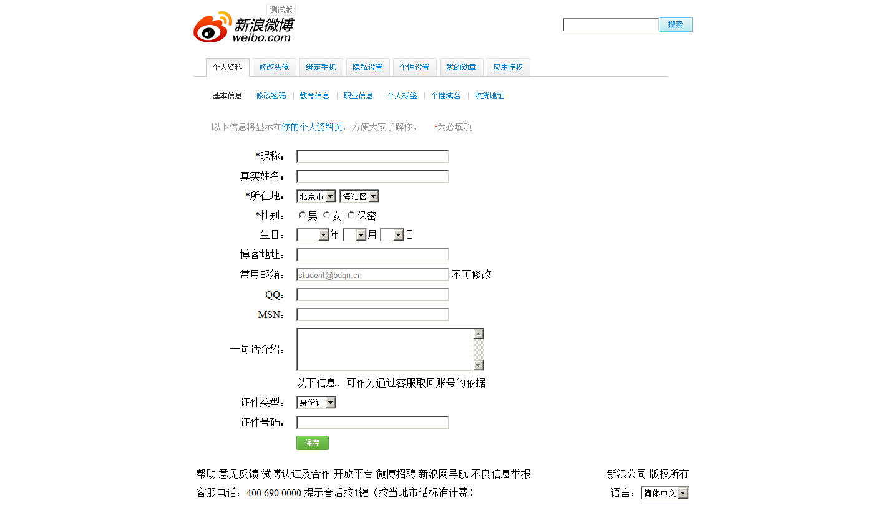
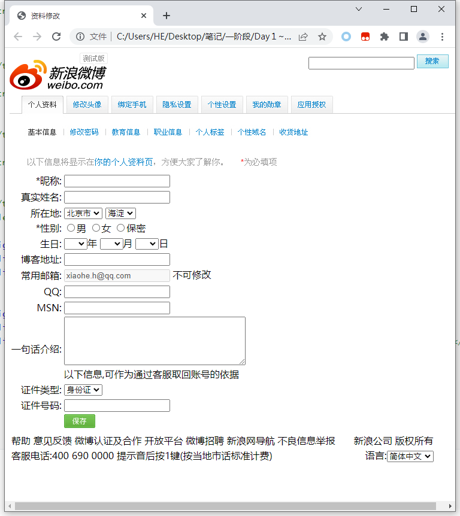

# 练习

## 易趣商品列表

完成以下效果图


完成代码:

```html
<!DOCTYPE html>
<html>

<head>
	<meta charset="utf-8";/>
	<title>易趣</title>
</head>

<body>
	
	<p>首页 > 中国馆 > 女装/女士精品 > 所有商品</p>
	
	<h2>热点推荐</h2>

	<br>
	&nbsp;&nbsp;&nbsp;&nbsp;&nbsp;&nbsp;&nbsp;&nbsp;一口价：49.00<br>
	&nbsp;&nbsp;&nbsp;&nbsp;&nbsp;&nbsp;&nbsp;&nbsp;全国包邮！韩版修身长袖T恤 打底衫 纯棉圆领T恤<br>
	<br>

	<br>
	&nbsp;&nbsp;&nbsp;&nbsp;&nbsp;&nbsp;&nbsp;&nbsp;一口价：35.00<br>
	&nbsp;&nbsp;&nbsp;&nbsp;&nbsp;&nbsp;&nbsp;&nbsp;2011新款T恤短袖 t恤女短袖 影子熊猫<br>
	<br>
	
	<br>
	&nbsp;&nbsp;&nbsp;&nbsp;&nbsp;&nbsp;&nbsp;&nbsp;一口价：48.00<br>
	&nbsp;&nbsp;&nbsp;&nbsp;&nbsp;&nbsp;&nbsp;&nbsp;钉珠蝴蝶结秋冬背心呢料裙911 -4366<br>
	<br>

	<br>
	&nbsp;&nbsp;&nbsp;&nbsp;&nbsp;&nbsp;&nbsp;&nbsp;一口价：88.00<br>
	&nbsp;&nbsp;&nbsp;&nbsp;&nbsp;&nbsp;&nbsp;&nbsp;2011 春装 新款 女装 假两件拼接修身包臀裙 洋装 长袖连衣裙<br>
	<br>

	<br>
	&nbsp;&nbsp;&nbsp;&nbsp;&nbsp;&nbsp;&nbsp;&nbsp;一口价：169.00<br>
	&nbsp;&nbsp;&nbsp;&nbsp;&nbsp;&nbsp;&nbsp;&nbsp;卖家推荐 2011春装新款 时尚韩版 假两件式 百褶 连衣裙 0210806 热销款<br>
	<br>

	<br>
	&nbsp;&nbsp;&nbsp;&nbsp;&nbsp;&nbsp;&nbsp;&nbsp;一口价：98.00<br>
	&nbsp;&nbsp;&nbsp;&nbsp;&nbsp;&nbsp;&nbsp;&nbsp;波西米亚 民族风格 扎染珠片 多穿裙 沙滩<br>
	<br>

	Copyright &copy; 2010 易趣版权所有
</body>

</html>
```


完成后的效果:


## 家用电器排行榜

完成以下效果图:


完成后的代码:

```html
<!DOCTYPE html>
<html>

<head>
	<meta charset ="utf-8";/>
	<title>家用电器排行榜</title>
	
</head>

<body>
	<h2>家用电器排行榜</h2>
	
	
	创维电视创维42E5CHR 42英寸 ￥2799.00 <br/>
	<hr/>

	
	海信电视海信LED42EC260JD 42英寸 ￥2848.00  <br/>
	<hr/>

	
	索尼电视索尼 KLV-40R476A 40英寸 ￥3599.00  <br/>
	<hr/>

	
	创维电视创维42E83RE 42英寸 ￥3699.00 <br/>
	<hr/>

	
	创维电视创维42E7BRE 42英寸 ￥3299.00 <br/>
	<hr/>
</body>

</html>
```

完成后的效果图:


## 滚筒洗衣机排行榜

完成以下效果图:


完成后的代码:

```html
<!DOCTYPE html>
<html>

<head>
	<meta charset ="utf-8";/>
	<title>滚筒洗衣机排行榜</title>
	
</head>

<body>
	<h2>滚筒洗衣机销售排行榜</h2>
	
	
	格兰仕XQG60-A708 ￥1099.00 <br/>
	<hr/>

	
	LG WD-N12430D ￥2599.00  <br/>
	<hr/>

	
	三洋XQG60-F1029 ￥1998.00  <br/>
	<hr/>

	
	三星WF1702NCW/XSC ￥2499.00 <br/>
	<hr/>

	
	西门子XQG60-WS10K2670W ￥3999.00 <br/>
	<hr/>
</body>

</html>
```

完成后的效果图:


## 聚美优品

### 聚美优品新手指南页面

完成以下效果图:


完成后的代码:

```html
<!DOCTYPE html>
<html>

<head>
	<meta charset ="utf-8";/>
	<title>聚美优品新手指南</title>
	
</head>

<body>
	
	<br/>

	<a href="../课后作业1：聚美优品常见问题页面/聚美优品常见问题.html">常见问题</a>&nbsp;
	<a href="#">用户协议</a>&nbsp;
	<a href="#signup_img">注册帮助</a>&nbsp;
	<a href="#login_img">登录帮助</a>&nbsp;

	<h2>新手指南&nbsp;-&nbsp;登录或注册</h2>

	<h3>购物流程</h3>
	

	<h3>新用户注册</h3>
	<h5>Step 1 点击页面右上方的"注册"按钮注册聚美优品账号。</h5>
	
	<h5>Step 2 注册前请仔细阅读《聚美优品用户协议》,如无异议请点击"同意以下协议并注册"。请根据相应提示在信息<br/>栏内填入您的注册信息。</h5>
	<br/>
	注册成功后系统将自动登录您的账号,并转至聚美优品首页。

	<h3>登录</h3>
	<h5>Step 1 如果您已经拥有聚美账号,请点击页面上方的"登录"按钮。</h5>
	
	<h5>Step 2 在登录页面的信息栏中填入对应信息,点击"登录"按钮进行登录,或者通过选择登录框下方的合作账号进行<br/>快速登录。登录成功后,系统将自动跳转至聚美优品首页。</h5>
	
</body>

</html>
```


完成后的效果图:


### 聚美优品常见问题页面

完成以下效果图:


完成后的代码:

```html
<!DOCTYPE html>
<html>

<head>
	<meta charset ="utf-8";/>
	<title>聚美优品常见问题FAQ</title>
	
</head>

<body>
	<br/>


	
	<p><h1>客服温馨提示</h1><p>
	为了减少您可能的等待时间，您不妨先仔细阅读下面的常见问题。 查询物流状态，退货，退余额等<br/>
	操作均可以登录聚美优品网站后自助进行，无需联系客服。如果仍无法解决。请您在本页页底联系在<br/>
	线客服，或拨打聚美客服电话。小美谢谢您的理解！
	<hr/>

	<h3>美订单什么时候发货？大概多长时间可以收到货？</h3>
	正常情况下您的订单将在6小时内发出（最晚不超过1个工作日）。8月1日的订单，将在3日内全部发<br/>
	出。发货之后，您可以在我的订单中可以查看发货状态。由于快递公司可能无法实时更新信息，因此<br/>
	您看到的发货情况可能有一定延迟。

	<h3>为什么后下的订单，先收到了，之前下的订单还没有收到？你们是按什么顺序发货的？</h3>
	为了单位时间内以最快速度处理尽量多订单，聚美会适当综合按订单里货品配货的情况安排发货顺<br/>
	序，因此可能会出现订单发货和下单顺序不完全一致的情况。我们会尽一切努力为您尽快发货。

	<h3>订单显示发货了，但快递信息为什么还没有更新？</h3>
	您在聚美订单页面看到的物流查询信息由快递公司传递提供。由于快递公司信息更新会有一定延迟，<br/>
	请您多多谅解。（延迟时间可能从1天到3天不等，EMS快递的物流配送信息可能最多可能有1周左右延<br/>
	迟）
	
	<h3>名品折扣产品显示发货了，但是为什么没有快递信息？为什么有时联系快递，快<br/>递称没有这个订单？</h3>
	由于名品折扣产品由品牌商负责发货，品牌商选择的部分快递公司不能及时提供快递物流信息，请您<br/>
	耐心等候。除非地域偏远，最晚七日内您应该可以收到货品。

	<h3>名品折扣产品收到后，发现漏发了或者错发，应该怎么办？</h3>
	请您先准备好漏发，错发的相关图片（拍摄图片），再通过在线客服核实，我们需要和品牌商方面进<br/>
	行确认，待客服确认后会进行补发或退款。	

	<h3>如果使用了现金券或红包的订单想退货，怎么办？</h3>
	对没有付款的订单或者货到付款订单，您可以选择取消订单再重新下单。如果订单已经付款（或货到<br/>
	付款订单已被系统确认），请您自助登陆聚美优品网站提交退货申请，待聚美工作人员审批通过后订<br/>
	单就会进入退货状态，同时订单对应红包会变为“未使用”状态。此时您可以选择在我的订单页面将<br/>
	红包订单进行退款退货。<br/>

		
</body>

</html>
```

完成后的效果图:


### 聚美优品帮助中心页面

完成以下效果图:


完成后的代码:

```html
<!DOCTYPE html>
<html>

<head>
	<meta charset ="utf-8";/>
	<title>聚美优品帮助中心</title>
	
</head>

<body>

	<h2>帮助中心</h2>
	&nbsp;&nbsp;&nbsp;&nbsp;&nbsp;&nbsp;<a href="#">使用帮助</a><br/><hr/>
	&nbsp;&nbsp;&nbsp;&nbsp;&nbsp;&nbsp;<a href="#">账户相关</a><br/><hr/>
	&nbsp;&nbsp;&nbsp;&nbsp;&nbsp;&nbsp;<a href="#">支付相关</a><br/><hr/>
	&nbsp;&nbsp;&nbsp;&nbsp;&nbsp;&nbsp;<a href="#">配送相关</a><br/><hr/>
	&nbsp;&nbsp;&nbsp;&nbsp;&nbsp;&nbsp;<a href="#">售后服务</a><br/><hr/>
	&nbsp;&nbsp;&nbsp;&nbsp;&nbsp;&nbsp;<a href="#">聚美手机版</a><br/><hr/>
		
</body>

</html>
```

完成后的效果图:


## 制作树形列表

完成以下效果图:


完成后的代码:

```html
<!DOCTYPE html>
<html>

<head>
	<meta charset ="utf-8";/>
	<title>树形列表</title>
	
</head>

<body>

	<h2>我的电脑文件列表</h2>
	
	<ul>
		<li>我的电脑</li>
		
		<ul>
			<li>本地磁盘(C:)</li>
			<ul>
			<li>我的文档</li>
			<li>我的收藏</li>
			</ul>
		</ul>
		<ul>
			<li>本地磁盘(D:)</li>
			<ul>
			<li>我的游戏</li>
			<li>我的资料</li>
			<li>我的电影</li>
			</ul>
		</ul>
		
	</ul>
		
</body>

</html>
```


完成后的效果图:


## 模拟试卷

完成以下效果图:


完成后的代码:

```html
<!DOCTYPE html>
<html>

<head>
	<meta charset ="utf-8";/>
	<title>HTML在线考试试卷</title>
	
</head>

<body>

	<h2>HTML在线考试试题</h2>

	1.HTML中，换行使用的标签是（）。
	<ol>
		<li type="A">&lt;br/&gt;</li>
		<li type="A">&lt;p&gt;</li>
		<li type="A">&lt;hr/&gt;</li>
		<li type="A">&lt;img/&gt;</li>
	</ol>
	
	2.标签的（）属性用于指定图像的地址。<br/>
	<ol>
		<li type="A">alt</li>
		<li type="A">href</li>
		<li type="A">src</li>
		<li type="A">addr</li>
	</ol>

	3.创建一个超级链接使用的是（）标签。
	<ol>
		<li type="A">&lt;a/&gt;</li>
		<li type="A">&lt;ol&gt;</li>
		<li type="A">&lt;img/&gt;</li>
		<li type="A">&lt;ht/&gt;</li>
	</ol>

	4.标签的（）属性用来设置图片与旁边内容的水平距离。
	<ol>
		<li type="A">hspace</li>
		<li type="A">vspace</li>
		<li type="A">border</li>
		<li type="A">alt</li>
	</ol>

	5.下面HTML结构中，不属于列表结构的是（）。 
	<ol>
		<li type="A">ul-li</li>
		<li type="A">ol-li</li>
		<li type="A">dl-dt-dd</li>
		<li type="A">p-br</li>
	</ol>
		
</body>

</html>
```

完成后的效果图:


## 导购咨询

### 导购咨询一

完成以下效果图:


完成后的代码:

```html
<!DOCTYPE html>
<html>

<head>
	<meta charset ="utf-8";/>
	<title>导购咨询一</title>
	
</head>

<body>
	
	免费注册 |关于拍拍 | 拍拍助理 | 联系我们<br/>
	

	<h2>导购资讯</h2>

	<p>参观电玩达人的宝贝仓库</p>
	炎炎夏日,冰凉家具两折起<br/>
	周末折扣,品牌三折热卖

	<h1>手机-诺基亚-MOTO-索爱</h1>
	<p>腾讯旗下购物网站 http://www.paipai.com</p>
	版权信息:Copyright&copy;1998-2007 TENCENT Inc. All Rights Reserved
</body>

</html>
```

完成后的效果图:


### 导购咨询二

完成以下效果图:


完成后的代码:

```html
<!DOCTYPE html>
<html>

<head>
	<meta charset ="utf-8";/>
	<title>导购咨询二</title>
	
</head>

<body>
	
	&nbsp;&nbsp;&nbsp;&nbsp;&nbsp;&nbsp;&nbsp;&nbsp;免费注册&nbsp;&nbsp;&nbsp;&nbsp;|&nbsp;&nbsp;&nbsp;&nbsp;
	关于拍拍&nbsp;&nbsp;&nbsp;&nbsp;|&nbsp;&nbsp;&nbsp;&nbsp;
	拍拍助理&nbsp;&nbsp;&nbsp;&nbsp;|&nbsp;&nbsp;&nbsp;&nbsp;
	联系我们<br/>

	<h2>导购资讯</h2>

	参观电玩达人的宝贝仓库<br/>
	炎炎夏日,冰凉家具两折起<br/>
	周末折扣,品牌三折热卖

	<h1>手机-诺基亚-MOTO-索爱</h1>
	版权信息:Copyright&copy;1998-2007 TENCENT Inc. All Rights Reserved
	<hr/>

	网游专区
	<ol>
		<li type="A">QQ幻想100点卡只需¥8.8元</li>
		<li type="A">热血江湖250点只需¥8.8元</li>
		<li type="A">问道30元卡只需¥25元</li>
		<li type="A">跑跑点卡200点只需¥16.8元</li>
	</ol>
	<hr/>
	<dl>
	<dt>MOTO E2 音乐手机</dt>
	<dd>130W像素摄像头 Linux智能系统</dd>
	<dd>Intel XScale 处理器</dd>
	<dd>A2DP蓝牙立体声 市场价:1690</dd>
	<dd>开学价:1045</dd>	
	</dl>

</dl>
	
</body>

</html>
```

完成后的效果图:


### 导购咨询三

完成以下效果图:


完成后的代码:

```html
<!DOCTYPE html>
<html>

<head>
	<meta charset ="utf-8";/>
	<title>导购咨询三</title>
	
</head>

<body>
	&nbsp;&nbsp;&nbsp;&nbsp;&nbsp;&nbsp;&nbsp;&nbsp;&nbsp;&nbsp;&nbsp;&nbsp;&nbsp;&nbsp;&nbsp;&nbsp;
	<a href="#" target="_blank">登录</a>&nbsp;&nbsp;&nbsp;&nbsp;|&nbsp;&nbsp;&nbsp;&nbsp;
	关于拍拍&nbsp;&nbsp;&nbsp;&nbsp;|&nbsp;&nbsp;&nbsp;&nbsp;
	拍拍助理&nbsp;&nbsp;&nbsp;&nbsp;|&nbsp;&nbsp;&nbsp;&nbsp;
	<a href="#" target="_blank">联系我们</a>
	<br/>
	<h1>手机-诺基亚-<a href="">MOTO</a>-索爱</h1>
	<h2>导购资讯</h2>

	<p>参观电玩达人的宝贝仓库<br/>
	炎炎夏日,冰凉家具两折起<br/>
	周末折扣,品牌三折热卖</p>
	<hr/>

	网游专区
	<ol>
		<li type="A">QQ幻想100点卡只需¥8.8元</li>
		<li type="A">热血江湖250点只需¥8.8元</li>
		<li type="A">问道30元卡只需¥25元</li>
		<li type="A">跑跑点卡200点只需¥16.8元</li>
	</ol>

	数码产品
	<ul>
		<li>最酷音乐手机导购</li>
		<li>最强街机6300仅售1450</li>
		<li>99元热销学生Mp3推荐</li>
		<li>漫步者音响76元搞定</li>
	</ul>
	<hr/>
	MOTO E2 音乐手机
	<p>
		&nbsp;&nbsp;&nbsp;&nbsp;130W像素摄像头 Linux智能系统<br/>
		&nbsp;&nbsp;&nbsp;&nbsp;Intel XScale 处理器<br/>
		&nbsp;&nbsp;&nbsp;&nbsp;A2DP蓝牙立体声 市场价:1690<br/>
		&nbsp;&nbsp;&nbsp;&nbsp;开学价:1045
	</p>
	<hr/>
	版权信息:Copyright&copy;1998-2007 TENCENT Inc. All Rights Reserved
</body>

</html>
```

完成后的效果图:


# 学习HTML元素

## 学习内容

### 表格元素

012.html

```html
<table>
    <tr>
        <td>第1行第一列</td>
        <td>第1行第二列</td>
    </tr>
    <tr>
        <td>第2行第一列</td>
        <td>第2行第二列</td>
    </tr>
</table>
```


### 表格元素相关属性

### 

#### border--边框

table元素的border属性可以为表格添加边框

`<table border="1"></table>`


#### align--水平对齐

设置元素的==水平对齐方式==

align默认值为==left==,即默认==左对齐==

在table元素align属性可以设置表格在网页中的水平位置,在tr元素中align属性可以设置该行内所有文字的水平对齐方式,在td元素中align属性可以设置该单元格内文字的水平对齐方式


```html
<table border="1" align='center'>
<tr>
<td>第一行第一列</td>
<td>第1行第二列</td>
</tr>
<tr>
<td>第2行第一列</td>
<td>第二行第2列</td>
</tr>
</table>

<table border = '1' align='left'>
<tr>
<td>第三行第1列</td>
<td>第三行第2列</td>
</tr>
<tr>
<td>第4行第一列</td>
<td>第4行第二列</td>
</tr>
</table>

<table border = '1' align='right'>
<tr>
<td>123</td>
<td>123</td>
<td>123</td>
</tr>
<tr>
<td>123</td>
<td>123</td>
<td>123</td>
</tr>
</table>
```


##### tr的align属性

##### 

设置==行==内文字的对齐方式,默认依然是居中

``` html
<td>第1行第3列</td>
</tr>
<tr align='center'>
<td>第2行第一列</td>
<td>第二行第2列</td>
<td>第2行第3列</td>
</tr>
</table>
```


##### td的align属性

设置==单元格==内文字的对齐方式,默认依然是居中


#### valign--垂直对齐

设置元素的==垂直对齐方式==

valign默认值为==middle== 即居中对齐

在table元素没有==valign==属性可以设置表格在网页中的垂直位置,

在tr元素中valign属性可以设置该行内所有文字的垂直对齐方式,在td元素中valign属性可以设置该单元格内文字的垂直对齐方式


```html
<table border="1" align='center' >
<tr >
<td>第一行第一列</td>
<td>第1行第二列aaccxx</td>
<td>第1行第3列</td>
</tr>
<tr align='center' valign = "top">
<td>第2行<br/>第一列</td>
<td>第<br/>二<br/>行<br/>第2<br/>列</td>
<td>第2行第<br/>3列</td>
</tr>
</table>
```


#### colspan--列合并


```html
<table border="1" align='center' >
    
<tr >
    <td colspan='2'>第一行第一列</td>
    <td>第1行第3列</td>
</tr>
    
<tr align='center' valign = "top">
    <td>第2行<br/>第一列</td>
    <td>第<br/>二<br/>行<br/>第2<br/>列</td>
    <td>第2行第<br/>3列</td>
</tr>
    
</table>
```


#### rowspan--行合并

```html
<table border="1" align='center' >
    
<tr >
	<td colspan='2'>第一行第一列</td>
	<td rowspan='2'>第1行第3列</td>
</tr>
    
<tr align='center' valign = "top">
    <td>第2行<br/>第一列</td>
    <td>第<br/>二<br/>行<br/>第2<br/>列</td>
</tr>
    
</table>
```


#### 小练习

完成下图效果:


完成后的代码:

```html
<table border='1' align='center' valign='middle'>
    <tr align="center">
        <td></td>
        <td>星期一</td>
        <td>星期二</td>
        <td>星期三</td>
        <td>星期四</td>
        <td>星期五</td>
        <td>星期六</td>
        <td>星期天</td>
    </tr>
    
    <tr align="center">
        <td>1</td>
        <td>语文</td>
        <td>英语</td>
        <td>数学</td>
        <td>英语</td>
        <td>语文</td>
        <td>微机</td>
        <td>书法</td>
    </tr>
    
    <tr align="center">
        <td>2</td>
        <td>英语</td>
        <td>体育</td>
        <td>英语</td>
        <td>数学</td>
        <td>数学</td>
        <td>数学</td>
        <td rowspan='2'>兴&nbsp;趣<br/>小&nbsp;组</td>
    </tr>
    
    <tr align="center">
        <td>3</td>
        <td>微机</td>
        <td>数学</td>
        <td>音乐</td>
        <td>语文</td>
        <td>数学</td>
        <td>数学</td>

    </tr>
    
    <tr align="center">
        <td>4</td>
        <td>数学</td>
        <td>语文</td>
        <td>语文</td>
        <td>美术</td>
        <td>英语</td>
        <td>语文</td>
        <td>阅读</td>
    </tr>
    
    <tr align="center">
        <td colspan='6'>作&nbsp;&nbsp;业&nbsp;&nbsp;整&nbsp;&nbsp;理</td>
        <td>英语</td>
        <td>周训</td>
    </tr>
    
    <tr align="center">
        <td colspan='8'>午&nbsp;&nbsp;&nbsp;&nbsp;休</td>
    </tr>
    
    <tr align="center">
        <td>1</td>
        <td>舞蹈</td>
        <td>美术</td>
        <td>舞蹈</td>
        <td>数学</td>
        <td>科学</td>
        <td>语文</td>
        <td rowspan="6">周&nbsp;末<br/>活&nbsp;动</td>
    </tr>
    
    <tr align="center">
        <td>2</td>
        <td>科学</td>
        <td>语文</td>
        <td rowspan='2'>兴&nbsp;趣<br/>小&nbsp;组</td>
        <td>社会</td>
        <td>舞蹈</td>
        <td>音乐</td>
        
    </tr>

    <tr align="center">
        <td>3</td>
        <td>体育</td>
        <td>英语</td>
        
        <td>语文</td>
        <td>语文</td>
        <td>英语</td>
        
    </tr>
    
    <tr align="center">
        <td>文化餐</td>
        <td>班会</td>
        <td>文化餐</td>
        <td>社会</td>
        <td colspan="3">文&nbsp;化&nbsp;餐</td>
        
    </tr>
    
    <tr align="center">
        <td>1</td>
        <td>数学</td>
        <td>语文</td>
        <td>数学</td>
        <td>语文</td>
        <td>数学</td>
        <td>数学</td>
        
    </tr>
    
    <tr align="center">
        <td>2</td>
        <td>语文</td>
        <td>英语</td>
        <td>语文</td>
        <td>数学</td>
        <td>英语</td>
        <td>语文</td>
        
    </tr>
    
   
</table>
```


完成后的效果图:


### 表单相关元素、表单相关控件标签、表单控件相关属性

表单主要是用于用户提交数据给服务器,我们常见的有登录表单,注册表单

#### 基本语法

```html
<form method="post" action="">
    <p>
        名字:<input type="text" name="username"/>
    </p>
    <p>
        密码:<input type="password" name="passwd"/>
    </p>
    <p>
        <input type="submit" value="登录" name="Login"/>	
        <!-- submit按钮会将当前整个form表单内用户填入的所有值和选择的所有选项提交给服务器 -->
        <input type="reset" value="重填" name="Reset"/>	
        <!-- 其中  name是传给服务器的值,value是用户实际看到的值 -->
    </p>
    
</form>
```


#### input标签

##### input标签的属性

|   属性    | 说明                                                         |
| :-------: | :----------------------------------------------------------- |
|   type    | 指定input元素的类型。input元素的类型有:text,password,checkbox,radio, |
|   name    | 指定表单元素的名称                                           |
|   value   | 元素的初始值.type为radio时必须指定一个值                     |
|   size    | 指定表单元素的初始宽度。当type为text或password时，表单元素的大小以字符为单位。对于其他类型，宽度以像素为单位 |
| maxlength | type为text或password时，输入的最大字符数                     |
|  checked  | type为radio或checkbox时，指定按钮是否是被选中                |

##### type属性的各种类型

| **text** | 文本框,用于输入文本(type的默认类型为text)                    |
| -------- | ------------------------------------------------------------ |
| password | 密码框，用来输入密码，==输入的文本会被实心圆点代替==达到保密效果 |
| checkbox | 复选框，name相同的复选框==可以同时选择多个选项==，设置默认选项：checked=“checked” |
| radio    | 单选框，name相同的单选框在==同一时间只能选择一个选项==，checked=“checked” |
| submit   | 提交按钮,将表单内的数据提交给服务器                          |
| reset    | 重置按钮,将表单内所有字段重置为默认值                        |
| file     | 文件选择按钮,点击按钮选择文件后点击submit按钮会将文件传回服务器 |
| hidden   | 隐藏域,将输入框隐藏,用户无法看到,任然可以通过submit向服务器传值 |
| image    | 将按钮设置为图片形式,图片路径通过input标签的src属性设置:`<input type="image" src="">` |
| button   | 按钮                                                         |

##### 文本框和密码框+submit和reset组成登录表单

```html
<form>
     <p>
        名字:<input type="text" name="username"/>
    </p>
    <p>
        密码:<input type="password" name="passwd"/>
    </p>
    <p>
        <input type="submit" value="登录" name="login"/>	
        <input type="reset" value="重填" name="Reset"/>	
    </p>
</form>
```

如图:


##### 按钮

```html
<form>
     <p>
        名字:<input type="text" name="username"/>
    </p>
    <p>
        密码:<input type="password" name="passwd"/>
    </p>
    <p>
        <input type="submit" value="登录" name="login"/>	
        <input type="reset" value="重填" name="Reset"/>	
    </p>
    
    <input type="image" src="./练习及课后作业/课后作业3：滚筒洗衣机排行榜/图片素材/wish02.jpg"/><br/>
    <input type="button" name="btn" value="button按钮"/>
</form>
```

如图:(洗衣机图片也是按钮)


##### 文件域

```html
<form>
     <p><input type='file' name="files"/>
        <input type='submit' name="upload" value="上传"/>
    </p>
</form>
```

如图:


##### 单选框

```html
<form>
     <p>
        <input type="radio" name="gender" value="男"/>男
        <input type="radio" name="gender" value="女" checked="checked"/>女
    </p>
</form>
```

如图:


##### 复选框

```html
<form>
     <p>
        <input type="checkbox" name="interest" value="sports"/>运动
        <input type="checkbox" name="interest" value="sleep" checked="checked"/>睡觉         
        <input type="checkbox" name="interest" value="play"/>打游戏
    </p>
</form>
```


如图:

默认情况:    

多选情况:    

#### 列表框select>option

select的name属性定义列表的名称,size属性代表列表在网页中默认显示的行数,==不是限制列表选项的条数==,列表名称应写在select标签之前

option的value属性定义选项传给服务器的值,`<option>中间定义给用户看的值</option>`

```html
<form>
     <p>列表:
        <select name="列表名称" size="1" >  <!-- size代表在网页中显示的行数,而不是限制选项的条数 -->  
            <option value="选项1的值" >111</option>
            <option value="选项2的值" selected="selected">222</option>
            <option value="选项3的值" >333</option>
            <option value="选项4的值" >444</option>
         </select>
    </p>
</form>
```


如图:


#### 文本域-textarea

文本域的属性: name:表示标签的name,cols='x' 表示显示的列数,rows='y'表示显示的行数,但是他们只能设置默认显示的行列数,在网页中可以使用鼠标随意改变文本域的大小。    同时textarea还是一个双标签,需要闭合标签`</textarea>`来关闭

```html
<form>
     <p>请输入个人介绍:
  <textarea name="Textarea" cols="10" rows="5"></textarea>
    </p>
</form>
```

如图:


### 课后练习:

完成以下效果图:



完成后的代码:

```html
<!DOCTYPE html>
<html>
<head>
	<meta charset="utf-8"/>
	<title>资料修改</title>
</head>

<body>
	
	<table align="right" valign="">
		<tr>
		<td><input type="text" name="search"/></td>
		<td><input type="image"src="./images/btn_search.gif"/></td>	
		</tr>
	</table><br/>

	

	<table >
		<tr>
			<td align="right" name="xname">*昵称:</td>
			<td><input type="text" name=""/></td>
		</tr>
		<tr>
			<td align="right">真实姓名:</td>
			<td><input type="text"/></td>
		</tr>
	
		<tr>
			<td align="right">所在地:</td>
			<td><select name="sheng" size="1"><option>四川省</option></select>
				<select name="shi" size="1"><option>雅安市</option></select></td>
		</tr>

		<tr>
			<td align="right">*性别:</td>
			<td><input type="radio" name="gender" value="male"/>男
			<input type="radio" name="gender" value="famale"/>女
			<input type="radio" name="gender" value="secret"/>保密</td>
		</tr>

		<tr>
			<td align="right">生日:</td>
			<td><select name="birth_year" size="1"><option>&nbsp;&nbsp;&nbsp;&nbsp;</option></select>年
			<select name="birth_month" size="1"><option>&nbsp;&nbsp;&nbsp;&nbsp;</option></select>月
			<select name="birth_day" size="1"><option>&nbsp;&nbsp;&nbsp;&nbsp;</option></select>日</td>
		</tr>

		<tr>
			<td align="right">博客地址:</td>
			<td><input type="text"/></td>
		</tr>

		<tr>
			<td align="right">常用邮箱:</td>
			<td><input type="text" value = "xiaohe.h@qq.com" disabled="disabled"/> 不可修改</td>
		</tr>
        
        <tr>
			<td align="right">常用邮箱:</td>
			<td><input type="text" value = "xiaohe.h@qq.com" readonly="readonly"/> 不可修改</td>
		</tr>

		<tr>
			<td align="right">QQ:</td>
			<td><input type="text"/></td>
		</tr>


		<tr>
			<td align="right">MSN:</td>
			<td><input type="text"/></td>
		</tr>

		<tr>
			<td align="right">一句话介绍:</td>
			<td><textarea cols="40" rows="5"></textarea><br/>
			以下信息,可作为通过客服取回账号的依据</td>
		</tr>
	
		<tr>
			<td align="right">证件类型:</td>
			<td><select name="IDcard" size="1"><option>身份证</option></select>
				</td>
		</tr>

		<tr>
			<td align="right">证件号码:</td>
			<td><input type="text"/></td>
		</tr>

		<tr>
			<td align="right"></td>
			<td><input type="image" src="./images/btn_save.gif"/></td>
		</tr>
	</table>

    <table align="left">
        <tr align="left"><td>帮助 意见反馈 微博认证及合作 开放平台 微博招聘 新浪网导航 不良信息举报</td></tr>
        <tr align="left"><td>客服电话:400 690 0000 提示音后按1键(按当地市话标准计费)</td></tr>
    </table>

    <table align="center">
        <tr align="right"><td>新浪公司 版权所有</td></tr>
        <tr align="right"><td>语言:<select  name="language" size="1"><option>简体中文</option></select></td></tr>
    </table>

</body>

</html>
```

完成后的效果图:




### 