[toc]

# CSS:层叠样式表

css就是为了规定网页内容样式的代码

## 重难点

1. CSS基本语法
2. CSS基本选择器
3. CSS相关样式
4. DVI布局
5. CSS手册


## css引入的三种样式:

### 行内样式表:	

```html
<h1 style="color:red;">一级标题</h1>
```

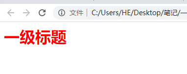


### 内部样式表:

```html
<head>
	<style type="text/css">
		h1{
			color:blue;
			font-size:60px;
		}
	</style>
</head>

<body>
<h1>一级标题</h1>
</body>
```

### 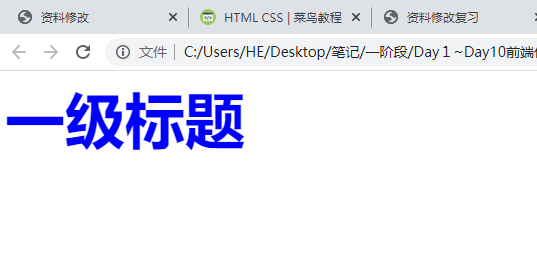外部样式表--链接样式表

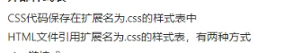

test.html:

```html
<head>
	<link href="test.css" rel="stylesheet" type="text/css"/>
</head>

<body>
<h1>一级标题</h1>
</body>
```

test.css

```css
h1{
	color: green;
	font-size:43px;
}
```

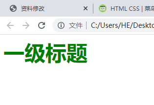


## 选择器:

### 标签选择器

test.html:

```html
<head>


<link href="test.css" rel="stylesheet" type"text/css"/>

</head>

<body>
	
	<h1>一级标题</h1>


</body>
```

test.css:

```css
h1{
	color: green;
	font-size:43px;
}
```

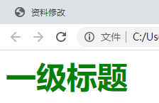


### 类选择器

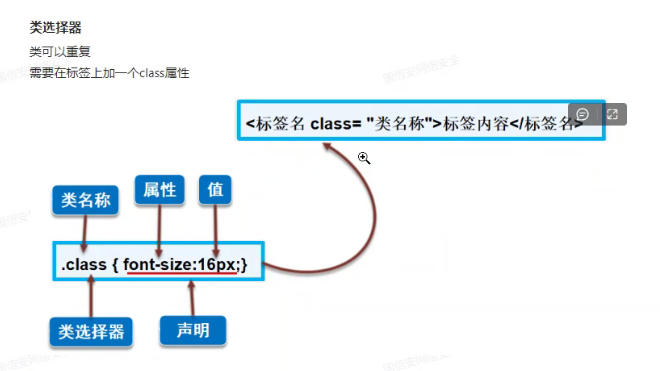

test.html:

```html
<head>


<link href="test.css" rel="stylesheet" type"text/css"/>

</head>

<body>

	<p class="green">哈佛撒就嗲大面积</p>
	<p>大萨达萨达萨达打</p>
	<p class="green">大萨达斧蛤us恢复撒</p>

</body>
```

test.css:

```css
.green{
	color:green;
	font-size:15px;
}
```

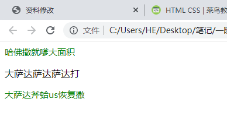


### ID选择器

test.html:

```html
<head>


<link href="test.css" rel="stylesheet" type"text/css"/>

</head>

<body>

	<p class="green">哈佛撒就嗲大面积</p>
	<p id="red">大萨达萨达萨达打</p>
	<p class="green">大萨达斧蛤us恢复撒</p>
    	<p id="red" class="green">dsads</p>

</body>


```


test.css:

```css

.green{
	color:green;
	font-size:15px;
}

#red{
	color:red;
	font-size:80;
}
```


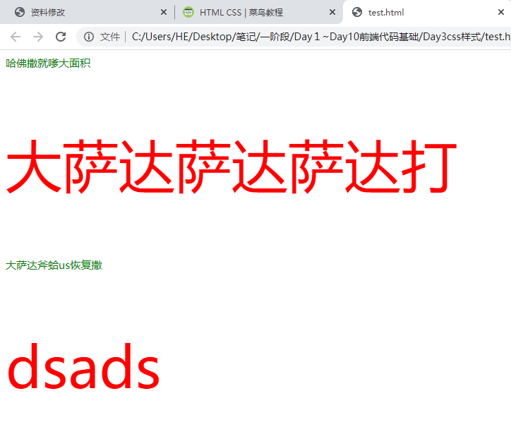

### 选择器优先级

> 行内元素>内部样式表>外部样式表
>
> ID选择器>类选择器>标签选择器

#### ID选择器优先级高于类选择器,同时给元素设置class和id,优先应用ID选择器的CSS属性

#### 如果外部样式放在内部样式的后面,则外部样式将覆盖内部样式

如:

test.html:

```html
<head>
    <!-- 设置：h3{color:blue;} -->
    <style type="text/css">
      /* 内部样式 */
      h3{color:green;}
    </style>
    <!-- 外部样式 style.css -->
    <link rel="stylesheet" type="text/css" href="test.css"/>
</head>
<body>
    <h3>显示蓝色，是外部样式</h3>
</body>
```

test.css:

```css
h3 {
    color:blue;
}
```


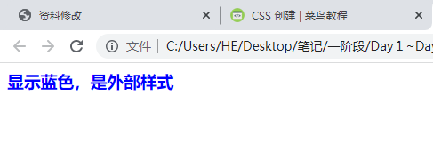

## CSS背景--background

用于定义HTML元素的背景

background:简写属性，作用是将背景属性设置在一个声明中。  可以设置如下属性:

- background-color	定义元素的背景颜色

``` css
h1 {background-color:#6495ed;}
p {background-color:#e0ffff;}
div {background-color:#b0c4de;}
```


- background-image   定义元素的背景图片

```css
body {background-image:url('paper.gif');}
```


- background-repeat    定义元素的背景图片的水平或垂直平铺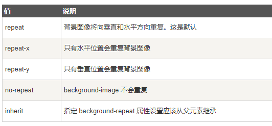

```
body
{
background-image:url('gradient2.png');
background-repeat:repeat-x;
}
```


- background-attachment    定义元素的背景图片是否固定或者随着页面的其余部分滚动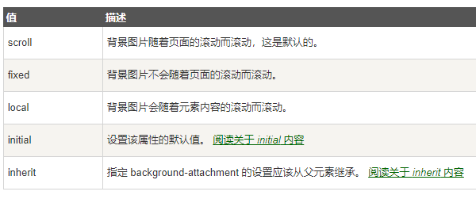

```css
body
{ 
    background-image:url('smiley.gif');
    background-repeat:no-repeat;
    background-attachment:fixed;
}
```


- background-position  定义背景图像的起始位置。

需要注意的是,使用background简写属性时,需要按以上顺序排列。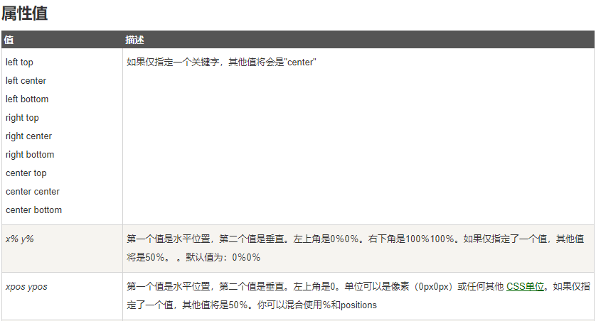

```css
body
{
background-image:url('smiley.gif');
background-repeat:no-repeat;
background-attachment:fixed;
background-position:center;
}
```


## CSS文本--text

css文本的属性:

### color:设置文本颜色

```css
body {
    color:red;
}
h1 {
    color:#00ff00;
}
p {
    color:rgb(0,0,255);
}
```

文本颜色可以通过以下方式设置:

| 值                                                  | 描述                                                         | 实例                                                         |
| --------------------------------------------------- | ------------------------------------------------------------ | ------------------------------------------------------------ |
| *颜色的名称*                                        | 颜色的名称，比如red, blue, brown, lightseagreen等，不区分大小写。 | color:red;    /* 红色 */ color:black;  /* 黑色 */ color:gray;   /* 灰色 */ color:white;  /* 白色 */ color:purple; /* 紫色 */ |
| *十六进制*                                          | 十六进制符号 #RRGGBB 和 #RGB（比如 #ff0000）。"#" 后跟 6 位或者 3 位十六进制字符（0-9, A-F）。 | #f03 #F03 #ff0033 #FF0033 rgb(255,0,51) rgb(255, 0, 51)      |
| *RGB，红-绿-蓝（red-green-blue (RGB)）*             | 规定颜色值为 rgb 代码的颜色，函数格式为 rgb(R,G,B)，取值可以是 0-255 的整数或百分比。 | rgb(255,0,51) rgb(255, 0, 51) rgb(100%,0%,20%) rgb(100%, 0%, 20%) |
| *RGBA，红-绿-蓝-阿尔法（RGBa）*                     | RGBa 扩展了 RGB 颜色模式，它包含了阿尔法通道，允许设定一个颜色的透明度。a 表示透明度：0=透明；1=不透明。 | rgba(255,0,0,0.1)    /* 10% 不透明 */   rgba(255,0,0,0.4)    /* 40% 不透明 */   rgba(255,0,0,0.7)    /* 70% 不透明 */   rgba(255,0,0,  1)    /* 不透明，即红色 */ |
| *HSL，色相-饱和度-明度（Hue-saturation-lightness）* | 色相（Hue）表示色环（即代表彩虹的一个圆环）的一个角度。<br/>饱和度和明度由百分数来表示。<br/>100% 是满饱和度，而 0% 是一种灰度。<br/>100% 明度是白色， 0% 明度是黑色，而 50% 明度是"一般的"。 | hsl(120,100%,25%)    /* 深绿色 */   hsl(120,100%,50%)    /* 绿色 */        hsl(120,100%,75%)    /* 浅绿色 */ |
| *HSLA，色相-饱和度-明度-阿尔法（HSLa）*             | HSLa 扩展自 HSL 颜色模式，包含了阿尔法通道，可以规定一个颜色的透明度。 a 表示透明度：0=透明；1=不透明。 | hsla(240,100%,50%,0.05)   /* 5% 不透明 */    hsla(240,100%,50%, 0.4)   /* 40% 不透明 */   hsla(240,100%,50%, 0.7)   /* 70% 不透明 */   hsla(240,100%,50%,   1)   /* 完全不透明 */ |


### direction:设置文本方向

设置文字方向"right-to-left"(从右到左,默认值为ltr):

```css
div{
    direction:rtl;
    unicode-bidi: bidi-override; 
}
```

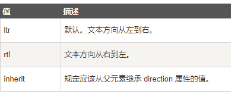


### letter-spacing:设置字符间距

设置h1和h2元素的字母间距：

```css
h1 {letter-spacing:2px}
h2 {letter-spacing:-3px}
```

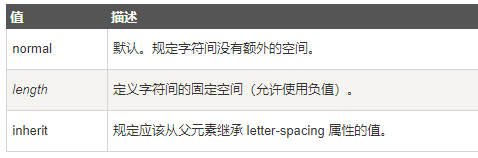


### line-height:设置行高

使用百分比设置行高:

```css
p.small {line-height:90%}
p.big {line-height:200%}
```


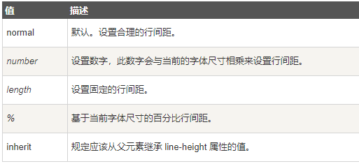


### text-align:设置文本的对齐方式

h1, h2, 和 h3元素设置文本的对齐方式：

```css
h1 {text-align:center}
h2 {text-align:left}
h3 {text-align:right}
```

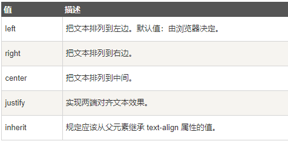


### text-decoration:向文本添加修饰

设置h1，h2，h3和h4元素文本装饰：

```css
h1 {text-decoration:overline}
h2 {text-decoration:line-through}
h3 {text-decoration:underline}
```


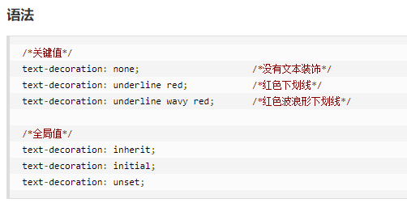


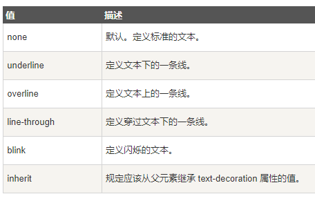

虚线与波浪线：

```css
h1 {
  text-decoration: underline overline dotted red;
}
 
h2 {
  text-decoration: underline overline wavy blue;
}
```


### text-indent:缩进元素中文本的首行

缩进段落的第一行50像素：

```css
p
{
text-indent:50px;
}
```


### text-shadow:设置文本阴影

基本文字阴影（text-shadow）：

```css
h1
{
    text-shadow: 2px 2px #ff0000;
}
```

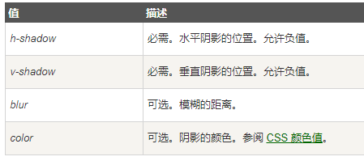


### text-transfortm:控制元素中的字母

转换不同元素中的文本：

```css
h1 {text-transform:uppercase;}  /*大写*/
h2 {text-transform:capitalize;}  /*每个单词首字母大写*/
p {text-transform:lowercase;}	/*小写*/
```


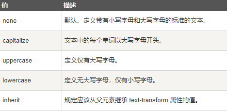


### unicode-bidi:设置或返回文本是否被重写css


### vertical-align:设置元素的垂直对齐

垂直对齐图像：

```css
img
{
    vertical-align:text-top;
}
```

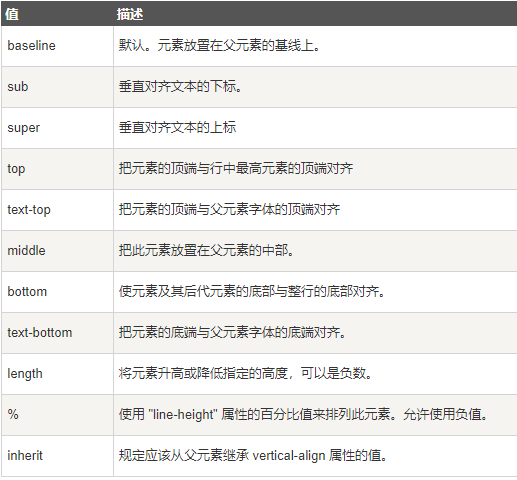


### white-space:设置元素中空白的处理方式

规定段落中的文本不进行换行：

```css
p
{
    white-space:nowrap;
}
```

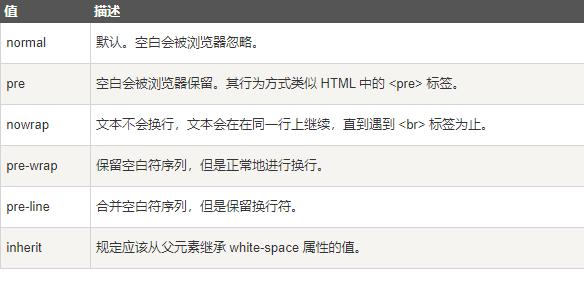


### word-spacing:设置字间距


指定段字之间的空间，应该是30像素：

```css
p
{
word-spacing:30px;
}
```

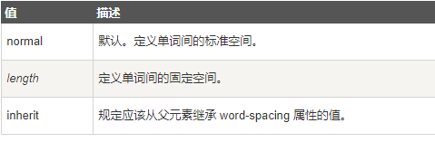


## CSS 字体--font

CSS字体的属性:

### font:在一个声明中设置所有的字体属性

可设置的属性是（按顺序）： "font-style font-variant font-weight font-size/line-height font-family"

font-size和font-family的值是必需的。如果缺少了其他值，默认值将被插入，如果有默认值的话。

```css
p.ex1
{
    font:15px arial,sans-serif;
}
 
p.ex2
{
    font:italic bold 12px/30px Georgia, serif;
}
```


### font-family: 指定文本的字体

font - family属性指定一个元素的字体。

font-family 可以把多个字体名称作为一个"回退"系统来保存。如果浏览器不支持第一个字体，则会尝试下一个。

```css
p {
font-family:"Times New Roman",Georgia,Serif;
}
```

**注意:** 如果字体名称包含空格，它必须加上引号。在HTML中使用"style"属性时，必须使用单引号。

如:

```css
<p style="font-family:'Times New Roman',Georgia,Serif;">
```


### font-size:指定文本的字体大小

```css
h1 {font-size:250%}
h2 {font-size:200%}
p {font-size:100%}
```

```css
/* <absolute-size>，绝对大小值 */
font-size: xx-small;
font-size: x-small;
font-size: small;
font-size: medium;
font-size: large;
font-size: x-large;
font-size: xx-large;
 
/* <relative-size>，相对大小值 */
font-size: larger;
font-size: smaller;
 
/* <length>，长度值 */
font-size: 12px;
font-size: 0.8em;
 
/* <percentage>，百分比值 */
font-size: 80%;
 
font-size: inherit;
```

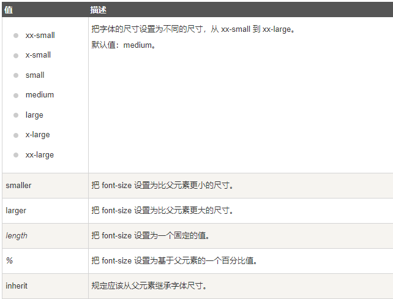


### font-style:指定文本的字体样式

```css
p.normal {font-style:normal}
p.italic {font-style:italic}
p.oblique {font-style:oblique}
```


### font-variant:以小型大写字体或者正常字体显示文本。


### font-weight:指定字体的粗细。

```css
p.normal {font-weight:normal;}
p.thick {font-weight:bold;}
p.thicker {font-weight:900;}
```

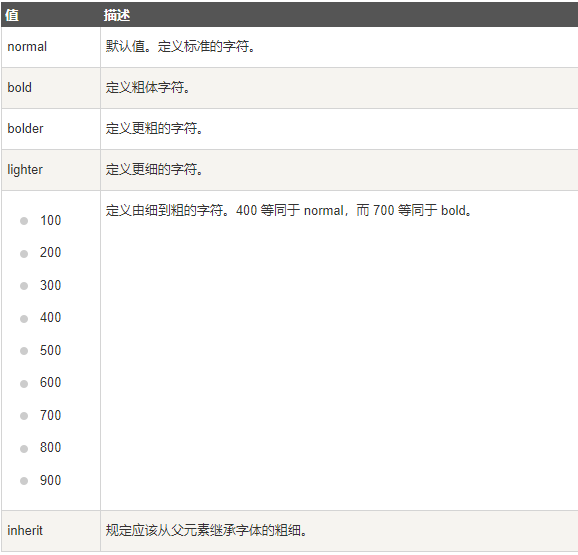


## CSS链接

### 链接的状态

- a:link - 正常，未访问过的链接
- a:visited - 用户已访问过的链接
- a:hover - 当用户鼠标放在链接上时
- a:active - 链接被点击的那一刻


```css
a:link {color:#000000;}      /* 未访问链接*/
a:visited {color:#00FF00;}  /* 已访问链接 */
a:hover {color:#FF00FF;}  /* 鼠标移动到链接上 */
a:active {color:#0000FF;}  /* 鼠标点击时 */
```

当设置为若干链路状态的样式，也有一些顺序规则：

- a:hover 必须跟在 a:link 和 a:visited后面
- a:active 必须跟在 a:hover后面


### 文本修饰--text-decoration

主要作用是删除链接中的下划线:

```css
a:link {text-decoration:none;}			/*取消下划线*/
a:visited {text-decoration:none;}			/**/
a:hover {text-decoration:underline;}			/*添加下划线*/
a:active {text-decoration:underline;}			/**/
```


### 背景颜色

```css
a:link {background-color:#B2FF99;}
a:visited {background-color:#FFFF85;}
a:hover {background-color:#FF704D;}
a:active {background-color:#FF704D;}
```


## CSS列表

list-style-type属性指定列表项标记的类型是：

```css
ul.a {list-style-type: circle;}
ul.b {list-style-type: square;}
 
ol.c {list-style-type: upper-roman;}
ol.d {list-style-type: lower-alpha;}
```

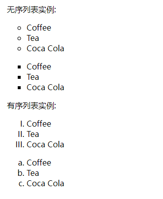

指定列表项标记的图像(用图像当做无序列表项的标记):

```css
ul
{
    list-style-image: url('sqpurple.gif');
}
```

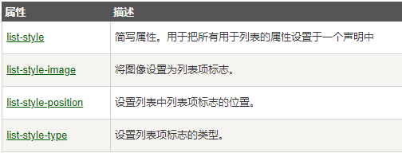


## CSS表格

### 表格边框

```css
table, th, td
{
    border: 1px solid black;
}
```

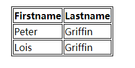

### 折叠边框

```css
table
{
    border-collapse:collapse;
}
table,th, td
{
    border: 1px solid black;
}
```

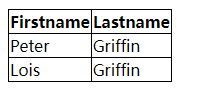


### 表格宽度和高度

```css
table 
{
    width:100%;
}
th
{
    height:50px;
}
```


### 表格文字对齐

```css
td
{
    text-align:right;   /*水平对齐*/
}

td
{
    height:50px;
    vertical-align:top;	/*垂直对齐*/
}
```

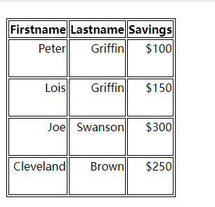

### 表格填充

```css
td
{
    padding:15px;
}
```


### 表格颜色

```css
table, td, th
{
    border:1px solid green;
}
th
{
    background-color:green;
    color:white;
}
```


## CSS盒子模型

CSS盒模型本质上是一个盒子，封装周围的HTML元素，它包括：边距，边框，填充，和实际内容。

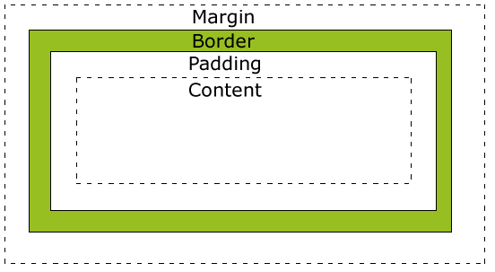

- **Margin(外边距)** - 清除边框外的区域，外边距是透明的。
- **Border(边框)** - 围绕在内边距和内容外的边框。
- **Padding(内边距)** - 清除内容周围的区域，内边距是透明的。
- **Content(内容)** - 盒子的内容，显示文本和图像。


### 元素的宽度和高度

```css
div {
    width: 300px;
    border: 25px solid green;
    padding: 25px;
    margin: 25px;
}
```

### 元素的总宽度计算公式

总元素的宽度=宽度+左填充+右填充+左边框+右边框+左边距+右边距

### 元素的总高度最终计算公式

总元素的高度=高度+顶部填充+底部填充+上边框+下边框+上边距+下边距


## CSS边框

### 边框样式:border-style

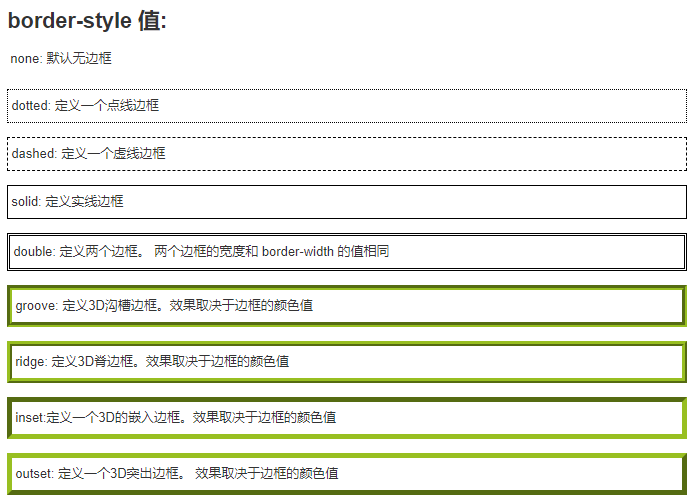

border-style属性可以有1-4个值：

- border-style:dotted solid double dashed;
  - 上边框是 dotted
  - 右边框是 solid
  - 底边框是 double
  - 左边框是 dashed
- border-style:dotted solid double;
  - 上边框是 dotted
  - 左、右边框是 solid
  - 底边框是 double
- border-style:dotted solid;
  - 上、底边框是 dotted
  - 右、左边框是 solid
- border-style:dotted;
  - 四面边框是 dotted


### 边框宽度: border-width 

边框指定宽度有两种方法：可以指定长度值，比如 2px 或 0.1em(单位为 px, pt, cm, em 等)，或者使用 3 个关键字之一，它们分别是 thick 、medium（默认值） 和 thin。

如:

```css
p.one
{
    border-style:solid;
    border-width:5px;
}
p.two
{
    border-style:solid;
    border-width:medium;
}
```

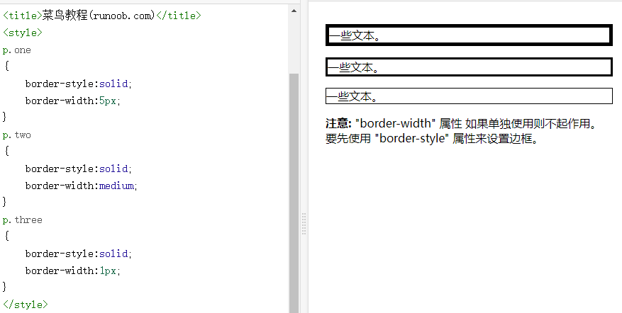


### 边框颜色:border-color


### CSS 边框属性

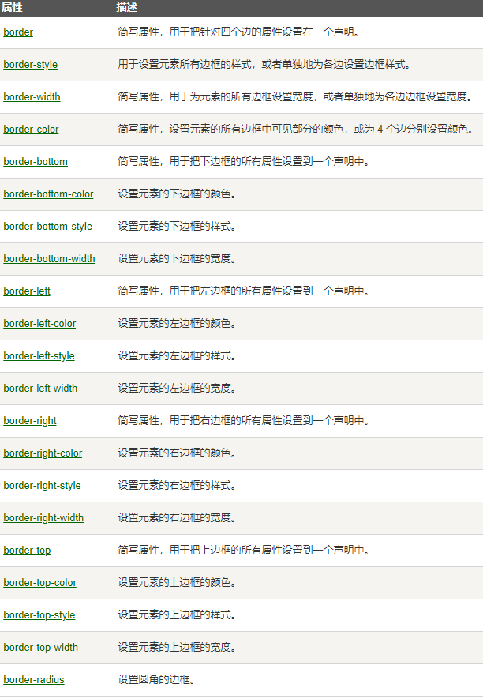


## CSS轮廓

轮廓（outline）是绘制于元素周围的一条线，位于边框边缘的外围，可起到突出元素的作用。

轮廓靠近margin内侧,紧挨着border外侧

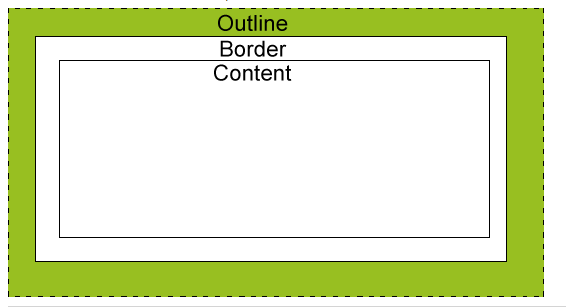


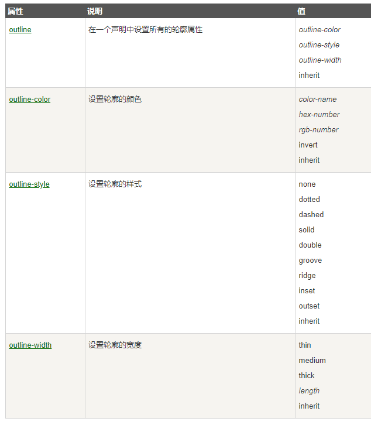


## CSS margin(外边距)


==margin 没有背景颜色，是完全透明的。==

### margin 可以单独改变元素的上，下，左，右边距，也可以一次改变所有的属性。

- margin:25px 50px 75px 100px;
  - 上边距为25px
  - 右边距为50px
  - 下边距为75px
  - 左边距为100px
- margin:25px 50px 75px;
  - 上边距为25px
  - 左右边距为50px
  - 下边距为75px
- margin:25px 50px;
  - 上下边距为25px
  - 左右边距为50px
- margin:25px;
  - 所有的4个边距都是25px

如:

```css
div1{
    margin-top:100px;
    margin-bottom:100px;
    margin-right:50px;
    margin-left:50px;
}

div2{
    margin:20px 40px;
}

div3{
    margin:25px 50px;
}
```


## CSS padding(填充)


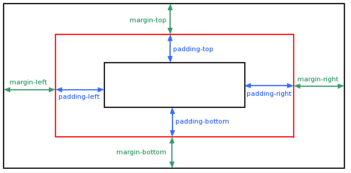

==padding 没有背景颜色，是完全透明的。==

### padding 可以单独改变元素的上，下，左，右边距，也可以一次改变所有的属性。

- 上填充为25px
- 右填充为50px
- 下填充为75px
- 左填充为100px

 **padding:25px 50px 75px;**

- 上填充为25px
- 左右填充为50px
- 下填充为75px

 **padding:25px 50px;**

- 上下填充为25px
- 左右填充为50px

 **padding:25px;**

- 所有的填充都是25px

```css
div1{
    padding-top:100px;
    padding-bottom:100px;
    padding-right:50px;
    padding-left:50px;
}

div2{
    padding:20px 40px;
}

div3{
    padding:25px 50px;
}
```


## CSS 分组 和 嵌套 选择器

多个选择器有相同的样式

```css
h1 {
    color:green;
}
h2 {
    color:green;
}
p {
    color:green;
}
```

#### 分组选择器

为了尽量减少代码，可以使用分组选择器。

每个选择器用逗号分隔。

```css
h1,h2,p
{
    color:green;
}
```

#### 嵌套选择器

- **p{ }**: 为所有 **p** 元素指定一个样式。
- **.marked{ }**: 为所有 **class="marked"** 的元素指定一个样式。
- **.marked p{ }**: 为所有 **class="marked"** 元素内的 **p** 元素指定一个样式。
- **p.marked{ }**: 为所有 **class="marked"** 的 **p** 元素指定一个样式。

```css
p
{
    color:blue;
    text-align:center;
}
.marked
{
    background-color:red;
}
.marked p
{
    color:white;
}
p.marked{
    text-decoration:underline;
}
```


## CSS尺寸

所有尺寸属性都可以以百分比(%)或者像素(px)为单位

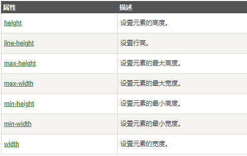


## CSS Display(显示)与Visibility(可见性)

### 隐藏元素:   display:none或visibility:hidden

隐藏一个元素可以通过把display属性设置为"none"，或把visibility属性设置为"hidden"。但是请注意，这两种方法会产生不同的结果。

visibility:hidden可以隐藏某个元素，但隐藏的元素仍需占用与未隐藏之前一样的空间。也就是说，该元素虽然被隐藏了，但仍然会影响布局。


## CSS Position(定位)

### position 属性的五个值：

- [static](https://www.runoob.com/css/css-positioning.html#position-static)
- [relative](https://www.runoob.com/css/css-positioning.html#position-relative)
- [fixed](https://www.runoob.com/css/css-positioning.html#position-fixed)
- [absolute](https://www.runoob.com/css/css-positioning.html#position-absolute)
- [sticky](https://www.runoob.com/css/css-positioning.html#position-sticky)

#### static 定位

HTML 元素的默认值，即没有定位，遵循正常的文档流对象。

静态定位的元素不会受到 top, bottom, left, right影响。


#### fixed 定位

元素的位置相对于浏览器窗口是固定位置。

即使窗口是滚动的它也不会移动：


#### relative 定位

相对定位元素的定位是相对其正常位置。

移动相对定位元素，但它原本所占的空间不会改变。

相对定位元素经常被用来作为绝对定位元素的容器块。

#### absolute 定位

绝对定位的元素的位置相对于最近的已定位父元素，如果元素没有已定位的父元素，那么它的位置相对于<html>:


#### sticky 定位

sticky 英文字面意思是粘，粘贴，所以可以把它称之为粘性定位。

**position: sticky;** 基于用户的滚动位置来定位。

粘性定位的元素是依赖于用户的滚动，在 **position:relative** 与 **position:fixed** 定位之间切换。

它的行为就像 **position:relative;** 而当页面滚动超出目标区域时，它的表现就像 **position:fixed;**，它会固定在目标位置。

元素定位表现为在跨越特定阈值前为相对定位，之后为固定定位。

这个特定阈值指的是 top, right, bottom 或 left 之一，换言之，指定 top, right, bottom 或 left 四个阈值其中之一，才可使粘性定位生效。否则其行为与相对定位相同。


### 所有的CSS定位属性

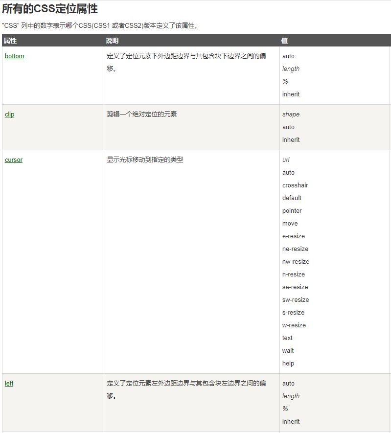


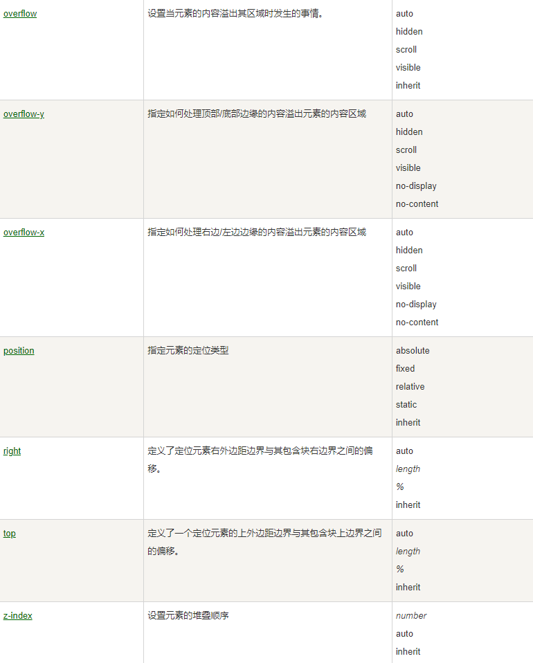


## CSS 布局 - Overflow

CSS overflow 属性用于控制内容溢出元素框时显示的方式。

### overflow属性的值

#### visible

默认值。内容不会被修剪，会呈现在元素框之外。


#### hidden

内容会被修剪，并且其余内容是不可见的。


#### scroll

内容会被修剪，但是浏览器会显示滚动条以便查看其余的内容。


#### auto

如果内容被修剪，则浏览器会显示滚动条以便查看其余的内容。


#### inherit

 规定应该从父元素继承 overflow 属性的值。


## CSS Float(浮动)

CSS 的 Float（浮动），会使元素向左或向右移动，其周围的元素也会重新排列。

Float（浮动），往往是用于图像，但它在布局时一样非常有用。


### 元素怎样浮动

```css
img
{
    float:right;
}
```


### 彼此相邻的浮动元素

如果你把几个浮动的元素放到一起，如果有空间的话，它们将彼此相邻。

在这里，我们对图片廊使用 float 属性：

```css
.thumbnail 
{
    float:left;
    width:110px;
    height:90px;
    margin:5px;
}
```


### 清除浮动 - 使用 clear

元素浮动之后，周围的元素会重新排列，为了避免这种情况，使用 clear 属性。

clear 属性指定元素两侧不能出现浮动元素。

```css
.text_line
{
    clear:both;
}
```

## CSS 布局 - 水平 & 垂直对齐

### 元素居中对齐

要水平居中对齐一个元素(如 `<div>`), 可以使用 **margin: auto;**。

设置到元素的宽度将防止它溢出到容器的边缘。

元素通过指定宽度，并将两边的空外边距平均分配

**注意:** 如果没有设置 **width** 属性(或者设置 100%)，居中对齐将不起作用。

```css
.center {
    margin: auto;
    width: 50%;
    border: 3px solid green;
    padding: 10px;
}
```


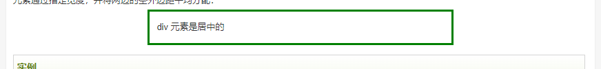


### 文本居中对齐

如果仅仅是为了文本在元素内居中对齐，可以使用 **text-align: center;**

```css
.center {
    text-align: center;
    border: 3px solid green;
}
```

### 图片居中对齐

要让图片居中对齐, 可以使用 **margin: auto;** 并将它放到 **块** 元素中:

```css
img {
    display: block;
    margin: auto;
    width: 40%;
}
```

### 左右对齐 - 使用定位方式

我们可以使用 **position: absolute;** 属性来对齐元素:

注释：绝对定位元素会被从正常流中删除，并且能够交叠元素。

**提示:** 当使用 **position** 来对齐元素时, 通常 **<body>** 元素会设置 **margin** 和 **padding** 。 这样可以避免在不同的浏览器中出现可见的差异。

```css
.right {
    position: absolute;
    right: 0px;
    width: 300px;
    border: 3px solid #73AD21;
    padding: 10px;
}
```

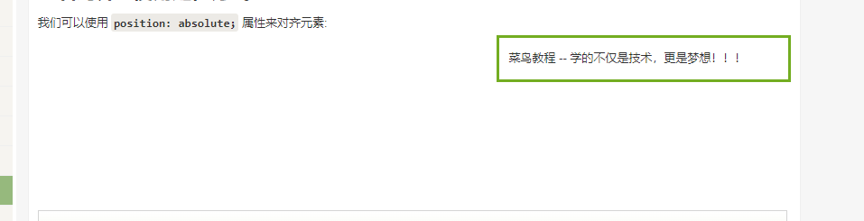


### 左右对齐 - 使用 float 方式

```css
.right {
    float: right;
    width: 300px;
    border: 3px solid #73AD21;
    padding: 10px;
}
```

当像这样对齐元素时，对 <body> 元素的外边距和内边距进行预定义是一个好主意。这样可以避免在不同的浏览器中出现可见的差异。

> 注意：如果子元素的高度大于父元素，且子元素设置了浮动，那么子元素将溢出，这时候你可以使用 "**clearfix**(清除浮动)" 来解决该问题。

我们可以在父元素上添加 overflow: auto; 来解决子元素溢出的问题:

```css
.clearfix {
    overflow: auto;
}
```


### 垂直居中对齐 - 使用 padding

CSS 中有很多方式可以实现垂直居中对齐。 一个简单的方式就是头部顶部使用 **padding**:

```css
.center {
    padding: 70px 0;
    border: 3px solid green;
}
```


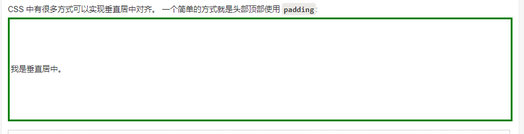

如果要水平和垂直都居中，可以使用 **padding** 和 **text-align: center**:

```css
.center {
    padding: 70px 0;
    border: 3px solid green;
    text-align: center;
}
```

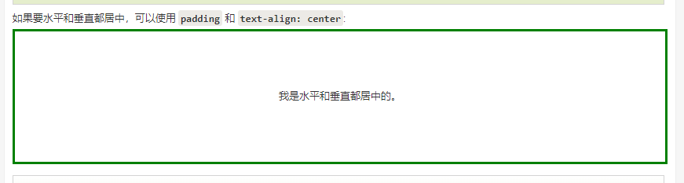

### 垂直居中 - 使用 line-height

```css
.center {
    line-height: 200px;
    height: 200px;
    border: 3px solid green;
    text-align: center;
}
 
/* 如果文本有多行，添加以下代码: */
.center p {
    line-height: 1.5;
    display: inline-block;
    vertical-align: middle;
}
```

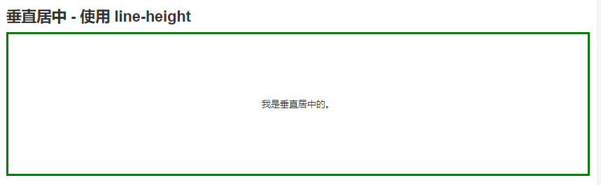


### 垂直居中 - 使用 position 和 transform

除了使用 **padding** 和 **line-height** 属性外,我们还可以使用 **transform** 属性来设置垂直居中:

```css
.center { 
    height: 200px;
    position: relative;
    border: 3px solid green; 
}
 
.center p {
    margin: 0;
    position: absolute;
    top: 50%;
    left: 50%;
    transform: translate(-50%, -50%);
}
```


## CSS 组合选择符

### **>(大于号) 子元素选择器**

大于号的意思是 选择某元素后面的第一代子元素。

```html
<style type="text/css">
	h1>strong {
		color: red;
	}
</style>

<body>
	<h1>
		<strong>一代子元素</strong>
	</h1>
	<h1>
		<span>
			<strong>二代子元素</strong>
		</span>
	</h1>
</body>
```

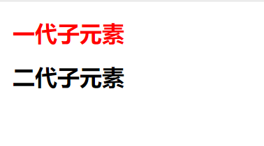


### ~（波浪号） 后续元素选择器

~波浪号的意思是 选取 某个元素之后的所有相同元素

```html
<style type="text/css">
	.box~h2{
		color: red;
	}
</style>

<body>
	<div class="box"></div>
	<h2>1</h2>
	<em>2</em>
	<h2>3</h2>
	<h2>4</h2>
</body>

```

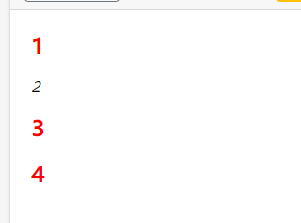


### （空格） 后代选择器

选择某元素后面的所有子元素，派生选择器允许你根据文档的上下文关系来确定某个标签的样式。

```html
<style type="text/css">
	h1 strong {
		color: red;
	}
</style>

<body>
	<h1>
		<strong>一代子元素</strong>
	</h1>
	<h1>
		<span>
			<strong>二代子元素</strong>
		</span>
	</h1>
</body>
```

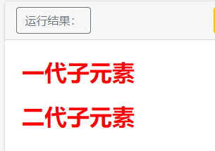

### +（加号）相邻兄弟选择器

可选择紧接在另一元素后的元素，且二者有相同父元素

```html
<style type="text/css">
	span+em{
		color: red;
	}
</style>

<body>
	<h1>
		<span>案例1</span>
		<em>案例2</em>
	</h1>
</body>
```


## CSS 伪类

### 伪类的语法：

selector:pseudo-class {property:value;}

### CSS类也可以使用伪类：

selector.class:pseudo-class {property:value;}


### anchor伪类

在支持 CSS 的浏览器中，链接的不同状态都可以以不同的方式显示

```css
a:link {color:#FF0000;} /* 未访问的链接 */
a:visited {color:#00FF00;} /* 已访问的链接 */
a:hover {color:#FF00FF;} /* 鼠标划过链接 */
a:active {color:#0000FF;} /* 已选中的链接 */
```

**注意：** 在CSS定义中，a:hover 必须被置于 a:link 和 a:visited 之后，才是有效的。

**注意：** 在 CSS 定义中，a:active 必须被置于 a:hover 之后，才是有效的。


### 伪类和CSS类

伪类可以与 CSS 类配合使用

```css
a.red:visited {color:#FF0000;}
 
<a class="red" href="css-syntax.html">CSS 语法</a>
```


### CSS :first-child 伪类

可以使用 :first-child 伪类来选择父元素的第一个子元素。

#### 匹配第一个 `<p> `元素

在下面的例子中，选择器匹配作为任何元素的第一个子元素的 <p> 元素：

```css
p:first-child
{
    color:blue;
}
```


#### 匹配所有作为第一个子元素的` <p>` 元素中的所有` <i>` 元素

在下面的例子中，选择器匹配所有作为元素的第一个子元素的 <p> 元素中的所有 <i> 元素：

```css
p:first-child i
{
    color:blue;
}
```

### CSS - :lang 伪类

:lang 伪类使你有能力为不同的语言定义特殊的规则

在下面的例子中，:lang 类为属性值为 no 的q元素定义引号的类型：

```css
q:lang(no) {quotes: "~"
```


### 所有CSS伪类/元素

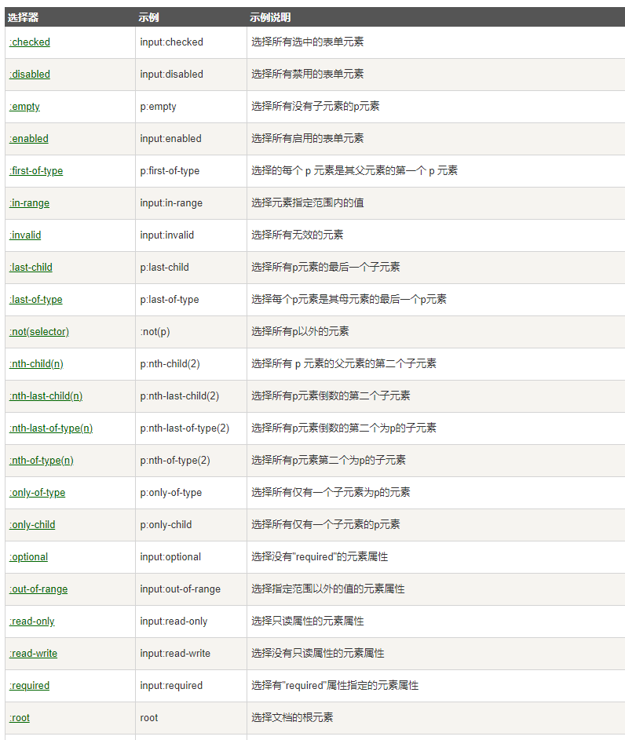

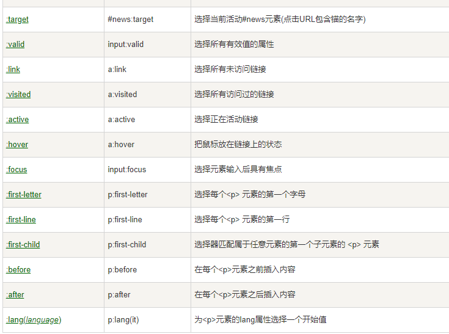


## CSS 伪元素

CSS 伪元素是用来添加一些选择器的特殊效果。

### 伪元素的语法：

```css
selector:pseudo-element {property:value;}
```

### CSS类也可以使用伪元素：

```css
selector.class:pseudo-element {property:value;}
```

### :first-line 伪元素

"first-line" 伪元素用于向文本的首行设置特殊样式。

在下面的例子中，浏览器会根据 "first-line" 伪元素中的样式对 p 元素的第一行文本进行格式化：

```css
p:first-line 
{
    color:#ff0000;
    font-variant:small-caps;
}
```

**注意：**"first-line" 伪元素只能用于块级元素。

**注意：** 下面的属性可应用于 "first-line" 伪元素：

- font properties
- color properties 
- background properties
- word-spacing
- letter-spacing
- text-decoration
- vertical-align
- text-transform
- line-height
- clear


### :first-letter 伪元素

"first-letter" 伪元素用于向文本的首字母设置特殊样式：

```css
p:first-letter 
{
    color:#ff0000;
    font-size:xx-large;
}
```

**注意：** "first-letter" 伪元素只能用于块级元素。

**注意：** 下面的属性可应用于 "first-letter" 伪元素： 

- font properties
- color properties 
- background properties
- margin properties
- padding properties
- border properties
- text-decoration
- vertical-align (only if "float" is "none")
- text-transform
- line-height
- float
- clear


## 伪元素和CSS类

伪元素可以结合CSS类： 

下面的例子会使所有 class 为 article 的段落的首字母变为红色。

```css
p.article:first-letter {color:#ff0000;}

<p class="article">文章段落</p>
```


### 多个伪元素

可以结合多个伪元素来使用。

在下面的例子中，段落的第一个字母将显示为红色，其字体大小为 xx-large。第一行中的其余文本将为蓝色，并以小型大写字母显示。

段落中的其余文本将以默认字体大小和颜色来显示：

```css
p:first-letter
{
    color:#ff0000;
    font-size:xx-large;
}
p:first-line 
{
    color:#0000ff;
    font-variant:small-caps;
}
```


### CSS - :before 伪元素

":before" 伪元素可以在元素的内容前面插入新内容。

下面的例子在每个` <h1>`元素前面插入一幅图片：

```css
h1:before 
{
    content:url(smiley.gif);
}
```


### CSS - :after 伪元素

":after" 伪元素可以在元素的内容之后插入新内容。

下面的例子在每个 <h1> 元素后面插入一幅图片：

```css
h1:after
{
    content:url(smiley.gif);
}
```


### 所有CSS伪类/元素

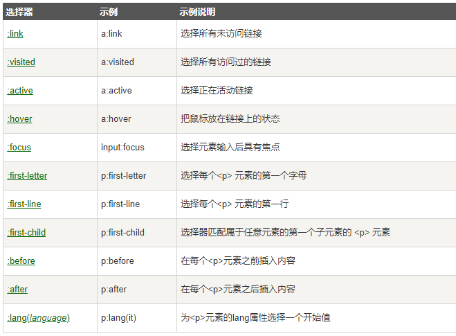


## CSS 导航栏

### 导航栏=链接列表

```html
<ul>
  <li><a href="#home">主页</a></li>
  <li><a href="#news">新闻</a></li>
  <li><a href="#contact">联系</a></li>
  <li><a href="#about">关于</a></li>
</ul>
```

```css
ul {
    list-style-type: none;
    margin: 0;
    padding: 0;
}
```

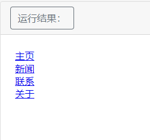


### 垂直导航栏

上面的代码，我们只需要` <a>`元素的样式，建立一个垂直的导航栏：

```css
a
{
    display:block;
    width:60px;
}
```

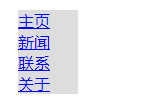


#### 垂直导航条实例:

创建一个简单的垂直导航条实例，在鼠标移动到选项时，修改背景颜色：

```css
ul {
    list-style-type: none;
    margin: 0;
    padding: 0;
    width: 200px;
    background-color: #f1f1f1;
}
 
li a {
    display: block;
    color: #000;
    padding: 8px 16px;
    text-decoration: none;
}
 
/* 鼠标移动到选项上修改背景颜色 */
li a:hover {
    background-color: #555;
    color: white;
}
```

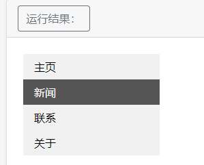


#### 激活/当前导航条实例

```css
li a.active {
    background-color: #4CAF50;
    color: white;
}
```


#### 创建链接并添加边框

```css
ul {
    border: 1px solid #555;
}
 
li {
    text-align: center;
    border-bottom: 1px solid #555;
}
 
li:last-child {
    border-bottom: none;
}
```

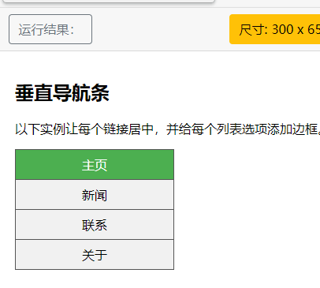


#### 全屏高度的固定导航条

接下来我们创建一个左边是全屏高度的固定导航条，右边是可滚动的内容。

```css
ul {
    list-style-type: none;
    margin: 0;
    padding: 0;
    width: 25%;
    background-color: #f1f1f1;
    height: 100%; /* 全屏高度 */
    position: fixed; 
    overflow: auto; /* 如果导航栏选项多，允许滚动 */
}
```

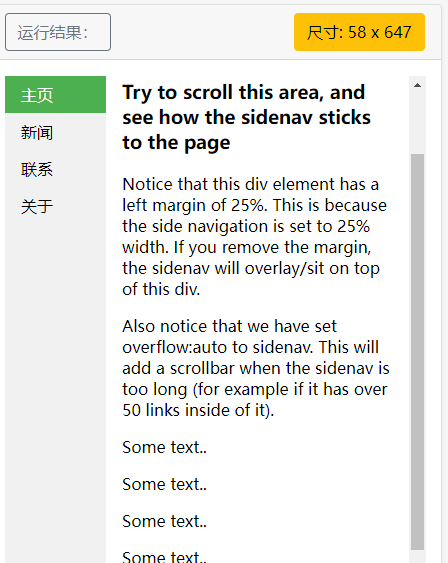

### 水平导航栏

有两种方法创建横向导航栏。使用**内联(inline)**或**浮动(float)**的列表项。

这两种方法都很好，但如果想链接到具有相同的大小，你必须使用浮动的方法。

#### 内联列表项

建立一个横向导航栏的方法之一是指定元素， 下述代码是标准的内联:

```css
li
{
    display:inline;
}
```

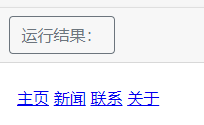

#### 浮动列表项

在上面的例子中链接有不同的宽度。

对于所有的链接宽度相等，浮动 <li>元素，并指定为 <a>元素的宽度：

```css
li
{
    float:left;
}
a
{
    display:block;
    width:60px;
}
```

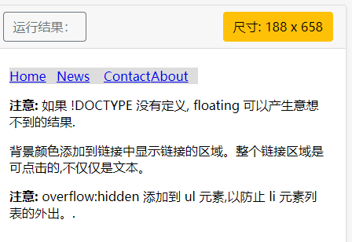

#### 水平导航条实例

创建一个水平导航条，在鼠标移动到选项后修改背景颜色。

```css
ul {
    list-style-type: none;
    margin: 0;
    padding: 0;
    overflow: hidden;
    background-color: #333;
}
 
li {
    float: left;
}
 
li a {
    display: block;
    color: white;
    text-align: center;
    padding: 14px 16px;
    text-decoration: none;
}
 
/*鼠标移动到选项上修改背景颜色 */
li a:hover {
    background-color: #111;
}
```

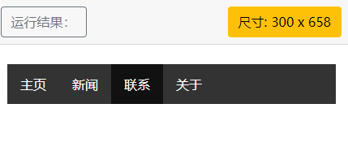

#### 激活/当前导航条实例

在点击了选项后，我们可以添加 "active" 类来标准哪个选项被选中：

```css
.active {
    background-color: #4CAF50;
}
```

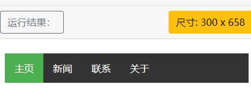

#### 链接右对齐

将导航条最右边的选项设置右对齐 (float:right;)：

```css
<ul>
  <li><a href="#home">主页</a></li>
  <li><a href="#news">新闻</a></li>
  <li><a href="#contact">联系</a></li>
  <li style="float:right"><a class="active" href="#about">关于</a></li>
</ul>
```

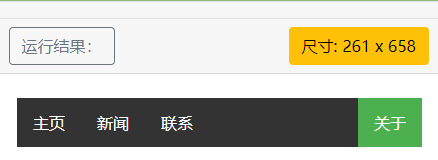

#### 添加分割线

`<li> `通过 **border-right** 样式来添加分割线:

```css
/* 除了最后一个选项(last-child) 其他的都添加分割线 */
li {
    border-right: 1px solid #bbb;
}
 
li:last-child {
    border-right: none;
}
```

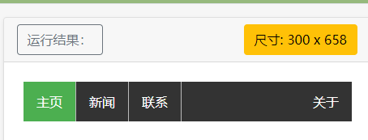

#### 固定导航条

可以设置页面的导航条固定在头部或者底部：

固定在头部:

```css
ul {
    position: fixed;
    top: 0;
    width: 100%;
}
```

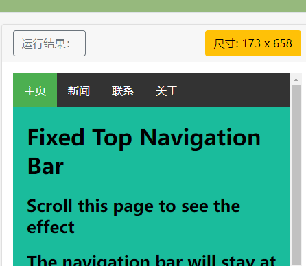

固定在底部:

```css
ul {
    position: fixed;
    bottom: 0;
    width: 100%;
}
```

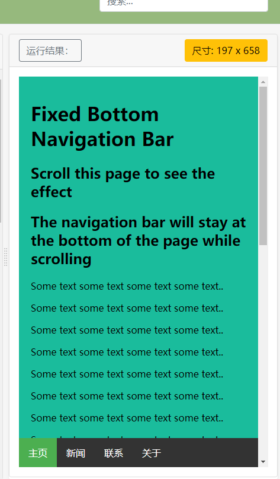

#### 灰色水平导航条

```css
ul {
    border: 1px solid #e7e7e7;
    background-color: #f3f3f3;
}
 
li a {
    color: #666;
}
```

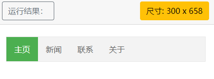

## CSS 下拉菜单

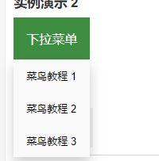

### 基本下拉菜单

当鼠标移动到指定元素上时，会出现下拉菜单:

```css
<style>
.dropdown {
  position: relative;
  display: inline-block;
}
.dropdown-content {
  display: none;
  position: absolute;
  background-color: #f9f9f9;
  min-width: 160px;
  box-shadow: 0px 8px 16px 0px rgba(0,0,0,0.2);
  padding: 12px 16px;
}
.dropdown:hover .dropdown-content {
  display: block;
}
</style>
[mycode3]
[mycode3 type="html"]
<div class="dropdown">
  <span>鼠标移动到我这！</span>
  <div class="dropdown-content">
    <p>菜鸟教程</p>
    <p>www.runoob.com</p>
  </div>
</div>
```

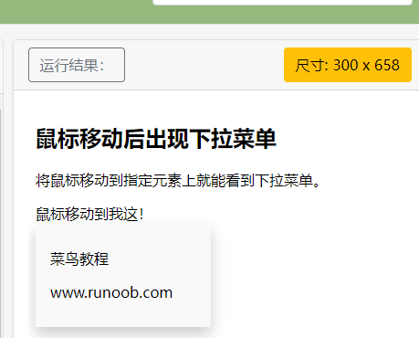

### 下拉菜单

创建下拉菜单，并允许用户选取列表中的某一项：

```css
<style>
/* 下拉按钮样式 */
.dropbtn {
    background-color: #4CAF50;
    color: white;
    padding: 16px;
    font-size: 16px;
    border: none;
    cursor: pointer;
}

/* 容器 <div> - 需要定位下拉内容 */
.dropdown {
    position: relative;
    display: inline-block;
}

/* 下拉内容 (默认隐藏) */
.dropdown-content {
    display: none;
    position: absolute;
    background-color: #f9f9f9;
    min-width: 160px;
    box-shadow: 0px 8px 16px 0px rgba(0,0,0,0.2);
}

/* 下拉菜单的链接 */
.dropdown-content a {
    color: black;
    padding: 12px 16px;
    text-decoration: none;
    display: block;
}

/* 鼠标移上去后修改下拉菜单链接颜色 */
.dropdown-content a:hover {background-color: #f1f1f1}

/* 在鼠标移上去后显示下拉菜单 */
.dropdown:hover .dropdown-content {
    display: block;
}

/* 当下拉内容显示后修改下拉按钮的背景颜色 */
.dropdown:hover .dropbtn {
    background-color: #3e8e41;
}
</style>

<div class="dropdown">
  <button class="dropbtn">下拉菜单</button>
  <div class="dropdown-content">
    <a href="#">菜鸟教程 1</a>
    <a href="#">菜鸟教程 2</a>
    <a href="#">菜鸟教程 3</a>
  </div>
</div>
```

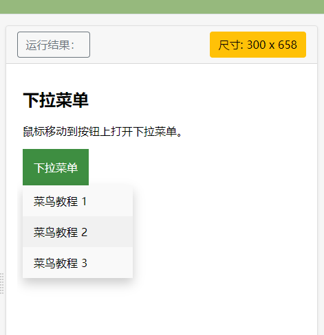

### 下拉内容对齐方式

### float:left;


### float:right;

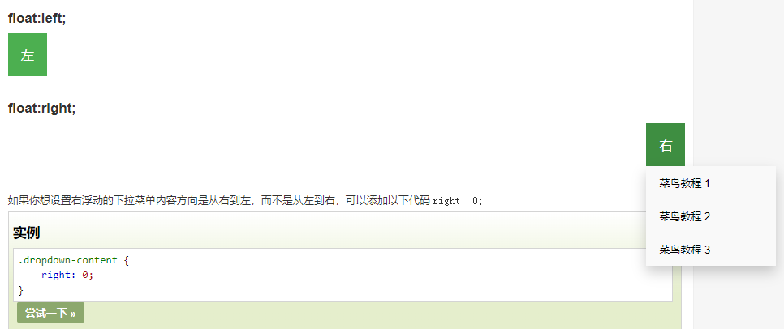如果你想设置右浮动的下拉菜单内容方向是从右到左，而不是从左到右，可以添加以下代码 `right: 0;`

```css
.dropdown-content {
    right: 0;
}
```

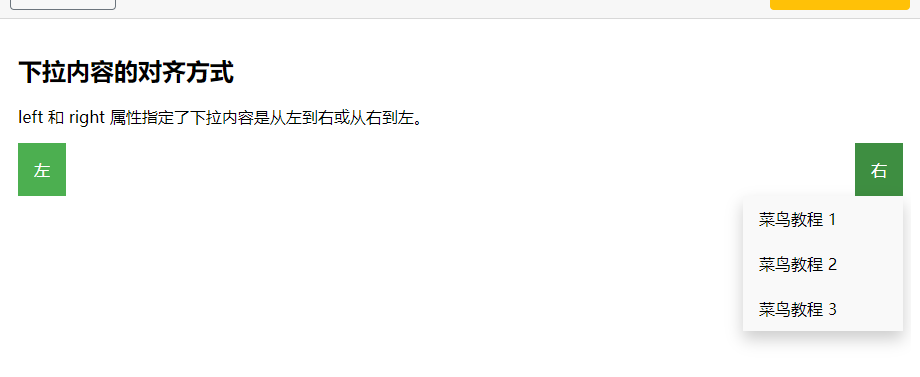


# 亮哥发的--【回顾及总结】

1. 什么是id、class选择器？如何声明？有何作用？

   #xx，.class

   #xx{}、.xxx{}

2. 选择器命名需要注意什么?

   不能是数字开头

3. 如何通过行内样式表、内部样式表、外部样式表的方式引入css样式？

   装怪代码（部分）

   ```css
   <head>
   	<link href=”./index.txt“ rel="styleshet" type="text/xss">
   </head>
   ```

   正确代码

   ```css
   <h1 style="color:red">标题1</h1>
   
   <head>
   	<style>
   		h1 {
               color:red;
   		}
   	</style>
   </head>
   
   <head>
   	<link href="./index.css" rel="stylesheet" type="text/css" />
   </head>
   ```

   外部样式表文件index.css

   错误：

   ```
   <head>
   	<style>
   		h1 {
               color:red;
   		}
   	</style>
   </head>
   ```

   正确：

   ```css
   h1 {
       color:red;
   }
   ```

4. 外部样式表方式引入css文件时，被引入文件的扩展名需要注意什么？

   .css

5. 对比css声明和html属性，各属性键值对之间的分隔符、属性名和属性值连接符、属性值是否有引号？

   css

   > 冒号，分号，无需引号

   html

   > 空格，等号，需要引号（单双均可，但是必须成对出现）

6. 如何定义背景色、背景图片？

   background-color: red;

   错误：background-img: url("./logo.jpg");

   正确：background-image: url("./logo.jpg");

7. 红色的背景色有哪三种写法？

   red、#F00、rgb(255,0,0)

8. 如何配置背景图片的重复方式、图片位置？

   错误：background-repeate: none;

   正确：background-repeat: none;

   background-position:  right top;

9. 如何设置文字的颜色、缩进、行高、字符间距、单词间距、倾斜、粗细？

   color: 后面可以跟颜色的各种形式的值。

   text-indent: 2px;

   line-height: 可以跟倍数数字，可以跟百分比

   letter-spacing: 2px;

   word-spacing: -20px;

   font-style:italic;

   font-weight:

10. 下面代码代表什么意思？

    ```css
    p{font-family:"Times New Roman", Times, serif;}
    ```

11. 如何定义多个网络安全的字体备用？

    ```css
    p{font-family:"宋体", "黑体", "微软雅黑";}
    ```

12. 如何定义链接各种情况下的选择器：正常的、访问过的、鼠标放在链接上时的、被点击时的

    a:link

    a:visited

    a:hover

    a:active

13. 无序列表由哪两类元素组成？如何设置条目的标志类型？

    ul,li

    list-style-type: none;

    备选属性值：square, circle

14. 如何把无序列表的标志设置为图片？

    list-style-image: url("./dot.png");

15. 有序列表由哪两类元素组成？如何设置条目的序号类型？

    ol, li

    在ol中设置type属性，可选值如下方冒号后面字符：

    123：1

    ABC：A

    abc：a

    I\II\III：I

    i\ii\iii：i

    ```css
    <ol type="I">
    	<li>sdfhsdfg</li>
    	<li>中扽中扽</li>
    	<li>三扽个</li>
    </ol>
    ```

    

16. 如何设置表格整体的位置？

    

17. 如何设置表格的行高、单元格宽度？

    

18. 如何对单元格字体垂直和水平方向对齐？可以有哪些属性值？

    

19. 背景色可以给表格元素及其子元素中哪些元素设置？

    table、tr、td

20. margin、padding什么意思？

    

21. 盒子如何设置边框样式、宽度？

    boder相关属性

22. 盒子如何设置外边距、内边距？

    

23. outline什么作用？

    

24. 盒子的大小包含了

    默认情况下：

    宽度：width + padding x 2 + border x 2+margin x 2

    高度：height + padding x 2 + border x 2+margin x 2

25. 当设置了margin后，outline显示位置靠近还是远离边框？

    靠近，例子：

    ```html
    <head>
        <style>
        p
        {
            border:10px solid red;
            margin: 50px;
            outline:green dotted thick;
        }
        </style>
    </head>
    
    <body>
    	<p><b>注意:</b> 如果只有一个 !DOCTYP E指定 IE8 支持 outline 属性。</p>
    </body>
    ```

26. margin、padding、border、outline哪些能够设置样式（如填充颜色等）？

    border、outline

27. 如果多个选择器要运用同一套css声明怎么办？

    .red和a

    .red, p{color:"red";}

28. 如何表示class为cls的h1选择器？

    h1.cls

29. 如何表示class为cls的h1和h2选择器？

    正确：h1.cls, h2.cls

    错误1：h1.cls h2.cls

    错误2：h1.cls + h2.cls

30. 如何表示.cls中的后代元素中的a元素 选择器？

    `.cls a`

31. 块元素和内联元素有何区别？

    内联元素:

    1. 和其他元素在同一行,不独占一行
    2. 元素的高度,宽度以及顶部底部边距不可设置;
    3. 元素的宽度就是元素所包含的图片或文字的宽度，不可设置；

    

    块级元素:

    1. 每个块级元素都从新的一行开始,并且其后面的元素也另起一行(相当于块级元素自己独占一行)
    2. 块级元素的高度,宽度,行高以及顶部和底部边距都可设置
    3. 元素宽度在不设置的情况下,占它本身父容器的100%(和父元素宽度一致)

    ​					

32. 典型块元素有哪些？

    h1、p,form,ul

33. 典型内联元素有哪些？

    img、a、

34. 如何把元素显示成块或内联元素？

    ```css
    div{
        display:inline;  /*块元素显示成内联元素*/
    }
        
    <p>{
        display:block;	/*内联元素显示成块元素*/
    }
    
    img{
        display:inline-block;	/*显示成内联块元素*/
    }
    ```

    

35. 元素定位方式有哪5种？默认定位方式是哪种？

    static(默认),relative,fixed,absolute,sticky

36. 如何让一个盒子在父元素中水平居中？

    ```css
    div{
    	margin: auto;    
    }
    
    ```

    

37. 如何让一个盒子保持在窗口固定位置？

    ```css
    div{
    	position:absolute;
    }
    ```

    

38. 如何让一个盒子相对其正常位置进行移动定位？

    ```css
    div{
        position:relative;
    }
    ```

    

39. 如何让一个盒子相对其父元素的位置进行移动定位？

    

40. 如何设置元素的显示层？有何应用？

    display:none或visibility:hidden

41. 如果一个网站的导航条在中部，往下滚动时如何防止它被滚动出屏幕外？

    sticky的top定位值最小设置为0

42. sticky的top定位值设置成非零有用么？

    有用

43. 如何编写一个textarea，使其中文字内容超出时该元素右边可以呈现滚动条

    ```css
    textarea{
                overflow: scroll;
            }
    ```

    

44. 并排有5张图片，想把最后一张靠最右显示如何做到？

    ```css
    img5{
        float:right;
    }
    ```

45. 如何清除浮动？

    ```css
    img4{
        clear:both;	/* 清除两边的浮动*/
    }
    ```

    

    

