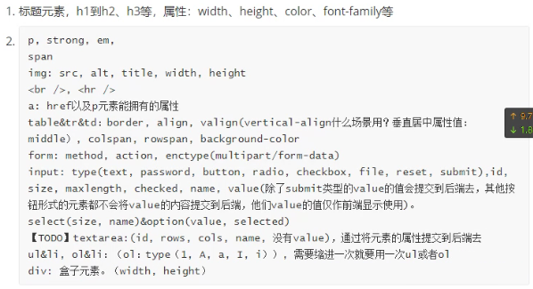

[toc]

# 总结上周内容

## 1. HTML

1. 是什么的缩写:

   hyper-text markup language 超文本标记语言

2. html架构:

   ```html
   <!DOCTYPE html>
   <html>
   <head>
   <meta charset="utf-8">
   <title>html架构</title>
   </head>
   <body>
       <h1>我的第一个标题</h1>
       <p>我的第一个段落。</p>
   </body>
   </html>
   ```

3. html元素的描述:

   - HTML 元素以**开始标签**起始
   - HTML 元素以**结束标签**终止
   - **元素的内容**是开始标签与结束标签之间的内容
   - 某些 HTML 元素具有**空内容（empty content）**
   - 空元素**在开始标签中进行关闭**（以开始标签的结束而结束）
   - 大多数 HTML 元素可拥有**属性**

4. 相关html元素:

   

   

## 2. CSS


