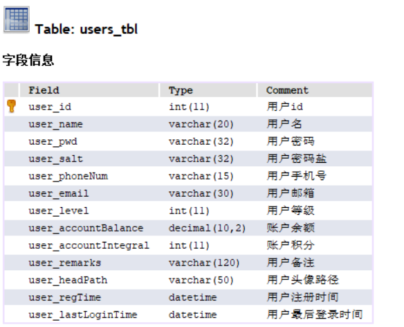
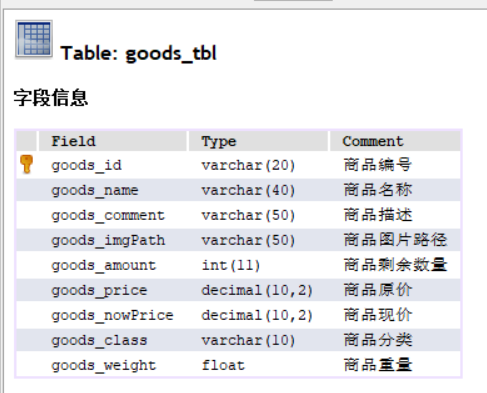
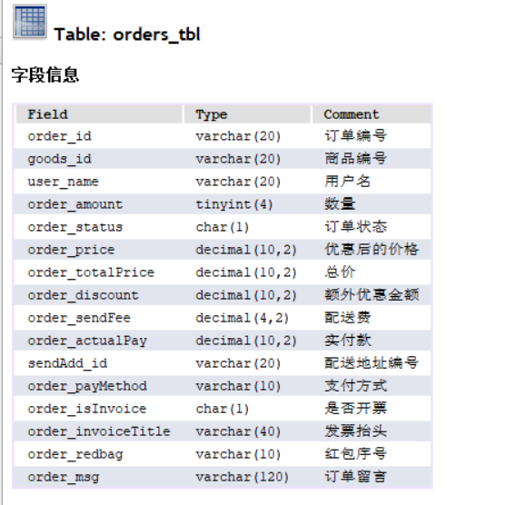
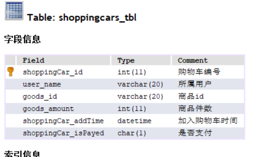
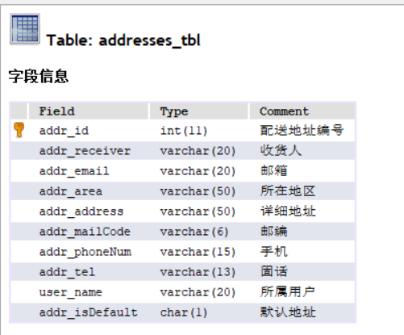

# 项目名称:

## 茶叶商城

# 项目架构:

## HTML+CSS+JS+apache+PHP+MySQL

# 项目功能:

## 该项目实现了茶叶商城的登录,注册,个人信息管理,收货地址管理,密码管理,购物车管理订单管理,个人中心的各种功能

# 项目数据库表结构

# 遇到的问题1:

商品详情页面前端修改数量后添加到购物车或者直接购买时后端获取数量问题

# 遇到的问题2:

从购物车多选物品生成订单问题

# 遇到的问题3

