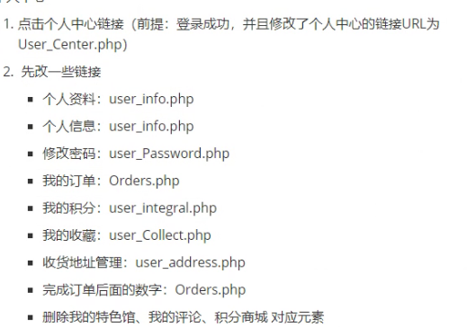

## 项目要求

1. 时长五个工作日
2. 技术点:PHP+HTML+CSS+JavaScript+MySQL
3. 个人项目(一个人完成一个项目)
4. 项目类型(博客,普通CMS,婚庆网站,前端可用现成模板)

## 功能需求

新建DBMS连接

提高代码复用性:

	1. 封装数据库连接(任意连接数据库操作都需要用到)
 	2. 封装密码加盐加密(登录,注册,改密都需要用到)
 	3. 封装

数据库设计:

用户表(用户名, 密码, 邮箱, 用户等级, 账户余额, 账户积分, 备注)

商品表(商品编号,商品名称,商品图片路径,商品单价)

订单表(订单编号,商品编号,  数量,  状态(完成,未付款两种),  商品价格,  优惠后的价格,  总价, 额外优惠金额, 配送费, 实付款(优惠后的单价*数量+配送费-额外优惠金额), 配送地址编号,  支付方式,  是否开票, 发票抬头, 红包序号,  订单留言)

配送地址表(配送地址编号, 收货人,邮箱,详细地址,邮编,手机,固话,快递公司)

收藏表(收藏编号,商品编号)

1. 登录,注册,注销,找回密码

   1. 登录
      1. 点击登录要跳转到登录页面
      2. 前端输入账号密码,提交到后端
      3. 后端获取账号密码并保存到两个变量中
      4. 后端利用**数据库连接查询**前端提交的用户名对应的用户名和密码
      5. 如果能查询到,则登录成功,否则失败返回登录页面
      6. 登录成功后新建会话,会话变量需要包含:用户名
      7. 返回前端页面前,将前端页面中未登录的相关元素不显示,同时将个人中心的链接,文字等元素显示上去,然后根据情况返回前端页面
      8. 注册的时候把session存在数据库,访问其他页面的时候用session去验证,cookie验证登录有效期,下发的cookie通过获取time()+3600表示有效期一小时,,然后hash,下发给客户端,客户端访问其他页面的时候用cookie验证登录状态,验证方法:在后端通过time获取一个时间,如果大于cookie中携带的时间,则失效,退出(选做挑战)
   2. 注册
      1. 点击注册跳转到注册页面
      2. 填写注册资料
      3. 前端或后端验证注册信息合法性(正则)
      4. 尝试随机生成验证码或尝试发送验证码到邮箱(选做)
      5. 插入注册信息到用户表
         1. 判断用户是否存在,如果不存在则插入,否则返回注册页面,提示用户已存在
      6. 
   3. 注销
      1. 销毁当前会话(unset()或者session_destroy())
      2. 跳转到首页(未登录状态)
      3. 首页代码会重新显示登录,注册相关元素,同时不显示注销,订单等元素
   4. 找回密码(选做)

2. 个人中心

   1. 点击个人中心链接跳转到个人中心

      

      

   2. 查询数据库,显示:

      - 用户名
      - 余额
      - 积分
      - 用户等级
      - 未完成订单数目
      - 完成订单数目
      - 收藏的商品

   3. 显示头像(使用默认头像,选做:增加修改头像功能)

3. 修改密码

   1. 点击跳转到修改密码页面
   2. 输入原密码  重复两次新密码
   3. 前端校验新密码是否一致
   4. 前端校验原密码非空,新密码相符才提交到后端
   5. 后端接收提交
      1. 判断isset($_POST['提交按钮']),为真则继续,
      2. 验证原密码
         1. 一致则修改为新密码
         2. 不一致定义密码不通过消息并返回

4. 用户管理(增删改查)

5. 文章管理,作品管理,产品管理等(增删改查)

6. 浏览记录

7. 我的收藏

## 项目流程

