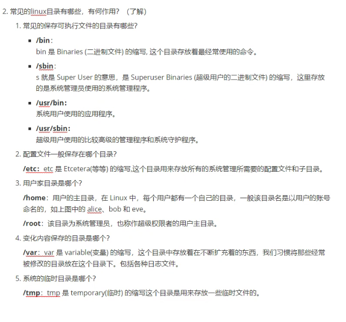
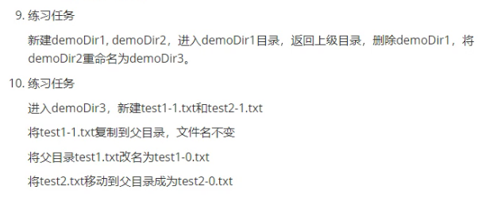
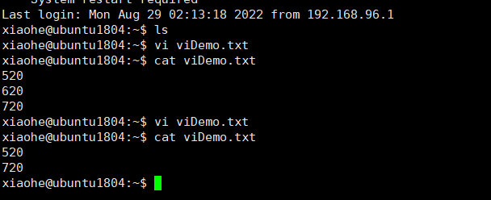
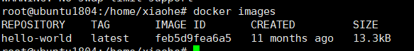

[toc]

## Day25

### Linux

#### 概念科普:

##### 操作系统的作用:

初步了解:合理地管理硬件资源，为软件在硬件上面运行提供编程接口和基础环境。
具体来说，比如:能够将硬件带动起来提供服务，能够进行文件管理、进程管理、用户管理、权限管理等

##### 常见的操作系统:

- Unix
- Linux
- Windows
- Mac
- Solaris
- OS/2
- Android
- iOS

##### Linux和Ubuntu的关系:

​	Linux是一类操作系统,Ubuntu是其中一个发行版

​	还有其他发行版,比如:RedHat,Debian,CentOS等等

常见云服务厂商:国内(阿里云,腾讯云等)国外(搬瓦工)

#### 如何远程管理Linux操作系统?

通过xshell等远程管理软件去管理

步骤:(服务器必须安装并开启sshd服务,安装步骤:sudo atp-get update;sudo apt-get install ssh)

1. 安装xshell并打开
2. 获取服务器的ip地址以及sshd端口
3. 为xshell指定目标服务器ip,端口,账号密码进行登录

#### Linux的目录结构

1. Linux的根目录是什么?

   /

2. 常见的Linux目录有哪些?有何作用?

   

   

#### Linux文件管理

1. 如何查看当前目录的路径?

   pwd

2. 如何进入一个文件夹?

   cd 文件路径

3. 当前目录,上级目录用什么表示?

   - 当前目录:.
   - 上级目录:..

4. 如何进入上级目录?

   cd ..

5. 如何进入用户的家目录?

   cd ~

   cd /home/用户名

6. 如何查看当前目录下有什么条目?

   ls

   练习:

   1. 进入/bin目录,查看该目录下有何文件

      cd /bin

      ls

   2. 回到家目录,查看家目录下所有文件

      cd /home/xiaohe

      ls

7. 如何新建目录?

   mkdir 目录名(也可以加路径比如/home/xiaohe/demodir)

   mkdir就是make directory(创建目录)的缩写

8. 如何删除目录?

   rm -rf

   rm:remove(移除) -r: recursion  -f:force(强制)

9. 如何修改文件夹的名称?

   mv

   move(移动或重命名)

   `mv 需要修改或移动的文件 目标文件名或者目标路径+文件名`

   **练习:**

   

10. 如何复制文件?

    cp

11. Linux命令行界面如何编辑文件

    可以用vi,gedit两个工具,

    学习以vi为例:

    目标:能够使用vi进行新建文件,编辑文件(移动文件,删除字符,保存文件,退出vi)

    vi的三种模式:

    一般命令模式

    **练习**

    在家目录下用vi新建viDemo.txt文件,

    进入插入模式,输入3行字符:520,620,720

    保存文件并退出

    查看保存的文件

    再次编辑该文件,删除620这行字符

    再次保存文件并退出

    再次查看保存的文件

    

#### vim快捷键

##### 一般模式

| 移动光标的操作 |                                                              |
| -------------- | ------------------------------------------------------------ |
| h或方向键←     | 光标向左移动一个字符                                         |
| j或方向键↓     | 光标向下移动一个字符                                         |
| k或方向键↑     | 光标向上移动一个字符                                         |
| l或方向键→     | 光标向上移动一个字符                                         |
|                |                                                              |
| Ctrl+f         | 屏幕向下移动一页,相当于page down                             |
| Ctrl+b         | 屏幕向上移动一页,相当于page up                               |
| Ctrl+d         | 屏幕向下移动半页                                             |
| Ctrl+u         | 屏幕向上移动半页                                             |
| +              | 光标移动到非空格符的下一行                                   |
| -              | 光标移动到非空格符的上一行                                   |
| n+<space>      | n表示一个数字,比如:输入20+空格,光标会向后面移动20个字符的距离(当前行不足20字符则继续跳到下一行) |
| 0或Home        | 移动到这一行的行首                                           |
| $或功能键End   | 移动到这一行的末尾                                           |
| H              | 光标移动到当前屏幕中最上方那一行的第一个字符处               |
| M              | 光标移动到当前屏幕中最中央那一行的第一个字符处               |
| L              | 光标移动到当前屏幕中最下方那一行的第一个字符处               |
| G              | 移动到这个文档的最后一行                                     |
| nG             | n是一个数字,移动到文档的第n行,20G就是移动到当前文档第20行    |
| gg             | 移动到这个文档的第一行,相当于1G                              |
| n+回车         | n是一个数字,光标向下移动n行                                  |

| 删除,复制,粘贴 |                                                              |
| -------------- | ------------------------------------------------------------ |
| x,X            | 小x为向后删除一个字符相当于del,大X为向前删除一个字符相当于退格 |
| nx             | n是一个数字,表示向后删除n个字符                              |
| dd             | 剪切光标所在行,剪切后可以用p或P粘贴                          |
| ndd            | 从光标所在行开始向下剪切n行,剪切后可以使用p或P粘贴           |
| d1G            | 删除光标所在行到第一行的所有数据                             |
| dG             | 删除光标所在行到最后一行的所有数据(先执行gg跳到第一行再执行dG即可删除所有内容) |
| d$             | 删除光标到该行的最后一个字符                                 |
| d0             | 删除光标到该行的第一个字符                                   |
| yy             | 复制光标所在行                                               |
| nyy            | 从光标所在行开始向下复制n行                                  |
| y1G            | 复制光标所在行到第一行的所有内容                             |
| yG             | 复制光标所在行到最后一行的所有内容                           |
| y0             | 复制光标位置到该行的第一个字符                               |
| y$             | 复制光标位置到该行的最后一个字符                             |
| p,P            | 小p表示将已复制的数据粘贴在光标的下一行,大P表示将已复制的内容粘贴到光标所在的上一行 |
| J              | 将光标所在行与下一行的数据结合成一行                         |
| cl(小写L)      | 删除光标选中的字符,并进入插入模式                            |
| cj             | 删除当前行以及下一行,并进入插入模式                          |
| ck             | 删除当前行以及上一行,并进入插入模式                          |
|                |                                                              |

#### 网上收集的vim笔记

##### 2. vim常用模式(包括一些基本操作)

- ##### 正常模式 ：

  - 打开的文件默认就处于正常模式
  - 无论处于那一种模式下，按`Esc` 就可以进入正常模式
  - 模式之间的切换依靠正常模式作为中转
  - 在正常模式下可以使用快捷键

- ##### 插入模式

  - 进入插入模式有多种方法，区别在于进入插入模式之后光标的位置

    | 键位               | 作用                                           |
    | ------------------ | ---------------------------------------------- |
    | i                  | 在光标的前边进入插入模式                       |
    | I ( 这是大写的 i ) | 在当前行的行首进入插入模式                     |
    | a                  | 在光标的后面进入插入模式                       |
    | A                  | 在当前行的行尾进入插入模式                     |
    | o                  | 在当前行的下方插入一个空行，并进入插入模式     |
    | O                  | 在当前行的上方插入一个空行，并进入插入模式     |
    | s                  | 删除光标所在位置的字符，并进入插入模式         |
    | S                  | 清除当前行的字符（不删除此行），并进入插入模式 |

- ##### 命令行模式

  - 正常模式下按 `:` 进入命令行，输入命令之后按 `Enter` 执行

    | 键位      | 作用           |
    | --------- | -------------- |
    | :set nu   | 显示行号       |
    | :set nonu | 取消行号       |
    | :行号     | 跳转至指定位置 |

- ##### 替换模式

  - 按 `R` 进入替换模式

    - 此时可以输入内容，且输入的内容会替换掉光标所在位置的原字符。
    - 按 `Backspace` 可以还原被替换的字符

  - 作用类似的命令

    | 键位          | 作用                                                         |
    | ------------- | ------------------------------------------------------------ |
    | r             | 替换光标所在字符，将光标移动到需要替换的字符上，按 r 键，然后输入新的字符 |
    | nr（n是数字） | 从光标处开始将n个字符全部替换                                |

- ##### 可视模式

  - 进入可视模式中可以使用h,j,k,l来移动光标，进而选择一部分字符作为编辑区域，然后可以对选中的区域进行一些其他的操作（d、y）

  - 被选中字符会高亮（没这么亮的）

    | 键位      | 作用                 |
    | --------- | -------------------- |
    | v（小写） | 以字符为单位选择文本 |
    | V（大写） | 以行为单位选择文本   |

##### 3. 光标的移动（正常模式下）

- ##### 基本的移动（可以与后面的命令搭配使用，非常重要）

  | 键位                       | 作用                                     |
  | -------------------------- | ---------------------------------------- |
  | h , j , k , l ( 小写的 L ) | 左，下，上，右                           |
  | 0 or ^                     | 将光标移动到当前行的行首                 |
  | $                          | 将光标移动到当前行的行尾                 |
  | b                          | 将光标移动到所在单词的起始处             |
  | e                          | 将光标移动到所在单词的结尾处             |
  | w                          | 将光标移动到所在单词的下一个单词的起始处 |
  | gg                         | 将光标移动到文件的开头                   |
  | G                          | 将光标移动到文件的结尾                   |

   **注1：数字 + 键位 =重复多次 例如：5h表示向左移动5个字符**

   **注2: 行号 + `G` ，可直接跳转至指定位置**

   **注3: `:行号`，可直接跳转至指定位置**

- ##### 翻屏

  | 键位   | 作用                   |
  | ------ | ---------------------- |
  | ctrl+b | 上翻一屏               |
  | ctrl+f | 下翻一屏               |
  | ctrl+u | 上翻半屏               |
  | ctrl+d | 下翻半屏               |
  | zz     | 将当前行移动到屏幕中央 |

##### 4. 文本操作（正常模式下）

- ##### 撤销

  | 键位    | 作用             |
  | ------- | ---------------- |
  | u       | 撤销最后一次修改 |
  | Ctr + r | 反撤销           |

- ##### 删除

  | 键位                                      | 作用                                                     |
  | ----------------------------------------- | -------------------------------------------------------- |
  | x                                         | 删除选中的单一字符                                       |
  | dh                                        | 删除光标前的一个字符                                     |
  | dl ( l是小写的L )                         | 删除光标选中的字符                                       |
  | dj                                        | 删除当前行，以及下一行                                   |
  | dk                                        | 删除当前行，以及上一行                                   |
  | d0 or d^                                  | 删除光标从当前位置（ 不包括 ）到该行行首的所有字符       |
  | d$                                        | 删除光标从当前位置（ 包括 ）到该行行尾的所有字符         |
  | db                                        | 删除光标从当前位置（ 不包括 ）到该单词起始处的所有字符   |
  | de                                        | 删除光标从当前位置（ 包括 ）到该单词结尾处的所有字符     |
  | dw                                        | 删除光标从当前位置（ 包括 ）到下一个单词起始处的所有字符 |
  | dgg                                       | 删除当前行到文件开头的所有字符                           |
  | dG                                        | 删除当前行到文件结尾的所有字符                           |
  | dd（使用2个相同字母的，往往是常用的操作） | 删除当前行                                               |

   **注1：d + 数字 + 键位 = 删除 范围（数字+键位 表示的范围） 例如：d5h表示删除左边5个字符，5h表示范围**

   **注2：上面这个注1非常重要**

   **注3：vim的删除操作更类似于Windows的剪切操作，被删除的内容会被放在缓冲区中，等你来粘贴它。**

- ##### 粘贴

  | 键位      | 作用                                                         |
  | --------- | ------------------------------------------------------------ |
  | p（小写） | 可以将最后一次删除的内容粘贴到光标之后；如果粘贴的内容以整行为单位，那么会粘贴到下一行 |
  | P（大写） | 可以将最后一次删除的内容粘贴到光标之前；如果粘贴的内容以整行为单位，那么会粘贴到上一行 |

- ##### 拷贝

  | 键位              | 作用                                                     |
  | ----------------- | -------------------------------------------------------- |
  | yh                | 拷贝光标前的一个字符                                     |
  | yl ( l是小写的L ) | 拷贝光标选中的字符                                       |
  | yj                | 拷贝当前行，以及下一行                                   |
  | yk                | 拷贝当前行，以及上一行                                   |
  | y0 or y^          | 拷贝光标从当前位置（ 不包括 ）到该行行首的所有字符       |
  | y$                | 拷贝光标从当前位置（ 包括 ）到该行行尾的所有字符         |
  | yb                | 拷贝光标从当前位置（ 不包括 ）到该单词起始处的所有字符   |
  | ye                | 拷贝光标从当前位置（ 包括 ）到该单词结尾处的所有字符     |
  | yw                | 拷贝光标从当前位置（ 包括 ）到下一个单词起始处的所有字符 |
  | ygg               | 拷贝当前行到文件开头的所有字符                           |
  | yG                | 拷贝当前行到文件结尾的所有字符                           |
  | yy                | 拷贝当前行                                               |

  **注：y + 数字 + 键位 = 拷贝 范围（数字+键位 表示的范围） 例如：y5j表示拷贝当前行以及下面的5行，5j表示范围**

- ##### 修改

  | 键位              | 作用                                                         |
  | ----------------- | ------------------------------------------------------------ |
  | ch                | 删除光标前的一个字符，并进入插入模式                         |
  | cl ( l是小写的L ) | 删除光标选中的字符，并进入插入模式                           |
  | cj                | 删除当前行，以及下一行，并进入插入模式                       |
  | ck                | 删除当前行，以及上一行，并进入插入模式                       |
  | c0 or c^          | 删除光标从当前位置（ 不包括 ）到该行行首的所有字符，并进入插入模式 |
  | c$                | 删除光标从当前位置（ 包括 ）到该行行尾的所有字符，并进入插入模式 |
  | cb                | 删除光标从当前位置（ 不包括 ）到该单词起始处的所有字符，并进入插入模式 |
  | ce                | 删除光标从当前位置（ 包括 ）到该单词结尾处的所有字符，并进入插入模式 |
  | cw                | 删除光标从当前位置（ 包括 ）到下一个单词起始处的所有字符，并进入插入模式 |
  | cgg               | 删除当前行到文件开头的所有字符，并进入插入模式               |
  | cG                | 删除当前行到文件结尾的所有字符，并进入插入模式               |
  | cc                | 删除当前行的字符，并进入插入模式                             |

  **注1：c+ 数字 + 键位 = 删除 范围（数字+键位 表示的范围） 例如：c5k表示删除当前行以及上面的5行，并进入插入模式，5k表示范围**

  **注2：不难发现，修改类似于删除再加上插入。**

##### 5. 排版

- ##### 缩进

  | 键位                                                     | 作用       |
  | -------------------------------------------------------- | ---------- |
  | >>                                                       | 表示缩进   |
  | <<                                                       | 表示反缩进 |
  | **注：可以使用可视模式选中多行，再对选中行同时进行缩进** |            |

##### 6. 查找与替换

- ##### 查找

  | 键位  | 作用                                                         |
  | ----- | ------------------------------------------------------------ |
  | /char | 查找字符char的位置（按n下一个，按N上一个），并高亮匹配的字符。（ `:nohl` 取消高亮） |

  **注： 按`Shift` + `\*` 查找光标所在的单词**

- ##### 替换（old替换为new）

  | 键位                | 作用                                               |
  | ------------------- | -------------------------------------------------- |
  | `:s/old/new`        | 使用new替换当前行中第一个old                       |
  | `:s/old/new/g`      | 使用new替换当前行中所有的old                       |
  | :%s/old/new/g       | 使用new替换文件中所有的old                         |
  | :%s/old/new/gc      | 使用new替换文件中所有的old，但每次替换前先请示用户 |
  | :nu1,nu2s/old/new/g | 使用new替换文件中nu1行到nu2行里所有的old           |

##### 7. 文件操作

| 键位        | 作用                                                         |
| ----------- | ------------------------------------------------------------ |
| :w          | 保存                                                         |
| :w!         | 若文本为只读时，强制保存                                     |
| :q          | 退出vim                                                      |
| :q!         | 不保存，强制退出                                             |
| :wq         | 保存并退出                                                   |
| :wq!        | 保存并强制退出 Vim 编辑器                                    |
| :e!         | 放弃所有修改，并从新载入文件的原始内容                       |
| :w filename | 另存为到 filename 文件；且可以与可视模式配合使用，另存为可视模式下选取的字符到filename文件 |
| :r filename | 读取文件内容，并插入到当前行的下一行                         |

##### 8. vim中执行shell命令

- ##### 输入shell命令的方式

  | 键位                | 作用                                                         |
  | ------------------- | ------------------------------------------------------------ |
  | :!command           | 在不退出vim的情况下，执行shell命令command                    |
  | :r !command         | 将shell命令command的结果插入到当前行的下一行                 |
  | :start,end !command | 使用shell命令command，来处理start行到end行中的内容，并用处理结果替换start行到end行中的内容 |

  **注：command为占位符，使用时请输入具体命令，例如：`:!ls -al`、`:r !date`、`:1,4 !sort`**

##### 9. 补充

- 数字 + 键位 ，可以表示该操作执行多少次，并且还可以表示范围。

  - 如：5dd 表示删除5行（5表示执行次数）
  - 如：d5k 表示删除当前行，以及上面的5行（5k表示范围）
  - 所以记住基本的光标移动，就可以和d、y、c 搭配出很多组合，这是一个窍门。

- `Ctrl` + `g` 查看本文件信息。

- 按 `%` 定位括号，在括号的任意一边上按 `%` 就可以跳转到匹配的另一半括号上。

  - 在编程中用来确认括号是否成对出现

- 同时打开多个文件的shell命令

  | 键位                                       | 作用                                                   |
  | ------------------------------------------ | ------------------------------------------------------ |
  | vim -o [filename1] [filename2] [filename3] | 以垂直排列的方式打开多个文件（命令中的o是小写的）      |
  | vim -O [filename1] [filename2] [filename3] | 以水平排列的方式打开多个文件（命令中的O是大写的）      |
  | Ctrl + w + w                               | 将光标切换到下一个文件中                               |
  | Ctrl + w + j                               | 在垂直排列方式下，将光标切换到当前文件下面的一个文件中 |
  | Ctrl + w + k                               | 在垂直排列方式下，将光标切换到当前文件上面的一个文件中 |
  | Ctrl + w + h                               | 在水平排列方式下，将光标切换到当前文件左面的一个文件中 |
  | Ctrl + w + l（小写L）                      | 在水平排列方式下，将光标切换到当前文件右面的一个文件中 |
  | :qa                                        | 退出所有打开的文件                                     |
  | :qa!                                       | 不保存，强制退出所有打开的文件                         |
  | :wqa                                       | 保存并退出所有打开的文件                               |

## Day26

#### 用户和用户组管理

1. 如何查看有哪些用户?

   直接列出家目录下的文件夹

   ```bash
   ls /home
   ```

   

2. 如何新增1个用户

   ```bash
   交互式:
   adduser(这种方法更好,是交互式的,可以一步一步的创建完成)
   
   非交互式(如果不添加选项,会造成用户创建后没有主目录,没有bash路径,也没有密码,根本无法登陆):
   useradd 选项 用户名
   ```

   选项:

   - -c :comment 添加描述
   - -d 给添加的用户指定其主目录,如果目录不存在,可以同时使用-m创建主目录
   - -g 指定用户所属的用户组
   - -G 指定用户所属的附加组
   - -s 指定用户登录的Shell
   - -u 指定用户的用户号,如果同时有-o选项,则可以重复使用其他用户的标识号

   用户名:

   - 指定要创建的用户名

   实例:

   ```bash
   useradd -d /home/sam -m sam
   #此实例创建了一个用户名为sam的账户,并为其指定主目录路径为/home/sam
   ```

   实例2:

   ```bash
   useradd -s /bin/sh -g group -G adm,root gem
   #此实例创建了一个用户名为gem的账户,并指定此用户的登录Sheel为/bin/sh,所属的主用户组是group,并且同时属于adm和root这两个组	
   ```

   

3. 如何修改用户密码

   ```bash
   passwd 用户名
   ```

   

4. 如何删除1个用户

   ```bash
   userdel 选项 用户名
   ```

   常用选项是-r,表示把用户的主目录一起删除

   

5. 如何查看有哪些用户组

   ```bash
   cat /etc/group
   ```

   

6. 如何新增1个用户组

   ```bash
   groupadd 选项 用户组
   ```

   选项:

   - -g 指定新增用户组的组标识号(GID)
   - -o 一般与-g同时使用,表示新用户组的GID可以与系统已有组的GID相同

   用户组:组名

7. 如何删除1个用户组

   ```bash
   groupdel 用户组
   ```

   

8. 如何将一个用户加入到1个用户组中

   - 创建一个新用户并添加到一个主用户组:

     ```bash
     useradd -g 用户组名称 用户名称
     ```

   - 创建一个新用户并将其添加到附属组(附属组可以有多个,多个附属组用逗号隔开):

     ```bash
     useradd -G 附属组1名称[,附属组2,...] 用户名
     ```

   - 将已有用户添加到指定附加用户组(a出现一般都和G连用):

     ```bash
     usermod -a -G 附加组名称 用户名
     #-a append 加入附属组而不离开原有主用户组
     ```

   - 将已有用户的主用户组改为新的用户组:

     ```bash
     usermod -g 新的用户组名 用户名
     ```

     

9. 如何将1个用户加入到多个用户组中

   - 用户不存在:

     ```bash
     useradd -g 主用户组名 -G 附加组1[,附加组2,...] 用户名
     ```

   - 用户已存在:

     ```bash
     usermod -a -G 附加组1[,附加组2,...] 用户名
     ```

     

10. 如何将1个用户从某个用户组中删除

    ```
    gpasswd -d 用户名 用户组名
    ```

#### 如何获取一个命令的帮助

> 1. man 命令名称
> 2. 命令名称 --help
> 3. 谷歌百度搜索

#### 文件权限管理

##### 修改文件所属的用户和用户组

命令: 

- chown
- chgrp

修改所属用户: chown 用户名 文件(文件夹)名

例子:

> chown 

修改所属用户组: chgrp 用户组 文件(文件夹)名

同时修改所属用户和用户组: chown 用户名:用户组 文件(文件夹)名


##### 修改文件(文件夹)的访问权限

完整表达是:修改文件(文件夹)对应主体对该文件拥有的权限

命令:chmod 权限表达式 文件(文件夹)名

```bash
#index.php目前的权限为:r--rwx---
#修改index.php的权限,实现所属用户拥有读写执行的权限,所属组拥有读写权限,其他用户拥有只读权限
#两种方法
chmod 764 index.php

如果原来的user权限是rw-  直接chmod u=wx index.php 权限r还在不在?
chmod u=rwx,g=rw,o=x index.php

```

如果对目录中的一个文件有读权限,但是对目录没有读权限,则无法读到该文件的内容


#### 软件管理

##### 通过包管理工具

- Debian系Linux:

  > 安装:
  >
  > apt update
  >
  > apt install 软件名
  >
  > 卸载:apt remove 软件名
  >
  > 搜索:apt search 软件名

- RH系(红帽系)

  > 安装:yum inst 软件名
  >
  > 卸载:yum remove 软件名
  >
  > 搜索:yum search

##### 通过源码安装

直接拷贝并手动编写配置文件

#### 服务管理

##### 以Ubuntu管理ssh为例:

1. 如何开启服务?

   ```bash
   systemctl start ssh
   ```

2. 如何停止服务?

   ```bash
   systemctl stop ssh
   ```

3. 如何查看服务状态?

   ```bash
   systemctl status ssh
   ```

4. 如何配置服务开机自启?

   ```bash
   systemctl enable ssh
   ```

## Day27

今日学习:

1. 了解grep,awk,sed三剑客
2. Linux其他部分知识
3. docker的应用
4. Windows操作系统命令

#### Linux文本处理

1. 如何匹配一个文本文件中,满足一定匹配条件的行(grep)

   例子:从/etc/passwd中找到包含 anyone字符串的行

   ```bash
   cat /etc/passwd | grep anyone
   ```

   

2. 如何找出执行命令后输出的内容中,满足一定匹配条件的行(grep)

   ```bash
   ss -ntlp可以查看服务器的网络连接	
   ss -ntlp | grep 22
   ```

   

3. 如何单独将/etc/passwd文件中的用户名一次性显示出来(awk)

   awk工具:能够按列进行处理

   ```bash
   
   ```

   

4. 如何统计满足一定条件的行的数目

   ```bash
   
   ```

5. 如何

#### Linux其他知识

sudo:以管理员的身份运行程序

管理员:root用户(或者其他UID是0的用户)

新安装的系统root用户没有密码,需要用安装系统时设置的用户执行sudo passwd root命令给root用户设置密码

查看当前目录路径:pwd

#### Linux防火墙iptables

防火墙:防护来自外部的攻击流量。一般通过将某些ip或者ip地址段,端口,应用加入黑名单来实现。具体来说:能够实现阻止某些ip或者端口,应用

Linux的多个发行版本中,有多种防火墙,但是他们都可以用iptables实现防火墙应有的功能。

##### 查看进程:`ps -elf`

相关字段:

- UID：用户身份
- PID：进程编号
- PPID：父进程编号
- CMD：命令以及相关位置

结束进程：`kill PID`

## Docker

回顾安装LNMP架构网站的过程

需求：重复的安装、启动、配置Nginx、Mysql、PHP

技术：虚拟化的技术，虚拟机（全虚拟化）、容器（半虚拟化、网络和应用层面上的虚拟化，并不完全模拟底层系统

#### 安装docker

```bash
#更新清单
apt update
#安装docker
apt install docker.io -y
#查看服务状态以验证安装是否成功
systemctl status docker
```


#### 运行镜像:docker run 镜像名称

#### 运行一个入门镜像:docker run hello-world

#### 查看本地镜像:docker images



- repository:镜像名称
- tag:版本
- image id:镜像编号
- created:创建时间
- size:大小

#### 查看容器基本信息:docker info

#### 查找镜像:docker search 镜像名

#### 下载镜像:docker pull

#### 交互式运行ubuntu:

```bash
docker run -it ubuntu /bin/bash
```

参数说明:

- -i:交互模式
- -t:终端运行

##### 退出ubuntu

exit

#### 后台运行镜像

```bash
docker run -d ubuntu
```

#### 让后台容器保持运行

```bash
docker run -d ubuntu /bin/bash -c "while true;do echo hello docker;sleep 1;done"
```

#### 注意:docker每一次run都会创建一个新的容器

#### 运行Apache镜像

```bash
docker search apache
docker pull httpd
docker run -d -p 8099:80 --name xiaohe-apache httpd
#-d:后台运行
#-p:端口映射,前面为外部端口,后面为docker内部端口,8099:80就是将docker的80端口映射到所在机器的8099端口,然后通过所在机器的IP:8099去访问
#--name:指定容器名字
```

#### 复制文件给容器

宿主机复制文件到docker

```bash
docker cp 宿主机目录及文件 容器名称:容器目录
```

#### 查看容器列表

```bash
sudo docker ps
```

#### 停止正在运行的容器

```bash
docker stop 容器编号或者容器名称(如果通过编号停止,只需要输入容器ID的前几位)
```

#### 停止所有正在运行的容器

```bash
docker stop $(docker ps -q)
```

#### 启动一个容器

```bash
docker start 容器名
```

#### 重启容器

```bash
docker restart 容器名
```

#### 删除容器

```bash
docker rm 容器编号或容器名(如果通过编号删除,只需要输入前几位即可)
```

#### 删除所有容器

```bash
docker rm $(docker ps -q)
```

注意:删除容器前必须先停止该容器

#### 删除镜像

```bash
docker rmi 镜像编号或名称
```

注意:删除镜像前,必须删除运行了此镜像的容器

步骤:

```
#查看容器
docker ps -a
#删除使用了要删除的镜像的容器
docker rm 容器ID或容器名
#docker rmi 镜像ID或镜像名
```


### docker总结

- 非root用户运行docker命令必须加上sudo

- docker search：搜索镜像

- docker pull：拉取镜像

- docker run：运行容器

- docker images：列出所有镜像

- docker ps -a：查看容器

- docker stop/start/restart/kill：容器的启停

- docker rm：删除容器

- docker rmi：删除镜像

- docker logs：查看容器日志

- docker exec:进入容器

  常见用法:

  ```bash
  docker exec it 容器id bash|sh
  ```

### docker安装lamp

```bash
#搜索lamp
docker search lamp

#拉取mattrayner/lamp
docker pull mattrayner/lammp

#创建并启动容器
docker run -d --name xiaohe-lamp -p "8090:80" -v /var/app:/app mattrayner/lamp:latest-1804

#docker run -d --name 容器名 -p "外部端口:内部端口" -v 本机路径:容器路径 镜像:版本

#遇到的问题:想要修改内部端口,以实现多个应用走不同的内部端口,修改/var/lib/docker/容器编号/hostconf.json文件后重启docker,重启服务  都不生效

#-v:volume   -v 主机路径:容器内部路径
#原理是把容器内外的文件夹进行关联以实现数据同步,
#作用:可以在容器删除后将容器内产生的数据保存在主机中
#可以在不进入容器的情况下像容器传输数据
```

