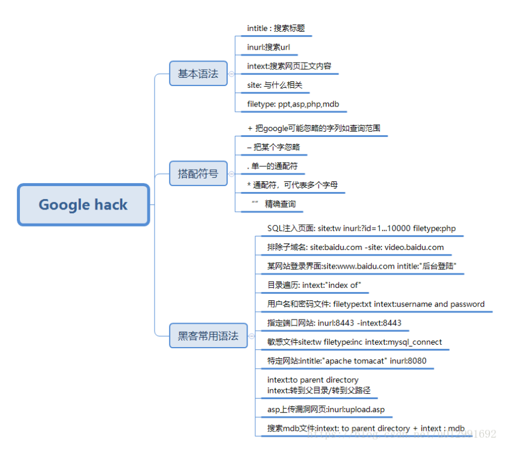

## 信息搜集

### 某同学去面试，面试官问： 

1. 拿到一个网站你首先做什么？ 信息搜集

2. 信息搜集需要做些什么？ 

   两大方面：技术和社工层面的信息搜集。 

   需要搜集目标单位的（信息）资产和社工信息

3. 如何进行信息搜集？

    参见下方信息搜集思路。

4. 如果让你尽可能 快速找到一个集团下各个信息系统的漏洞，该怎么办？ 

   参见下方信息搜集思路。

5. 如果让你对某个域名或者ip进行漏洞挖掘，该怎么办？

   参见下方信息搜集思路。

### 背景知识 

信息搜集意义：找到更多攻击面（可能的脆弱点） 

任务类型 

1. 找某个目标网站的漏洞（给ip地址或者域名，让找漏洞） 
2. 找某个单位所属网站的漏洞（给单位名称，让找漏洞）

#### 网站的攻击面 

技术和管理层面 

1.  技术层面：找信息系统组件的漏洞、配置不当,包括 :

   操作系统、（网络）服务、代码层面的漏洞和配置不当

2. 管理层面：人性弱点（社工）

### 信息搜集的思路 

思路（针对具体某个网站或IP）

1. 翻页面，找可能漏洞利用点 
2. 找CMS 
3. 扫敏感目录和文件 
4. 扫危险请求方式 
5. 找旁站（c段、子域名）
6. 找供应链 
7. 扫端口 
8. 社工信息搜集（名字、联系方式等）

思路（针对某个单位或集团） 

1. 搜集信息资产 
   1. 找子域名（包括找C段、扫描子域名等方式实现）子域名可能有多级,每级子域都可以爆破(cookie有可能可复用,开发的时候可能设置了来自*.xxx.com的cookie可以在所有子域使用)子域名注意找邮箱系统、vpn系统等
   2. 找真实IP（如果遇到CDN云防护）
   3. 扫端口服务
   4. 扫危险请求方式 
   5. 扫敏感目录和文件 
   6. 找CMS(找到CMS后可以找历史漏洞;翻过来说,挖到漏洞之后也可以去找相应版本的CMS去挖别的站)
2. 翻页面功能，尝试漏洞利用 
3. 找供应链
4. 收集社工信息（whois信息、网页信息、网页源码信息）
5. 内网信息搜集（三阶段扩展）

### 技术信息搜集 

#### 翻看网站页面，找到潜在的漏洞利用点（OWASP Top 10） 

##### 识别指纹：找到对应CMS（如有公开），查询历史相关漏洞。

网站架构及指纹 

操作系统(TTL判断，大小写判断、响应头)、中间件、动态脚本解析器、数据库管理系统、代码 网站指纹：网站架构和网站CMS（一套代码模板，网站所有者只需要往里面填写内容就可以了），如历 史上的shiro❤fastjson❤thinkphp❤weblogic❤struts2❤等框架或组件漏洞危害很大，搜集到指纹后……

#### TTL判断:

常见操作系统的默认TTL:(每进过一次路由TTL就会-1,可以通过ping命令返回的TTL可以大概判断,一般情况最接近的就是大概的主机系统类型,可以通过其他方式再加以判断)

> 1、WINDOWS NT/2000  TTL：128
>
> 2、WINDOWS 95/98   TTL：32
>
> 3、UNIX        TTL：255
>
> 4、LINUX       TTL：64
>
> 5、WIN7      TTL：64

##### 可以通过修改注册表来改变默认TTL数,以此混淆攻击者的判断

Windows平台的修改方式:

> TTL值在注册表的位置是：HKEY_LOCAL_MACHINE\SYSTEM\CurrentControlSet\Services\Tcpip\Parameters （通过在cmd命令里面输入：regedit，然后回车的方式可以打开注册表）。其中有个DefaultTTL的DWORD值，其数据就是默认的TTL值了，我们可以修改DefaultTTL里面的TTL默认值，但不能大于十进制的255。


RCE、文件上传漏洞、反序列化、解析漏洞、SQLi、XSS、CSRF、SSRF、XXE、逻辑漏洞（含越权）、 敏感信息泄露、缺陷组件 

HTTP响应头 

相关工具：nmap、wappalyzer、浏览器开发者工具、网站footer 

在线工具：

- 微步社区：https://x.threatbook.cn/ 
- 潮汐指纹：http://finger.tidesec.com/ 
- 云悉指纹：https://www.yunsee.cn/

#### CMS历史漏洞搜索

站点CMS，已知漏洞搜索

 seebug.org、 exploit-db.org

#### 子目录或敏感文件 

敏感文件:包含敏感信息的文件。

 什么是敏感信息：敏感信息包括但不限于：口令、密钥、证书、会话标识、许可证、隐私数据、授权凭 据、个人数据等、源码文件、配置文件、日志文件、备份文件等

##### 工具扫描 

御剑后台扫描工具（不仅仅扫后台，还扫敏感目录和文件）/dirbuster

> 后台 
>
> robots.txt
>
>  配置文件 
>
> 备份文件：www.bak等

##### 手工确认 

网站名、网站全名、.zip、.rar、tar、bak、日期等的组合

 www.gxaedu.com——》www.gxaedu.com.bak, www.gxaedu.com.tar.gz, www.gxaedu.com.bak2 0220902

##### 路径泄露的信息 

查看前端网页源码

 生成报错信息：故意填写不存在的路径或者查看首页增加不存在参数让生成错误 

phpinfo 

git、svn、vim临时文件泄露源码：githack、svnhack工具，

#### 思考

1. 什么样的网站才可能和目标网站在同一台服务器上？ 

   建在同一台服务器上的网站叫做旁站。 同一家单位的网站有时是建立在同一服务器上的。 服务器托管商的一台服务器上可能有多个公司的网站。

2. 如何找到目标网站同服务器的其他网站？

   有时，在同一个主域名（二级域名）下的其他子域名网站就在同一服务器上，大型机构尤其是互联 网厂商的站通常例外。

   找子域名工具：oneforall 

   www.gxaedu.com.同服的旁站可能长这个样子：xxx.gxaedu.com（xxx为其他子域名） 在线服务找旁站（站长之家https://stool.chinaz.com/same）

3. 如何找到网站的真实ip？（如果目标网站在云防（云防护的简称）CDN后方，如何找到其真实ip直 接进行信息搜集和渗透？） 

   1. 爆破不同子域名服务器的ip可能能找到；（找子域名可以通过：爬虫、资产搜索引擎、通过证 书透明度计划等方式，具体参照后面找域名部分的内容）
   2. 通过邮件服务器（如果邮件服务和网站服务在同一个ip的服务器上的话）；如：mail.xxx.com 和www.xxx.com在同ip服务器上，攻击者通过向某个邮箱用户（如sales@xx.com）发送邮件 并且受到回复，可以通过返回的邮件信息里查看到该邮件服务器的ip，也间接查到了同服网站 服务器的真实ip；
   3. 通过favicon的hash值 zoomeye.org fofa.info 
   4.  历史dns记录：https://viewdns.info/、https://x.threatbook.cn/
   5. 多地进行域名解析（国外尤佳） 多地ping：http://ping.chinaz.com/、https://ping.aizhan.com/ www.gxaedu.com——》中国网安的WAF——》真实的服务器 
   6. 换协议

#### 搜集子域名

#####  搜索子域名有哪些方法？ 

1. ping爆破；
2. 搜索引擎结果整理；
3. 证书透明度计划 
4.  fofa 
5. dns域传送漏洞 
6. 爬取威胁情报网站 

##### 用过哪些工具？ 

oneforall（需要配置才能发挥全部功能）、御剑子域名爆破工具、subdomainbrute

oneforall使用步骤:

1. 安装Python环境

2. 下载或克隆oneforall

3. 进入oneforall目录

4. 用Python执行oneforall

   ```python
   python oneforall.py --target xxx.com
   ```

   爬取完成后会在results目录生成一个xxx.com的CSV文件

nmap脚本之--dns域传送漏洞:

```shell
nmap --script dns-zone-transfer --script-args dns-zone-transfer.domain=xxx.com -p 53 -Pn dns.xxx.com
```

#### 扫端口

一台计算机上至少有65535个端口

端口可以当做是网络服务的大门

##### 典型的高风险端口:

| 端口号 | 端口描述                                                     |
| ------ | ------------------------------------------------------------ |
| 21     | FTP文件传输协议的端口号                                      |
| 22     | SSH安全登录,文件传送(SCP)和端口重定向                        |
| 23     | Telnet远程终端协议的端口号                                   |
| 25     | SMTP简单邮件传输协议的端口号                                 |
| 53     | DNS域服务器所开放的端口                                      |
| 69     | TFTP简单文件传输协议的端口号                                 |
| 80     | HTTP超文本传输协议的端口号                                   |
| 110    | POP3邮局协议版本3的端口号                                    |
| 123    | NTP网络时间协议的端口号                                      |
| 161    | SNMP简单网络管理协议的端口号                                 |
| 443    | 443端口即网页浏览端口,主要是用于HTTPS服务,是提供加密和通过安全端口传输的另一种HTTP |
| 445    | 445端口的作用是实现一些共享文件夹以及一些共享打印机的访问工作(永恒之蓝) |
| 520    | RIP路由信息协议的端口号                                      |
| 1433   | mssql数据库默认端口                                          |
| 1521   | oracle数据库默认端口                                         |
| 3306   | mysql数据库默认端口                                          |
| 3389   | Windows远程桌面端口                                          |
| 6379   | Redis默认端口                                                |
| 8080   | 8080端口同80端口,是被用于WWW代理服务的                       |
| 5432   | postgresql数据库管理系统的服务                               |

##### nmap

功能:探测网段中存活的主机,识别目标的操作系统、开放的端口和服务等

###### 典型命令

扫描网段中存活的主机

```bash
nmap -sn 目标ip段/掩码位数
```

识别目标系统的操作系统

```bash
nmap -O 目标ip
```

扫描目标系统开放的端口和服务

```bash
#不指定端口,则扫描默认常见的1000个端口
nmap 目标ip

#扫描全部端口
nmap -p 1-65535

#以下是推荐使用的方法
#针对某台计算机,扫描操作系统,端口信息,   使用tcp半连接sync扫描(加快扫描速度)
nmap -A -T4 -sS 目标ip

#针对网段
nmap -sS -p 80 443 目标ip段/掩码位数

#扫描dns服务器
nmap -sU -p 53 目标ip段/掩码位数
```

其他参数:

- -O 扫描操作系统版本

- -F 快速扫描

- -T 指定扫描过程使用的时序（Timing），总有6个级别（0-5），级别越高，扫描速度越快，但也容易被防火墙或IDS检测并屏蔽掉，在网络通讯状况良好的情况推荐使用T4

- -A 详尽扫描

- -sU UDP扫描

- -Pn 无需ping通直接扫描端口(针对目标禁ping使用)

- -sn ping扫描在线情况

- -iL 指定输入文件名称

- -oN 指定输出文件名称

- -sS 半连接扫描,提高扫描速度

- -p 指定端口(范围),默认扫描常见的1000个端口,如果需要全端口扫描,则使用-p 1-65535

- -r 随机扫描端口

- --min-parallelism/max-parallelism 最小最大并发数

- --host-timeout 超时时长设置

- -e 指定从哪个网口发包扫描

- -S 指定伪造源IP  (nmap -s 伪造ip 目标ip)

- --spoof-mac 指定伪造源MAC

- nmap还可以利用内置的脚本进行漏洞扫描等工作

  >–script=script_name 使用脚本（脚本列表 http://nmap.org/nsedoc/scripts/)
  >比如：利用nmap进行smb爆破
  >
  >```bash
  >nmap --script=smb-brute.nse --scriptargs=
  >userdb=/var/passwd,passdb=/var/passwd 192.168.137.4
  >```
  >
  >

  > 利用nmap扫描dns域传送漏洞
  >
  > ```bash
  > nmap --script dns-zone-transfer --script-args dns-zonetransfer.domain=xxx.edu.cn -p 53 -Pn dns.xxx.edu.cn
  > ```

  更多命令可以参考亮哥的有道云笔记:

  > https://note.youdao.com/s/HaFSOz86  或官方文档

##### msscan

急速端口扫描的工具,但是扫描结果极不准确  (你别管准不准,你就说快不快吧)

>  项目地址:https://github.com/robertdavidgraham/masscan

##### 在线端口扫描

> https://tool.chinaz.com/port/

#### 旁站和C段

“旁站”是指在同一台服务器上的其他网站
在线工具
https://stool.chinaz.com/same
c段：
每个IP有ABCD四个段，举个例子，192.168.0.1，A段就是192，B段是168，C段是0，D段是1，而C段嗅探的意思就是拿下它同一C段中的其中一台服务器答，也就是说是D段1-255中的一台服务器，然后利用工具嗅探拿下该服务器。
nmap -sn x.x.x.x/24

#### 单位其他服务器

nslookup用来查询目标常见的相关记录，例如a记录、cname记录、ns记录、mx记录、ptr记录、txt/spt记录等。在最开始的被动信息搜集中，可以辅助我们搜集相关的目标记录信息。
下面命令中A字母可以换成其他的dns记录类型（dns记录类型复习大学网络的课程）

> nslookup
> set type=A
> 输入域名

#### 网络空间资产搜索引擎

shadon、ZoomEye、Fofa、hunter

#### 威胁情报

微步在线、seebug、安犬、火蚁

### 社工信息搜集

#### 手工翻查页面

运维信息、联系方式等

#### whois

多找几个查whois的站

#### 谷歌黑客google hacking

http://tools.bugscaner.com/google/

##### 简单用法

| 关键字    | 功能                                             |
| --------- | ------------------------------------------------ |
| "xxx"     | 双引号内的内容不可拆分                           |
| site:     | 指定域名                                         |
| inurl:    | url存在指定关键字的网页                          |
| intext:   | 网页正文中包含指定关键字                         |
| filetype: | 指定搜索的文件类型                               |
| intitle:  | 指定网页标题中的关键字                           |
| link:     | link:gxaedu.com表示所有和gxaedu.com做了链接的url |
| info:     | 查找指定站点的一些基本信息                       |



##### 复杂用法

| 搜索敏感文件                          | 搜索管理后台        | 搜索mail                     |
| ------------------------------------- | ------------------- | ---------------------------- |
| site:xxx.com filetype:doc intext:pass | site:xxx.com 管理   | site:xxx.com intext:@xxx.com |
| site:xxx.com filetype:xls intext:pass | site:xxx.com  admin | intext:@xxx.com              |
| site:xxx.com filetype:conf            | site:xxx.com login  | ....                         |
| site:xxx.com filetype:inc             | ....                |                              |
| ....                                  |                     |                              |

3

| 搜索敏感web路径                         |
| --------------------------------------- |
| site:xxx.com intitle:mongod inurl:28017 |
| site:xxx.com inurl:sql.php              |
| site:xxx.com inurl:phpinfo.php          |
| ……                                      |

Google镜像站推荐：http://tools.bugscaner.com/google/

#### nslookup、dig

#### 备案信息查看

https://www.beian88.com/、https://beian.miit.gov.cn/#/Integrated/index、

#### 公司、老板信息

https://www.tianyancha.com/、https://www.17ce.com/

- 公司地址
- 公司组织架构
- 联系电话/传真号码
- 人员姓名/职务
- 公开的商业信息

#### 源码

根据公司信息、CMS信息寻找源码
github.com
githack、svnhack、缓存文件等

#### 构造的社工字典（包含弱密码）

根据搜集到的人名、生日等等构造弱密码
比如找了：张三，19980105，可以构造弱密码字典（社工字典）：

> zs1998
> zs199801
> zs0105
> zhangsan666
> zhangsan888

#### 不同场景下的信息搜集

获取授权
打站点：
打多个站：编写脚本批量进行信息搜集
打区域：shodan、fofa、zoomeye
供应链攻击
代码审计
配置不当
多余服务
预留后门
CTF：
AWD：先（或同时）打补丁

#### 工具

wafw00f（一个Web应用防火墙（WAF）指纹识别的工具。可以探测网站是否存在waf）

项目地址：

> https://github.com/EnableSecurity/wafw00f