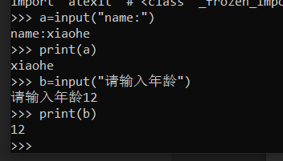

## python3

### 编码

默认情况下，Python 3 源码文件以 **UTF-8** 编码，所有字符串都是 unicode 字符串。 当然你也可以为源码文件指定不同的编码：

```python
# -*- coding: cp-1252 -*-

# encoding:utf-8 //更简单
```

### 保留字

```python
['False', 'None', 'True', 'and', 'as', 'assert', 'break', 'class', 'continue', 'def', 'del', 'elif', 'else', 'except', 'finally', 'for', 'from', 'global', 'if', 'import', 'in', 'is', 'lambda', 'nonlocal', 'not', 'or', 'pass', 'raise', 'return', 'try', 'while', 'with', 'yield']
```


### 第一个python代码

hello.py:

```python
#! python
# encoding:utf-8

print("hello world!")
```

### 运行方式

1. 通过解释器解释运行脚本文件

   python hello.py

2. 命令行交互模式

   


### 注释符

1. 单行注释:  #
2. 多行注释: `'''` 或 `"""`

### 多行语句

使用反斜杠表示多行语句`\`

```python
num_a = num1 + \
		num2 + \
    	num3
#等价于

num_a = num1 + num2 + num3
```

### 一行显示多条语句

使用分号分隔语句

```python
print('hello');print('world')
```

### 导入模块

- import:导入整个模块
- from ... import ... ：从某个模块中导入某个函数
- from ... import ... ：从某个模块中导入多个函数

### 基本数据类型

#### Python3 六个标准的数据类型：

- Number（数字）
  - int
  - bool
  - float
  - complex(复数)
- String（字符串）
- List（列表）
- Tuple（元组）
- Set（集合）
- Dictionary（字典）

Python3 中，bool 是 int 的子类，True 和 False 可以和数字相加， `True==1、False==0` 会返回 **True**


Python3 的六个标准数据类型中：

- **不可变数据（3 个）：**Number（数字）、String（字符串）、Tuple（元组）；
- **可变数据（3 个）：**List（列表）、Dictionary（字典）、Set（集合）。

#### String（字符串）

Python中的字符串用单引号` '` 或双引号` " `括起来，同时使用反斜杠 `\` 转义特殊字符。

截取方式：字符串变量[开始下标:结束下标]

```python
str = 'Runoob'

print (str)          # 输出字符串
print (str[0:-1])    # 输出第一个到倒数第二个的所有字符
print (str[0])       # 输出字符串第一个字符
print (str[2:5])     # 输出从第三个开始到第五个的字符
print (str[2:])      # 输出从第三个开始的后的所有字符
print (str * 2)      # 输出字符串两次，也可以写成 print (2 * str)
print (str + "TEST") # 连接字符串
```

特殊字符的输出：

```python
print('\n')	#输出换行符
print(r'\n') #不转义直接输出字符\n,
```


#### List（列表）

列表可以完成大多数集合类的数据结构实现。列表中元素的类型可以不相同，它支持数字，字符串甚至可以包含列表（所谓嵌套）。

列表是写在方括号 **[]** 之间、用逗号分隔开的元素列表。

和字符串一样，列表同样可以被索引和截取，列表被截取后返回一个包含所需元素的新列表。

```python
list = [ 'abcd', 786 , 2.23, 'runoob', 70.2 ]
tinylist = [123, 'runoob']

print (list)            # 输出完整列表
print (list[0])         # 输出列表第一个元素
print (list[1:3])       # 从第二个开始输出到第三个元素
print (list[2:])        # 输出从第三个元素开始的所有元素
print (tinylist * 2)    # 输出两次列表
print (list + tinylist) # 连接列表
```

#### Tuple（元组）

元组（tuple）与列表类似，不同之处在于元组的元素不能修改。元组写在小括号 **()** 里，元素之间用逗号隔开。

元组与字符串类似，可以被索引且下标索引从0开始，-1 为从末尾开始的位置。也可以进行截取

```python
tuple = ( 'abcd', 786 , 2.23, 'runoob', 70.2  )
tinytuple = (123, 'runoob')

print (tuple)             # 输出完整元组
print (tuple[0])          # 输出元组的第一个元素
print (tuple[1:3])        # 输出从第二个元素开始到第三个元素
print (tuple[2:])         # 输出从第三个元素开始的所有元素
print (tinytuple * 2)     # 输出两次元组
print (tuple + tinytuple) # 连接元组
```

#### Set（集合）

集合（set）是由一个或数个形态各异的大小整体组成的，构成集合的事物或对象称作元素或是成员。

基本功能是进行成员关系测试和删除重复元素。

```python
sites = {'Google', 'Taobao', 'Runoob', 'Facebook', 'Zhihu', 'Baidu'}

print(sites)   # 输出集合，重复的元素被自动去掉

# 成员测试
if 'Runoob' in sites :
    print('Runoob 在集合中')
else :
    print('Runoob 不在集合中')


# set可以进行集合运算
a = set('abracadabra')
b = set('alacazam')

print(a)

print(a - b)     # a 和 b 的差集

print(a | b)     # a 和 b 的并集

print(a & b)     # a 和 b 的交集

print(a ^ b)     # a 和 b 中不同时存在的元素
```

#### Dictionary（字典）

字典（dictionary）是Python中另一个非常有用的内置数据类型。

列表是有序的对象集合，字典是无序的对象集合。两者之间的区别在于：字典当中的元素是通过键来存取的，而不是通过偏移存取。

### 数据类型转换


#### 隐式类型转换

低精度数据类型和高精度数据类型相加,为了防止精度丢失,会自动转换成高精度数据类型(隐式转换)

```python
num_new = num_int + num_flo

print("datatype of num_int:",type(num_int))
print("datatype of num_flo:",type(num_flo))

print("Value of num_new:",num_new)
print("datatype of num_new:",type(num_new))
```

#### 显式类型转换

用户主动将对象的数据类型转换成指定的数据类型(解释器不会考虑精度问题——显示类型转换)

可以使用以下各种预定义函数对数据类型进行显示转换

| 函数                                                         | 描述                                                |
| :----------------------------------------------------------- | :-------------------------------------------------- |
| int(x[ [,base\])](https://www.runoob.com/python3/python-func-int.html) | 将x转换为一个整数,base -- 进制数，默认十进制。      |
| [float(x)](https://www.runoob.com/python3/python-func-float.html) | 将x转换到一个浮点数                                 |
| complex(real[ [,imag\])](https://www.runoob.com/python3/python-func-complex.html) | 创建一个复数                                        |
| [str(x)](https://www.runoob.com/python3/python-func-str.html) | 将对象 x 转换为字符串                               |
| [repr(x)](https://www.runoob.com/python3/python-func-repr.html) | 将对象 x 转换为表达式字符串                         |
| [eval(str)](https://www.runoob.com/python3/python-func-eval.html) | 用来计算在字符串中的有效Python表达式,并返回一个对象 |
| [tuple(s)](https://www.runoob.com/python3/python3-func-tuple.html) | 将序列 s 转换为一个元组                             |
| [list(s)](https://www.runoob.com/python3/python3-att-list-list.html) | 将序列 s 转换为一个列表                             |
| [set(s)](https://www.runoob.com/python3/python-func-set.html) | 转换为可变集合                                      |
| [dict(d)](https://www.runoob.com/python3/python-func-dict.html) | 创建一个字典。d 必须是一个 (key, value)元组序列。   |
| [frozenset(s)](https://www.runoob.com/python3/python-func-frozenset.html) | 转换为不可变集合                                    |
| [chr(x)](https://www.runoob.com/python3/python-func-chr.html) | 将一个整数转换为一个字符                            |
| [ord(x)](https://www.runoob.com/python3/python-func-ord.html) | 将一个字符转换为一个十进制整数                      |
| [hex(x)](https://www.runoob.com/python3/python-func-hex.html) | 将一个整数转换为一个十六进制字符串                  |
| [oct(x)](https://www.runoob.com/python3/python-func-oct.html) | 将一个整数转换为一个八进制字符串                    |

### 推导式

#### 列表推导式

列表推导式格式为：

```
[表达式 for 变量 in 列表] 
[out_exp_res for out_exp in input_list]

或者 

[表达式 for 变量 in 列表 if 条件]
[out_exp_res for out_exp in input_list if condition]
```

- out_exp_res：列表生成元素表达式，可以是有返回值的函数。
- for out_exp in input_list：迭代 input_list 将 out_exp 传入到 out_exp_res 表达式中。
- if condition：条件语句，可以过滤列表中不符合条件的值。


eg:过滤掉长度小于或等于3的字符串列表，并将剩下的转换成大写字母：

```
names = ['Bob','Tom','alice','Jerry','Wendy','Smith']
new_names = [name.upper()for name in names if len(name)>3]
print(new_names)
```


#### 字典推导式

字典推导基本格式：

```
{ key_expr: value_expr for value in collection }

或

{ key_expr: value_expr for value in collection if condition }
```


eg:使用字符串及其长度创建字典：

```python
listdemo = ['Google','Runoob', 'Taobao']
# 将列表中各字符串值为键，各字符串的长度为值，组成键值对
newdict = {key:len(key) for key in listdemo}
newdict
```


#### 集合推导式

集合推导式基本格式：

```
{ expression for item in Sequence }
或
{ expression for item in Sequence if conditional }
```


eg:计算数字 1,2,3 的平方数：

```python
setnew = {i**2 for i in (1,2,3)}
newset
```


#### 元组推导式（生成器表达式）

元组推导式可以利用 range 区间、元组、列表、字典和集合等数据类型，快速生成一个满足指定需求的元组。

元组推导式基本格式：

```
(expression for item in Sequence )
或
(expression for item in Sequence if conditional )
```

### 运算符

python3支持以下类型的运算符:

- 算术运算符
- 比较（关系）运算符
- 赋值运算符
- 逻辑运算符
- 位运算符
- 成员运算符
- 身份运算符
- 运算符优先级

#### 算术运算符

| 运算符 | 描述                                            | 实例                      |
| :----- | :---------------------------------------------- | :------------------------ |
| +      | 加 - 两个对象相加                               | a + b 输出结果 31         |
| -      | 减 - 得到负数或是一个数减去另一个数             | a - b 输出结果 -11        |
| *      | 乘 - 两个数相乘或是返回一个被重复若干次的字符串 | a * b 输出结果 210        |
| /      | 除 - x 除以 y                                   | b / a 输出结果 2.1        |
| %      | 取模 - 返回除法的余数                           | b % a 输出结果 1          |
| **     | 幂 - 返回x的y次幂                               | a**b 为10的21次方         |
| //     | 取整除 - 向下取接近商的整数                     | `>>> 9//2 4 >>> -9//2 -5` |

#### 比较运算符

以下假设变量a为10，变量b为20：

| 运算符 | 描述                                                         | 实例                  |
| :----- | :----------------------------------------------------------- | :-------------------- |
| ==     | 等于 - 比较对象是否相等                                      | (a == b) 返回 False。 |
| !=     | 不等于 - 比较两个对象是否不相等                              | (a != b) 返回 True。  |
| >      | 大于 - 返回x是否大于y                                        | (a > b) 返回 False。  |
| <      | 小于 - 返回x是否小于y。所有比较运算符返回1表示真，返回0表示假。这分别与特殊的变量True和False等价。注意，这些变量名的大写。 | (a < b) 返回 True。   |
| >=     | 大于等于 - 返回x是否大于等于y。                              | (a >= b) 返回 False。 |
| <=     | 小于等于 - 返回x是否小于等于y。                              | (a <= b) 返回 True。  |

#### 赋值运算符

以下假设变量a为10，变量b为20：

| 运算符 | 描述                                                         | 实例                                                         |
| :----- | :----------------------------------------------------------- | :----------------------------------------------------------- |
| =      | 简单的赋值运算符                                             | c = a + b 将 a + b 的运算结果赋值为 c                        |
| +=     | 加法赋值运算符                                               | c += a 等效于 c = c + a                                      |
| -=     | 减法赋值运算符                                               | c -= a 等效于 c = c - a                                      |
| *=     | 乘法赋值运算符                                               | c *= a 等效于 c = c * a                                      |
| /=     | 除法赋值运算符                                               | c /= a 等效于 c = c / a                                      |
| %=     | 取模赋值运算符                                               | c %= a 等效于 c = c % a                                      |
| **=    | 幂赋值运算符                                                 | c **= a 等效于 c = c ** a                                    |
| //=    | 取整除赋值运算符                                             | c //= a 等效于 c = c // a                                    |
| :=     | 海象运算符，可在表达式内部为变量赋值。**Python3.8 版本新增运算符**。 | 在这个示例中，赋值表达式可以避免调用 len() 两次:`if (n := len(a)) > 10:    print(f"List is too long ({n} elements, expected <= 10)")` |

#### 位运算符

变量 a 为 60，b 为 13

```python
a = 0011 1100

b = 0000 1101

-----------------

a&b = 0000 1100

a|b = 0011 1101

a^b = 0011 0001

~a  = 1100 0011
```


| 运算符 | 描述                                                         | 实例                                                         |
| :----- | :----------------------------------------------------------- | :----------------------------------------------------------- |
| &      | 按位与运算符：参与运算的两个值,如果两个相应位都为1,则该位的结果为1,否则为0 | (a & b) 输出结果 12 ，二进制解释： 0000 1100                 |
| \|     | 按位或运算符：只要对应的二个二进位有一个为1时，结果位就为1。 | (a \| b) 输出结果 61 ，二进制解释： 0011 1101                |
| ^      | 按位异或运算符：当两对应的二进位相异时，结果为1              | (a ^ b) 输出结果 49 ，二进制解释： 0011 0001                 |
| ~      | 按位取反运算符：对数据的每个二进制位取反,即把1变为0,把0变为1。**~x** 类似于 **-x-1** | (~a ) 输出结果 -61 ，二进制解释： 1100 0011， 在一个有符号二进制数的补码形式。 |
| <<     | 左移动运算符：运算数的各二进位全部左移若干位，由"<<"右边的数指定移动的位数，高位丢弃，低位补0。 | a << 2 输出结果 240 ，二进制解释： 1111 0000                 |
| >>     | 右移动运算符：把">>"左边的运算数的各二进位全部右移若干位，">>"右边的数指定移动的位数 | a >> 2 输出结果 15 ，二进制解释： 0000 1111                  |

#### 逻辑运算符

Python语言支持逻辑运算符，以下假设变量 a 为 10, b为 20:

| 运算符 | 逻辑表达式 | 描述                                                         | 实例                    |
| :----- | :--------- | :----------------------------------------------------------- | :---------------------- |
| and    | x and y    | 布尔"与" - 如果 x 为 False，x and y 返回 x 的值，否则返回 y 的计算值。 | (a and b) 返回 20。     |
| or     | x or y     | 布尔"或" - 如果 x 是 True，它返回 x 的值，否则它返回 y 的计算值。 | (a or b) 返回 10。      |
| not    | not x      | 布尔"非" - 如果 x 为 True，返回 False 。如果 x 为 False，它返回 True。 | not(a and b) 返回 False |

#### 成员运算符

除了以上的一些运算符之外，Python还支持成员运算符，测试实例中包含了一系列的成员，包括字符串，列表或元组。

| 运算符 | 描述                                                    | 实例                                              |
| :----- | :------------------------------------------------------ | :------------------------------------------------ |
| in     | 如果在指定的序列中找到值返回 True，否则返回 False。     | x 在 y 序列中 , 如果 x 在 y 序列中返回 True。     |
| not in | 如果在指定的序列中没有找到值返回 True，否则返回 False。 | x 不在 y 序列中 , 如果 x 不在 y 序列中返回 True。 |

#### 身份运算符

身份运算符用于比较两个对象的存储单元

| 运算符 | 描述                                        | 实例                                                         |
| :----- | :------------------------------------------ | :----------------------------------------------------------- |
| is     | is 是判断两个标识符是不是引用自一个对象     | **x is y**, 类似 **id(x) == id(y)** , 如果引用的是同一个对象则返回 True，否则返回 False |
| is not | is not 是判断两个标识符是不是引用自不同对象 | **x is not y** ， 类似 **id(x) != id(y)**。如果引用的不是同一个对象则返回结果 True，否则返回 False。 |

### 运算符优先级

以下表格列出了从最高到最低优先级的所有运算符， 相同单元格内的运算符具有相同优先级。 运算符均指二元运算，除非特别指出。 相同单元格内的运算符从左至右分组（除了幂运算是从右至左分组）：

| 运算符                                                       | 描述                               |
| :----------------------------------------------------------- | :--------------------------------- |
| `(expressions...)`,`[expressions...]`, `{key: value...}`, `{expressions...}` | 圆括号的表达式                     |
| `x[index]`, `x[index:index]`, `x(arguments...)`, `x.attribute` | 读取，切片，调用，属性引用         |
| await x                                                      | await 表达式                       |
| `**`                                                         | 乘方(指数)                         |
| `+x`, `-x`, `~x`                                             | 正，负，按位非 NOT                 |
| `*`, `@`, `/`, `//`, `%`                                     | 乘，矩阵乘，除，整除，取余         |
| `+`, `-`                                                     | 加和减                             |
| `<<`, `>>`                                                   | 移位                               |
| `&`                                                          | 按位与 AND                         |
| `^`                                                          | 按位异或 XOR                       |
| `|`                                                          | 按位或 OR                          |
| `in,not in, is,is not, <, <=, >, >=, !=, ==`                 | 比较运算，包括成员检测和标识号检测 |
| `not x`                                                      | 逻辑非 NOT                         |
| `and`                                                        | 逻辑与 AND                         |
| `or`                                                         | 逻辑或 OR                          |
| `if -- else`                                                 | 条件表达式                         |
| `lambda`                                                     | lambda 表达式                      |
| `:=`                                                         | 赋值表达式                         |


