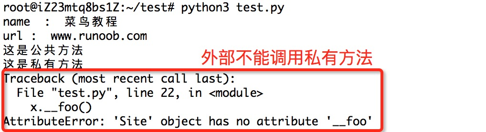

## python3

[toc]

### miniconda


### 编码

默认情况下，Python 3 源码文件以 **UTF-8** 编码，所有字符串都是 unicode 字符串。 当然你也可以为源码文件指定不同的编码：

```python
# -*- coding: cp-1252 -*-

# encoding:utf-8 //更简单
```

### 保留字

```python
['False', 'None', 'True', 'and', 'as', 'assert', 'break', 'class', 'continue', 'def', 'del', 'elif', 'else', 'except', 'finally', 'for', 'from', 'global', 'if', 'import', 'in', 'is', 'lambda', 'nonlocal', 'not', 'or', 'pass', 'raise', 'return', 'try', 'while', 'with', 'yield']
```


### 第一个python代码

hello.py:

```python
#! python
# encoding:utf-8

print("hello world!")
```

### 运行方式

1. 通过解释器解释运行脚本文件

   python hello.py

2. 命令行交互模式

   


### 注释符

1. 单行注释:  #
2. 多行注释: `'''` 或 `"""`

### 多行语句

使用反斜杠表示多行语句`\`

```python
num_a = num1 + \
		num2 + \
    	num3
#等价于

num_a = num1 + num2 + num3
```

### 一行显示多条语句

使用分号分隔语句

```python
print('hello');print('world')
```

### 导入模块

- import:导入整个模块
- from ... import ... ：从某个模块中导入某个函数
- from ... import ... ：从某个模块中导入多个函数

### 基本数据类型

#### Python3 六个标准的数据类型：

- Number（数字）
  - int
  - bool
  - float
  - complex(复数)
- String（字符串）
- List（列表）
- Tuple（元组）
- Set（集合）
- Dictionary（字典）

Python3 中，bool 是 int 的子类，True 和 False 可以和数字相加， `True==1、False==0` 会返回 **True**

Python3 的六个标准数据类型中：

- **不可变数据（3 个）：**Number（数字）、String（字符串）、Tuple（元组）；
- **可变数据（3 个）：**List（列表）、Dictionary（字典）、Set（集合）。

#### Number（数字）

```python
>>> 5 + 4  # 加法
9
>>> 4.3 - 2 # 减法
2.3
>>> 3 * 7  # 乘法
21
>>> 2 / 4  # 除法，得到一个浮点数
0.5
>>> 2 // 4 # 除法，得到一个整数
0
>>> 17 % 3 # 取余
2
>>> 2 ** 5 # 乘方
32
```

- 1、Python可以同时为多个变量赋值，如a, b = 1, 2。
- 2、一个变量可以通过赋值指向不同类型的对象。
- 3、数值的除法包含两个运算符：**/** 返回一个浮点数，**//** 返回一个整数。
- 4、在混合计算时，Python会把整型转换成为浮点数。

#### String（字符串）

Python中的字符串用单引号` '` 或双引号` " `括起来，同时使用反斜杠 `\` 转义特殊字符。

截取方式：字符串变量[开始下标:结束下标]

```python
str = 'Runoob'

print (str)          # 输出字符串
print (str[0:-1])    # 输出第一个到倒数第二个的所有字符
print (str[0])       # 输出字符串第一个字符
print (str[2:5])     # 输出从第三个开始到第五个的字符
print (str[2:])      # 输出从第三个开始的后的所有字符
print (str * 2)      # 输出字符串两次，也可以写成 print (2 * str)
print (str + "TEST") # 连接字符串
```

特殊字符的输出：

```python
print('\n')	#输出换行符
print(r'\n') #不转义直接输出字符\n,
```


#### List（列表）

列表可以完成大多数集合类的数据结构实现。列表中元素的类型可以不相同，它支持数字，字符串甚至可以包含列表（所谓嵌套）。

列表是写在方括号 **[]** 之间、用逗号分隔开的元素列表。

和字符串一样，列表同样可以被索引和截取，列表被截取后返回一个包含所需元素的新列表。

```python
list = [ 'abcd', 786 , 2.23, 'runoob', 70.2 ]
tinylist = [123, 'runoob']

print (list)            # 输出完整列表
print (list[0])         # 输出列表第一个元素
print (list[1:3])       # 从第二个开始输出到第三个元素
print (list[2:])        # 输出从第三个元素开始的所有元素
print (tinylist * 2)    # 输出两次列表
print (list + tinylist) # 连接列表
```

#### Tuple（元组）

元组（tuple）与列表类似，不同之处在于元组的元素不能修改。元组写在小括号 **()** 里，元素之间用逗号隔开。

元组与字符串类似，可以被索引且下标索引从0开始，-1 为从末尾开始的位置。也可以进行截取

```python
tuple = ( 'abcd', 786 , 2.23, 'runoob', 70.2  )
tinytuple = (123, 'runoob')

print (tuple)             # 输出完整元组
print (tuple[0])          # 输出元组的第一个元素
print (tuple[1:3])        # 输出从第二个元素开始到第三个元素
print (tuple[2:])         # 输出从第三个元素开始的所有元素
print (tinytuple * 2)     # 输出两次元组
print (tuple + tinytuple) # 连接元组
```

#### Set（集合）

集合（set）是由一个或数个形态各异的大小整体组成的，构成集合的事物或对象称作元素或是成员。

基本功能是进行成员关系测试和删除重复元素。

```python
sites = {'Google', 'Taobao', 'Runoob', 'Facebook', 'Zhihu', 'Baidu'}

print(sites)   # 输出集合，重复的元素被自动去掉

# 成员测试
if 'Runoob' in sites :
    print('Runoob 在集合中')
else :
    print('Runoob 不在集合中')


# set可以进行集合运算
a = set('abracadabra')
b = set('alacazam')

print(a)

print(a - b)     # a 和 b 的差集

print(a | b)     # a 和 b 的并集

print(a & b)     # a 和 b 的交集

print(a ^ b)     # a 和 b 中不同时存在的元素
```

#### Dictionary（字典）

字典（dictionary）是Python中另一个非常有用的内置数据类型。

列表是有序的对象集合，字典是无序的对象集合。两者之间的区别在于：字典当中的元素是通过键来存取的，而不是通过偏移存取。

### 数据类型转换


#### 隐式类型转换

低精度数据类型和高精度数据类型相加,为了防止精度丢失,会自动转换成高精度数据类型(隐式转换)

```python
num_new = num_int + num_flo

print("datatype of num_int:",type(num_int))
print("datatype of num_flo:",type(num_flo))

print("Value of num_new:",num_new)
print("datatype of num_new:",type(num_new))
```

#### 显式类型转换

用户主动将对象的数据类型转换成指定的数据类型(解释器不会考虑精度问题——显示类型转换)

可以使用以下各种预定义函数对数据类型进行显示转换

| 函数                                                         | 描述                                                |
| :----------------------------------------------------------- | :-------------------------------------------------- |
| int(x[ [,base\])](https://www.runoob.com/python3/python-func-int.html) | 将x转换为一个整数,base -- 进制数，默认十进制。      |
| [float(x)](https://www.runoob.com/python3/python-func-float.html) | 将x转换到一个浮点数                                 |
| complex(real[ [,imag\])](https://www.runoob.com/python3/python-func-complex.html) | 创建一个复数                                        |
| [str(x)](https://www.runoob.com/python3/python-func-str.html) | 将对象 x 转换为字符串                               |
| [repr(x)](https://www.runoob.com/python3/python-func-repr.html) | 将对象 x 转换为表达式字符串                         |
| [eval(str)](https://www.runoob.com/python3/python-func-eval.html) | 用来计算在字符串中的有效Python表达式,并返回一个对象 |
| [tuple(s)](https://www.runoob.com/python3/python3-func-tuple.html) | 将序列 s 转换为一个元组                             |
| [list(s)](https://www.runoob.com/python3/python3-att-list-list.html) | 将序列 s 转换为一个列表                             |
| [set(s)](https://www.runoob.com/python3/python-func-set.html) | 转换为可变集合                                      |
| [dict(d)](https://www.runoob.com/python3/python-func-dict.html) | 创建一个字典。d 必须是一个 (key, value)元组序列。   |
| [frozenset(s)](https://www.runoob.com/python3/python-func-frozenset.html) | 转换为不可变集合                                    |
| [chr(x)](https://www.runoob.com/python3/python-func-chr.html) | 将一个整数转换为一个字符                            |
| [ord(x)](https://www.runoob.com/python3/python-func-ord.html) | 将一个字符转换为一个十进制整数                      |
| [hex(x)](https://www.runoob.com/python3/python-func-hex.html) | 将一个整数转换为一个十六进制字符串                  |
| [oct(x)](https://www.runoob.com/python3/python-func-oct.html) | 将一个整数转换为一个八进制字符串                    |

### 推导式

#### 列表推导式

列表推导式格式为：

```
[表达式 for 变量 in 列表] 
[out_exp_res for out_exp in input_list]

或者 

[表达式 for 变量 in 列表 if 条件]
[out_exp_res for out_exp in input_list if condition]
```

- out_exp_res：列表生成元素表达式，可以是有返回值的函数。
- for out_exp in input_list：迭代 input_list 将 out_exp 传入到 out_exp_res 表达式中。
- if condition：条件语句，可以过滤列表中不符合条件的值。


eg:过滤掉长度小于或等于3的字符串列表，并将剩下的转换成大写字母：

```
names = ['Bob','Tom','alice','Jerry','Wendy','Smith']
new_names = [name.upper()for name in names if len(name)>3]
print(new_names)
```


#### 字典推导式

字典推导基本格式：

```
{ key_expr: value_expr for value in collection }

或

{ key_expr: value_expr for value in collection if condition }
```


eg:使用字符串及其长度创建字典：

```python
listdemo = ['Google','Runoob', 'Taobao']
# 将列表中各字符串值为键，各字符串的长度为值，组成键值对
newdict = {key:len(key) for key in listdemo}
newdict
```


#### 集合推导式

集合推导式基本格式：

```
{ expression for item in Sequence }
或
{ expression for item in Sequence if conditional }
```


eg:计算数字 1,2,3 的平方数：

```python
setnew = {i**2 for i in (1,2,3)}
newset
```


#### 元组推导式（生成器表达式）

元组推导式可以利用 range 区间、元组、列表、字典和集合等数据类型，快速生成一个满足指定需求的元组。

元组推导式基本格式：

```
(expression for item in Sequence )
或
(expression for item in Sequence if conditional )
```

### 运算符

python3支持以下类型的运算符:

- 算术运算符
- 比较（关系）运算符
- 赋值运算符
- 逻辑运算符
- 位运算符
- 成员运算符
- 身份运算符
- 运算符优先级

#### 算术运算符

| 运算符 | 描述                                            | 实例                      |
| :----- | :---------------------------------------------- | :------------------------ |
| +      | 加 - 两个对象相加                               | a + b 输出结果 31         |
| -      | 减 - 得到负数或是一个数减去另一个数             | a - b 输出结果 -11        |
| *      | 乘 - 两个数相乘或是返回一个被重复若干次的字符串 | a * b 输出结果 210        |
| /      | 除 - x 除以 y                                   | b / a 输出结果 2.1        |
| %      | 取模 - 返回除法的余数                           | b % a 输出结果 1          |
| **     | 幂 - 返回x的y次幂                               | a**b 为10的21次方         |
| //     | 取整除 - 向下取接近商的整数                     | `>>> 9//2 4 >>> -9//2 -5` |

#### 比较运算符

以下假设变量a为10，变量b为20：

| 运算符 | 描述                                                         | 实例                  |
| :----- | :----------------------------------------------------------- | :-------------------- |
| ==     | 等于 - 比较对象是否相等                                      | (a == b) 返回 False。 |
| !=     | 不等于 - 比较两个对象是否不相等                              | (a != b) 返回 True。  |
| >      | 大于 - 返回x是否大于y                                        | (a > b) 返回 False。  |
| <      | 小于 - 返回x是否小于y。所有比较运算符返回1表示真，返回0表示假。这分别与特殊的变量True和False等价。注意，这些变量名的大写。 | (a < b) 返回 True。   |
| >=     | 大于等于 - 返回x是否大于等于y。                              | (a >= b) 返回 False。 |
| <=     | 小于等于 - 返回x是否小于等于y。                              | (a <= b) 返回 True。  |

#### 赋值运算符

以下假设变量a为10，变量b为20：

| 运算符 | 描述                                                         | 实例                                                         |
| :----- | :----------------------------------------------------------- | :----------------------------------------------------------- |
| =      | 简单的赋值运算符                                             | c = a + b 将 a + b 的运算结果赋值为 c                        |
| +=     | 加法赋值运算符                                               | c += a 等效于 c = c + a                                      |
| -=     | 减法赋值运算符                                               | c -= a 等效于 c = c - a                                      |
| *=     | 乘法赋值运算符                                               | c *= a 等效于 c = c * a                                      |
| /=     | 除法赋值运算符                                               | c /= a 等效于 c = c / a                                      |
| %=     | 取模赋值运算符                                               | c %= a 等效于 c = c % a                                      |
| **=    | 幂赋值运算符                                                 | c **= a 等效于 c = c ** a                                    |
| //=    | 取整除赋值运算符                                             | c //= a 等效于 c = c // a                                    |
| :=     | 海象运算符，可在表达式内部为变量赋值。**Python3.8 版本新增运算符**。 | 在这个示例中，赋值表达式可以避免调用 len() 两次:`if (n := len(a)) > 10:    print(f"List is too long ({n} elements, expected <= 10)")` |

#### 位运算符

变量 a 为 60，b 为 13

```python
a = 0011 1100

b = 0000 1101

-----------------

a&b = 0000 1100

a|b = 0011 1101

a^b = 0011 0001

~a  = 1100 0011
```


| 运算符 | 描述                                                         | 实例                                                         |
| :----- | :----------------------------------------------------------- | :----------------------------------------------------------- |
| &      | 按位与运算符：参与运算的两个值,如果两个相应位都为1,则该位的结果为1,否则为0 | (a & b) 输出结果 12 ，二进制解释： 0000 1100                 |
| \|     | 按位或运算符：只要对应的二个二进位有一个为1时，结果位就为1。 | (a \| b) 输出结果 61 ，二进制解释： 0011 1101                |
| ^      | 按位异或运算符：当两对应的二进位相异时，结果为1              | (a ^ b) 输出结果 49 ，二进制解释： 0011 0001                 |
| ~      | 按位取反运算符：对数据的每个二进制位取反,即把1变为0,把0变为1。**~x** 类似于 **-x-1** | (~a ) 输出结果 -61 ，二进制解释： 1100 0011， 在一个有符号二进制数的补码形式。 |
| <<     | 左移动运算符：运算数的各二进位全部左移若干位，由"<<"右边的数指定移动的位数，高位丢弃，低位补0。 | a << 2 输出结果 240 ，二进制解释： 1111 0000                 |
| >>     | 右移动运算符：把">>"左边的运算数的各二进位全部右移若干位，">>"右边的数指定移动的位数 | a >> 2 输出结果 15 ，二进制解释： 0000 1111                  |

#### 逻辑运算符

Python语言支持逻辑运算符，以下假设变量 a 为 10, b为 20:

| 运算符 | 逻辑表达式 | 描述                                                         | 实例                    |
| :----- | :--------- | :----------------------------------------------------------- | :---------------------- |
| and    | x and y    | 布尔"与" - 如果 x 为 False，x and y 返回 x 的值，否则返回 y 的计算值。 | (a and b) 返回 20。     |
| or     | x or y     | 布尔"或" - 如果 x 是 True，它返回 x 的值，否则它返回 y 的计算值。 | (a or b) 返回 10。      |
| not    | not x      | 布尔"非" - 如果 x 为 True，返回 False 。如果 x 为 False，它返回 True。 | not(a and b) 返回 False |

#### 成员运算符

除了以上的一些运算符之外，Python还支持成员运算符，测试实例中包含了一系列的成员，包括字符串，列表或元组。

| 运算符 | 描述                                                    | 实例                                              |
| :----- | :------------------------------------------------------ | :------------------------------------------------ |
| in     | 如果在指定的序列中找到值返回 True，否则返回 False。     | x 在 y 序列中 , 如果 x 在 y 序列中返回 True。     |
| not in | 如果在指定的序列中没有找到值返回 True，否则返回 False。 | x 不在 y 序列中 , 如果 x 不在 y 序列中返回 True。 |

#### 身份运算符

身份运算符用于比较两个对象的存储单元

| 运算符 | 描述                                        | 实例                                                         |
| :----- | :------------------------------------------ | :----------------------------------------------------------- |
| is     | is 是判断两个标识符是不是引用自一个对象     | **x is y**, 类似 **id(x) == id(y)** , 如果引用的是同一个对象则返回 True，否则返回 False |
| is not | is not 是判断两个标识符是不是引用自不同对象 | **x is not y** ， 类似 **id(x) != id(y)**。如果引用的不是同一个对象则返回结果 True，否则返回 False。 |

### 运算符优先级

以下表格列出了从最高到最低优先级的所有运算符， 相同单元格内的运算符具有相同优先级。 运算符均指二元运算，除非特别指出。 相同单元格内的运算符从左至右分组（除了幂运算是从右至左分组）：

| 运算符                                                       | 描述                               |
| :----------------------------------------------------------- | :--------------------------------- |
| `(expressions...)`,`[expressions...]`, `{key: value...}`, `{expressions...}` | 圆括号的表达式                     |
| `x[index]`, `x[index:index]`, `x(arguments...)`, `x.attribute` | 读取，切片，调用，属性引用         |
| await x                                                      | await 表达式                       |
| `**`                                                         | 乘方(指数)                         |
| `+x`, `-x`, `~x`                                             | 正，负，按位非 NOT                 |
| `*`, `@`, `/`, `//`, `%`                                     | 乘，矩阵乘，除，整除，取余         |
| `+`, `-`                                                     | 加和减                             |
| `<<`, `>>`                                                   | 移位                               |
| `&`                                                          | 按位与 AND                         |
| `^`                                                          | 按位异或 XOR                       |
| `|`                                                          | 按位或 OR                          |
| `in,not in, is,is not, <, <=, >, >=, !=, ==`                 | 比较运算，包括成员检测和标识号检测 |
| `not x`                                                      | 逻辑非 NOT                         |
| `and`                                                        | 逻辑与 AND                         |
| `or`                                                         | 逻辑或 OR                          |
| `if -- else`                                                 | 条件表达式                         |
| `lambda`                                                     | lambda 表达式                      |
| `:=`                                                         | 赋值表达式                         |

### 数字

部分随机函数需要导入模块,如果使用函数时提示未定义,则需要导入对应模块


#### 进制转换

二进制表示:  0b    函数:bin()

八进制表示:  0o  	函数:oct()

十六进制表示:  0x  函数:  hex()


### 字符串

#### 更新字符串

```
strA = '123456'
strA + '7'

实际strA并未改变

要改变strA:
strA += '7'
```

#### 转义字符

| 转义字符    | 描述                                                         | 实例                                                         |
| :---------- | :----------------------------------------------------------- | :----------------------------------------------------------- |
| \(在行尾时) | 续行符                                                       | `>>> print("line1 \ ... line2 \ ... line3") line1 line2 line3 >>> ` |
| \\          | 反斜杠符号                                                   | `>>> print("\\") \`                                          |
| \'          | 单引号                                                       | `>>> print('\'') '`                                          |
| \"          | 双引号                                                       | `>>> print("\"") "`                                          |
| \a          | 响铃                                                         | `>>> print("\a")`执行后电脑有响声。                          |
| \b          | 退格(Backspace)                                              | `>>> print("Hello \b World!") Hello World!`                  |
| \000        | 空                                                           | `>>> print("\000") >>> `                                     |
| \n          | 换行                                                         | `>>> print("\n")  >>>`                                       |
| \v          | 纵向制表符                                                   | `>>> print("Hello \v World!") Hello        World! >>>`       |
| \t          | 横向制表符                                                   | `>>> print("Hello \t World!") Hello    World! >>>`           |
| \r          | 回车，将 **\r** 后面的内容移到字符串开头，并逐一替换开头部分的字符，直至将 **\r** 后面的内容完全替换完成。 | `>>> print("Hello\rWorld!") World! >>> print('google runoob taobao\r123456') 123456 runoob taobao` |
| \f          | 换页                                                         | `>>> print("Hello \f World!") Hello        World! >>> `      |
| \yyy        | 八进制数，y 代表 0~7 的字符，例如：\012 代表换行。           | `>>> print("\110\145\154\154\157\40\127\157\162\154\144\41") Hello World!` |
| \xyy        | 十六进制数，以 \x 开头，y 代表的字符，例如：\x0a 代表换行    | `>>> print("\x48\x65\x6c\x6c\x6f\x20\x57\x6f\x72\x6c\x64\x21") Hello World!` |
| \other      | 其它的字符以普通格式输出                                     |                                                              |

#### 字符串运算符

| 操作符 | 描述                                                         | 实例                            |
| :----- | :----------------------------------------------------------- | :------------------------------ |
| +      | 字符串连接                                                   | a + b 输出结果： HelloPython    |
| *      | 重复输出字符串                                               | a*2 输出结果：HelloHello        |
| []     | 通过索引获取字符串中字符                                     | a[1] 输出结果 **e**             |
| [ : ]  | 截取字符串中的一部分，遵循**左闭右开**原则，str[0:2] 是不包含第 3 个字符的。 | a[1:4] 输出结果 **ell**         |
| in     | 成员运算符 - 如果字符串中包含给定的字符返回 True             | **'H' in a** 输出结果 True      |
| not in | 成员运算符 - 如果字符串中不包含给定的字符返回 True           | **'M' not in a** 输出结果 True  |
| r/R    | 原始字符串 - 原始字符串：所有的字符串都是直接按照字面的意思来使用，没有转义特殊或不能打印的字符。 原始字符串除在字符串的第一个引号前加上字母 **r**（可以大小写）以外，与普通字符串有着几乎完全相同的语法。 | `print( r'\n' ) print( R'\n' )` |

####  字符串格式化

| 符  号 | 描述                                 |
| :----- | :----------------------------------- |
| %c     | 格式化字符及其ASCII码                |
| %s     | 格式化字符串                         |
| %d     | 格式化整数                           |
| %u     | 格式化无符号整型                     |
| %o     | 格式化无符号八进制数                 |
| %x     | 格式化无符号十六进制数               |
| %X     | 格式化无符号十六进制数（大写）       |
| %f     | 格式化浮点数字，可指定小数点后的精度 |
| %e     | 用科学计数法格式化浮点数             |
| %E     | 作用同%e，用科学计数法格式化浮点数   |
| %g     | %f和%e的简写                         |
| %G     | %f 和 %E 的简写                      |
| %p     | 用十六进制数格式化变量的地址         |

##### 格式化操作符辅助指令:

| 符号  | 功能                                                         |
| :---- | :----------------------------------------------------------- |
| *     | 定义宽度或者小数点精度                                       |
| -     | 用做左对齐                                                   |
| +     | 在正数前面显示加号( + )                                      |
| <sp>  | 在正数前面显示空格                                           |
| #     | 在八进制数前面显示零('0')，在十六进制前面显示'0x'或者'0X'(取决于用的是'x'还是'X') |
| 0     | 显示的数字前面填充'0'而不是默认的空格                        |
| %     | '%%'输出一个单一的'%'                                        |
| (var) | 映射变量(字典参数)                                           |
| m.n.  | m 是显示的最小总宽度,n 是小数点后的位数(如果可用的话)        |

Python2.6 开始，新增了一种格式化字符串的函数 [str.format()](https://www.runoob.com/python/att-string-format.html)，它增强了字符串格式化的功能。

#### 字符串内建函数

| 序号 | 方法及描述                                                   |
| :--- | :----------------------------------------------------------- |
| 1    | [capitalize()](https://www.runoob.com/python3/python3-string-capitalize.html) 将字符串的第一个字符转换为大写 |
| 2    | [center(width, fillchar)](https://www.runoob.com/python3/python3-string-center.html)返回一个指定的宽度 width 居中的字符串，fillchar 为填充的字符，默认为空格。 |
| 3    | [count(str, beg= 0,end=len(string))](https://www.runoob.com/python3/python3-string-count.html) 返回 str 在 string 里面出现的次数，如果 beg 或者 end 指定则返回指定范围内 str 出现的次数 |
| 4    | [bytes.decode(encoding="utf-8", errors="strict")](https://www.runoob.com/python3/python3-string-decode.html) Python3 中没有 decode 方法，但我们可以使用 bytes 对象的 decode() 方法来解码给定的 bytes 对象，这个 bytes 对象可以由 str.encode() 来编码返回。 |
| 5    | [encode(encoding='UTF-8',errors='strict')](https://www.runoob.com/python3/python3-string-encode.html) 以 encoding 指定的编码格式编码字符串，如果出错默认报一个ValueError 的异常，除非 errors 指定的是'ignore'或者'replace' |
| 6    | [endswith(suffix, beg=0, end=len(string))](https://www.runoob.com/python3/python3-string-endswith.html) 检查字符串是否以 suffix 结束，如果 beg 或者 end 指定则检查指定的范围内是否以 suffix 结束，如果是，返回 True,否则返回 False。 |
| 7    | [expandtabs(tabsize=8)](https://www.runoob.com/python3/python3-string-expandtabs.html) 把字符串 string 中的 tab 符号转为空格，tab 符号默认的空格数是 8 。 |
| 8    | [find(str, beg=0, end=len(string))](https://www.runoob.com/python3/python3-string-find.html) 检测 str 是否包含在字符串中，如果指定范围 beg 和 end ，则检查是否包含在指定范围内，如果包含返回开始的索引值，否则返回-1 |
| 9    | [index(str, beg=0, end=len(string))](https://www.runoob.com/python3/python3-string-index.html) 跟find()方法一样，只不过如果str不在字符串中会报一个异常。 |
| 10   | [isalnum()](https://www.runoob.com/python3/python3-string-isalnum.html) 如果字符串至少有一个字符并且所有字符都是字母或数字则返 回 True，否则返回 False |
| 11   | [isalpha()](https://www.runoob.com/python3/python3-string-isalpha.html) 如果字符串至少有一个字符并且所有字符都是字母或中文字则返回 True, 否则返回 False |
| 12   | [isdigit()](https://www.runoob.com/python3/python3-string-isdigit.html) 如果字符串只包含数字则返回 True 否则返回 False.. |
| 13   | [islower()](https://www.runoob.com/python3/python3-string-islower.html) 如果字符串中包含至少一个区分大小写的字符，并且所有这些(区分大小写的)字符都是小写，则返回 True，否则返回 False |
| 14   | [isnumeric()](https://www.runoob.com/python3/python3-string-isnumeric.html) 如果字符串中只包含数字字符，则返回 True，否则返回 False |
| 15   | [isspace()](https://www.runoob.com/python3/python3-string-isspace.html) 如果字符串中只包含空白，则返回 True，否则返回 False. |
| 16   | [istitle()](https://www.runoob.com/python3/python3-string-istitle.html) 如果字符串是标题化的(见 title())则返回 True，否则返回 False |
| 17   | [isupper()](https://www.runoob.com/python3/python3-string-isupper.html) 如果字符串中包含至少一个区分大小写的字符，并且所有这些(区分大小写的)字符都是大写，则返回 True，否则返回 False |
| 18   | [join(seq)](https://www.runoob.com/python3/python3-string-join.html) 以指定字符串作为分隔符，将 seq 中所有的元素(的字符串表示)合并为一个新的字符串 |
| 19   | [len(string)](https://www.runoob.com/python3/python3-string-len.html) 返回字符串长度 |
| 20   | [ljust(width[, fillchar\])](https://www.runoob.com/python3/python3-string-ljust.html) 返回一个原字符串左对齐,并使用 fillchar 填充至长度 width 的新字符串，fillchar 默认为空格。 |
| 21   | [lower()](https://www.runoob.com/python3/python3-string-lower.html) 转换字符串中所有大写字符为小写. |
| 22   | [lstrip()](https://www.runoob.com/python3/python3-string-lstrip.html) 截掉字符串左边的空格或指定字符。 |
| 23   | [maketrans()](https://www.runoob.com/python3/python3-string-maketrans.html) 创建字符映射的转换表，对于接受两个参数的最简单的调用方式，第一个参数是字符串，表示需要转换的字符，第二个参数也是字符串表示转换的目标。 |
| 24   | [max(str)](https://www.runoob.com/python3/python3-string-max.html) 返回字符串 str 中最大的字母。 |
| 25   | [min(str)](https://www.runoob.com/python3/python3-string-min.html) 返回字符串 str 中最小的字母。 |
| 26   | [replace(old, new [, max\])](https://www.runoob.com/python3/python3-string-replace.html) 把 将字符串中的 old 替换成 new,如果 max 指定，则替换不超过 max 次。 |
| 27   | [rfind(str, beg=0,end=len(string))](https://www.runoob.com/python3/python3-string-rfind.html) 类似于 find()函数，不过是从右边开始查找. |
| 28   | [rindex( str, beg=0, end=len(string))](https://www.runoob.com/python3/python3-string-rindex.html) 类似于 index()，不过是从右边开始. |
| 29   | [rjust(width,[, fillchar\])](https://www.runoob.com/python3/python3-string-rjust.html) 返回一个原字符串右对齐,并使用fillchar(默认空格）填充至长度 width 的新字符串 |
| 30   | [rstrip()](https://www.runoob.com/python3/python3-string-rstrip.html) 删除字符串末尾的空格或指定字符。 |
| 31   | [split(str="", num=string.count(str))](https://www.runoob.com/python3/python3-string-split.html) 以 str 为分隔符截取字符串，如果 num 有指定值，则仅截取 num+1 个子字符串 |
| 32   | [splitlines([keepends\])](https://www.runoob.com/python3/python3-string-splitlines.html) 按照行('\r', '\r\n', \n')分隔，返回一个包含各行作为元素的列表，如果参数 keepends 为 False，不包含换行符，如果为 True，则保留换行符。 |
| 33   | [startswith(substr, beg=0,end=len(string))](https://www.runoob.com/python3/python3-string-startswith.html) 检查字符串是否是以指定子字符串 substr 开头，是则返回 True，否则返回 False。如果beg 和 end 指定值，则在指定范围内检查。 |
| 34   | [strip([chars\])](https://www.runoob.com/python3/python3-string-strip.html) 在字符串上执行 lstrip()和 rstrip() |
| 35   | [swapcase()](https://www.runoob.com/python3/python3-string-swapcase.html) 将字符串中大写转换为小写，小写转换为大写 |
| 36   | [title()](https://www.runoob.com/python3/python3-string-title.html) 返回"标题化"的字符串,就是说所有单词都是以大写开始，其余字母均为小写(见 istitle()) |
| 37   | [translate(table, deletechars="")](https://www.runoob.com/python3/python3-string-translate.html) 根据 table 给出的表(包含 256 个字符)转换 string 的字符, 要过滤掉的字符放到 deletechars 参数中 |
| 38   | [upper()](https://www.runoob.com/python3/python3-string-upper.html) 转换字符串中的小写字母为大写 |
| 39   | [zfill (width)](https://www.runoob.com/python3/python3-string-zfill.html) 返回长度为 width 的字符串，原字符串右对齐，前面填充0 |
| 40   | [isdecimal()](https://www.runoob.com/python3/python3-string-isdecimal.html) 检查字符串是否只包含十进制字符，如果是返回 true，否则返回 false。 |

### 列表

创建一个列表，只要把逗号分隔的不同的数据项使用方括号括起来即可。如下所示：

```python
list1 = ['Google', 'Runoob', 1997, 2000] 
list2 = [1, 2, 3, 4, 5 ]
list3 = [] #创建空列表
```

#### 列表脚本操作符

| Python 表达式                         | 结果                         | 描述                 |
| :------------------------------------ | :--------------------------- | :------------------- |
| len([1, 2, 3])                        | 3                            | 长度                 |
| [1, 2, 3] + [4, 5, 6]                 | [1, 2, 3, 4, 5, 6]           | 组合                 |
| ['Hi!'] * 4                           | ['Hi!', 'Hi!', 'Hi!', 'Hi!'] | 重复                 |
| 3 in [1, 2, 3]                        | True                         | 元素是否存在于列表中 |
| for x in [1, 2, 3]: print(x, end=" ") | 1 2 3                        | 迭代                 |

#### 列表截取与拼接

| Python 表达式 | 结果                 | 描述                                               |
| :------------ | :------------------- | :------------------------------------------------- |
| L[2]          | 'Taobao'             | 读取第三个元素                                     |
| L[-2]         | 'Runoob'             | 从右侧开始读取倒数第二个元素: count from the right |
| L[1:]         | ['Runoob', 'Taobao'] | 输出从第二个元素开始后的所有元素                   |

#### 列表比较

列表比较需要引入 **operator** 模块的 **eq** 方法（详见：[Python operator 模块](https://www.runoob.com/python3/python-operator.html)）：

```
# 导入 operator 模块
import operator

a = [1, 2]
b = [2, 3]
c = [2, 3]
print("operator.eq(a,b): ", operator.eq(a,b))
print("operator.eq(c,b): ", operator.eq(c,b))
```

#### 列表函数&方法

Python包含以下函数:

| 序号 | 函数                                                         |
| :--- | :----------------------------------------------------------- |
| 1    | [len(list)](https://www.runoob.com/python3/python3-att-list-len.html) 列表元素个数 |
| 2    | [max(list)](https://www.runoob.com/python3/python3-att-list-max.html) 返回列表元素最大值 |
| 3    | [min(list)](https://www.runoob.com/python3/python3-att-list-min.html) 返回列表元素最小值 |
| 4    | [list(seq)](https://www.runoob.com/python3/python3-att-list-list.html) 将元组转换为列表 |

Python包含以下方法:

| 序号 | 方法                                                         |
| :--- | :----------------------------------------------------------- |
| 1    | [list.append(obj)](https://www.runoob.com/python3/python3-att-list-append.html) 在列表末尾添加新的对象 |
| 2    | [list.count(obj)](https://www.runoob.com/python3/python3-att-list-count.html) 统计某个元素在列表中出现的次数 |
| 3    | [list.extend(seq)](https://www.runoob.com/python3/python3-att-list-extend.html) 在列表末尾一次性追加另一个序列中的多个值（用新列表扩展原来的列表） |
| 4    | [list.index(obj)](https://www.runoob.com/python3/python3-att-list-index.html) 从列表中找出某个值第一个匹配项的索引位置 |
| 5    | [list.insert(index, obj)](https://www.runoob.com/python3/python3-att-list-insert.html) 将对象插入列表 |
| 6    | [list.pop([index=-1\])](https://www.runoob.com/python3/python3-att-list-pop.html) 移除列表中的一个元素（默认最后一个元素），并且返回该元素的值 |
| 7    | [list.remove(obj)](https://www.runoob.com/python3/python3-att-list-remove.html) 移除列表中某个值的第一个匹配项 |
| 8    | [list.reverse()](https://www.runoob.com/python3/python3-att-list-reverse.html) 反向列表中元素 |
| 9    | [list.sort( key=None, reverse=False)](https://www.runoob.com/python3/python3-att-list-sort.html) 对原列表进行排序 |
| 10   | [list.clear()](https://www.runoob.com/python3/python3-att-list-clear.html) 清空列表 |
| 11   | [list.copy()](https://www.runoob.com/python3/python3-att-list-copy.html) 复制列表 |


#### 生成列表

range()

```python
listDemo = range(0,100,2)#生成从0到100(不包含100)的所有偶数列表
```


### 元组

#### 运算符

与字符串一样，元组之间可以使用 **+** 号和 ***** 号进行运算。这就意味着他们可以组合和复制，运算后会生成一个新的元组。

| Python 表达式                                | 结果                         | 描述         |
| :------------------------------------------- | :--------------------------- | :----------- |
| `len((1, 2, 3))`                             | 3                            | 计算元素个数 |
| `(1, 2, 3) + (4, 5, 6)`                      | (1, 2, 3, 4, 5, 6)           | 连接         |
| `('Hi!',) * 4`                               | ('Hi!', 'Hi!', 'Hi!', 'Hi!') | 复制         |
| `3 in (1, 2, 3)`                             | True                         | 元素是否存在 |
| `for x in (1, 2, 3):     print (x, end=" ")` | 1 2 3                        | 迭代         |


#### 内置函数

Python元组包含了以下内置函数

| 序号 | 方法及描述                               | 实例                                                         |
| :--- | :--------------------------------------- | :----------------------------------------------------------- |
| 1    | len(tuple) 计算元组元素个数。            | `>>> tuple1 = ('Google', 'Runoob', 'Taobao') >>> len(tuple1) 3 >>> ` |
| 2    | max(tuple) 返回元组中元素最大值。        | `>>> tuple2 = ('5', '4', '8') >>> max(tuple2) '8' >>> `      |
| 3    | min(tuple) 返回元组中元素最小值。        | `>>> tuple2 = ('5', '4', '8') >>> min(tuple2) '4' >>> `      |
| 4    | tuple(iterable) 将可迭代系列转换为元组。 | `>>> list1= ['Google', 'Taobao', 'Runoob', 'Baidu'] >>> tuple1=tuple(list1) >>> tuple1 ('Google', 'Taobao', 'Runoob', 'Baidu')` |


### 字典

使用大括号 **{ }** 创建空字典

#### 删除字典元素

能删单一的元素也能清空字典，清空只需一项操作。

显式删除一个字典用del命令，如下实例：

```
#!/usr/bin/python3
 
tinydict = {'Name': 'Runoob', 'Age': 7, 'Class': 'First'}
 
del tinydict['Name'] # 删除键 'Name'
tinydict.clear()     # 清空字典
del tinydict         # 删除字典
 
print ("tinydict['Age']: ", tinydict['Age'])
print ("tinydict['School']: ", tinydict['School'])
```

#### 字典内置函数&方法

##### Python字典包含了以下内置函数：

| 序号 | 函数及描述                                                   | 实例                                                         |
| :--- | :----------------------------------------------------------- | :----------------------------------------------------------- |
| 1    | len(dict) 计算字典元素个数，即键的总数。                     | `>>> tinydict = {'Name': 'Runoob', 'Age': 7, 'Class': 'First'} >>> len(tinydict) 3` |
| 2    | str(dict) 输出字典，可以打印的字符串表示。                   | `>>> tinydict = {'Name': 'Runoob', 'Age': 7, 'Class': 'First'} >>> str(tinydict) "{'Name': 'Runoob', 'Class': 'First', 'Age': 7}"` |
| 3    | type(variable) 返回输入的变量类型，如果变量是字典就返回字典类型。 | `>>> tinydict = {'Name': 'Runoob', 'Age': 7, 'Class': 'First'} >>> type(tinydict) <class 'dict'>` |

##### Python字典包含了以下内置方法：

| 序号 | 函数及描述                                                   |
| :--- | :----------------------------------------------------------- |
| 1    | [dict.clear()](https://www.runoob.com/python3/python3-att-dictionary-clear.html) 删除字典内所有元素 |
| 2    | [dict.copy()](https://www.runoob.com/python3/python3-att-dictionary-copy.html) 返回一个字典的浅复制 |
| 3    | [dict.fromkeys()](https://www.runoob.com/python3/python3-att-dictionary-fromkeys.html) 创建一个新字典，以序列seq中元素做字典的键，val为字典所有键对应的初始值 |
| 4    | [dict.get(key, default=None)](https://www.runoob.com/python3/python3-att-dictionary-get.html) 返回指定键的值，如果键不在字典中返回 default 设置的默认值 |
| 5    | [key in dict](https://www.runoob.com/python3/python3-att-dictionary-in.html) 如果键在字典dict里返回true，否则返回false |
| 6    | [dict.items()](https://www.runoob.com/python3/python3-att-dictionary-items.html) 以列表返回一个视图对象 |
| 7    | [dict.keys()](https://www.runoob.com/python3/python3-att-dictionary-keys.html) 返回一个视图对象 |
| 8    | [dict.setdefault(key, default=None)](https://www.runoob.com/python3/python3-att-dictionary-setdefault.html) 和get()类似, 但如果键不存在于字典中，将会添加键并将值设为default |
| 9    | [dict.update(dict2)](https://www.runoob.com/python3/python3-att-dictionary-update.html) 把字典dict2的键/值对更新到dict里 |
| 10   | [dict.values()](https://www.runoob.com/python3/python3-att-dictionary-values.html) 返回一个视图对象 |
| 11   | dict.pop(key[,[default\])](https://www.runoob.com/python3/python3-att-dictionary-pop.html) 删除字典 key（键）所对应的值，返回被删除的值。 |
| 12   | [dict.popitem()](https://www.runoob.com/python3/python3-att-dictionary-popitem.html) 返回并删除字典中的最后一对键和值。 |

#### 字典遍历

```python
dictDemo = {1:"name",2:"age",3:"sex"}

for key,val in dictDemo.items():
    print(key,val)
```


```python
for key in dictDemo.keys():
    #取key
for val in dictDemo.values():
    #取value
```


### 集合

集合（set）是一个无序的不重复元素序列。

可以使用大括号 **{ }** 或者 **set()** 函数创建集合，

注意：创建一个空集合必须用 **set()** 而不是 **{ }**，因为 **{ }** 是用来创建一个空字典。

#### 集合的基本操作

##### 1、添加元素

**语法格式如下：**

```
s.add( x )
```

将元素 x 添加到集合 s 中，如果元素已存在，则不进行任何操作。

##### 2、移除元素

**语法格式如下：**

```
s.remove( x )
```

将元素 x 从集合 s 中移除，如果元素不存在，则会发生错误。

##### 3、计算集合元素个数

**语法格式如下：**

```
len(s)

len("中国")  #也返回2,len()函数返回的是字符的个数而不是长度

#要显示中文字符长度,需要将字符编码
a = "中国"
len(a.encode())  #默认以utf-8编码,返回6,
len(a.encode("GB2312"))	#gb2312则是4
```

计算集合 s 元素个数:len(s)。

##### 4、清空集合

**语法格式如下：**

```
s.clear()
```

清空集合 s。

##### 5、判断元素是否在集合中存在

**语法格式如下：**

```
x in s
```

判断元素 x 是否在集合 s 中，存在返回 True，不存在返回 False。

#### 集合内置方法完整列表

| 方法                                                         | 描述                                                         |
| :----------------------------------------------------------- | :----------------------------------------------------------- |
| [add()](https://www.runoob.com/python3/ref-set-add.html)     | 为集合添加元素                                               |
| [clear()](https://www.runoob.com/python3/ref-set-clear.html) | 移除集合中的所有元素                                         |
| [copy()](https://www.runoob.com/python3/ref-set-copy.html)   | 拷贝一个集合                                                 |
| [difference()](https://www.runoob.com/python3/ref-set-difference.html) | 返回多个集合的差集                                           |
| [difference_update()](https://www.runoob.com/python3/ref-set-difference_update.html) | 移除集合中的元素，该元素在指定的集合也存在。                 |
| [discard()](https://www.runoob.com/python3/ref-set-discard.html) | 删除集合中指定的元素                                         |
| [intersection()](https://www.runoob.com/python3/ref-set-intersection.html) | 返回集合的交集                                               |
| [intersection_update()](https://www.runoob.com/python3/ref-set-intersection_update.html) | 返回集合的交集。                                             |
| [isdisjoint()](https://www.runoob.com/python3/ref-set-isdisjoint.html) | 判断两个集合是否包含相同的元素，如果没有返回 True，否则返回 False。 |
| [issubset()](https://www.runoob.com/python3/ref-set-issubset.html) | 判断指定集合是否为该方法参数集合的子集。                     |
| [issuperset()](https://www.runoob.com/python3/ref-set-issuperset.html) | 判断该方法的参数集合是否为指定集合的子集                     |
| [pop()](https://www.runoob.com/python3/ref-set-pop.html)     | 随机移除元素                                                 |
| [remove()](https://www.runoob.com/python3/ref-set-remove.html) | 移除指定元素                                                 |
| [symmetric_difference()](https://www.runoob.com/python3/ref-set-symmetric_difference.html) | 返回两个集合中不重复的元素集合。                             |
| [symmetric_difference_update()](https://www.runoob.com/python3/ref-set-symmetric_difference_update.html) | 移除当前集合中在另外一个指定集合相同的元素，并将另外一个指定集合中不同的元素插入到当前集合中。 |
| [union()](https://www.runoob.com/python3/ref-set-union.html) | 返回两个集合的并集                                           |
| [update()](https://www.runoob.com/python3/ref-set-update.html) | 给集合添加元素                                               |


### 条件控制、循环

### 迭代器与生成器

#### 迭代器

迭代是Python最强大的功能之一，是访问集合元素的一种方式。

迭代器是一个可以记住遍历的位置的对象。

迭代器对象从集合的第一个元素开始访问，直到所有的元素被访问完结束。迭代器只能往前不会后退。

迭代器有两个基本的方法：**iter()** 和 **next()**。

字符串，列表或元组对象都可用于创建迭代器：


#### 创建一个迭代器

把一个类作为一个迭代器使用需要在类中实现两个方法 __iter__() 与 __next__() 。

如果你已经了解的面向对象编程，就知道类都有一个构造函数，Python 的构造函数为 __init__(), 它会在对象初始化的时候执行。

更多内容查阅：[Python3 面向对象](https://www.runoob.com/python3/python3-class.html)

__iter__() 方法返回一个特殊的迭代器对象， 这个迭代器对象实现了 __next__() 方法并通过 StopIteration 异常标识迭代的完成。

__next__() 方法（Python 2 里是 next()）会返回下一个迭代器对象。

创建一个返回数字的迭代器，初始值为 1，逐步递增 1：

#### StopIteration

StopIteration 异常用于标识迭代的完成，防止出现无限循环的情况，在 __next__() 方法中我们可以设置在完成指定循环次数后触发 StopIteration 异常来结束迭代。

#### 生成器


在 Python 中，使用了 yield 的函数被称为生成器（generator）。

跟普通函数不同的是，生成器是一个返回迭代器的函数，只能用于迭代操作，更简单点理解生成器就是一个迭代器。

在调用生成器运行的过程中，每次遇到 yield 时函数会暂停并保存当前所有的运行信息，返回 yield 的值, 并在下一次执行 next() 方法时从当前位置继续运行。

调用一个生成器函数，返回的是一个迭代器对象。

### 函数

#### 函数定义

使用def关键字

```python
def funtion():
    函数体
    返回值

```

#### 函数调用

```python
#!/usr/bin/python3
 
# 定义函数
def printme( str ):
   # 打印任何传入的字符串
   print (str)
   return
 
# 调用函数
printme("我要调用用户自定义函数!")
printme("再次调用同一函数")
```

#### 参数传递

在 python 中，类型属于对象，对象有不同类型的区分，变量是没有类型的：

```
a=[1,2,3]

a="Runoob"
```

以上代码中，**[1,2,3]** 是 List 类型，**"Runoob"** 是 String 类型，而变量 a 是没有类型，她仅仅是一个对象的引用（一个指针），可以是指向 List 类型对象，也可以是指向 String 类型对象。

#### 可更改(mutable)与不可更改(immutable)对象

在 python 中，strings, tuples, 和 numbers 是不可更改的对象，而 list,dict 等则是可以修改的对象。

- **不可变类型：**变量赋值 **a=5** 后再赋值 **a=10**，这里实际是新生成一个 int 值对象 10，再让 a 指向它，而 5 被丢弃，不是改变 a 的值，相当于新生成了 a。
- **可变类型：**变量赋值 **la=[1,2,3,4]** 后再赋值 **la[2]=5** 则是将 list la 的第三个元素值更改，本身la没有动，只是其内部的一部分值被修改了。

python 函数的参数传递：

- **不可变类型：**类似 C++ 的值传递，如整数、字符串、元组。如 fun(a)，传递的只是 a 的值，没有影响 a 对象本身。如果在 fun(a) 内部修改 a 的值，则是新生成一个 a 的对象。
- **可变类型：**类似 C++ 的引用传递，如 列表，字典。如 fun(la)，则是将 la 真正的传过去，修改后 fun 外部的 la 也会受影响

python 中一切都是对象，严格意义我们不能说值传递还是引用传递，我们应该说传不可变对象和传可变对象。

#### 参数

以下是调用函数时可使用的正式参数类型：

- 必需参数
- 关键字参数
- 默认参数
- 不定长参数

##### 必需参数

必需参数须以正确的顺序传入函数。调用时的数量必须和声明时的一样。

调用 printme() 函数，你必须传入一个参数，不然会出现语法错误：

##### 关键字参数

关键字参数和函数调用关系紧密，函数调用使用关键字参数来确定传入的参数值。

使用关键字参数允许函数调用时参数的顺序与声明时不一致，因为 Python 解释器能够用参数名匹配参数值。

##### 默认参数

调用函数时，如果没有传递参数，则会使用默认参数。

##### 不定长参数

你可能需要一个函数能处理比当初声明时更多的参数。这些参数叫做不定长参数，和上述 2 种参数不同，声明时不会命名。

#### 匿名函数

Python 使用 **lambda** 来创建匿名函数。

所谓匿名，意即不再使用 **def** 语句这样标准的形式定义一个函数。

- **lambda** 只是一个表达式，函数体比 **def** 简单很多。
- lambda 的主体是一个表达式，而不是一个代码块。仅仅能在 lambda 表达式中封装有限的逻辑进去。
- lambda 函数拥有自己的命名空间，且不能访问自己参数列表之外或全局命名空间里的参数。
- 虽然 lambda 函数看起来只能写一行，却不等同于 C 或 C++ 的内联函数，后者的目的是调用小函数时不占用栈内存从而增加运行效率。

##### 语法

lambda 函数的语法只包含一个语句，如下：

```
lambda [arg1 [,arg2,.....argn]]:expression
```

### 数据结构

#### 列表

Python中列表是可变的，这是它区别于字符串和元组的最重要的特点，一句话概括即：列表可以修改，而字符串和元组不能。

以下是 Python 中列表的方法：

| 方法              | 描述                                                         |
| :---------------- | :----------------------------------------------------------- |
| list.append(x)    | 把一个元素添加到列表的结尾，相当于 a[len(a):] = [x]。        |
| list.extend(L)    | 通过添加指定列表的所有元素来扩充列表，相当于 a[len(a):] = L。 |
| list.insert(i, x) | 在指定位置插入一个元素。第一个参数是准备插入到其前面的那个元素的索引，例如 a.insert(0, x) 会插入到整个列表之前，而 a.insert(len(a), x) 相当于 a.append(x) 。 |
| list.remove(x)    | 删除列表中值为 x 的第一个元素。如果没有这样的元素，就会返回一个错误。 |
| list.pop([i])     | 从列表的指定位置移除元素，并将其返回。如果没有指定索引，a.pop()返回最后一个元素。元素随即从列表中被移除。（方法中 i 两边的方括号表示这个参数是可选的，而不是要求你输入一对方括号，你会经常在 Python 库参考手册中遇到这样的标记。） |
| list.clear()      | 移除列表中的所有项，等于del a[:]。                           |
| list.index(x)     | 返回列表中第一个值为 x 的元素的索引。如果没有匹配的元素就会返回一个错误。 |
| list.count(x)     | 返回 x 在列表中出现的次数。                                  |
| list.sort()       | 对列表中的元素进行排序。                                     |
| list.reverse()    | 倒排列表中的元素。                                           |
| list.copy()       | 返回列表的浅复制，等于a[:]。                                 |

##### del 语句

使用 del 语句可以从一个列表中根据索引来删除一个元素，而不是值来删除元素。这与使用 pop() 返回一个值不同。可以用 del 语句从列表中删除一个切割，或清空整个列表（我们以前介绍的方法是给该切割赋一个空列表）。例如：

#### 遍历技巧

在字典中遍历时，关键字和对应的值可以使用 items() 方法同时解读出来：

```python
>>> knights = {'gallahad': 'the pure', 'robin': 'the brave'}
>>> for k, v in knights.items():
...     print(k, v)
...
gallahad the pure
robin the brave
```

### 模块

##### import 语句

想使用 Python 源文件，只需在另一个源文件里执行 import 语句，语法如下：

```python
import module1[, module2[,... moduleN]
```

当解释器遇到 import 语句，如果模块在当前的搜索路径就会被导入。

搜索路径是一个解释器会先进行搜索的所有目录的列表。如想要导入模块 support，需要把命令放在脚本的顶端：

support.py

```python
#!/usr/bin/python3
# Filename: support.py
 
def print_func( par ):
    print ("Hello : ", par)
    return
```

test.py 引入 support 模块：

```python
#!/usr/bin/python3
# Filename: test.py
 
# 导入模块
import support
 
# 现在可以调用模块里包含的函数了
support.print_func("Runoob")
```

**一个模块只会被导入一次，不管执行了多少次 import。这样可以防止导入模块被一遍又一遍地执行。**

##### from … import 语句

Python 的 from 语句从模块中导入一个指定的部分到当前命名空间中

##### from … import * 语句

把一个模块的所有内容全都导入到当前的命名空间使用如下声明：

```
from modname import *
```

这提供了一个简单的方法来导入一个模块中的所有项目。然而这种声明不该被过多地使用。

#### 深入模块

模块除了方法定义，还可以包括可执行的代码。这些代码一般用来初始化这个模块。这些代码只有在第一次被导入时才会被执行。

每个模块有各自独立的符号表，在模块内部为所有的函数当作全局符号表来使用。

所以，模块的作者可以放心大胆的在模块内部使用这些全局变量，而不用担心把其他用户的全局变量搞混。

从另一个方面，当你确实知道你在做什么的话，你也可以通过 modname.itemname 这样的表示法来访问模块内的函数。

模块是可以导入其他模块的。在一个模块（或者脚本，或者其他地方）的最前面使用 import 来导入一个模块，当然这只是一个惯例，而不是强制的。被导入的模块的名称将被放入当前操作的模块的符号表中。

#### __name__属性

一个模块被另一个程序第一次引入时，其主程序将运行。如果我们想在模块被引入时，模块中的某一程序块不执行，我们可以用__name__属性来使该程序块仅在该模块自身运行时执行。

```python
#!/usr/bin/python3
# Filename: using_name.py

if __name__ == '__main__':
   print('程序自身在运行')
else:
   print('我来自另一模块')
```

运行输出如下：

```python
$ python using_name.py
程序自身在运行
```

别处引入此模块:

```python
$ python
>>> import using_name
我来自另一模块
>>>
```

每个模块都有一个`__name__`属性，当其值是`'__main__'`时，表明该模块自身在运行，否则是被引入。

#### dir() 函数

内置的函数 dir() 可以找到模块内定义的所有名称。以一个字符串列表的形式返回

```python
 Python3 数据结构Python3 输入和输出 
Python3 模块
在前面的几个章节中我们基本上是用 python 解释器来编程，如果你从 Python 解释器退出再进入，那么你定义的所有的方法和变量就都消失了。

为此 Python 提供了一个办法，把这些定义存放在文件中，为一些脚本或者交互式的解释器实例使用，这个文件被称为模块。

模块是一个包含所有你定义的函数和变量的文件，其后缀名是.py。模块可以被别的程序引入，以使用该模块中的函数等功能。这也是使用 python 标准库的方法。

下面是一个使用 python 标准库中模块的例子。

实例(Python 3.0+)
#!/usr/bin/python3
# 文件名: using_sys.py
 
import sys
 
print('命令行参数如下:')
for i in sys.argv:
   print(i)
 
print('\n\nPython 路径为：', sys.path, '\n')
执行结果如下所示：

$ python using_sys.py 参数1 参数2
命令行参数如下:
using_sys.py
参数1
参数2


Python 路径为： ['/root', '/usr/lib/python3.4', '/usr/lib/python3.4/plat-x86_64-linux-gnu', '/usr/lib/python3.4/lib-dynload', '/usr/local/lib/python3.4/dist-packages', '/usr/lib/python3/dist-packages'] 
1、import sys 引入 python 标准库中的 sys.py 模块；这是引入某一模块的方法。
2、sys.argv 是一个包含命令行参数的列表。
3、sys.path 包含了一个 Python 解释器自动查找所需模块的路径的列表。
import 语句
想使用 Python 源文件，只需在另一个源文件里执行 import 语句，语法如下：

import module1[, module2[,... moduleN]
当解释器遇到 import 语句，如果模块在当前的搜索路径就会被导入。

搜索路径是一个解释器会先进行搜索的所有目录的列表。如想要导入模块 support，需要把命令放在脚本的顶端：

support.py 文件代码
#!/usr/bin/python3
# Filename: support.py
 
def print_func( par ):
    print ("Hello : ", par)
    return
test.py 引入 support 模块：

test.py 文件代码
#!/usr/bin/python3
# Filename: test.py
 
# 导入模块
import support
 
# 现在可以调用模块里包含的函数了
support.print_func("Runoob")
以上实例输出结果：

$ python3 test.py 
Hello :  Runoob
下载代码

一个模块只会被导入一次，不管你执行了多少次 import。这样可以防止导入模块被一遍又一遍地执行。

当我们使用 import 语句的时候，Python 解释器是怎样找到对应的文件的呢？

这就涉及到 Python 的搜索路径，搜索路径是由一系列目录名组成的，Python 解释器就依次从这些目录中去寻找所引入的模块。

这看起来很像环境变量，事实上，也可以通过定义环境变量的方式来确定搜索路径。

搜索路径是在 Python 编译或安装的时候确定的，安装新的库应该也会修改。搜索路径被存储在 sys 模块中的 path 变量，做一个简单的实验，在交互式解释器中，输入以下代码：

>>> import sys
>>> sys.path
['', '/usr/lib/python3.4', '/usr/lib/python3.4/plat-x86_64-linux-gnu', '/usr/lib/python3.4/lib-dynload', '/usr/local/lib/python3.4/dist-packages', '/usr/lib/python3/dist-packages']
>>> 
sys.path 输出是一个列表，其中第一项是空串 ''，代表当前目录（若是从一个脚本中打印出来的话，可以更清楚地看出是哪个目录），亦即我们执行python解释器的目录（对于脚本的话就是运行的脚本所在的目录）。

因此若像我一样在当前目录下存在与要引入模块同名的文件，就会把要引入的模块屏蔽掉。

了解了搜索路径的概念，就可以在脚本中修改sys.path来引入一些不在搜索路径中的模块。

现在，在解释器的当前目录或者 sys.path 中的一个目录里面来创建一个fibo.py的文件，代码如下：

实例
# 斐波那契(fibonacci)数列模块
 
def fib(n):    # 定义到 n 的斐波那契数列
    a, b = 0, 1
    while b < n:
        print(b, end=' ')
        a, b = b, a+b
    print()
 
def fib2(n): # 返回到 n 的斐波那契数列
    result = []
    a, b = 0, 1
    while b < n:
        result.append(b)
        a, b = b, a+b
    return result
然后进入Python解释器，使用下面的命令导入这个模块：

>>> import fibo
这样做并没有把直接定义在fibo中的函数名称写入到当前符号表里，只是把模块fibo的名字写到了那里。

可以使用模块名称来访问函数：

实例
>>>fibo.fib(1000)
1 1 2 3 5 8 13 21 34 55 89 144 233 377 610 987
>>> fibo.fib2(100)
[1, 1, 2, 3, 5, 8, 13, 21, 34, 55, 89]
>>> fibo.__name__
'fibo'
如果你打算经常使用一个函数，你可以把它赋给一个本地的名称：

>>> fib = fibo.fib
>>> fib(500)
1 1 2 3 5 8 13 21 34 55 89 144 233 377
from … import 语句
Python 的 from 语句让你从模块中导入一个指定的部分到当前命名空间中，语法如下：

from modname import name1[, name2[, ... nameN]]
例如，要导入模块 fibo 的 fib 函数，使用如下语句：

>>> from fibo import fib, fib2
>>> fib(500)
1 1 2 3 5 8 13 21 34 55 89 144 233 377
这个声明不会把整个fibo模块导入到当前的命名空间中，它只会将fibo里的fib函数引入进来。


from … import * 语句
把一个模块的所有内容全都导入到当前的命名空间也是可行的，只需使用如下声明：

from modname import *
这提供了一个简单的方法来导入一个模块中的所有项目。然而这种声明不该被过多地使用。

深入模块
模块除了方法定义，还可以包括可执行的代码。这些代码一般用来初始化这个模块。这些代码只有在第一次被导入时才会被执行。

每个模块有各自独立的符号表，在模块内部为所有的函数当作全局符号表来使用。

所以，模块的作者可以放心大胆的在模块内部使用这些全局变量，而不用担心把其他用户的全局变量搞混。

从另一个方面，当你确实知道你在做什么的话，你也可以通过 modname.itemname 这样的表示法来访问模块内的函数。

模块是可以导入其他模块的。在一个模块（或者脚本，或者其他地方）的最前面使用 import 来导入一个模块，当然这只是一个惯例，而不是强制的。被导入的模块的名称将被放入当前操作的模块的符号表中。

还有一种导入的方法，可以使用 import 直接把模块内（函数，变量的）名称导入到当前操作模块。比如:

>>> from fibo import fib, fib2
>>> fib(500)
1 1 2 3 5 8 13 21 34 55 89 144 233 377
这种导入的方法不会把被导入的模块的名称放在当前的字符表中（所以在这个例子里面，fibo 这个名称是没有定义的）。

这还有一种方法，可以一次性的把模块中的所有（函数，变量）名称都导入到当前模块的字符表:

>>> from fibo import *
>>> fib(500)
1 1 2 3 5 8 13 21 34 55 89 144 233 377
这将把所有的名字都导入进来，但是那些由单一下划线（_）开头的名字不在此例。大多数情况， Python程序员不使用这种方法，因为引入的其它来源的命名，很可能覆盖了已有的定义。

__name__属性
一个模块被另一个程序第一次引入时，其主程序将运行。如果我们想在模块被引入时，模块中的某一程序块不执行，我们可以用__name__属性来使该程序块仅在该模块自身运行时执行。

#!/usr/bin/python3
# Filename: using_name.py

if __name__ == '__main__':
   print('程序自身在运行')
else:
   print('我来自另一模块')
运行输出如下：

$ python using_name.py
程序自身在运行
$ python
>>> import using_name
我来自另一模块
>>>
说明： 每个模块都有一个__name__属性，当其值是'__main__'时，表明该模块自身在运行，否则是被引入。

说明：__name__ 与 __main__ 底下是双下划线， _ _ 是这样去掉中间的那个空格。

dir() 函数
内置的函数 dir() 可以找到模块内定义的所有名称。以一个字符串列表的形式返回:

>>> import fibo, sys
>>> dir(fibo)
['__name__', 'fib', 'fib2']
>>> dir(sys)  
['__displayhook__', '__doc__', '__excepthook__', '__loader__', '__name__',
 '__package__', '__stderr__', '__stdin__', '__stdout__',
 '_clear_type_cache', '_current_frames', '_debugmallocstats', '_getframe',
 '_home', '_mercurial', '_xoptions', 'abiflags', 'api_version', 'argv',
 'base_exec_prefix', 'base_prefix', 'builtin_module_names', 'byteorder',
 'call_tracing', 'callstats', 'copyright', 'displayhook',
 'dont_write_bytecode', 'exc_info', 'excepthook', 'exec_prefix',
 'executable', 'exit', 'flags', 'float_info', 'float_repr_style',
 'getcheckinterval', 'getdefaultencoding', 'getdlopenflags',
 'getfilesystemencoding', 'getobjects', 'getprofile', 'getrecursionlimit',
 'getrefcount', 'getsizeof', 'getswitchinterval', 'gettotalrefcount',
 'gettrace', 'hash_info', 'hexversion', 'implementation', 'int_info',
 'intern', 'maxsize', 'maxunicode', 'meta_path', 'modules', 'path',
 'path_hooks', 'path_importer_cache', 'platform', 'prefix', 'ps1',
 'setcheckinterval', 'setdlopenflags', 'setprofile', 'setrecursionlimit',
 'setswitchinterval', 'settrace', 'stderr', 'stdin', 'stdout',
 'thread_info', 'version', 'version_info', 'warnoptions']
```

### 输入和输出

#### 输出格式美化

Python两种输出值的方式: 表达式语句和 print() 函数。

第三种方式是使用文件对象的 write() 方法，标准输出文件可以用 sys.stdout 引用。

可以使用 str.format() 函数来格式化输出值。

如果你希望将输出的值转成字符串，可以使用 repr() 或 str() 函数来实现。

- **str()：** 函数返回一个用户易读的表达形式。
- **repr()：** 产生一个解释器易读的表达形式。

#### 读取键盘输入

Python 提供了 [input() 内置函数](https://www.runoob.com/python3/python3-func-input.html)从标准输入读入一行文本，默认的标准输入是键盘。

#### 读和写文件

open() 将会返回一个 file 对象，基本语法格式如下:

```python
open(filename, mode)
```

- filename：包含了你要访问的文件名称的字符串值。
- mode：决定了打开文件的模式：只读，写入，追加等。所有可取值见如下的完全列表。这个参数是非强制的，默认文件访问模式为只读(r)。

不同模式打开文件的完全列表：

| 模式 | 描述                                                         |
| :--- | :----------------------------------------------------------- |
| r    | 以只读方式打开文件。文件的指针将会放在文件的开头。这是默认模式。 |
| rb   | 以二进制格式打开一个文件用于只读。文件指针将会放在文件的开头。 |
| r+   | 打开一个文件用于读写。文件指针将会放在文件的开头。           |
| rb+  | 以二进制格式打开一个文件用于读写。文件指针将会放在文件的开头。 |
| w    | 打开一个文件只用于写入。如果该文件已存在则打开文件，并从开头开始编辑，即原有内容会被删除。如果该文件不存在，创建新文件。 |
| wb   | 以二进制格式打开一个文件只用于写入。如果该文件已存在则打开文件，并从开头开始编辑，即原有内容会被删除。如果该文件不存在，创建新文件。 |
| w+   | 打开一个文件用于读写。如果该文件已存在则打开文件，并从开头开始编辑，即原有内容会被删除。如果该文件不存在，创建新文件。 |
| wb+  | 以二进制格式打开一个文件用于读写。如果该文件已存在则打开文件，并从开头开始编辑，即原有内容会被删除。如果该文件不存在，创建新文件。 |
| a    | 打开一个文件用于追加。如果该文件已存在，文件指针将会放在文件的结尾。也就是说，新的内容将会被写入到已有内容之后。如果该文件不存在，创建新文件进行写入。 |
| ab   | 以二进制格式打开一个文件用于追加。如果该文件已存在，文件指针将会放在文件的结尾。也就是说，新的内容将会被写入到已有内容之后。如果该文件不存在，创建新文件进行写入。 |
| a+   | 打开一个文件用于读写。如果该文件已存在，文件指针将会放在文件的结尾。文件打开时会是追加模式。如果该文件不存在，创建新文件用于读写。 |
| ab+  | 以二进制格式打开一个文件用于追加。如果该文件已存在，文件指针将会放在文件的结尾。如果该文件不存在，创建新文件用于读写。 |

|    模式    |  r   |  r+  |  w   |  w+  |  a   |  a+  |
| :--------: | :--: | :--: | :--: | :--: | :--: | :--: |
|     读     |  +   |  +   |      |  +   |      |  +   |
|     写     |      |  +   |  +   |  +   |  +   |  +   |
|    创建    |      |      |  +   |  +   |  +   |  +   |
|    覆盖    |      |      |  +   |  +   |      |      |
| 指针在开始 |  +   |  +   |  +   |  +   |      |      |
| 指针在结尾 |      |      |      |      |  +   |  +   |

将字符串写入到foo.txt:

```python
#!/usr/bin/python3

# 打开一个文件
f = open("/tmp/foo.txt", "w")

f.write( "Python 是一个非常好的语言。\n是的，的确非常好!!\n" )

# 关闭打开的文件
f.close()
```

- 第一个参数为要打开的文件名。
- 第二个参数描述文件如何使用的字符。 mode 可以是 'r' 如果文件只读, 'w' 只用于写 (如果存在同名文件则将被删除), 和 'a' 用于追加文件内容; 所写的任何数据都会被自动增加到末尾. 'r+' 同时用于读写。 mode 参数是可选的; 'r' 将是默认值。

#### 文件对象的方法

##### f.read()

为了读取一个文件的内容，调用 f.read(size), 这将读取一定数目的数据, 然后作为字符串或字节对象返回。

size 是一个可选的数字类型的参数。 当 size 被忽略了或者为负, 那么该文件的所有内容都将被读取并且返回。

##### f.readline()

f.readline() 会从文件中读取单独的一行。换行符为 '\n'。f.readline() 如果返回一个空字符串, 说明已经已经读取到最后一行。

##### f.readlines()

f.readlines() 将返回该文件中包含的所有行。

如果设置可选参数 sizehint, 则读取指定长度的字节, 并且将这些字节按行分割。

##### f.write()

f.write(string) 将 string 写入到文件中, 然后返回写入的字符数。

##### f.tell()

f.tell() 返回文件对象当前所处的位置, 它是从文件开头开始算起的字节数。

##### f.seek()(改变光标位置)

读一个字典,从第100万行开始读10个手机号

如果要改变文件指针当前的位置, 可以使用 f.seek(offset, from_what) 函数。

from_what 的值, 如果是 0 表示开头, 如果是 1 表示当前位置, 2 表示文件的结尾，例如：


- seek(x,0) ： 从起始位置即文件首行首字符开始移动 x 个字符
- seek(x,1) ： 表示从当前位置往后移动x个字符
- seek(-x,2)：表示从文件的结尾往前移动x个字符

##### f.close()

在文本文件中 (那些打开文件的模式下没有 b 的), 只会相对于文件起始位置进行定位。

当你处理完一个文件后, 调用 f.close() 来关闭文件并释放系统的资源，如果尝试再调用该文件，则会抛出异常。

with可以自动关闭文件

```python
>>> with open('/tmp/foo.txt', 'r') as f:
...     read_data = f.read()
>>> f.closed
True
```


#### pickle 模块

python的pickle模块实现了基本的数据序列和反序列化。

通过pickle模块的序列化操作我们能够将程序中运行的对象信息保存到文件中去，永久存储。

通过pickle模块的反序列化操作，我们能够从文件中创建上一次程序保存的对象。

基本接口：

```
pickle.dump(obj, file, [,protocol])
```

有了 pickle 这个对象, 就能对 file 以读取的形式打开:

```
x = pickle.load(file)
```

### File(文件) 方法

#### open() 方法

Python **open()** 方法用于打开一个文件，并返回文件对象。

在对文件进行处理过程都需要使用到这个函数，如果该文件无法被打开，会抛出 **OSError**。

**注意：**使用 **open()** 方法一定要保证关闭文件对象，即调用 **close()** 方法。

**open()** 函数常用形式是接收两个参数：文件名(file)和模式(mode)。

```
open(file, mode='r')
```

完整的语法格式为：

```
open(file, mode='r', buffering=-1, encoding=None, errors=None, newline=None, closefd=True, opener=None)
```

参数说明:

- file: 必需，文件路径（相对或者绝对路径）。
- mode: 可选，文件打开模式
- buffering: 设置缓冲
- encoding: 一般使用utf8
- errors: 报错级别
- newline: 区分换行符
- closefd: 传入的file参数类型
- opener: 设置自定义开启器，开启器的返回值必须是一个打开的文件描述符。

mode 参数有(默认为文本模式，如果要以二进制模式打开，加上 **b** 。)：

| 模式 | 描述                                                         |
| :--- | :----------------------------------------------------------- |
| t    | 文本模式 (默认)。                                            |
| x    | 写模式，新建一个文件，如果该文件已存在则会报错。             |
| b    | 二进制模式。                                                 |
| +    | 打开一个文件进行更新(可读可写)。                             |
| U    | 通用换行模式（**Python 3 不支持**）。                        |
| r    | 以只读方式打开文件。文件的指针将会放在文件的开头。这是默认模式。 |
| rb   | 以二进制格式打开一个文件用于只读。文件指针将会放在文件的开头。这是默认模式。一般用于非文本文件如图片等。 |
| r+   | 打开一个文件用于读写。文件指针将会放在文件的开头。           |
| rb+  | 以二进制格式打开一个文件用于读写。文件指针将会放在文件的开头。一般用于非文本文件如图片等。 |
| w    | 打开一个文件只用于写入。如果该文件已存在则打开文件，并从开头开始编辑，即原有内容会被删除。如果该文件不存在，创建新文件。 |
| wb   | 以二进制格式打开一个文件只用于写入。如果该文件已存在则打开文件，并从开头开始编辑，即原有内容会被删除。如果该文件不存在，创建新文件。一般用于非文本文件如图片等。 |
| w+   | 打开一个文件用于读写。如果该文件已存在则打开文件，并从开头开始编辑，即原有内容会被删除。如果该文件不存在，创建新文件。 |
| wb+  | 以二进制格式打开一个文件用于读写。如果该文件已存在则打开文件，并从开头开始编辑，即原有内容会被删除。如果该文件不存在，创建新文件。一般用于非文本文件如图片等。 |
| a    | 打开一个文件用于追加。如果该文件已存在，文件指针将会放在文件的结尾。也就是说，新的内容将会被写入到已有内容之后。如果该文件不存在，创建新文件进行写入。 |
| ab   | 以二进制格式打开一个文件用于追加。如果该文件已存在，文件指针将会放在文件的结尾。也就是说，新的内容将会被写入到已有内容之后。如果该文件不存在，创建新文件进行写入。 |
| a+   | 打开一个文件用于读写。如果该文件已存在，文件指针将会放在文件的结尾。文件打开时会是追加模式。如果该文件不存在，创建新文件用于读写。 |
| ab+  | 以二进制格式打开一个文件用于追加。如果该文件已存在，文件指针将会放在文件的结尾。如果该文件不存在，创建新文件用于读写。 |

#### file 对象

file 对象使用 open 函数来创建，下表列出了 file 对象常用的函数：

| 序号 | 方法及描述                                                   |
| :--- | :----------------------------------------------------------- |
| 1    | [file.close()](https://www.runoob.com/python3/python3-file-close.html)关闭文件。关闭后文件不能再进行读写操作。 |
| 2    | [file.flush()](https://www.runoob.com/python3/python3-file-flush.html)刷新文件内部缓冲，直接把内部缓冲区的数据立刻写入文件, 而不是被动的等待输出缓冲区写入。 |
| 3    | [file.fileno()](https://www.runoob.com/python3/python3-file-fileno.html)返回一个整型的文件描述符(file descriptor FD 整型), 可以用在如os模块的read方法等一些底层操作上。 |
| 4    | [file.isatty()](https://www.runoob.com/python3/python3-file-isatty.html)如果文件连接到一个终端设备返回 True，否则返回 False。 |
| 5    | [file.next()](https://www.runoob.com/python3/python3-file-next.html)**Python 3 中的 File 对象不支持 next() 方法。**返回文件下一行。 |
| 6    | [file.read([size\])](https://www.runoob.com/python3/python3-file-read.html)从文件读取指定的字节数，如果未给定或为负则读取所有。 |
| 7    | [file.readline([size\])](https://www.runoob.com/python3/python3-file-readline.html)读取整行，包括 "\n" 字符。 |
| 8    | [file.readlines([sizeint\])](https://www.runoob.com/python3/python3-file-readlines.html)读取所有行并返回列表，若给定sizeint>0，返回总和大约为sizeint字节的行, 实际读取值可能比 sizeint 较大, 因为需要填充缓冲区。 |
| 9    | [file.seek(offset[, whence\])](https://www.runoob.com/python3/python3-file-seek.html)移动文件读取指针到指定位置 |
| 10   | [file.tell()](https://www.runoob.com/python3/python3-file-tell.html)返回文件当前位置。 |
| 11   | [file.truncate([size\])](https://www.runoob.com/python3/python3-file-truncate.html)从文件的首行首字符开始截断，截断文件为 size 个字符，无 size 表示从当前位置截断；截断之后后面的所有字符被删除，其中 windows 系统下的换行代表2个字符大小。 |
| 12   | [file.write(str)](https://www.runoob.com/python3/python3-file-write.html)将字符串写入文件，返回的是写入的字符长度。 |
| 13   | [file.writelines(sequence)](https://www.runoob.com/python3/python3-file-writelines.html)向文件写入一个序列字符串列表，如果需要换行则要自己加入每行的换行符。 |

php对比


### OS 文件/目录方法

**os** 模块提供了非常丰富的方法用来处理文件和目录。常用的方法如下表所示：

| 序号 | 方法及描述                                                   |
| :--- | :----------------------------------------------------------- |
| 1    | [os.access(path, mode)](https://www.runoob.com/python3/python3-os-access.html) 检验权限模式 |
| 2    | [os.chdir(path)](https://www.runoob.com/python3/python3-os-chdir.html) 改变当前工作目录 |
| 3    | [os.chflags(path, flags)](https://www.runoob.com/python3/python3-os-chflags.html) 设置路径的标记为数字标记。 |
| 4    | [os.chmod(path, mode)](https://www.runoob.com/python3/python3-os-chmod.html) 更改权限 |
| 5    | [os.chown(path, uid, gid)](https://www.runoob.com/python3/python3-os-chown.html) 更改文件所有者 |
| 6    | [os.chroot(path)](https://www.runoob.com/python3/python3-os-chroot.html) 改变当前进程的根目录 |
| 7    | [os.close(fd)](https://www.runoob.com/python3/python3-os-close.html) 关闭文件描述符 fd |
| 8    | [os.closerange(fd_low, fd_high)](https://www.runoob.com/python3/python3-os-closerange.html) 关闭所有文件描述符，从 fd_low (包含) 到 fd_high (不包含), 错误会忽略 |
| 9    | [os.dup(fd)](https://www.runoob.com/python3/python3-os-dup.html) 复制文件描述符 fd |
| 10   | [os.dup2(fd, fd2)](https://www.runoob.com/python3/python3-os-dup2.html) 将一个文件描述符 fd 复制到另一个 fd2 |
| 11   | [os.fchdir(fd)](https://www.runoob.com/python3/python3-os-fchdir.html) 通过文件描述符改变当前工作目录 |
| 12   | [os.fchmod(fd, mode)](https://www.runoob.com/python3/python3-os-fchmod.html) 改变一个文件的访问权限，该文件由参数fd指定，参数mode是Unix下的文件访问权限。 |
| 13   | [os.fchown(fd, uid, gid)](https://www.runoob.com/python3/python3-os-fchown.html) 修改一个文件的所有权，这个函数修改一个文件的用户ID和用户组ID，该文件由文件描述符fd指定。 |
| 14   | [os.fdatasync(fd)](https://www.runoob.com/python3/python3-os-fdatasync.html) 强制将文件写入磁盘，该文件由文件描述符fd指定，但是不强制更新文件的状态信息。 |
| 15   | [os.fdopen(fd[, mode[, bufsize\]])](https://www.runoob.com/python3/python3-os-fdopen.html) 通过文件描述符 fd 创建一个文件对象，并返回这个文件对象 |
| 16   | [os.fpathconf(fd, name)](https://www.runoob.com/python3/python3-os-fpathconf.html) 返回一个打开的文件的系统配置信息。name为检索的系统配置的值，它也许是一个定义系统值的字符串，这些名字在很多标准中指定（POSIX.1, Unix 95, Unix 98, 和其它）。 |
| 17   | [os.fstat(fd)](https://www.runoob.com/python3/python3-os-fstat.html) 返回文件描述符fd的状态，像stat()。 |
| 18   | [os.fstatvfs(fd)](https://www.runoob.com/python3/python3-os-fstatvfs.html) 返回包含文件描述符fd的文件的文件系统的信息，Python 3.3 相等于 statvfs()。 |
| 19   | [os.fsync(fd)](https://www.runoob.com/python3/python3-os-fsync.html) 强制将文件描述符为fd的文件写入硬盘。 |
| 20   | [os.ftruncate(fd, length)](https://www.runoob.com/python3/python3-os-ftruncate.html) 裁剪文件描述符fd对应的文件, 所以它最大不能超过文件大小。 |
| 21   | [os.getcwd()](https://www.runoob.com/python3/python3-os-getcwd.html) 返回当前工作目录 |
| 22   | [os.getcwdb()](https://www.runoob.com/python3/python3-os-getcwdb.html) 返回一个当前工作目录的Unicode对象 |
| 23   | [os.isatty(fd)](https://www.runoob.com/python3/python3-os-isatty.html) 如果文件描述符fd是打开的，同时与tty(-like)设备相连，则返回true, 否则False。 |
| 24   | [os.lchflags(path, flags)](https://www.runoob.com/python3/python3-os-lchflags.html) 设置路径的标记为数字标记，类似 chflags()，但是没有软链接 |
| 25   | [os.lchmod(path, mode)](https://www.runoob.com/python3/python3-os-lchmod.html) 修改连接文件权限 |
| 26   | [os.lchown(path, uid, gid)](https://www.runoob.com/python3/python3-os-lchown.html) 更改文件所有者，类似 chown，但是不追踪链接。 |
| 27   | [os.link(src, dst)](https://www.runoob.com/python3/python3-os-link.html) 创建硬链接，名为参数 dst，指向参数 src |
| 28   | [os.listdir(path)](https://www.runoob.com/python3/python3-os-listdir.html) 返回path指定的文件夹包含的文件或文件夹的名字的列表。 |
| 29   | [os.lseek(fd, pos, how)](https://www.runoob.com/python3/python3-os-lseek.html) 设置文件描述符 fd当前位置为pos, how方式修改: SEEK_SET 或者 0 设置从文件开始的计算的pos; SEEK_CUR或者 1 则从当前位置计算; os.SEEK_END或者2则从文件尾部开始. 在unix，Windows中有效 |
| 30   | [os.lstat(path)](https://www.runoob.com/python3/python3-os-lstat.html) 像stat(),但是没有软链接 |
| 31   | [os.major(device)](https://www.runoob.com/python3/python3-os-major.html) 从原始的设备号中提取设备major号码 (使用stat中的st_dev或者st_rdev field)。 |
| 32   | [os.makedev(major, minor)](https://www.runoob.com/python3/python3-os-makedev.html) 以major和minor设备号组成一个原始设备号 |
| 33   | [os.makedirs(path[, mode\])](https://www.runoob.com/python3/python3-os-makedirs.html) 递归文件夹创建函数。像mkdir(), 但创建的所有intermediate-level文件夹需要包含子文件夹。 |
| 34   | [os.minor(device)](https://www.runoob.com/python3/python3-os-minor.html) 从原始的设备号中提取设备minor号码 (使用stat中的st_dev或者st_rdev field )。 |
| 35   | [os.mkdir(path[, mode\])](https://www.runoob.com/python3/python3-os-mkdir.html) 以数字mode的mode创建一个名为path的文件夹.默认的 mode 是 0777 (八进制)。 |
| 36   | [os.mkfifo(path[, mode\])](https://www.runoob.com/python3/python3-os-mkfifo.html) 创建命名管道，mode 为数字，默认为 0666 (八进制) |
| 37   | [os.mknod(filename[, mode=0600, device\])](https://www.runoob.com/python3/python3-os-mknod.html) 创建一个名为filename文件系统节点（文件，设备特别文件或者命名pipe）。 |
| 38   | [os.open(file, flags[, mode\])](https://www.runoob.com/python3/python3-os-open.html) 打开一个文件，并且设置需要的打开选项，mode参数是可选的 |
| 39   | [os.openpty()](https://www.runoob.com/python3/python3-os-openpty.html) 打开一个新的伪终端对。返回 pty 和 tty的文件描述符。 |
| 40   | [os.pathconf(path, name)](https://www.runoob.com/python3/python3-os-pathconf.html) 返回相关文件的系统配置信息。 |
| 41   | [os.pipe()](https://www.runoob.com/python3/python3-os-pipe.html) 创建一个管道. 返回一对文件描述符(r, w) 分别为读和写 |
| 42   | [os.popen(command[, mode[, bufsize\]])](https://www.runoob.com/python3/python3-os-popen.html) 从一个 command 打开一个管道 |
| 43   | [os.read(fd, n)](https://www.runoob.com/python3/python3-os-read.html) 从文件描述符 fd 中读取最多 n 个字节，返回包含读取字节的字符串，文件描述符 fd对应文件已达到结尾, 返回一个空字符串。 |
| 44   | [os.readlink(path)](https://www.runoob.com/python3/python3-os-readlink.html) 返回软链接所指向的文件 |
| 45   | [os.remove(path)](https://www.runoob.com/python3/python3-os-remove.html) 删除路径为path的文件。如果path 是一个文件夹，将抛出OSError; 查看下面的rmdir()删除一个 directory。 |
| 46   | [os.removedirs(path)](https://www.runoob.com/python3/python3-os-removedirs.html) 递归删除目录。 |
| 47   | [os.rename(src, dst)](https://www.runoob.com/python3/python3-os-rename.html) 重命名文件或目录，从 src 到 dst |
| 48   | [os.renames(old, new)](https://www.runoob.com/python3/python3-os-renames.html) 递归地对目录进行更名，也可以对文件进行更名。 |
| 49   | [os.rmdir(path)](https://www.runoob.com/python3/python3-os-rmdir.html) 删除path指定的空目录，如果目录非空，则抛出一个OSError异常。 |
| 50   | [os.stat(path)](https://www.runoob.com/python3/python3-os-stat.html) 获取path指定的路径的信息，功能等同于C API中的stat()系统调用。 |
| 51   | [os.stat_float_times([newvalue\])](https://www.runoob.com/python3/python3-os-stat_float_times.html) 决定stat_result是否以float对象显示时间戳 |
| 52   | [os.statvfs(path)](https://www.runoob.com/python3/python3-os-statvfs.html) 获取指定路径的文件系统统计信息 |
| 53   | [os.symlink(src, dst)](https://www.runoob.com/python3/python3-os-symlink.html) 创建一个软链接 |
| 54   | [os.tcgetpgrp(fd)](https://www.runoob.com/python3/python3-os-tcgetpgrp.html) 返回与终端fd（一个由os.open()返回的打开的文件描述符）关联的进程组 |
| 55   | [os.tcsetpgrp(fd, pg)](https://www.runoob.com/python3/python3-os-tcsetpgrp.html) 设置与终端fd（一个由os.open()返回的打开的文件描述符）关联的进程组为pg。 |
| 56   | os.tempnam([dir[, prefix]]) **Python3 中已删除。**返回唯一的路径名用于创建临时文件。 |
| 57   | os.tmpfile() **Python3 中已删除。**返回一个打开的模式为(w+b)的文件对象 .这文件对象没有文件夹入口，没有文件描述符，将会自动删除。 |
| 58   | os.tmpnam() **Python3 中已删除。**为创建一个临时文件返回一个唯一的路径 |
| 59   | [os.ttyname(fd)](https://www.runoob.com/python3/python3-os-ttyname.html) 返回一个字符串，它表示与文件描述符fd 关联的终端设备。如果fd 没有与终端设备关联，则引发一个异常。 |
| 60   | [os.unlink(path)](https://www.runoob.com/python3/python3-os-unlink.html) 删除文件路径 |
| 61   | [os.utime(path, times)](https://www.runoob.com/python3/python3-os-utime.html) 返回指定的path文件的访问和修改的时间。 |
| 62   | [os.walk(top[, topdown=True[, onerror=None[, followlinks=False\]]])](https://www.runoob.com/python3/python3-os-walk.html) 输出在文件夹中的文件名通过在树中游走，向上或者向下。 |
| 63   | [os.write(fd, str)](https://www.runoob.com/python3/python3-os-write.html) 写入字符串到文件描述符 fd中. 返回实际写入的字符串长度 |
| 64   | [os.path 模块](https://www.runoob.com/python3/python3-os-path.html) 获取文件的属性信息。 |
| 65   | [os.pardir()](https://www.runoob.com/python3/python3-os-pardir.html) 获取当前目录的父目录，以字符串形式显示目录名。 |
| 66   | [os.replace()](https://www.runoob.com/python3/python3-os-replace.html) 重命名文件或目录。 |

### 错误和异常

#### 语法错误

Python 的语法错误或者称之为解析错

#### 异常

即便 Python 程序的语法是正确的，在运行它的时候，也有可能发生错误。运行期检测到的错误被称为异常。

#### 异常处理

##### try/except

异常捕捉可以使用 **try/except** 语句


以下例子中，让用户输入一个合法的整数，但是允许用户中断这个程序（使用 Control-C 或者操作系统提供的方法）。用户中断的信息会引发一个 KeyboardInterrupt 异常。

```python
while True:
  try:
    x = int(input("请输入一个数字: "))
    break
  except ValueError:
    print("您输入的不是数字，请再次尝试输入！")
```

try 语句按照如下方式工作；

- 首先，执行 try 子句（在关键字 try 和关键字 except 之间的语句）。
- 如果没有异常发生，忽略 except 子句，try 子句执行后结束。
- 如果在执行 try 子句的过程中发生了异常，那么 try 子句余下的部分将被忽略。如果异常的类型和 except 之后的名称相符，那么对应的 except 子句将被执行。
- 如果一个异常没有与任何的 except 匹配，那么这个异常将会传递给上层的 try 中。

一个 try 语句可能包含多个except子句，分别来处理不同的特定的异常。最多只有一个分支会被执行。

处理程序将只针对对应的 try 子句中的异常进行处理，而不是其他的 try 的处理程序中的异常。

一个except子句可以同时处理多个异常，这些异常将被放在一个括号里成为一个元组，例如:

```python
except (RuntimeError, TypeError, NameError):
    pass
```

最后一个except子句可以忽略异常的名称，它将被当作通配符使用。你可以使用这种方法打印一个错误信息，然后再次把异常抛出。

```python
import sys

try:
    f = open('myfile.txt')
    s = f.readline()
    i = int(s.strip())
except OSError as err:
    print("OS error: {0}".format(err))
except ValueError:
    print("Could not convert data to an integer.")
except:
    print("Unexpected error:", sys.exc_info()[0])
    raise
```

##### try/except...else

**try/except** 语句还有一个可选的 **else** 子句，如果使用这个子句，那么必须放在所有的 except 子句之后。

else 子句将在 try 子句没有发生任何异常的时候执行。


以下实例在 try 语句中判断文件是否可以打开，如果打开文件时正常的没有发生异常则执行 else 部分的语句，读取文件内容：

```python
for arg in sys.argv[1:]:
    try:
        f = open(arg, 'r')
    except IOError:
        print('cannot open', arg)
    else:
        print(arg, 'has', len(f.readlines()), 'lines')
        f.close()
```

使用 else 子句比把所有的语句都放在 try 子句里面要好，这样可以避免一些意想不到，而 except 又无法捕获的异常。

异常处理并不仅仅处理那些直接发生在 try 子句中的异常，而且还能处理子句中调用的函数（甚至间接调用的函数）里抛出的异常。例如:

```python
>>> def this_fails():
        x = 1/0
   
>>> try:
        this_fails()
    except ZeroDivisionError as err:
        print('Handling run-time error:', err)
   
Handling run-time error: int division or modulo by zero
```

##### try-finally 语句

try-finally 语句无论是否发生异常都将执行最后的代码。


以下实例中 finally 语句无论异常是否发生都会执行：

```python
try:
    runoob()
except AssertionError as error:
    print(error)
else:
    try:
        with open('file.log') as file:
            read_data = file.read()
    except FileNotFoundError as fnf_error:
        print(fnf_error)
finally:
    print('这句话，无论异常是否发生都会执行。')
```

##### 抛出异常

Python 使用 raise 语句抛出一个指定的异常。

raise语法格式如下：

```python
raise [Exception [, args [, traceback]]]
```


以下实例如果 x 大于 5 就触发异常:

```python
x = 10
if x > 5:
    raise Exception('x 不能大于 5。x 的值为: {}'.format(x))
```

raise 唯一的一个参数指定了要被抛出的异常。它必须是一个异常的实例或者是异常的类（也就是 Exception 的子类）。

如果你只想知道这是否抛出了一个异常，并不想去处理它，那么一个简单的 raise 语句就可以再次把它抛出。

```python
>>> try:
        raise NameError('HiThere')
    except NameError:
        print('An exception flew by!')
        raise
   
An exception flew by!
Traceback (most recent call last):
  File "<stdin>", line 2, in ?
NameError: HiThere
```

##### 用户自定义异常

你可以通过创建一个新的异常类来拥有自己的异常。异常类继承自 Exception 类，可以直接继承，或者间接继承，例如:

```python
>>> class MyError(Exception):
        def __init__(self, value):
            self.value = value
        def __str__(self):
            return repr(self.value)
   
>>> try:
        raise MyError(2*2)
    except MyError as e:
        print('My exception occurred, value:', e.value)
   
My exception occurred, value: 4
>>> raise MyError('oops!')
Traceback (most recent call last):
  File "<stdin>", line 1, in ?
__main__.MyError: 'oops!'
```

类 Exception 默认的 __init__() 被覆盖。

当创建一个模块有可能抛出多种不同的异常时，一种通常的做法是为这个包建立一个基础异常类，然后基于这个基础类为不同的错误情况创建不同的子类:

```python
class Error(Exception):
    """Base class for exceptions in this module."""
    pass

class InputError(Error):
    """Exception raised for errors in the input.

    Attributes:
        expression -- input expression in which the error occurred
        message -- explanation of the error
    """

    def __init__(self, expression, message):
        self.expression = expression
        self.message = message

class TransitionError(Error):
    """Raised when an operation attempts a state transition that's not
    allowed.

    Attributes:
        previous -- state at beginning of transition
        next -- attempted new state
        message -- explanation of why the specific transition is not allowed
    """

    def __init__(self, previous, next, message):
        self.previous = previous
        self.next = next
        self.message = message
```

##### 定义清理行为

try 语句还有另外一个可选的子句，它定义了无论在任何情况下都会执行的清理行为。 例如:

```python
>>> try:
...     raise KeyboardInterrupt
... finally:
...     print('Goodbye, world!')
...
Goodbye, world!
Traceback (most recent call last):
  File "<stdin>", line 2, in <module>
KeyboardInterrupt
```

以上例子不管 try 子句里面有没有发生异常，finally 子句都会执行。

如果一个异常在 try 子句里（或者在 except 和 else 子句里）被抛出，而又没有任何的 except 把它截住，那么这个异常会在 finally 子句执行后被抛出。

##### 预定义的清理行为

一些对象定义了标准的清理行为，无论系统是否成功的使用了它，一旦不需要它了，那么这个标准的清理行为就会执行。

下面这个例子展示了尝试打开一个文件，然后把内容打印到屏幕上:

```python
for line in open("myfile.txt"):
    print(line, end="")
```

以上这段代码的问题是，当执行完毕后，文件会保持打开状态，并没有被关闭。

关键词 with 语句就可以保证诸如文件之类的对象在使用完之后一定会正确的执行他的清理方法:

```python
with open("myfile.txt") as f:
    for line in f:
        print(line, end="")
```

以上这段代码执行完毕后，就算在处理过程中出问题了，文件 f 总是会关闭。

### 面向对象

#### 面向对象技术简介

- **类(Class):** 用来描述具有相同的属性和方法的对象的集合。它定义了该集合中每个对象所共有的属性和方法。对象是类的实例。
- **方法：**类中定义的函数。
- **类变量：**类变量在整个实例化的对象中是公用的。类变量定义在类中且在函数体之外。类变量通常不作为实例变量使用。
- **数据成员：**类变量或者实例变量用于处理类及其实例对象的相关的数据。
- **方法重写：**如果从父类继承的方法不能满足子类的需求，可以对其进行改写，这个过程叫方法的覆盖（override），也称为方法的重写。
- **局部变量：**定义在方法中的变量，只作用于当前实例的类。
- **实例变量：**在类的声明中，属性是用变量来表示的，这种变量就称为实例变量，实例变量就是一个用 self 修饰的变量。
- **继承：**即一个派生类（derived class）继承基类（base class）的字段和方法。继承也允许把一个派生类的对象作为一个基类对象对待。例如，有这样一个设计：一个Dog类型的对象派生自Animal类，这是模拟"是一个（is-a）"关系（例图，Dog是一个Animal）。
- **实例化：**创建一个类的实例，类的具体对象。
- **对象：**通过类定义的数据结构实例。对象包括两个数据成员（类变量和实例变量）和方法。

#### 类定义

语法格式如下：

class ClassName:    <statement-1>    .    .    .    <statement-N>

类实例化后，可以使用其属性，实际上，创建一个类之后，可以通过类名访问其属性。

#### 类对象

类对象支持两种操作：属性引用和实例化。

属性引用使用和 Python 中所有的属性引用一样的标准语法：**obj.name**。

类有一个名为 `__init__() `的特殊方法（**构造方法**），该方法在类实例化时会自动调用，像下面这样：

```python
def __init__(self):
    self.data = []
```

类定义了` __init__() `方法，类的实例化操作会自动调用` __init__() `方法。如下实例化类 MyClass，对应的` __init__() `方法就会被调用:

```python
x = MyClass()
```

 `__init__()` 方法可以有参数，参数通过 __init__() 传递到类的实例化操作上。例如:

```python
class Complex:
    def __init__(self, realpart, imagpart):
        self.r = realpart
        self.i = imagpart
x = Complex(3.0, -4.5)
print(x.r, x.i)   # 输出结果：3.0 -4.5
```

##### self代表类的实例，而非类

类的方法与普通的函数只有一个特别的区别——它们必须有一个额外的**第一个参数名称**, 按照惯例它的名称是 self。

```python
class Test:
    def prt(self):
        print(self)
        print(self.__class__)
 
t = Test()
t.prt()
```

#### 类的方法

在类的内部，使用 **def** 关键字来定义一个方法，与一般函数定义不同，类方法必须包含参数 self, 且为第一个参数，self 代表的是类的实例。

```python
 
#类定义
class people:
    #定义基本属性
    name = ''
    age = 0
    #定义私有属性,私有属性在类外部无法直接进行访问
    __weight = 0
    #定义构造方法
    def __init__(self,n,a,w):
        self.name = n
        self.age = a
        self.__weight = w
    def speak(self):
        print("%s 说: 我 %d 岁。" %(self.name,self.age))
 
# 实例化类
p = people('runoob',10,30)
p.speak()
```

#### 继承

Python 同样支持类的继承，如果一种语言不支持继承，类就没有什么意义。派生类的定义如下所示:

```python
class DerivedClassName(BaseClassName):
    <statement-1>
    .
    .
    .
    <statement-N>
```

子类（派生类 DerivedClassName）会继承父类（基类 BaseClassName）的属性和方法。

BaseClassName（实例中的基类名）必须与派生类定义在一个作用域内。除了类，还可以用表达式，基类定义在另一个模块中时这一点非常有用:

```python
class DerivedClassName(modname.BaseClassName):
```

```python
#类定义
class people:
    #定义基本属性
    name = ''
    age = 0
    #定义私有属性,私有属性在类外部无法直接进行访问
    __weight = 0
    #定义构造方法
    def __init__(self,n,a,w):
        self.name = n
        self.age = a
        self.__weight = w
    def speak(self):
        print("%s 说: 我 %d 岁。" %(self.name,self.age))
 
#单继承示例
class student(people):
    grade = ''
    def __init__(self,n,a,w,g):
        #调用父类的构函
        people.__init__(self,n,a,w)
        self.grade = g
    #覆写父类的方法
    def speak(self):
        print("%s 说: 我 %d 岁了，我在读 %d 年级"%(self.name,self.age,self.grade))
 
 
 
s = student('ken',10,60,3)
s.speak()


执行以上程序输出结果为：

ken 说: 我 10 岁了，我在读 3 年级
```

#### 多继承

Python同样有限的支持多继承形式。多继承的类定义形如下例:

```python
class DerivedClassName(Base1, Base2, Base3):
    <statement-1>
    .
    .
    .
    <statement-N>
```

需要注意圆括号中父类的顺序，若是父类中有相同的方法名，而在子类使用时未指定，python从左至右搜索 即方法在子类中未找到时，从左到右查找父类中是否包含方法。

```python
#类定义
class people:
    #定义基本属性
    name = ''
    age = 0
    #定义私有属性,私有属性在类外部无法直接进行访问
    __weight = 0
    #定义构造方法
    def __init__(self,n,a,w):
        self.name = n
        self.age = a
        self.__weight = w
    def speak(self):
        print("%s 说: 我 %d 岁。" %(self.name,self.age))
 
#单继承示例
class student(people):
    grade = ''
    def __init__(self,n,a,w,g):
        #调用父类的构函
        people.__init__(self,n,a,w)
        self.grade = g
    #覆写父类的方法
    def speak(self):
        print("%s 说: 我 %d 岁了，我在读 %d 年级"%(self.name,self.age,self.grade))
 
#另一个类，多重继承之前的准备
class speaker():
    topic = ''
    name = ''
    def __init__(self,n,t):
        self.name = n
        self.topic = t
    def speak(self):
        print("我叫 %s，我是一个演说家，我演讲的主题是 %s"%(self.name,self.topic))
 
#多重继承
class sample(speaker,student):
    a =''
    def __init__(self,n,a,w,g,t):
        student.__init__(self,n,a,w,g)
        speaker.__init__(self,n,t)
 
test = sample("Tim",25,80,4,"Python")
test.speak()   #方法名同，默认调用的是在括号中参数位置排前父类的方法


执行以上程序输出结果为：

我叫 Tim，我是一个演说家，我演讲的主题是 Python
```

#### 方法重写

如果你的父类方法的功能不能满足你的需求，你可以在子类重写你父类的方法:

```python
class Parent:        # 定义父类
   def myMethod(self):
      print ('调用父类方法')
 
class Child(Parent): # 定义子类
   def myMethod(self):
      print ('调用子类方法')
 
c = Child()          # 子类实例
c.myMethod()         # 子类调用重写方法
super(Child,c).myMethod() #用子类对象调用父类已被覆盖的方法


super() 函数是用于调用父类(超类)的一个方法。

执行以上程序输出结果为：

调用子类方法
调用父类方法
```

#### 类属性与方法

##### 类的私有属性

**__private_attrs**：两个下划线开头，声明该属性为私有，不能在类的外部被使用或直接访问。在类内部的方法中使用时 **self.__private_attrs**。

##### 类的方法

在类的内部，使用 def 关键字来定义一个方法，与一般函数定义不同，类方法必须包含参数 **self**，且为第一个参数，**self** 代表的是类的实例。

**self** 的名字并不是规定死的，也可以使用 **this**，但是最好还是按照约定使用 **self**。

##### 类的私有方法

**__private_method**：两个下划线开头，声明该方法为私有方法，只能在类的内部调用 ，不能在类的外部调用。**self.__private_methods**。

类的私有属性实例如下：

```python
class JustCounter:
    __secretCount = 0  # 私有变量
    publicCount = 0    # 公开变量
 
    def count(self):
        self.__secretCount += 1
        self.publicCount += 1
        print (self.__secretCount)
 
counter = JustCounter()
counter.count()
counter.count()
print (counter.publicCount)
print (counter.__secretCount)  # 报错，实例不能访问私有变量
```

```python
执行以上程序输出结果为：

1
2
2
Traceback (most recent call last):
  File "test.py", line 16, in <module>
    print (counter.__secretCount)  # 报错，实例不能访问私有变量
AttributeError: 'JustCounter' object has no attribute '__secretCount'
```

类的私有方法实例：

```python
class Site:
    def __init__(self, name, url):
        self.name = name       # public
        self.__url = url   # private
 
    def who(self):
        print('name  : ', self.name)
        print('url : ', self.__url)
 
    def __foo(self):          # 私有方法
        print('这是私有方法')
 
    def foo(self):            # 公共方法
        print('这是公共方法')
        self.__foo()
 
x = Site('菜鸟教程', 'www.runoob.com')
x.who()        # 正常输出
x.foo()        # 正常输出
x.__foo()      # 报错
```

以上实例执行结果：



##### 类的专有方法：

- **__init__ :** 构造函数，在生成对象时调用
- **__del__ :** 析构函数，释放对象时使用
- **__repr__ :** 打印，转换
- **__setitem__ :** 按照索引赋值
- **__getitem__:** 按照索引获取值
- **__len__:** 获得长度
- **__cmp__:** 比较运算
- **__call__:** 函数调用
- **__add__:** 加运算
- **__sub__:** 减运算
- **__mul__:** 乘运算
- **__truediv__:** 除运算
- **__mod__:** 求余运算
- **__pow__:** 乘方

##### 运算符重载

Python支持运算符重载，我们可以对类的专有方法进行重载，实例如下：

```python
class Vector:
   def __init__(self, a, b):
      self.a = a
      self.b = b
 
   def __str__(self):
      return 'Vector (%d, %d)' % (self.a, self.b)
   
   def __add__(self,other):
      return Vector(self.a + other.a, self.b + other.b)
 
v1 = Vector(2,10)
v2 = Vector(5,-2)
print (v1 + v2)

以上代码执行结果如下所示:

Vector(7,8)
```

### 命名空间和作用域

#### 命名空间

一般有三种命名空间：

- **内置名称（built-in names**）， Python 语言内置的名称，比如函数名 abs、char 和异常名称 BaseException、Exception 等等。
- **全局名称（global names）**，模块中定义的名称，记录了模块的变量，包括函数、类、其它导入的模块、模块级的变量和常量。
- **局部名称（local names）**，函数中定义的名称，记录了函数的变量，包括函数的参数和局部定义的变量。（类中定义的也是）


##### 命名空间查找顺序:

假设我们要使用变量 runoob，则 Python 的查找顺序为：**局部的命名空间去 -> 全局命名空间 -> 内置命名空间**。

##### 命名空间的生命周期：

命名空间的生命周期取决于对象的作用域，如果对象执行完成，则该命名空间的生命周期就结束。

因此，我们无法从外部命名空间访问内部命名空间的对象。

#### 作用域

作用域就是一个 Python 程序可以直接访问命名空间的正文区域。

在一个 python 程序中，直接访问一个变量，会从内到外依次访问所有的作用域直到找到，否则会报未定义的错误。

Python 中，程序的变量并不是在哪个位置都可以访问的，访问权限决定于这个变量是在哪里赋值的。

变量的作用域决定了在哪一部分程序可以访问哪个特定的变量名称。Python 的作用域一共有4种，分别是：

有四种作用域：

- **L（Local）**：最内层，包含局部变量，比如一个函数/方法内部。
- **E（Enclosing）**：包含了非局部(non-local)也非全局(non-global)的变量。比如两个嵌套函数，一个函数（或类） A 里面又包含了一个函数 B ，那么对于 B 中的名称来说 A 中的作用域就为 nonlocal。
- **G（Global）**：当前脚本的最外层，比如当前模块的全局变量。
- **B（Built-in）**： 包含了内建的变量/关键字等，最后被搜索。

规则顺序： **L –> E –> G –> B**。

在局部找不到，便会去局部外的局部找（例如闭包），再找不到就会去全局找，再者去内置中找。

##### 全局变量和局部变量

定义在函数内部的变量拥有一个局部作用域，定义在函数外的拥有全局作用域。

局部变量只能在其被声明的函数内部访问，而全局变量可以在整个程序范围内访问。调用函数时，所有在函数内声明的变量名称都将被加入到作用域中。

##### global 和 nonlocal关键字

当内部作用域想修改外部作用域的变量时，就要用到 global 和 nonlocal 关键字了。

### 标准库概览

#### 操作系统接口

os模块提供了不少与操作系统相关联的函数。

```python
>>> import os
>>> os.getcwd()      # 返回当前的工作目录
'C:\\Python34'
>>> os.chdir('/server/accesslogs')   # 修改当前的工作目录
>>> os.system('mkdir today')   # 执行系统命令 mkdir 
0
```

使用 "import os" 风格而非 "from os import *"。这样可以保证随操作系统不同而有所变化的 os.open() 不会覆盖内置函数 open()。

```python
>>> import os
>>> dir(os)
<returns a list of all module functions>
>>> help(os)
<returns an extensive manual page created from the module's docstrings>
```


#### 文件通配符

glob模块提供了一个函数用于从目录通配符搜索中生成文件列表
```python
>>> import glob
>>> glob.glob('*.py')
['primes.py', 'random.py', 'quote.py']
```

#### 命令行参数

通用工具脚本经常调用命令行参数。这些命令行参数以链表形式存储于 sys 模块的 argv 变量。
```python
>>> import sys
>>> print(sys.argv)
['demo.py', 'one', 'two', 'three']


```

#### 错误输出重定向和程序终止

sys 还有 stdin，stdout 和 stderr 属性，即使在 stdout 被重定向时，后者也可以用于显示警告和错误信息。
```python
>>> sys.stderr.write('Warning, log file not found starting a new one\n')
Warning, log file not found starting a new one
```

#### 字符串正则匹配

re模块为高级字符串处理提供了正则表达式工具。对于复杂的匹配和处理，正则表达式提供了简洁、优化的解决方案
```python
>>> import re
>>> re.findall(r'\bf[a-z]*', 'which foot or hand fell fastest')
['foot', 'fell', 'fastest']
>>> re.sub(r'(\b[a-z]+) \1', r'\1', 'cat in the the hat')
'cat in the hat'
```

#### 数学

math模块为浮点运算提供了对底层C函数库的访问
```python
>>> import math
>>> math.cos(math.pi / 4)
0.70710678118654757
>>> math.log(1024, 2)
10.0
```

random提供了生成随机数的工具。

```python
>>> import random
>>> random.choice(['apple', 'pear', 'banana'])
'apple'
>>> random.sample(range(100), 10)   # sampling without replacement
[30, 83, 16, 4, 8, 81, 41, 50, 18, 33]
>>> random.random()    # random float
0.17970987693706186
>>> random.randrange(6)    # random integer chosen from range(6)
4
```


#### 访问 互联网

有几个模块用于访问互联网以及处理网络通信协议。其中最简单的两个是用于处理从 urls 接收的数据的 urllib.request 以及用于发送电子邮件的 smtplib
```python
>>> from urllib.request import urlopen
>>> for line in urlopen('http://tycho.usno.navy.mil/cgi-bin/timer.pl'):
...     line = line.decode('utf-8')  # Decoding the binary data to text.
...     if 'EST' in line or 'EDT' in line:  # look for Eastern Time
...         print(line)

<BR>Nov. 25, 09:43:32 PM EST

>>> import smtplib
>>> server = smtplib.SMTP('localhost')
>>> server.sendmail('soothsayer@example.org', 'jcaesar@example.org',
... """To: jcaesar@example.org
... From: soothsayer@example.org
...
... Beware the Ides of March.
... """)
>>> server.quit()
```

#### 日期和时间

datetime模块为日期和时间处理同时提供了简单和复杂的方法。

支持日期和时间算法的同时，实现的重点放在更有效的处理和格式化输出。

该模块还支持时区处理
```python
>>> # dates are easily constructed and formatted
>>> from datetime import date
>>> now = date.today()
>>> now
datetime.date(2003, 12, 2)
>>> now.strftime("%m-%d-%y. %d %b %Y is a %A on the %d day of %B.")
'12-02-03. 02 Dec 2003 is a Tuesday on the 02 day of December.'

>>> # dates support calendar arithmetic
>>> birthday = date(1964, 7, 31)
>>> age = now - birthday
>>> age.days
14368
```

#### 数据压缩

以下模块直接支持通用的数据打包和压缩格式：zlib，gzip，bz2，zipfile，以及 tarfile
```python
>>> import zlib
>>> s = b'witch which has which witches wrist watch'
>>> len(s)
41
>>> t = zlib.compress(s)
>>> len(t)
37
>>> zlib.decompress(t)
b'witch which has which witches wrist watch'
>>> zlib.crc32(s)
226805979
```

#### 性能度量

有些用户对了解解决同一问题的不同方法之间的性能差异很感兴趣。Python 提供了一个度量工具，为这些问题提供了直接答案。

例如，使用元组封装和拆封来交换元素看起来要比使用传统的方法要诱人的多,timeit 证明了现代的方法更快一些。
```python
>>> from timeit import Timer
>>> Timer('t=a; a=b; b=t', 'a=1; b=2').timeit()
0.57535828626024577
>>> Timer('a,b = b,a', 'a=1; b=2').timeit()
0.54962537085770791
```

#### 测试模块

开发高质量软件的方法之一是为每一个函数开发测试代码，并且在开发过程中经常进行测试

doctest模块提供了一个工具，扫描模块并根据程序中内嵌的文档字符串执行测试。

测试构造如同简单的将它的输出结果剪切并粘贴到文档字符串中。

通过用户提供的例子，它强化了文档，允许 doctest 模块确认代码的结果是否与文档一致:

```python
def average(values):
    """Computes the arithmetic mean of a list of numbers.

    >>> print(average([20, 30, 70]))
    40.0
    """
    return sum(values) / len(values)

import doctest
doctest.testmod()   # 自动验证嵌入测试
```

unittest模块不像 doctest模块那么容易使用，不过它可以在一个独立的文件里提供一个更全面的测试集:

```python
import unittest

class TestStatisticalFunctions(unittest.TestCase):

    def test_average(self):
        self.assertEqual(average([20, 30, 70]), 40.0)
        self.assertEqual(round(average([1, 5, 7]), 1), 4.3)
        self.assertRaises(ZeroDivisionError, average, [])
        self.assertRaises(TypeError, average, 20, 30, 70)

unittest.main() # Calling from the command line invokes all tests
```

