# Day10上午


### 第一个php代码

php001.php

```php+HTML
<html>
    <body>
        <p>
            我的第一个php代码
        </p>
        
        <?php phpinfo();?>
    </body>
</html>
```


### 部署及运行:

1.安装phpstudy,构建php网站环境

2.编写php代码文件

3.复制php文件到网站根目录

4.访问网站根目录下的php001.php文件: 

> ​	localhosts/php001.php或者http://127.0.0.1/php001.php

### 动态网站后端三大组件:

1. 中间件
2. 动态脚本解析器
3. 数据库管理系统


### 后端各组件的作用


中间件接收到动态脚本请求后传给动态脚本解析器,由动态脚本解析器解析执行脚本后返回一个或多个静态资源给中间件,中间件再传给客户端由浏览器进行渲染呈现给用户


### 语法格式:

```php
<?php
    
    ....
?>
```


### 定义变量

```php
<?php 
    $a = 100;
	$b = "scc";
	$c = 3.3;
	echo $a.'--a<br>'.$b.'--a<br>'.$c.'--a<br>';
    echo var_dump($a).'--a<br>';
    echo var_dump($b).'--b<br>';
    echo var_dump($c).'--c<br>';
?>
```

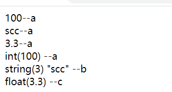


#### 定义数组:

```php
<?php 
    $a = Array('a',2,'ccc');
	echo var_dump($a);
    ?>
```

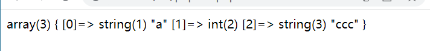

#### php定义多行字符串(定义的时候没有换行符输出会在一行)

```php
<?php
$str = <<<XXX
    url:
	www.gxaedu.com
XXX;
echo $str;
?>
```

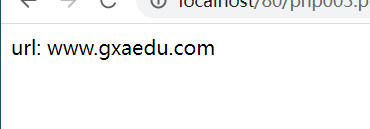


```php
<?php
$str = <<<XXX
    url:<br>
	www.gxaedu.com
XXX;
echo $str;
?>
```

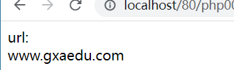


### php连接字符串用点`.`

### var_dump()函数--返回变量的数据类型和值(可以返回多个变量的数据类型和值,参数用逗号,隔开)

### 命名规范:

#### PHP==函数名不区分大小写==,==变量名要区分大小写==

变量名以$区分,

以字母或者下划线开头

不能以数字开头

变量名支持中文


### 当在浏览器地址栏输入一个网址按下回车，到页面返回内容之间发生了什么？

#### 前言

当我们在web浏览器的地址栏中输入：www.baidu.com，具体发生了什么？

#### **概述**

1. 对www.baidu.com这个网址进行DNS[域名解析](https://cloud.tencent.com/product/cns?from=10680)，得到对应的IP地址
2. 根据这个IP，找到对应的服务器，发起TCP的三次握手
3. 建立TCP连接后发起HTTP请求
4. 服务器响应HTTP请求，浏览器得到html代码
5. 浏览器解析html代码，并请求html代码中的资源（如js、css、图片等）（先得到html代码，才能去找这些资源）
6. 浏览器对页面进行渲染呈现给用户
7. 服务器关闭关闭TCP连接

注：

1.DNS怎么找到[域名](https://dnspod.cloud.tencent.com/)的？

> DNS域名解析采用的是递归查询的方式，过程是，先去找DNS缓存->缓存找不到就去找根域名服务器->根域名又会去找下一级，这样递归查找之后，找到了，给我们的web浏览器

2.为什么HTTP协议要基于TCP来实现？  

> TCP是一个端到端的可靠的面相连接的协议，HTTP基于传输层TCP协议不用担心数据传输的各种问题（当发生错误时，会重传）

3.最后一步浏览器是如何对页面进行渲染的？  

> a）解析html文件构成 DOM树 b）解析CSS文件构成渲染树 c）边解析，边渲染  d）JS 单线程运行，JS有可能修改DOM结构，意味着JS执行完成前，后续所有资源的下载是没有必要的，所以JS是单线程，会阻塞后续资源下载

#### 各个步骤具体细节

##### DNS解析（域名解析服务器）

a）首先会搜索浏览器自身的DNS缓存（缓存时间比较短，大概只有1分钟，且只能容纳1000条缓存）

b）如果浏览器自身的缓存里面没有找到，那么浏览器会搜索系统自身的DNS缓存

c）如果还没有找到，那么尝试从 hosts文件里面去找

d）在前面三个过程都没获取到的情况下，就递归地去域名服务器去查找，具体过程如下

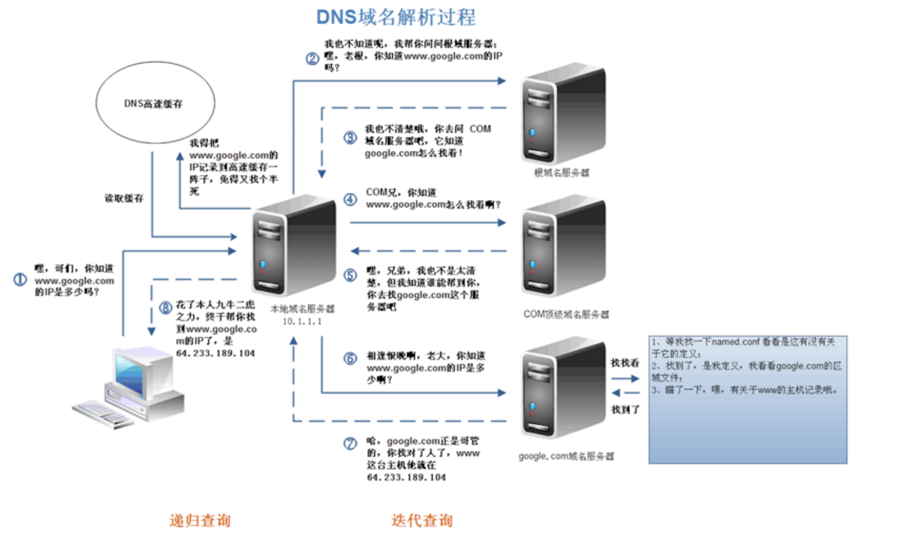图1

DNS优化两个方面：DNS缓存、DNS[负载均衡](https://cloud.tencent.com/product/clb?from=10680)

##### TCP连接建立（三次握手）

　　拿到域名对应的IP地址之后，User-Agent（一般指浏览器）会以一个随机端口（1024<端口<65535）向服务器的WEB程序（常用的有httpd，nginx）等的80端口。这个连接请求（原始的http请求经过TCP/IP4层模型的层层封包）到达服务器端后（这中间有各种路由设备，局域网内除外），进入到网卡，然后是进入到内核的TCP/IP协议栈（用于识别连接请求，解封包，一层一层的剥开），还有可能要经过Netfilter防火墙（属于内核的模块）的过滤，最终达到WEB程序，最终建立了TCP/IP的连接

##### **发起HTTP请求(建立连接后)**

HTTP请求报文由三部分组成：请求行，请求头、空格、请求正文

**请求行：**用于描述客户端的请求方式（GET/POST等），请求的资源名称(URL)以及使用的HTTP协议的版本号

**请求头：**用于描述客户端请求哪台主机及其端口，以及客户端的一些环境信息等

**空行：**空行就是\r\n (POST请求时候有)

**请求正文：**当使用POST等方法时，通常需要客户端向服务器传递数据。这些数据就储存在请求正文中（GET方式是保存在url地址后面，不会放到这里）

##### **GET请求**

下面是浏览器对 http://localhost:8081/test?name=XXG&age=23的GET 请求时发送给服务器的数据：

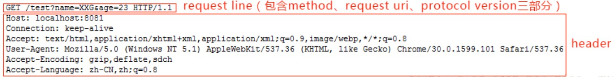图2

可以看出请求包含请求行和请求头两部分。其中请求行中包含 method（例如 GET、POST）、URI（通一资源标志符）和协议版本三部分，三个部分之间以空格分开。请求行和每个请求头各占一行，以换行符 CRLF（即 \r\n）分割。

**POST请求**

下面是浏览器对 http://localhost:8081/test 的 POST 请求时发送给服务器的数据，消息体中带上参数 name=XXG&age=23

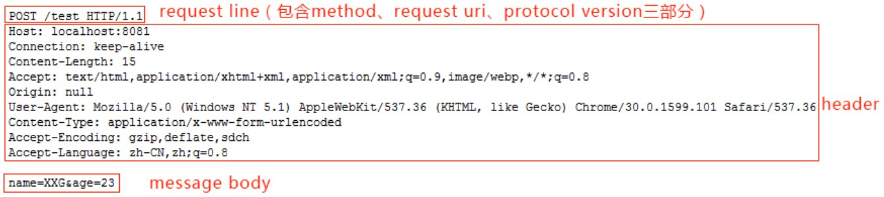图3

可以看出，上面的请求包含三个部分：请求行、请求头、空格、消息体，比之前的 GET 请求多了一个请求消息，其中 请求头和消息体之间用一个空行分割。POST 请求的参数不在 URL 中，而是在消息体中，请求头中多了一项 Content-Length 用于表示消息体的字节数，这样服务器才能知道请求是否发送结束。这也就是 GET 请求和 POST 请求的主要区别。

那么起始行中的请求方法有哪些种呢？

>  GET: 完整请求一个资源 （常用）  HEAD: 仅请求响应首部  POST：提交表单  （常用）  PUT: (webdav) 上传文件（但是浏览器不支持该方法）  DELETE：(webdav) 删除  OPTIONS：返回请求的资源所支持的方法的方法  TRACE: 追求一个资源请求中间所经过的代理（该方法不能由浏览器发出）

那什么是URL、URI、URN？

> URI  Uniform Resource Identifier 统一资源标识符 URL  Uniform Resource Locator 统一资源定位符 URN  Uniform Resource Name 统一资源名称

URL和URN 都属于 URI，为了方便就把URL和URI暂时都通指一个东西

##### **服务器响应http请求，浏览器得到html代码**

HTTP响应也由三部分组成：状态行，响应头，空格，消息体

状态行包括：协议版本、状态码、状态码描述

**状态码：**状态码用于表示服务器对请求的处理结果

> 1xx：指示信息——表示请求已经接受，继续处理 2xx：成功——表示请求已经被成功接收、理解、接受。 3xx：重定向——要完成请求必须进行更进一步的操作 4xx：客户端错误——请求有语法错误或请求无法实现 5xx：服务器端错误——服务器未能实现合法的请求。

列举几种常见的：

> 200（没有问题） 302（要你去找别人） 304（要你去拿缓存） 307（要你去拿缓存） 403（有这个资源，但是没有访问权限） 404（服务器没有这个资源） 500（服务器这边有问题）

**响应头：**响应头用于描述服务器的基本信息，以及客户端如何处理数据

**空格：**CRLF（即 \r\n）分割

**消息体：**服务器返回给客户端的数据

响应格式如下图

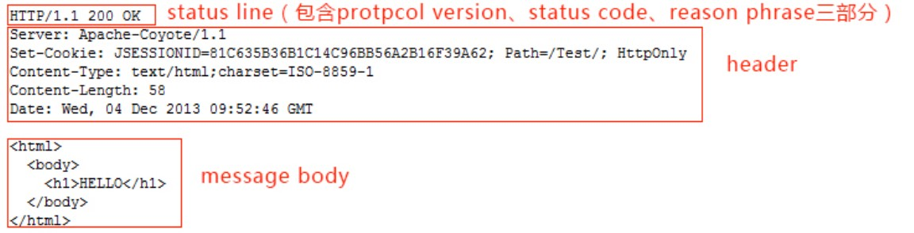图4

上面的 HTTP 响应中，响应头中的 Content-Length 同样用于表示消息体的字节数。Content-Type 表示消息体的类型，通常浏览网页其类型是HTML，当然还会有其他类型，比如图片、视频等。

##### **浏览器解析html代码，并请求html代码中的资源**

浏览器拿到html文件后，就开始解析其中的html代码，遇到js/css/image等静态资源时，就向服务器端去请求下载（会使用多线程下载，每个浏览器的线程数不一样），这是时候就用上 keep-alive特性了，建立一次HTTP连接，可以请求多个资源，下载资源的顺序就是按照代码里面的顺序，但是由于每个资源大小不一样，而浏览器又是多线程请求请求资源，所以这里显示的顺序并不一定是代码里面的顺序。

##### **浏览器对页面进行渲染呈现给用户**

最后，浏览器利用自己内部的工作机制，把请求的静态资源和html代码进行渲染，渲染之后呈现给用户，浏览器是一个边解析边渲染的过程。首先浏览器解析HTML文件构建DOM树，然后解析CSS文件构建渲染树，等到渲染树构建完成后，浏览器开始布局渲染树并将其绘制到屏幕上。这个过程比较复杂，涉及到两个概念: reflow(回流)和repain(重绘)。DOM节点中的各个元素都是以盒模型的形式存在，这些都需要浏览器去计算其位置和大小等，这个过程称为relow;当盒模型的位置,大小以及其他属性，如颜色,字体,等确定下来之后，浏览器便开始绘制内容，这个过程称为repain。页面在首次加载时必然会经历reflow和repain。reflow和repain过程是非常消耗性能的，尤其是在移动设备上，它会破坏用户体验，有时会造成页面卡顿。所以我们应该尽可能少的减少reflow和repain。JS的解析是由浏览器中的JS解析引擎完成的。JS是单线程运行，JS有可能修改DOM结构，意味着JS执行完成前，后续所有资源的下载是没有必要的，所以JS是单线程，会阻塞后续资源下载。

##### 服务器关闭关闭TCP连接

一般情况下，一旦Web服务器向浏览器发送了请求数据，它就要关闭TCP连接，然后如果浏览器或者服务器在其头信息加入了这行代码：

```js
Connection:keep-alive 
```

复制

TCP连接在发送后将仍然保持打开状态，于是，浏览器可以继续通过相同的连接发送请求。保持连接节省了为每个请求建立新连接所需的时间，还节约了网络带宽。

自此一次完整的HTTP事务宣告完成.

# PHP笔记

### php变量作用域

#### 局部变量和全局变量作用域

在所有函数外部定义的变量，拥有全局作用域。除了函数外，全局变量可以被脚本中的任何部分访问，要在一个函数中访问一个全局变量，需要使用 global 关键字。

在 PHP 函数内部声明的变量是局部变量，仅能在函数内部访问

```php
<?php 
    $x = 5; //全局变量
	function myFunc(){
        $s = 10;//局部变量
        echo "<p>测试函数内变量:<p>";
        echo "变量x为: $x ";
        echo "变量s为: $s ";
    }
	myFunc();
	echo "<p>测试函数外变量:<p>";
    echo "变量x为:$x<br>";
	echo "变量s为:$s"; xQ
    ?>
```

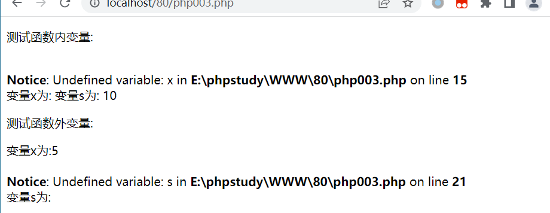

当我们调用myFunc()函数并输出两个变量的值, 函数将会输出局部变量 $s 的值，但是不能输出 $x 的值，因为 ==$x 变量在函数外定义==，==无法在函数内使用==，如果==要在一个函数中访问一个全局变量，需要使用 global 关键字==。


#### PHP global 关键字

global 关键字用于函数内访问全局变量。

在函数内调用函数外定义的全局变量，我们需要在函数中的变量前加上 global 关键字：

```php
<?php 
	$x = 5;
	$y = 9;
	function myFunc(){
	global $x,$y;
	$y = $x +$y;
	}
	myFunc();
	echo $y;
?>

```


#### Static 作用域

当一个函数完成时，它的所有变量通常都会被删除。然而，有时候希望某个局部变量不要被删除。

要做到这一点，要在第一次声明变量时使用 **static** 关键字：


```php
<?php 
    function myFunc(){
    static $x = 0;
    echo " $x <br>";
    $x++;
    echo PHP_EOL;   //PHP_EOL  ---换行符
}
	myFunc();
	myFunc();
	myFunc();

    ?>


```

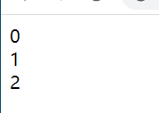


#### 参数作用域

参数是通过调用代码将值传递给函数的局部变量。

参数是在参数列表中声明的，作为函数声明的一部分：


```php
<?php
	function myFunc($x){
		echo $x;
	}
	myFunc(5);
?>
```


### PHP echo/print

echo 和 print 区别:

- echo - 可以输出一个或多个字符串
- print - 只允许输出一个字符串，返回值总为 1

**注意：**echo 输出的速度比 print 快， echo 没有返回值，print有返回值1。

#### echo

echo 是一个语言结构，使用的时候可以不用加括号，也可以加上括号： echo 或 echo()

echo可以输出一个或多个字符串,print只能输出一个字符串,返回值总为1

```php
<?php
echo "<h2>PHP 很有趣!</h2>";
echo "Hello world!<br>"."shm_detach"."dasdasdsa"."dsadsadasd";
echo "<br>我要学习 PHP!<br>";

$str1 = "study is so happy<br>";
$arr1 = Array('1','e','w');
echo $str1;
echo var_dump($arr1);
?>
```

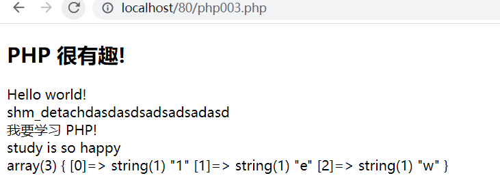

#### print

print只能输出一个字符串,返回值总为1

```php
<?php
print "<h2>PHP 很有趣!</h2>";
print "Hello world!<br>"."shm_detach"."dasdasdsa"."dsadsadasd";
print "<br>我要学习 PHP!<br>";

$str1 = "study is so happy<br>";
$arr1 = Array('1','e','w');
print $str1;
print var_dump($arr1);
?>

```

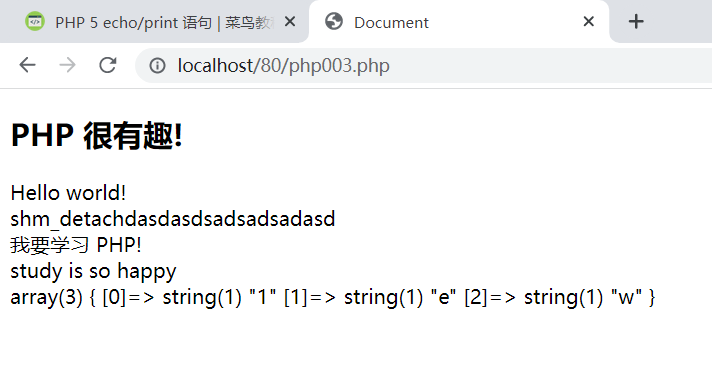

### PHP EOF(heredoc)


```php
<?php
$name="runoob";
$a= <<<EOF
        "abc"$name
        "123"
EOF;
// 结束需要独立一行且前后不能空格
echo $a;
?>
```

 **EOF** 可以用任意其它字符代替，只需保证结束标识与开始标识一致。

**结束标识必须顶格独自占一行(即必须从行首开始，前后不能衔接任何空白和字符)。**

位于开始标记和结束标记之间的变量可以被正常解析，但是==函数则不可以==。在 heredoc 中，变量不需要用连接符 **.** 或 **,** 来拼接

### PHP数据类型

PHP 支持以下几种数据类型:

- String（字符串）
- Integer（整型）
- Float（浮点型）
- Boolean（布尔型）
- Array（数组）
- Object（对象）
- NULL（空值）
- Resource（资源类型）

#### String(字符串):

定义的时候将字符串放在单引号或者双引号中间

```php
<?php 
	$x = "sjdaidjsai<br>";
	$str = 'sdsdsd';
	echo $x;
echo $str
?>

```

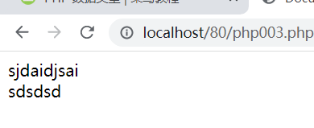


#### Integer(整型):

整数是一个没有小数的数字。

整数规则:

- 整数必须至少有一个数字 (0-9)
- 整数不能包含逗号或空格
- 整数是没有小数点的
- 整数可以是正数或负数
- 整型可以用三种格式来指定：十进制， 十六进制（ 以 0x 为前缀）或八进制（前缀为 0）。

```php
<?php 
$x = 5985;
var_dump($x);
echo "<br>"; 
$x = -345; // 负数 
var_dump($x);
echo "<br>"; 
$x = 0x8C; // 十六进制数
var_dump($x);
echo "<br>";
$x = 047; // 八进制数
var_dump($x);
?>
```

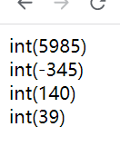

#### Float(浮点型):

浮点数是带小数部分的数字，或是指数形式。

```php
<?php 
$x = 10.365;
var_dump($x);
echo "<br>"; 
$x = 2.4e3;
var_dump($x);
echo "<br>"; 
$x = 8E-5;
var_dump($x);
?>
```

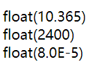

#### boolean(布尔型):

true,false  各个字母大小写不限,不能用1,0,null代替

```php
<?php $x = true;
$y = false;
?>
```


#### Array()(数组):

```php
<?php 
$cars=array("Volvo","BMW","Toyota");
var_dump($cars);
?>
```

#### 对象

对象类型也可以用于存储数据

在php中对象必须声明

首先使用class关键字声明类对象。类是可以包含属性和方法的结构。然后在类中定义数据类型，然在实例化的类中使用数据类型：


### PHP类型比较

#### 松散比较:

使用两个等号`==`进行比较,只比较值,==不比较类型==

#### 严格比较:

使用三个等号`===`进行比较,==除了比较值,还要比较类型==


```php
<?php
if(42 == "42") {
    echo '1、值相等';
}
 
echo PHP_EOL; // 换行符
 
if(42 === "42") {
    echo '2、类型相等';
} else {
    echo '3、类型不相等';
}
?>
```

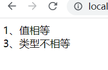

### PHP常量

#### 常量是全局的

设置常量使用define()函数:

```php
bool define ( string $name , mixed $value [, bool $case_insensitive = false ] )
```

- **name：**必选参数，常量名称，即标志符。
- **value：**必选参数，常量的值。
- **case_insensitive** ：可选参数，如果设置为 TRUE，该常量则大小写不敏感。默认是大小写敏感的。

```php
<?php 
    define("Ga","hello world");
echo Ga;
    ?>
```

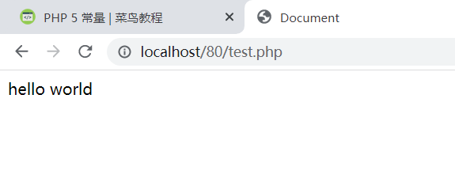

### PHP strlen() 函数

作用:返回字符串的长度(字节数)

```php
<?php 
	echo strlen("hello world!")
?> 
```

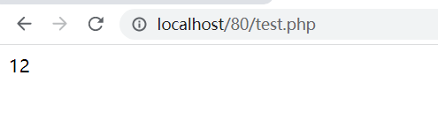

### PHP strpos() 函数

作用:在字符串内查找一个字符或者一段指定的文本

如果在字符串中找到匹配,该函数会返回第一个匹配的字符位,如果未找到匹配,则返回FALSE


在hello world! 中查找world:

```php
<?php 
	echo strpos("hello world!","world")
?>
```

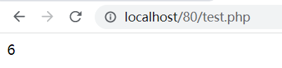

返回6是因为字符串起始索引是0

### PHP If...Else 语句

php中  elseif()  和else if()一样通用

### PHP Switch 语句

### PHP数组

#### 数值数组

##### 创建数组

php中用array()函数创建数组

```php
$cars=array("Volvo","BMW","Toyota");
```

手动复制:

```php
$cars[0]="Volvo";
$cars[1]="BMW";
$cars[2]="Toyota";
```

##### 数组函数:

获取数组长度-count()函数:返回数组的长度


##### 遍历数组

```php
<?php 
	$cars = Array("dz","bc","volvo");
	$carsLength = count($cars);
	for($x = 0;$x<$carsLength;$x++){
        echo $cars[$x];
        echo "<br>";
    }
?>
```

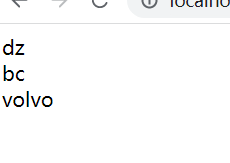

#### 关联数组

关联数组是使用指定的键的数组。


##### 创建方法1:

```php
<?php
	$age = array("peter"=>"35","Ben"=>"50","Jane"=>"99");
?>
```

##### 创建方法2:

```php
<?php 
	$age['Peter'] = "35";
    $age['May'] = "35";
    $age['Jay'] = "35";
?>
```

##### 遍历关联数组:

```php
<?php
	$age = array("peter"=>"35","Ben"=>"50","Jane"=>"99");
	foreach($age as $x=>$x_value){
        echo "key=".$x.",value=".$x_value;
        echo "<br>;"
    }
?>
```

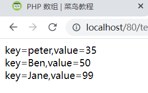

### PHP 数组排序

#### PHP - 数组排序函数:

- sort() - 对数组进行升序排列
- rsort() - 对数组进行降序排列
- asort() - 根据关联数组的值，对数组进行升序排列
- ksort() - 根据关联数组的键，对数组进行升序排列
- arsort() - 根据关联数组的值，对数组进行降序排列
- krsort() - 根据关联数组的键，对数组进行降序排列

#### sort() - 对数组进行升序排列

下面的实例将 $cars 数组中的元素按照字母升序排列：

```php
<?php
$cars=array("Volvo","BMW","Toyota");
sort($cars);
?>
```

下面的实例将 $numbers 数组中的元素按照数字升序排列：

```php
<?php
$numbers=array(4,6,2,22,11);
sort($numbers);
?>
```


#### rsort() - 对数组进行降序排列

下面的实例将 $cars 数组中的元素按照字母降序排列：

```php
<?php
$cars=array("Volvo","BMW","Toyota");
rsort($cars);
?>
```

下面的实例将$numbers数组中的元素按照数字降序排列:

```php
<?php 
$numbers = array(4,2,5,3,8);
rsort($numbers);
?>
```

#### asort() - 根据数组的值，对数组进行升序排列

下面的实例根据数组的值，对关联数组进行升序排列：

```php
<?php
$age=array("Peter"=>"35","Ben"=>"37","Joe"=>"43");
asort($age);
?>
```

#### ksort() - 根据数组的键，对数组进行升序排列

下面的实例根据数组的键，对关联数组进行升序排列：

```php
<?php
$age=array("Peter"=>"35","Ben"=>"37","Joe"=>"43");
ksort($age);
?>
```

#### arsort() - 根据数组的值，对数组进行降序排列

下面的实例根据数组的值，对关联数组进行降序排列：

```php
<?php
$age=array("Peter"=>"35","Ben"=>"37","Joe"=>"43");
arsort($age);
?>
```

#### krsort() - 根据数组的键，对数组进行降序排列

下面的实例根据数组的键，对关联数组进行降序排列：

```php
<?php
$age=array("Peter"=>"35","Ben"=>"37","Joe"=>"43");
krsort($age);
?>
```

### PHP 超级全局变量

PHP中预定义了几个超级全局变量（superglobals） ，这意味着它们在一个脚本的全部作用域中都可用。 你不需要特别说明，就可以在函数及类中使用。

#### PHP 超级全局变量列表:

- $GLOBALS
- $_SERVER
- $_REQUEST
- $_POST
- $_GET
- $_FILES
- $_ENV
- $_COOKIE
- $_SESSION

##### $GLOBALS

$GLOBALS 是PHP的一个超级全局变量组，在一个PHP脚本的全部作用域中都可以访问。

$GLOBALS 是一个包含了全部变量的全局组合数组。变量的名字就是数组的键。

```php
<?php 
$x = 75; 
$y = 25;
 
function addition() 
{ 
    $GLOBALS['z'] = $GLOBALS['x'] + $GLOBALS['y']; 
}
 
addition(); 
echo $z; 
?>
```

##### $_SERVER

$_SERVER 是一个包含了诸如头信息(header)、路径(path)、以及脚本位置(script locations)等等信息的数组。这个数组中的项目由 Web 服务器创建。不能保证每个服务器都提供全部项目；服务器可能会忽略一些，或者提供一些没有在这里列举出来的项目。

```php
<?php 
echo $_SERVER['PHP_SELF'];
echo "<br>";
echo $_SERVER['SERVER_NAME'];
echo "<br>";
echo $_SERVER['HTTP_HOST'];
echo "<br>";
echo $_SERVER['HTTP_REFERER'];
echo "<br>";
echo $_SERVER['HTTP_USER_AGENT'];
echo "<br>";
echo $_SERVER['SCRIPT_NAME'];
?>
```

##### $_REQUEST

$_REQUEST 用于收集HTML表单提交的数据。

```php+HTML
<html>
<body>
 
<form method="post" action="<?php echo $_SERVER['PHP_SELF'];?>">
Name: <input type="text" name="fname">
<input type="submit">
</form>
 
<?php 
$name = $_REQUEST['fname']; 
echo $name; 
?>
 
</body>
</html>
```


##### $_POST

 $_POST 被广泛应用于收集表单数据，在HTML form标签的指定该属性："method="post"。

```php+HTML
<html>
<body>
 
<form method="post" action="<?php echo $_SERVER['PHP_SELF'];?>">
Name: <input type="text" name="fname">
<input type="submit">
</form>
 
<?php 
$name = $_POST['fname']; 
echo $name; 
?>
 
</body>
</html>
```

##### $_GET

PHP $_GET 同样被广泛应用于收集表单数据，在HTML form标签的指定该属性："method="get"。

```php+HTML
<html>
<body>

<a href="test_get.php?subject=PHP&web=runoob.com">Test $GET</a>

</body>
</html
```

### PHP 循环

#### while()

#### do{}while();

#### for()

#### foreach()

forerch()用于遍历数组

foreach ($array as $value){

}

进行一次循环，当前数组元素的值就会被赋值给 $value 变量（数组指针会逐一地移动），在进行下一次循环时，将看到数组中的下一个值


```php
<?php
$x=array("Google","Runoob","Taobao");
foreach ($x as $value)
{
    echo $value . PHP_EOL;
}
?>
```


### PHP函数

语法

```php
<?php
function functionName()
{
    // 要执行的代码
}
?>
```


### PHP魔术常量

PHP 向它运行的任何脚本提供了大量的预定义常量。

不过很多常量都是由不同的扩展库定义的，只有在加载了这些扩展库时才会出现，或者动态加载后，或者在编译时已经包括进去了。

有八个魔术常量它们的值随着它们在代码中的位置改变而改变。

例如 __LINE__ 的值就依赖于它在脚本中所处的行来决定。这些特殊的常量不区分大小写

#### `__LINE__`

返回文件中当前的行号:

```
<?php 
	echo ''
?>
```

