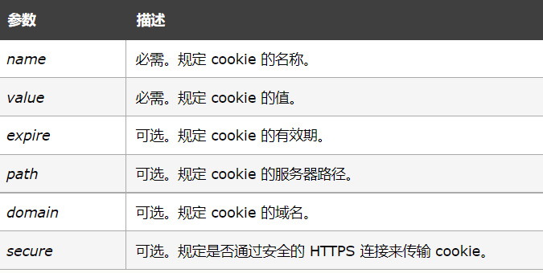

[toc]

1. php的最新版本:

​	8

2. 最常用的php版本:

   5和7

3. 静态页面:

   浏览器从服务器上获取的非后端脚本程序的静态资源展示出来的页面,如 html,txt,图片,声音等

4. 动态页面:

   ​	浏览器向服务器请求一个动态脚本程序,服务器根据提交的参数	不同经过逻辑处	后返回的页面,如 PHP,JSP,ASP,ASPX等就是动态页面

5. php的开始闭合标记

   ```php
   <?php
   ?>
   ```

6. php中单双引号的区别:

   单引号只能直接显示引号中的字符串

   双引号能够将引号内的变量转换成对应参数显示出来

7. 整数的八进制,十进制,十六进制

   ```
   八进制:057;  		除了开头的0,每一位最小是0最大是7
   十进制:124;	
   十六进制:0x1A;		除了开头的0x,每一位最小是0最大是F
   ```

8. 表示2乘以10的十次方:

   科学计数法: 2e10     其中e代表的是10的多少次方

9. 表示2.35乘以10的负2次方:

   科学计数法: 2.35e-2

10. PHP中整数和浮点数有最大的表示范围

11. 布尔值:

    true,false;

    不区分大小写

12. 数组的作用,如何定义:

    用处:保存同一类的多个数据,方便统一取用;

    定义:

    - 索引数组--通过索引(下标)访问
      - `$list = Array(1,2."vac",True);`
      - ~~==$list2 = [1,2,3,"tr",true];==~~   (==不使用方括号创建==)
    - 关联数组--通过数组的键访问对应的值
      - `$dict = Array("varName1"=>"value1","varName2"=>"value2");`

13. 关联数组中的元素叫做:

    键值对

    简单数组就是特殊的关联数组,键就是从0开始自增的索引

14. 遍历数组:

    使用foreach遍历简单数组

    ```php
    $list1 = Array(1,2,5,"2ss",false);
    foreach($list1 as $item){
        echo "$item<br>";
    }
    ```

    使用foreach遍历关联数组,(关联数组也可以用遍历简单数组的方式来遍历)

    ```php
    $dict = Array("varName1"=>"value1","varName2"=>"value2");
    foreach($dict as $k=>$value){
        echo "key:".$k."value:".$value;
    }
    ```

15. 取出数组指定索引的键值:

    ```php
    $list1 = Array(1,2,5,"2ss",false);
    echo $list[2]; //输出5
    ```

16. 预定义遍:`$_GET` ,`$_POST` :

17. 如果不知道前端用的什么方式传值(get或者post不确定),可以使用`$_REQUEST`

18. 数组排序:

    ​	sort()   升序排列,如果是混合数组,字符串排最前面,布尔值用0或1和数字一起参与排序

    ```php
    $list1 = Array(1,2,5);
    echo sort($list1);		//只能输出sort的返回值,0或1
    
    sort($list1);
    var_dump($list1)		//
    print_r($list)			//两种方法都可以输出数组内容
    ```

19. 获取数组长度:

    count()函数

20. sizeof()和count()的区别:

    只是名字不同,其他没有任何区别

21. 函数的定义:

    ````php
    function 
    ````

22. 绝对值,取整,最大最小值计算,生成随机数,四舍五入,

    - 绝对值函数:abs()

    - 向上取整:ceil()

    - 向下取整:floor()

    - 最大值:max()

    - 最小值:min()

    - 随机数:rand()    范围设置: rand(10,20)  

      ==js中:Math.random();==

    - 四舍五入:round()     可以保留小数round(3.1415926,2) 返回值为3.14

      js中:round()只能取整

23. 正则表达式:

    匹配字符串:

    preg_match(正则规则,被匹配字符串,匹配出来的结果,PREG_OFFSET_CAPTURE,3)从第三位开始匹配,函数返回值只能是true或者false,

    匹配的结果要在参数列表第三个参数接收 ,

    第三个参数会接收到匹配到的字串和匹配到字串的起始位置

    PREG_OFFSET_CAPTURE,3表示从字符串的下标3(第四位)开始匹配

    ```PHP
    $str = "abcdefghijklmn";
    $parttern = '/def$/';
    $num = preg_match($pattern,$str,$matche_1,PREG_OFFSET_CAPTURE,1);
    //num的值为0或1,
    echo "<pre>"
    pre中间的代码会按照原来的样式显示而不会在网页中被渲染成一行
    echo "</pre>"
    ```

    替换字符串内的内容:

    preg_replace(匹配规则,替换内容,要被替换的字符串)替换,返回值就是替换后的内容,

    ```php
    $str = "这是[5]def[545]的阿飞飞";
    $partten = /\[([a-zA-Z0-9]+)\]/;
    $str = preg_replace($partten,"***",$str);
    echo $str;
    替换后的内容为:这是***def***的阿飞飞
    ```

    补充, 一次替换数组内多出内容:

    str_replace():

    对于被匹配的这样的字符串:

    ``

    ```php
    $partten1 = '/src=".*"/';//贪婪模式,匹配到的是src="test.jpg" width = "60px" height="80px"
    
    $partten2 = '/src=".*?"/';//非贪婪模式,匹配结果为:src="test.jpg" 
    ```

    

24. 读文件:$ file = fopen(文件路径和文件名,打开方式) or exit("打开错误");

    ```php
    $ file = fopen("s.txt","r") or exit("打开错误");
    while(!feof($file)){
        echo fgets($file);
    }
    fclose();
    ```

    

25. 写文件:

    ```php
    $file = fopen("s.txt","w") or exit("打开错误");
    fwrite($file,"内容");
    fclose($file);
    ```

26. 向文件追加内容:

    ```
    file_put_contents($file,"google.com",FILE_APPEND|LOCK_EX);
    ```

27. 文件打开的模式:

    

    

28. 上传,接收文件:

    encode:编码

    type:类型

    enctype:编码类型

    multi多

    multi-media多媒体

    multi-part多部分

    label:标签(用于提示的字符)

    上传过程:

    - 建立前端表单

    - 编写后端php,通过$_FILES获取文件信息

      `$_FILES['前端file属性的name']['各种值']`

      - `$_FILES["file"]["name"]` - 上传文件的名称
      - `$_FILES["file"]["type"]` - 上传文件的类型
      - `$_FILES["file"]["size"] `- 上传文件的大小，以字节计
      - `$_FILES["file"]["tmp_name"] `- 存储在服务器的文件的临时副本的名称
      - `$_FILES["file"]["error"] `- 由文件上传导致的错误代码

    - 通过move_uploaded_file()函数保存文件

      `move_uploaded_file($_FILES['file']['tmp_name'],"要保存的路径和文件名")`

    前端上传:

    ```html
    <form action="" method="post" enctype="multipart/form-data">
            <label for="file">选择文件</label>
            <input type="file" name="file" id="">
            <input type="submit" value="上传">
    </form>
    ```

    后端接收:

    ```php
    <?php
        $_FILES['file']['name'];
    	if($_FILES['file']['error']>0){
            die("上传错误,代码".$_FILES['file']['error']);
        }
    	move_uploaded_file($_FILES[['file']['tmp_name'],"./xiaohe.txt");
                                   
        ?>
    ```

    

29. cookie的作用:

    ```
    服务器下发给用户的一个标记,用来关联用户身份,比如记录登录状态等
    在用户每次访问网站的时候都,用户浏览器都会自动带上当前网站的cookie发送给服务器
    ```

    

30. php生成,下发,接收cookie:

    request:请求
    response:响应

    生成cookie使用setcookie()函数

    ```php
    setcookie(name,value,expire,path,domain,secure)//setcookie()函数必须位于<html>标签之前
    ```

    

    **注释：**可以通过 $HTTP_COOKIE_VARS["user"] 或 $_COOKIE["user"] 来访问名为 "user" 的 cookie 的值。

    例:生成和下发cookie

    ```php
    setcookie("xiaohe","you are admin",time()*3600);//给xiaohe生成一个有效期为1小时的cookie,cookie的值为:you are admin
    ```

    服务器接收传来的cookie

    ```php
    <?php
    	$_COOKIE['xiaohe'];
    ?>
    ```

31. SESSION的作用

    **什么是session**

    在WEB开发中，服务器可以为每个用户浏览器创建一个会话对象（session对象），注意：一个浏览器独占一个session对象(默认情况下)。因此，在需要保存用户数据时，服务器程序可以把用户数据写到用户浏览器独占的session中，当用户使用浏览器访问其它程序时，其它程序可以从用户的session中取出该用户的数据为用户服务。

    **session的作用**

    Session用于保存每个用户的专用信息，每个客户端用户访问时，服务器都为每个用户分配一个唯一的会话ID（Session ID) . 她的生存期是用户持续请求时间再加上一段时间(一般是20分钟左右)。

    Session中的信息保存在Web服务器内容中,保存的数据量可大可小。当 Session超时或被关闭时将自动释放保存的数据信息。由于用户停止使用应用程序后它仍然在内存中保持一段时间，因此使用Session对象使保存用户数据的方法效率很低。对于小量的数据,使用Session对象保存还是一个不错的选择。

32. PHP生成,管理SESSION

    session_start()向浏览器下发一个标记用户会话的cookie

    生成(注意:`session_start()函数必须位于<html>标签之前`)

    每个浏览器的session都是不同的,不同的浏览器的$_SESSION['user']值都是独立保存的,会通过session_start()下发的cookie绑定

    ```php
    <?php session_start();
    $_SESSION['user']=1;		//
    ?>
    
    <html>
    <body>
    
    </body>
    </html>
    ```

    管理Session:

    - 读取session:`$_SESSION`

      ```php
      <?php?
          $_SESSION['user']		//
          
          ?>
      ```

    - 管理Session:

      unset()函数用于释放指定的session变量:

      ```php
      <?php
      	unset($_SESSION['user']);
      ?>
      ```

    - session_destroy()函数彻底终结所有session:

      ```php
      <?php
      session_destroy();
      ?>
      ```

    问题:


