MySQL

1. 什么是数据库:

   保存数据的仓库

2. 数据库管理系统:

   管理数据库的系统

3. MySQL:

   是一个关系型数据库管理系统

4. 数据库管理系统分类:

   - 关系型
   - 非关系型

5. 学习MySQL和开发一个网站的关系:

   网站需要管理相关的信息,而MySQL就是实现管理功能的工具

   比如,对于一个论坛系统来说,需要利用数据库管理系统的:

   - 查询功能:查询帖子内容,查询用户信息,比对用户登录信息
   - 新增功能:新增用户信息表,帖子内容表等
   - 新增记录:发表帖子,用户注册等
   - 删除功能:删除用户信息,帖子内容信息等
   - 修改功能:修改用户信息等

6. MySQL可以通过哪些途径操作:

   > phpstudy中,MySQL有默认的账号密码:root/root
   >
   > 登录后可以为DBSM新建其他账号密码 
   >
   > //DBSM:database management system数据库管理系统

   1. 命令行

      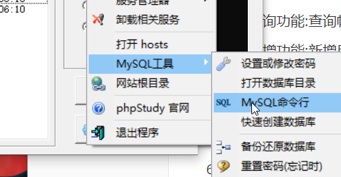

      

   2. 图形化客户端工具

      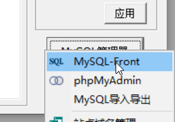

      

   3. B/S架构下的PHPmyadmin工具

      

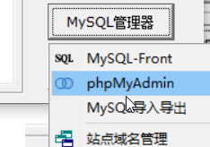

7. mysqld的默认端口号:

   3306  myqsld代表MySQL的服务,httpd代表http的服务   d--daemon:服务

8. MySQL的端口号:

   客户端是:高位随机端口

   服务端默认是3306端口,但是可以自定义

9. MySQL如何保存数据:

   - 建立数据库,
   - 数据库中建立数据表,
   - 数据表中建立数据实现

   数据库>数据表>记录

   例如:对于论坛网站,将:

   - 建立一个网站**数据库,**

   - 在该库中根据信息的分类建立不同的**数据表**,如用户表,帖子表,数据表有标题,这些标题叫**字段**

   - 在每个表中有很多行,这些行叫**记录,以记录的形式保存相关信息**
   
     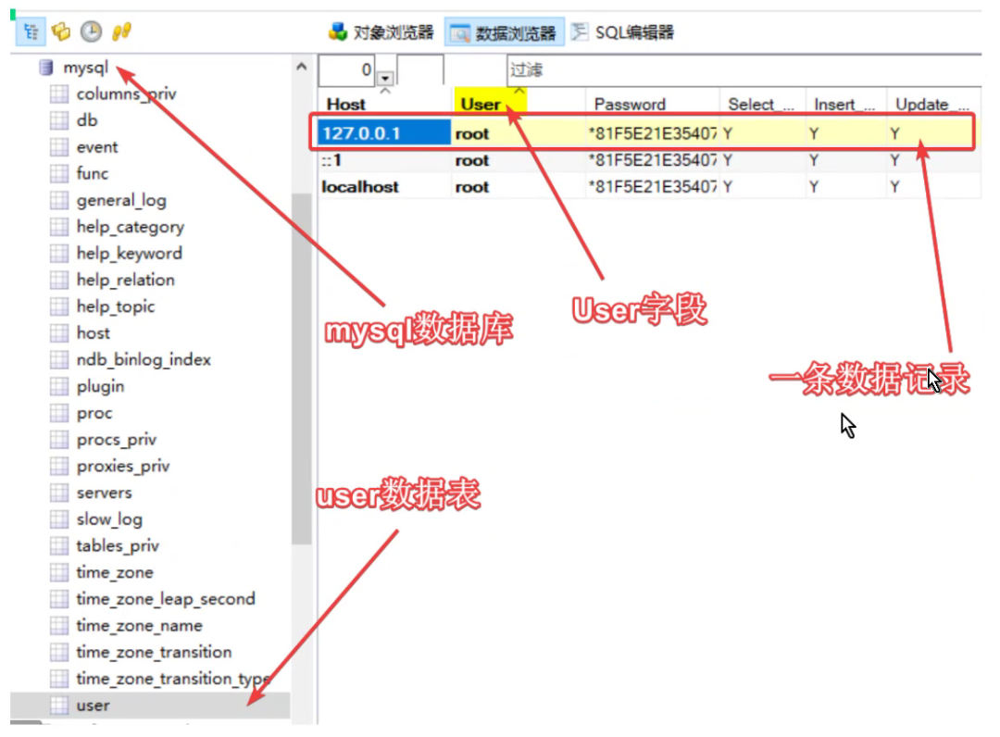

# MySQL数据库操作

==MySQL指令不区分大小写,必须以分号结尾,==

如果字符串中本身包含分号,则需要用转义符`\`转义成普通字符

扩展:转义符可以将特殊字符转移成普通字符,也可以将普通字符转换成特殊字符,比如说:`\n`表示换行

## MySQL注释:

```sql
#在mysql中如何写注释
SELECT 6 + 6; #这是单行注释
SELECT 8 + 8; -- 这是单行注释 (注意:--后面要加一个空格，一定要记住)
SELECT 20 + 6;
SELECT 15  /* 这是一个在行中间的注释 */ + 2;
/*
这是多行注释
这是多行注释
*/
 
/*
总结:
如果要使用单行注释的话，推荐使用#，不建议用--
*/
```


## 数据库的操作

### 查询当前有哪些数据库

```mysql
show databases;
```

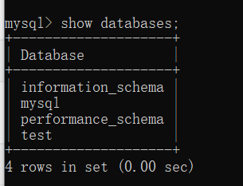


### 新建数据库

```mysql
create database 数据库名;  //库名不加引号
```

例子:创建一个名为userdb的库

```mysql
create database userdb;		//创建一个名为userdb的库
```

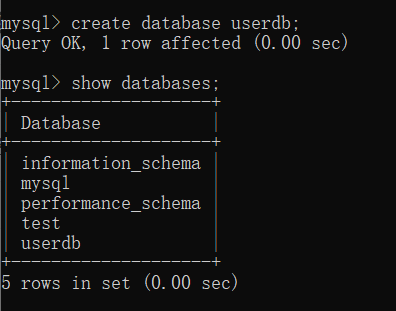

仅做了解:还可以用mysqladmin创建

### 删除数据库

``` mysql
drop database 数据库名;		//库名不加引号
```

例如:

```mysql
drop database userdb;
```

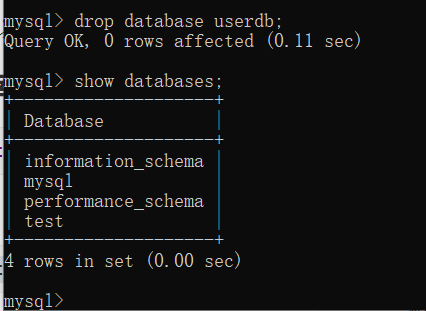

### 切换数据库

```mysql
use 数据库名;
```

### 查看当前所在数据库

```SQL
select database();
```

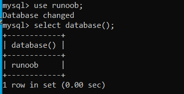

==操作表前请务必确认已经使用use语句选中想要操作的数据库!!!!==

## 表的操作

### 查询表

```mysql
#选择某个库
use 数据库名;
#展示该库的表
show tables;
```

### 新建表

```mysql
CREATE TABLE 表名(字段名1,字段类型1,字段名2,字段类型2,字段名3字段类型3);    //最后一个字段后不加逗号
```

创建一个runoob_tbl表,表中有如下字段:

- runoob_id,整型,不准是空值,自动增加编号
- runoob_title,字符型,长度100,不允许留空
- runoob_author,字符型,长度40,不允许留空
- submission_date,日期型,
- 把runoob_id设置成主键
- 设定表采用的引擎是innoDB DEFAULT,设定字符集是utf-8

```mysql
create table runoob_tbl(
	runoob_id int not null auto_increment,
    runoob_title varchar(100) not null,
    runoob_author varchar(40) not null,
    submission date,
    primary key(runoob_id)
)engine innodb charset=utf8;
```


### 删除表

```mysql
drop table 表名;
```


### 更改表

```

```

### 查看表结构

```
desc 表名;
```

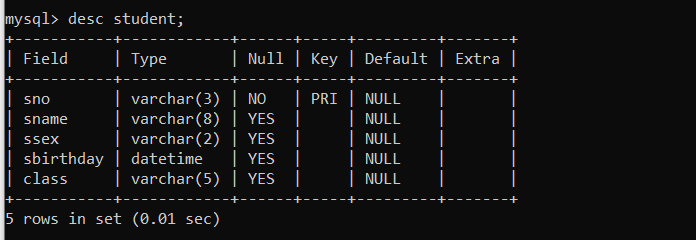


## 记录的操作

### 插入记录

> ==自动增加的runoob_id字段插入的时候values是null==

```MySQL
insert into 表名 (字段1,字段2,字段3)
values 
(字段1的值,字段2的值,字段3的值);
```

### 查询记录

```
select * from 表名;
```

```mysql
select 字段名1 as 字段描述,字段名2 as 字段描述,...
from 表名
[where语句]
```

#### 如何查询w3cschool库中w3cschool_tbl表中的全部数据?

```
select * from w3cschool_tbl;
```

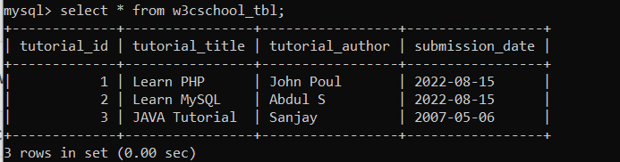


### where字句

#### 如何查询w3cschool_tbl表中tutorial_id为1的记录?

```
select * from w3cschool_tbl where tutorial_id = 1;
```

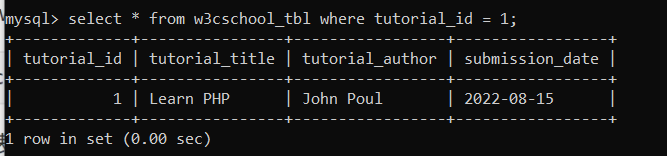


### UPDATE语句

UPDATE  SET命令用于更新字段的值,可以同时更新多个字段

eg.修改w3cschool_tbl中tutorial_id为1的tutorial_title的值

```sql
update w3cschool_tbl 
set tutorial_title = "PHP"
where tutorial_id = 1;
```

原数据:

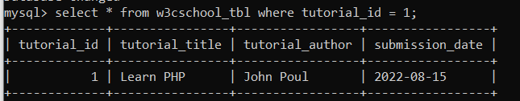

执行update set语句后:


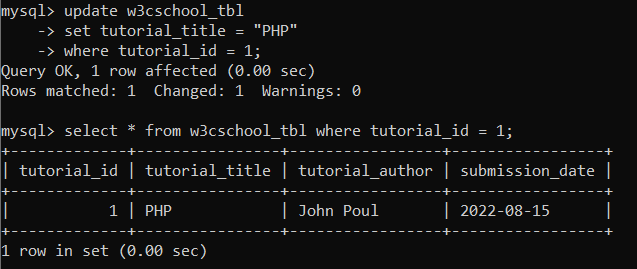


### DELETE语句

DELETE FROM 命令用来删除MySQL表中的记录

```sql
delete from w3cschool_tbl [where]
```

where子句为可选项,如果==没有where子句限定删除条件,那么表中所有数据都将被删除==


eg. 删除w3cschool_tbl中tutorial_id为3的记录:

```mysql
delete from w3cschool_tbl where tutorial_id = 3;
```

原数据:

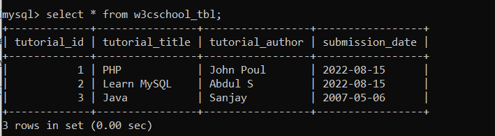

执行delete语句后:

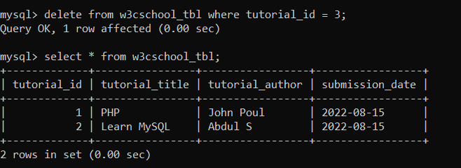

### LIKE子句

LIKE子句用在where中:where ... like ... 或  not like 

==like通常与%一起使用,如果like后不使用%匹配,那么like等效于等号(=)==

通配符:

> %  匹配任意n个字符
>
> _  匹配任意一个字符	

eg. 从w3cschool_tbl中获取tutorial_author字段中以oul结尾的所有记录:

```mysql
select * from w3cschool_tbl where tutorial_author like '%OUL';  
```

==注意 like后引号内的字符串不区分大小写==

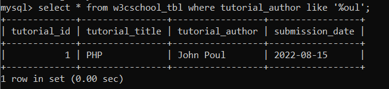


### ORDER BY 排序

ORDER BY 排序有升序(ASC)和倒序(DESC)两种方式,默认是升序(ASC)

eg. 查询w3cschool_tbl表中的所有数据并根据tutorial_id倒序排列:

```mysql
select * from w3cschool_tbl order by tutorial_id desc;
```

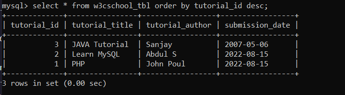

### LIMIT分页

语法：
`SELECT 字段列表 FROM 表名 LIMIT 起始索引, 查询记录数;`

##### 注意事项

- 起始索引从0开始，起始索引 = （查询页码 - 1） * 每页显示记录数
- 分页查询是数据库的方言，不同数据库有不同实现，MySQL是LIMIT
- 如果查询的是第一页数据，起始索引可以省略，直接简写 LIMIT 10


### GROUP BY 分组

GROUP BY分组可以根据一个或者多个列对结果集进行分组

#### GROUP BY语法结构

```MySQL
select 字段名,聚合函数()
from 表名
where 条件
GROUP BY 字段名  # 根据此字段名分组
```

eg. 使用 GROUP BY 语句 将数据表按名字进行分组，并统计每个人有多少条记录：

原数据:

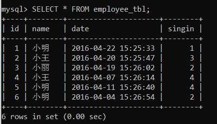

```mysql
select name,count(*) from employee_tbl group by name;
```

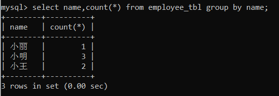

#### 常用聚合和函数

| 函数    | 功能     |
| ------- | -------- |
| count() | 统计数量 |
| max()   | 最大值   |
| min()   | 最小值   |
| avg()   | 平均值   |
| sum()   | 求和     |

语法：
`SELECT 聚合函数(字段列表) FROM 表名;`


#### WITH ROLLUP

可以在分组统计的基础上再对聚合函数进行统计,

eg. 首先在name字段上进行分组，然后在分组的基础上进行某些字段统计，表结构如下：

```MySQL
CREATE TABLE `test` (
  `Id` int(11) NOT NULL AUTO_INCREMENT,
  `title` varchar(25) DEFAULT NULL COMMENT '标题',
  `uid` int(11) DEFAULT NULL COMMENT 'uid',
  `money` decimal(2,0) DEFAULT '0',
  `name` varchar(25) DEFAULT NULL,
  PRIMARY KEY (`Id`)
) ENGINE=InnoDB AUTO_INCREMENT=8 DEFAULT CHARSET=utf8mb4;
```

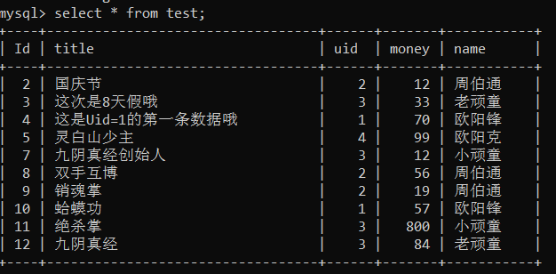


分组统计:

```mysql
select name,sum(money) from test group by name with rollup;
```

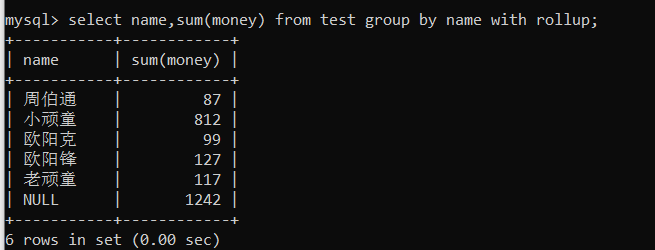

可以看到按照name分组后对money求和统计了。上面看到 null 1242, 如何搞个别名字段比如 总金额：1242呢？

###### 使用coalesce()函数

```mysql
coalesce(a,b,c)
# 参数说明:如果a==null,则b,如果b==null,则c,如果a!=null则a,如果a,b,c都为null,则返回null
```

所以:

```mysql
select coalesce(name,'总金额')as 姓名,sum(money) as 金额 from test group by name with rollup;
```

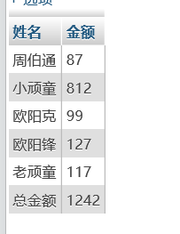

### 连接

使用场景:从多张表获取数据

#### 内连接INNER JOIN

##### 语法

隐式内连接:

`SELECT 字段列表 FROM 表1 [表1别名],表2 [表2别名] WHERE 条件 ...;`

显示内连接:

```mysql
SELECT 字段列表 
FROM 表1[表1别名] 
[INNER] JOIN 表2 [表2别名] 
ON 连接条件;
```

==显示连接性能比隐式更高==

#### 外连接

左外连接:

查询左表所有数据，以及两张表交集部分数据

```mysql
SELECT 字段列表 
FROM 表1 [表1别名]
LEFT [OUTER] JOIN 表2 [表2别名]
ON 连接条件...;
```

右外连接:

查询右表所有数据，以及两张表交集部分数据

```mysql
SELECT 字段列表
FROM 表1 [表1别名]
RIGHT [OUTER] JOIN 表2 [表2别名]
ON 连接条件...;
```

